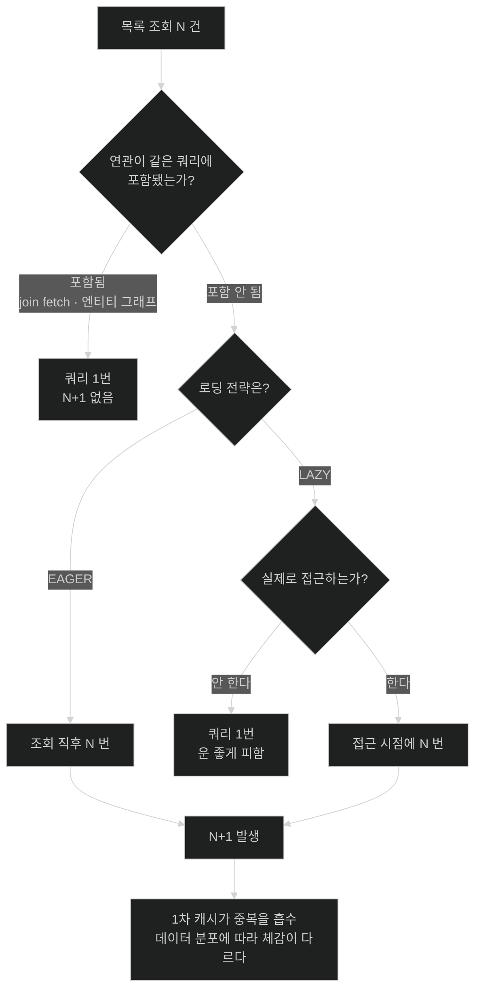

# N+1이 발생하는 조건

## 한눈에 보기

| 질문 | 핵심 답 |
|---|---|
| 지연 로딩이 원인인가? | 아니다. 즉시 로딩에서도 똑같이 일어난다. |
| 진짜 원인은? | 연관을 **항목마다 따로** 읽는 구조 자체다. |
| 왜 늦게 발견되나? | 기능 테스트를 통과한다. 결과가 맞고 느릴 뿐이다. |
| 로컬에서 왜 안 보이나? | 데이터가 적으면 201번이 20ms다. 운영에서 2초가 된다. |
| 어떻게 잡나? | 쿼리 수를 직접 세는 테스트. 기능 검증으로는 못 잡는다. |

## 1. 왜 이게 필요한가

### 출발 장면: 발견 카탈로그 목록이 느려진다

CosmoRoute의 발견 카탈로그는 원료 목록에 각 원료의 회사 이름을 보여 준다. 첫 슬라이스가 끝나면 성분 목록도 함께 보여 준다.

```java
@Transactional(readOnly = true)
public List<MaterialSummary> discoveryList() {
    List<Material> materials = repository.findDiscoveryMaterials();   // ①

    return materials.stream()
            .map(m -> new MaterialSummary(
                    m.getId(),
                    m.getName(),
                    m.getCompany().getCompanyName(),                  // ②
                    m.getSubstanceLinks().size()))                    // ③
            .toList();
}
```

원료가 20건이라고 하자. 나가는 SQL은 몇 개일까.

```text
①  SELECT ... FROM material WHERE ...           1번
②  SELECT ... FROM company WHERE id = ?        20번   ← 원료마다
③  SELECT ... FROM material_substance WHERE material_id = ?
                                               20번   ← 원료마다

                                        합계   41번
```

코드에는 `map` 하나뿐인데 SQL은 41개다. 그리고 이게 **[[N-플러스-1-문제]]**(=목록 쿼리 1번 뒤에 항목마다 연관 쿼리가 N번 더 나가는 현상)다.

원료가 200건이면 401번, 각 원료의 성분까지 이름을 찍으면 그 안에서 또 갈라진다.

### 여기서 뭐가 무너지나

이 문제가 특히 나쁜 이유는 성능 자체가 아니라 **드러나는 방식**이다.

- **기능 테스트가 통과한다.** 결과 데이터는 완전히 정확하다. 회사 이름도 맞고 성분 개수도 맞다. 틀린 것이 없으니 어떤 단언도 실패하지 않는다.
- **로컬에서 빠르다.** 시드 데이터가 10건이면 쿼리 21번에 20ms다. 아무도 이상하다고 느끼지 않는다.
- **코드 리뷰에서 안 보인다.** `m.getCompany().getCompanyName()`은 완벽하게 자연스러운 자바 코드다. 이 줄이 SQL을 만든다는 사실이 코드에 적혀 있지 않다.
- **원인 지점과 증상 지점이 다르다.** 느린 것은 목록 API인데, 원인은 `Material` 매핑의 fetch 설정이거나 DTO 변환 코드다.

즉 **정상적인 개발 과정을 전부 통과한 뒤 운영에서만 드러난다.** 이것이 N+1을 별도로 공부해야 하는 이유다.

### 그래서 나온 생각 — 먼저 원인을 정확히 짚어야 한다

흔한 요약은 "지연 로딩 때문"이다. 그렇지 않다.

앞 챕터에서 `Material.company`에 `fetch = FetchType.LAZY`가 명시되어 있는 것을 봤다. 그걸 `EAGER`로 바꾸면 어떻게 될까.

```text
[LAZY]   SELECT material  × 1
         getCompany() 접근 시 SELECT company × 20        → 21번

[EAGER]  SELECT material  × 1
         각 원료의 company 를 즉시 로딩 SELECT × 20      → 21번
```

**쿼리 수가 같다.** EAGER는 읽는 시점을 앞당길 뿐이고, 여전히 원료마다 한 번씩 읽는다. 오히려 나빠지는 면도 있다 — 회사를 쓰지 않는 화면에서도 20번을 읽는다.

그러니 원인은 로딩 시점이 아니다. **"연관을 항목마다 별도 쿼리로 읽는다"는 구조**가 원인이고, 로딩 전략은 그 쿼리가 언제 나가느냐만 정한다.

비유하자면 **장을 보면서 품목마다 따로 계산하는 것**이다. 20개를 사면서 계산대에 20번 간다. 물건은 정확히 다 샀고 금액도 맞다 — 오래 걸릴 뿐이다.

→ 비유가 깨지는 지점: 계산대에 20번 가는 사람은 자기가 20번 갔다는 걸 안다. 코드는 그렇지 않다 — `getCompanyName()` 한 줄만 보이고, 그 줄이 20번 실행된다는 것도, 매번 DB에 간다는 것도 **소스에 적혀 있지 않다.** 이 비가시성이 문제의 본질이고, 그래서 "조심하자"로는 해결되지 않는다.

## 2. 어떻게 동작하는가

### 2.1 발생 조건의 정확한 형태

N+1은 다음 세 가지가 겹칠 때 나온다.

1. **여러 건을 반환하는 조회가 있다.** — 한 건만 읽으면 추가 쿼리도 한 번뿐이라 문제가 되지 않기 때문이다.
2. **각 건이 연관을 갖고 있다.** — 연관이 없으면 추가로 읽을 것이 없기 때문이다.
3. **그 연관이 같은 쿼리에 포함되지 않았다.** — 포함됐다면 이미 메모리에 있어 추가 쿼리가 필요 없기 때문이다.

3번이 핵심이다. `join fetch`나 엔티티 그래프를 쓰지 않으면 JPA는 목록 쿼리에 연관을 넣지 않는다. **기본 동작이 곧 N+1이다.**

### 2.2 어디까지 갈라지는가

연관이 중첩되면 곱해진다. 원료 20건, 각 원료에 성분 연결이 평균 8개, 각 연결이 성분을 가리킨다고 하자.

```text
SELECT material                                    1번
  → 원료마다 SELECT material_substance             20번
      → 연결마다 SELECT substance                  20 × 8 = 160번
                                            합계   181번
```

한 단계 깊어질 때마다 곱해진다. 그래서 발견 카탈로그 상세처럼 "원료 → 성분 → 성분 정보"를 타고 들어가는 화면이 가장 위험하다.

여기에 앞 챕터의 사실 하나가 겹친다 — **영속성 전이가 컬렉션을 순회하면 지연 로딩이 무력화된다.** 읽지 않으려던 컬렉션이 삭제 경로에서 전부 초기화된다.

### 2.3 1차 캐시가 일부를 가려 준다

같은 회사에 속한 원료가 여러 건이면 쿼리가 줄어든다. 첫 챕터에서 본 1차 캐시 때문이다.

```text
원료 20건이 전부 같은 회사 소속이라면
  첫 번째 getCompany().getCompanyName()   → SELECT company    1번
  나머지 19번                              → 1차 캐시에서 반환  0번
                                                       합계   2번
```

**이것이 문제를 더 어렵게 만든다.** 개발 환경의 시드 데이터는 대개 회사 두세 개에 원료가 몰려 있어서 쿼리가 거의 안 늘어난다. 운영 데이터는 회사가 다양해서 그대로 N번이 된다. **같은 코드가 데이터 분포에 따라 다르게 동작한다.**

### 2.4 그래서 쿼리 수를 직접 세야 한다

기능 검증으로는 못 잡으므로, 나간 SQL 개수를 세는 **[[쿼리-카운트-검증]]**(=테스트에서 실제로 나간 SQL 문의 개수를 세어 기대값과 비교하는 검증)이 필요하다.

Hibernate는 통계를 제공한다.

```java
@Test
void 발견_카탈로그_목록은_쿼리를_두_번만_쓴다() {
    Statistics stats = entityManagerFactory.unwrap(SessionFactory.class).getStatistics();
    stats.setStatisticsEnabled(true);
    stats.clear();

    service.discoveryList();

    assertThat(stats.getPrepareStatementCount()).isEqualTo(2);
}
```

이 단언이 있으면 다음 사람이 DTO 변환에 연관 하나를 더 타고 들어가는 순간 테스트가 깨진다. **성능 회귀를 기능 회귀처럼 잡는 방법**이고, N+1에 대해 실제로 작동하는 유일한 방어선이다.

CosmoRoute는 이미 실 PostgreSQL을 Testcontainers로 띄우고 있어서, 이런 검증을 붙일 자리가 이미 마련되어 있다. `ModuleStructureTest`가 모듈 경계를 테스트로 강제하는 것과 같은 성격의 장치다 — **규율을 사람의 주의력이 아니라 테스트에 맡긴다.**

## 3. 그림으로 보기

### 쿼리가 갈라지는 모양

```text
[N+1 — 항목마다 따로]

  SELECT material WHERE ...            ─────▶ 20건
         │
         ├── material[0].getCompany()  ─────▶ SELECT company WHERE id=?
         ├── material[1].getCompany()  ─────▶ SELECT company WHERE id=?
         ├── material[2].getCompany()  ─────▶ SELECT company WHERE id=?
         │   ...
         └── material[19].getCompany() ─────▶ SELECT company WHERE id=?

  총 21번. 코드에는 map() 한 줄뿐이다.


[한 번에 — 다음 노트의 주제]

  SELECT m.*, c.*
    FROM material m JOIN company c ON m.company_id = c.id
   WHERE ...                          ─────▶ 20건 + 회사까지 채워짐

  총 1번.
```

### 로딩 전략은 원인이 아니다



## 4. 이 노트에 나온 용어

| 용어 | 한 줄 풀이 | 자세히 |
|---|---|---|
| N+1 문제 | 목록 쿼리 1번 뒤 항목마다 연관 쿼리가 N번 더 나가는 현상 | [[_glossary#N-플러스-1-문제]] |
| 쿼리 카운트 검증 | 나간 SQL 개수를 세어 기대값과 비교하는 테스트 | [[_glossary#쿼리-카운트-검증]] |

## 5. 자주 헷갈리는 것

### N+1 vs 지연 로딩

| 축 | N+1 | 지연 로딩 |
|---|---|---|
| 정체 | 쿼리가 갈라지는 **현상** | 언제 읽을지 정하는 **설정** |
| 즉시 로딩이면 | 그대로 발생 | 해당 없음 |
| 해결 방법 | 연관을 같은 쿼리에 넣기 | — |

"LAZY라서 N+1이 났다"는 진단은 절반만 맞다. LAZY를 EAGER로 바꿔도 쿼리 수는 같다. 고쳐야 하는 것은 **어느 쿼리에 무엇이 포함되는가**다.

### N+1 vs 느린 쿼리

느린 쿼리는 한 번의 실행이 오래 걸리는 것이고, N+1은 각각은 빠른데 횟수가 많은 것이다. 실행 계획을 아무리 들여다봐도 N+1은 안 보인다 — 개별 쿼리는 인덱스를 잘 타고 1ms에 끝난다. **모니터링 지표가 달라야 보인다.**

### 1차 캐시가 줄여 주는 것 vs 해결

같은 식별자를 다시 조회하면 캐시가 막아 준다. 하지만 그것은 **중복 접근**만 막고, 서로 다른 20개 회사를 읽는 것은 그대로 20번이다. 개발 데이터에서 문제가 안 보이는 이유가 이것이지 해결책이 아니다.

## 6. 언제 안 쓰나 / 경계

- **모든 N+1을 없애야 하는 것은 아니다.** 상세 화면처럼 한 건만 읽는 경로에서 연관을 한두 번 더 읽는 것은 문제가 아니다. 목록과 반복이 있는 곳만 본다.
- **쿼리 수를 줄이는 것이 항상 이득은 아니다.** 다음 노트에서 볼 페치 조인은 쿼리를 1번으로 만들지만 결과 행을 부풀린다. 교환이지 개선이 아니다.
- **`EAGER`로 바꿔서 "해결"하지 않는다.** 쿼리 수는 그대로이고, 그 연관을 안 쓰는 화면까지 비용을 떠안는다.
- **쿼리 카운트 단언을 남발하지 않는다.** 모든 테스트에 붙이면 매핑을 조금만 바꿔도 무더기로 깨진다. 목록 API처럼 **회귀가 실제로 아픈 경로에만** 붙인다.
- **로컬 데이터로 성능을 판단하지 않는다.** 1차 캐시와 데이터 분포 때문에 같은 코드가 다르게 동작한다.

## 7. 연결

- [[02-fetch-join-entitygraph-batch-size]] — 이 노트가 문제를 정의했다면 그 노트는 세 가지 해법과 각각이 못 하는 것을 다룬다.
- [[03-transactional-propagation-and-proxy-limits]] — 쿼리가 어느 트랜잭션 안에서 나가는지가 이 문제의 범위를 정한다. 트랜잭션이 길어지면 커넥션도 그만큼 오래 잡힌다.
- [[05-open-session-in-view]] — OSIV가 켜져 있으면 지연 로딩이 응답 변환 단계에서도 성공한다. 편리한 만큼 N+1이 컨트롤러 밖에서 조용히 발생한다.

## 8. 스스로 확인

1. 왜 지연 로딩이 N+1의 원인이 아닌가? `EAGER`로 바꿨을 때 쿼리 수가 어떻게 되는가?
2. N+1이 발생하는 세 가지 조건을 말할 수 있는가? 그중 핵심은 어느 것인가?
3. 연관이 중첩되면 쿼리 수가 어떻게 변하는가? 계산해 볼 수 있는가?
4. 이 문제가 기능 테스트를 통과하는 이유는 무엇인가?
5. 1차 캐시가 개발 환경에서 문제를 가리는 메커니즘을 설명할 수 있는가?
6. 쿼리 카운트 검증이 필요한 이유를 "성능 회귀를 기능 회귀처럼 잡는다"로 설명할 수 있는가?
7. 실행 계획 분석으로 N+1을 찾을 수 없는 이유는 무엇인가?
8. 쿼리 카운트 단언을 모든 테스트에 붙이면 안 되는 이유는 무엇인가?


> 여덟 문항을 스스로 답한 **뒤에** [[_01-n-plus-one-when-it-happens]]에서 모범답안과 대조한다. 먼저 열면 이 문항들은 다시 인출 문제로 쓸 수 없다.

<!-- ==== 아래는 내 영역 · 스킬 수정 금지 ==== -->

## 내 설명 시도


## 막혔던 지점


## 리뷰 이력
