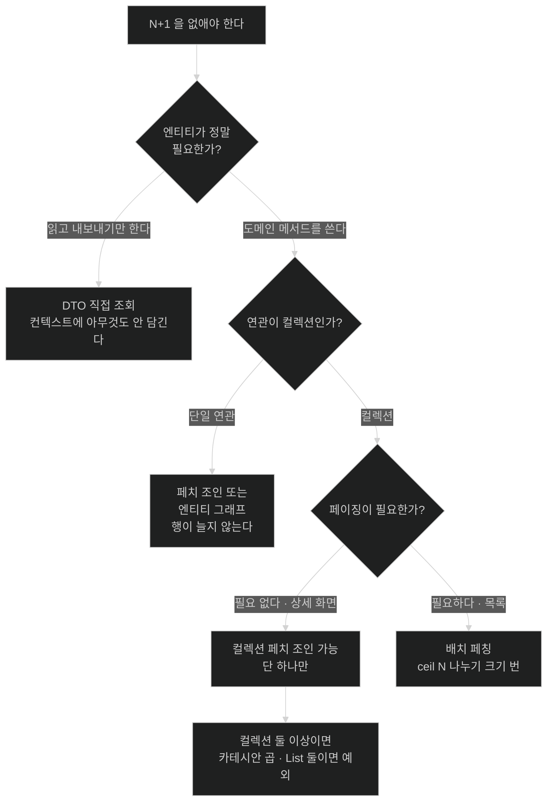

# 페치 조인·엔티티 그래프·배치 페칭

## 한눈에 보기

| 질문 | 핵심 답 |
|---|---|
| 셋 다 N+1을 없애나? | 페치 조인·엔티티 그래프는 1번으로, 배치 페칭은 `ceil(N/크기)`번으로. |
| 페치 조인의 결정적 한계는? | 컬렉션을 페치하면서 **페이징을 같이 쓸 수 없다.** |
| 그때 무슨 일이 일어나나? | Hibernate가 `limit`을 빼고 전부 읽어 메모리에서 자른다. |
| 컬렉션 둘을 동시에 페치하면? | 카테시안 곱. `List` 둘이면 Hibernate가 예외를 던진다. |
| 페이징이 필요하면? | 컬렉션은 배치 페칭, 단일 연관은 페치 조인. |

## 1. 왜 이게 필요한가

### 출발 장면: 41번을 줄여야 한다

앞 노트에서 발견 카탈로그 목록이 SQL 41번을 쓰는 것을 봤다. 원인은 "연관이 목록 쿼리에 포함되지 않았다"는 것이었다. 그러면 포함시키면 된다.

```java
@Query("SELECT m FROM Material m JOIN FETCH m.company WHERE " + CatalogVisibility.DISCOVERY)
List<Material> findDiscoveryMaterials();
```

`JOIN FETCH` 하나로 회사 20번이 사라진다. 이것이 **[[페치-조인]]**(=JPQL에서 `join fetch`로 연관을 같은 SQL 한 번에 함께 읽어 오는 것)이다.

여기서 멈추면 "N+1은 페치 조인으로 해결한다"는 결론이 나온다. 그런데 성분 연결까지 붙이면 무너진다.

```java
@Query("SELECT m FROM Material m JOIN FETCH m.company JOIN FETCH m.substanceLinks WHERE ...")
Page<Material> findDiscoveryMaterials(Pageable pageable);   // 페이징이 필요하다
```

이 쿼리는 **동작은 하는데 페이징이 SQL에서 사라진다.** 로그에 `HHH90003004` 경고가 찍히고, 조건에 맞는 원료를 **전부** 읽어 온 뒤 메모리에서 잘라 낸다. 원료가 5만 건이면 5만 건을 읽어 20건을 반환한다.

### 여기서 뭐가 무너지나

두 가지 구조적 문제가 있다.

**첫째, 컬렉션을 조인하면 결과 행이 곱해진다.**

```text
원료 20건, 각각 성분 연결 8개

SELECT m.*, ms.*
  FROM material m JOIN material_substance ms ON ...

→ 결과 행 160개. 원료 하나가 8줄로 반복된다.
```

JPA는 이 160행을 읽어 중복을 제거하고 원료 20개로 조립한다. 결과는 맞다. 하지만 **DB에서 애플리케이션으로 오는 데이터가 8배**다.

**둘째, 그래서 `limit`을 쓸 수 없다.**

`LIMIT 20`을 붙이면 원료 20개가 아니라 **행 20개**가 잘린다. 원료 두세 개의 성분 일부만 담긴 결과가 나온다. 완전히 틀린 답이다.

Hibernate는 이 상황에서 틀린 답을 주는 대신 다른 선택을 한다. 소스를 보면 판단이 이렇게 되어 있다.

```java
else if ( hasLimit && containsCollectionFetches ) {
    if ( !isPaginationPushedToDerivedTable() ) {
        errorOrLogForPaginationWithCollectionFetch();
    }
    return limitOmittingExecutionContext();   // limit 을 빼고 실행한다
}
```

`limitOmittingExecutionContext()` — **`limit`을 빼고 실행한다.** 그리고 전부 읽어 중복을 제거한 뒤 메모리에서 자른다. 이 동작이 **[[메모리-페이징]]**(=페이징과 컬렉션 페치 조인을 함께 쓸 때 Hibernate가 `limit`을 빼고 전부 읽어 메모리에서 잘라 내는 동작)이다.

경고만 찍고 계속 도는 것이 기본이라, **정확성 문제가 아니라 성능 문제로 조용히 남는다.** `fail_on_pagination_over_collection_fetch`를 켜면 경고 대신 예외가 나서 즉시 드러난다.

### 그래서 나온 생각

방법이 하나가 아니라 셋이고, 각각이 못 하는 것이 다르다.

비유하자면 **택배 배송 방식**이다. 한 트럭에 전부 싣거나(페치 조인), 열 개씩 묶어 여러 번 보내거나(배치 페칭), 무엇을 실을지 송장에 따로 적어 두거나(엔티티 그래프).

→ 비유가 깨지는 지점: 택배는 어떻게 묶든 물건 개수가 그대로다. 페치 조인은 다르다 — **조인하는 순간 물건이 8배로 불어났다가 도착해서 다시 줄어든다.** 원료 20개를 받으려고 160행을 실어 나른다. "묶어 보내면 효율적"이라는 직관이 여기서 뒤집히고, 그래서 컬렉션 페치 조인은 항상 이득인 것이 아니다.

## 2. 어떻게 동작하는가

### 2.1 페치 조인 — 한 번에 읽되 행이 곱해진다

```java
@Query("SELECT m FROM Material m JOIN FETCH m.company WHERE ...")
```

1. **JPQL이 SQL의 조인으로 번역된다.** — 연관 테이블의 컬럼을 같은 결과 집합에 담기 위해서다.
2. **연관 엔티티의 컬럼까지 SELECT 목록에 포함된다.** — 프록시가 아니라 실제 값을 채우려면 컬럼이 있어야 하기 때문이다. 일반 `JOIN`과 다른 점이 정확히 이것이다.
3. **읽어 온 행으로 원본과 연관을 함께 조립한다.** — 이후 접근 시 추가 쿼리가 나가지 않게 하기 위해서다.

**단일 연관(`@ManyToOne`)이면 행이 늘지 않는다.** 원료 하나에 회사 하나이므로 20건은 그대로 20행이다. 페이징도 문제없다.

**컬렉션(`@OneToMany`)이면 행이 곱해진다.** 그리고 페이징이 깨진다. 여기서 규칙 하나가 나온다 — **단일 연관 페치 조인은 거의 항상 안전하고, 컬렉션 페치 조인은 항상 따져 봐야 한다.**

컬렉션을 둘 이상 동시에 페치하면 더 나빠진다. 성분 연결 8개와 다른 컬렉션 5개를 함께 조인하면 행이 20 × 8 × 5 = 800개가 된다. `List` 타입 컬렉션 둘을 동시에 페치하면 Hibernate가 아예 예외를 던진다 — 중복 제거가 불가능해지기 때문이다.

### 2.2 엔티티 그래프 — 같은 일을 쿼리 밖에서 선언한다

**[[엔티티-그래프]]**(=어떤 연관을 함께 읽을지 쿼리 밖에서 선언하는 방식)는 페치 조인과 효과가 같지만 선언 위치가 다르다.

```java
// Spring Data 리포지토리
@EntityGraph(attributePaths = {"company"})
@Query("SELECT m FROM Material m WHERE " + CatalogVisibility.DISCOVERY)
List<Material> findDiscoveryMaterials();
```

Hibernate는 이것을 left outer join으로 번역한다. 즉 **SQL 수준에서는 페치 조인과 거의 같다.** 한계도 같다 — 컬렉션을 넣으면 페이징이 깨진다.

그럼에도 쓰는 이유는 재사용성이다.

```java
// 같은 쿼리, 다른 그래프
@EntityGraph(attributePaths = {"company"})
List<Material> findForList();

@EntityGraph(attributePaths = {"company", "substanceLinks"})
Optional<Material> findForDetail(UUID id);
```

쿼리 문자열은 그대로 두고 **호출 지점마다 무엇을 함께 읽을지만 바꾼다.** 목록과 상세가 같은 조건을 쓰는데 필요한 연관만 다를 때 특히 맞는다. CosmoRoute의 `CatalogVisibility` 상수처럼 조건이 공유되는 구조와 잘 맞물린다.

### 2.3 배치 페칭 — 없애는 것이 아니라 나눈다

**[[배치-페칭]]**(=지연 로딩을 유지하되 초기화가 필요해진 프록시를 모아서 `IN` 절 하나로 읽는 방식)은 접근 방식 자체가 다르다.

```yaml
spring:
  jpa:
    properties:
      hibernate:
        default_batch_fetch_size: 100
```

1. **지연 로딩을 그대로 둔다.** 목록 쿼리에 연관이 포함되지 않는다. — 결과 행을 부풀리지 않기 위해서다.
2. **첫 프록시에 접근하는 순간, 아직 초기화되지 않은 같은 종류의 프록시를 모은다.** — 어차피 곧 다 필요해질 것이기 때문이다.
3. **모은 식별자를 `IN` 절 하나로 묶어 읽는다.** — 왕복 횟수를 나누기 위해서다.

```sql
-- 배치 페칭이 켜지면
SELECT ... FROM company WHERE id IN (?, ?, ?, ..., ?)
```

쿼리 수가 20번에서 1번이 된다(배치 크기 100, 회사 20개). 원료가 500건이고 회사가 500개면 `ceil(500/100) = 5`번이다. **1번으로 만들지는 못하지만 결과 행을 부풀리지도 않는다.**

그래서 **페이징과 함께 쓸 수 있다.** 이것이 배치 페칭의 결정적 장점이다.

### 2.4 CosmoRoute에서 무엇을 고를 것인가

`application.yaml`을 보면 `default_batch_fetch_size`가 설정되어 있지 않다. Hibernate 속성은 `jdbc.time_zone`만 있다. 즉 배치 페칭이 꺼져 있다.

발견 카탈로그 목록의 요구를 정리하면 이렇다.

| 요구 | 결론 |
|---|---|
| 회사 이름을 보여 준다 (단일 연관) | **페치 조인** — 행이 늘지 않고 안전하다 |
| 성분 개수·목록을 보여 준다 (컬렉션) | **배치 페칭** — 페이징을 살려야 한다 |
| 페이징이 필요하다 | 컬렉션 페치 조인은 배제된다 |
| 상세 화면은 한 건만 읽는다 | 페이징이 없으므로 **컬렉션 페치 조인 가능** |

즉 **하나를 고르는 문제가 아니라 경로마다 다르게 고르는 문제**다.

```java
// 목록 — 페이징 있음
@EntityGraph(attributePaths = {"company"})          // 단일 연관만
Page<Material> findDiscoveryPage(Pageable pageable);
// 성분 연결은 default_batch_fetch_size 가 처리한다

// 상세 — 한 건
@EntityGraph(attributePaths = {"company", "substanceLinks"})
Optional<Material> findDiscoveryDetail(UUID id);
```

`default_batch_fetch_size`를 전역으로 켜는 것이 가장 값싼 조치다. 매핑을 건드리지 않고 설정 한 줄이며, 켜서 나빠지는 경우가 거의 없다. **첫 슬라이스에서 가장 먼저 시도할 것**이 이것이다.

### 2.5 네 번째 선택지 — 아예 엔티티를 읽지 않는다

앞 챕터에서 본 DTO 직접 조회는 이 세 가지와 층이 다르다.

```java
@Query("SELECT new com.cosmoroute.api.catalog.MaterialSummary(m.id, m.name, c.companyName)"
        + " FROM Material m JOIN m.company c WHERE ...")
Page<MaterialSummary> findDiscoverySummaries(Pageable pageable);
```

여기에는 페치 조인이 없다. 일반 `JOIN`이고, 필요한 컬럼만 SELECT해서 DTO 생성자에 넣는다.

- 쿼리 1번, 컬럼은 필요한 것만
- 영속성 컨텍스트에 아무것도 담기지 않는다 — 1차 캐시도 스냅샷도 없다
- 프록시가 없으므로 N+1이 발생할 수 없다

목록 화면처럼 **읽고 그대로 내보내는** 경로에서는 이쪽이 가장 정직하다. 셋 중 무엇을 고를지 고민하기 전에 "엔티티가 정말 필요한가"를 먼저 묻는 것이 순서다.

## 3. 그림으로 보기

### 세 방법이 만드는 SQL

```text
원료 20건, 각 원료에 성분 연결 8개

[페치 조인 — 컬렉션]
  SELECT m.*, ms.* FROM material m JOIN material_substance ms ...
  → 쿼리 1번, 결과 행 160개, 중복 제거 후 20개
  → LIMIT 을 붙일 수 없다 (붙이면 행이 잘려 답이 틀린다)

[배치 페칭]
  SELECT m.* FROM material ...                              1번
  SELECT ms.* FROM material_substance WHERE material_id IN (?×20)   1번
  → 쿼리 2번, 결과 행 20 + 160 (부풀지 않음, 각각 자기 행만)
  → LIMIT 을 붙일 수 있다

[DTO 직접 조회]
  SELECT m.id, m.name, c.company_name FROM material m JOIN company c ...
  → 쿼리 1번, 필요한 컬럼만, 컨텍스트에 아무것도 안 담김
  → LIMIT 을 붙일 수 있다
```

### 무엇을 고를지



## 4. 이 노트에 나온 용어

| 용어 | 한 줄 풀이 | 자세히 |
|---|---|---|
| 페치 조인 | `join fetch`로 연관을 같은 SQL에 함께 읽는 것 | [[_glossary#페치-조인]] |
| 엔티티 그래프 | 함께 읽을 연관을 쿼리 밖에서 선언하는 방식 | [[_glossary#엔티티-그래프]] |
| 배치 페칭 | 프록시를 모아 `IN` 절 하나로 읽는 방식 | [[_glossary#배치-페칭]] |
| 메모리 페이징 | `limit`을 빼고 전부 읽어 메모리에서 자르는 동작 | [[_glossary#메모리-페이징]] |

## 5. 자주 헷갈리는 것

### `JOIN` vs `JOIN FETCH`

| 축 | `JOIN` | `JOIN FETCH` |
|---|---|---|
| 목적 | 조건에 쓰기 위해 | 연관을 함께 읽기 위해 |
| SELECT 목록 | 연관 컬럼 없음 | 연관 컬럼 포함 |
| 조회 후 연관 접근 | 추가 쿼리 발생 | 이미 채워져 있음 |
| 결과 행 | 컬렉션이면 곱해짐 | 컬렉션이면 곱해짐 |

`JOIN`만 쓰고 N+1이 해결됐다고 생각하는 것이 흔한 착각이다. 조인은 걸렸지만 연관은 여전히 프록시다.

### 페치 조인 vs 엔티티 그래프

SQL 수준에서는 거의 같다. 다른 것은 **어디에 선언하느냐**다 — 쿼리 문자열 안이냐 밖이냐. 그래서 "무엇이 더 빠른가"는 잘못된 질문이고, "같은 쿼리를 여러 그래프로 재사용할 일이 있는가"가 맞는 질문이다.

### 배치 페칭 vs 즉시 로딩

둘 다 "미리 읽는다"처럼 들리지만 다르다. 즉시 로딩은 항목마다 한 번씩 읽고(N번), 배치 페칭은 모아서 읽는다(`ceil(N/크기)`번). 배치 페칭은 **지연 로딩을 유지한 채** 작동하므로 접근하지 않는 연관은 여전히 안 읽는다.

### `distinct`가 하는 일

컬렉션 페치 조인에서 `SELECT DISTINCT`를 쓰면 중복 원료가 제거된다. 그런데 이건 **애플리케이션 메모리에서의 제거**이고, DB로 나가는 행 수는 그대로다. 최신 Hibernate는 이 중복 제거를 기본으로 해 주므로 `distinct`를 적을 필요가 줄었다. 어느 쪽이든 **전송량 문제는 해결되지 않는다.**

## 6. 언제 안 쓰나 / 경계

- **컬렉션 페치 조인과 페이징을 함께 쓰지 않는다.** 경고만 찍고 도는 것이 기본이라 조용히 남는다. `fail_on_pagination_over_collection_fetch`를 켜서 즉시 터지게 하는 편이 낫다.
- **컬렉션을 둘 이상 동시에 페치하지 않는다.** 행이 곱의 곱이 되고, `List` 둘이면 예외가 난다. 하나만 페치하고 나머지는 배치 페칭에 맡긴다.
- **`default_batch_fetch_size`를 지나치게 크게 잡지 않는다.** `IN` 절의 파라미터 수가 커지면 DB의 실행 계획 캐시가 갈라지고 파서 부담이 늘어난다. 100 안팎이 흔한 출발점이다.
- **모든 쿼리에 페치 조인을 기본으로 달지 않는다.** 그 연관을 쓰지 않는 호출부에서도 읽게 된다. 즉시 로딩을 매핑 대신 쿼리로 옮긴 것에 지나지 않는다.
- **먼저 DTO 조회를 검토한다.** 읽고 내보내기만 하는 경로라면 셋 중 무엇을 고를지 자체가 필요 없는 문제다.

## 7. 연결

- [[01-n-plus-one-when-it-happens]] — 이 노트의 세 방법은 그 노트가 정의한 문제의 해법이다. 문제의 조건 3번("연관이 같은 쿼리에 포함되지 않았다")을 각각 다른 방식으로 뒤집는다.
- [[03-transactional-propagation-and-proxy-limits]] — 배치 페칭은 지연 로딩을 유지하므로 트랜잭션 경계 안에서 접근해야 한다. 경계가 어디까지인지가 이 선택의 전제다.
- [[05-open-session-in-view]] — OSIV가 켜져 있으면 지연 로딩이 응답 변환에서도 성공해, 이 노트의 문제가 컨트롤러 밖에서 발생한다. 그래서 어느 쪽을 고를지 판단이 흐려진다.

## 8. 스스로 확인

1. `JOIN`과 `JOIN FETCH`의 차이를 SELECT 목록으로 설명할 수 있는가?
2. 컬렉션 페치 조인에서 결과 행이 몇 배가 되는지 계산할 수 있는가?
3. 페이징과 컬렉션 페치 조인을 함께 쓰면 Hibernate가 무엇을 하는가? 왜 그렇게 하는가?
4. `LIMIT`을 그대로 붙이면 왜 답이 틀리는가?
5. 페치 조인과 엔티티 그래프의 차이는 SQL 수준인가 다른 곳인가?
6. 배치 페칭이 페이징과 함께 쓸 수 있는 이유는 무엇인가?
7. 배치 크기 100에 항목 500개면 쿼리가 몇 번인가?
8. 목록과 상세에서 서로 다른 전략을 고르는 근거는 무엇인가?
9. `distinct`가 해결하는 것과 해결하지 못하는 것은 각각 무엇인가?


> 아홉 문항을 스스로 답한 **뒤에** [[_02-fetch-join-entitygraph-batch-size]]에서 모범답안과 대조한다. 먼저 열면 이 문항들은 다시 인출 문제로 쓸 수 없다.

<!-- ==== 아래는 내 영역 · 스킬 수정 금지 ==== -->

## 내 설명 시도


## 막혔던 지점


## 리뷰 이력
