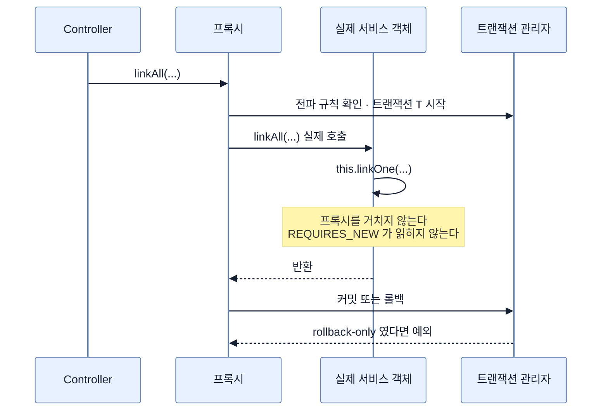

# 트랜잭션 전파와 프록시 AOP의 한계

## 한눈에 보기

| 질문 | 핵심 답 |
|---|---|
| 같은 클래스 안에서 부르면? | `@Transactional`이 **아무 효과도 내지 못한다.** |
| 왜 그런가? | 프록시를 거쳐 들어온 외부 호출만 가로채기 때문이다. |
| 어떻게 알아채나? | 알아채기 어렵다. 애노테이션은 코드에 버젓이 붙어 있다. |
| 해결은? | 다른 빈으로 분리하는 것이 정석. 자기 주입은 차선. |
| 기본 전파는? | `REQUIRED` — 있으면 참여, 없으면 새로 시작. |

## 1. 왜 이게 필요한가

### 출발 장면: `REQUIRES_NEW`가 아무 일도 하지 않는다

원료에 성분 40개를 한꺼번에 붙이는 경로를 만든다고 하자. 요구가 이렇다 — **한 건이 실패해도 나머지는 저장되어야 한다.** 운영자가 40개를 붙였는데 하나가 중복이라고 전부 날아가면 곤란하다.

전파 속성으로 풀 수 있을 것 같다.

```java
@Service
public class CuratedCatalogService {

    @Transactional
    public LinkResult linkAll(UUID materialId, List<UUID> substanceIds) {
        LinkResult result = new LinkResult();
        for (UUID id : substanceIds) {
            try {
                linkOne(materialId, id);        // ← 같은 클래스의 메서드
            } catch (CuratedCatalogRuleViolation e) {
                result.addFailure(id, e);
            }
        }
        return result;
    }

    @Transactional(propagation = Propagation.REQUIRES_NEW)
    public void linkOne(UUID materialId, UUID substanceId) {
        // ...
    }
}
```

돌려 보면 **하나가 실패하는 순간 전부 롤백된다.** `REQUIRES_NEW`가 붙어 있는데도 그렇다. 더 나쁘게는, `catch`로 예외를 잡았는데도 커밋 시점에 `UnexpectedRollbackException`이 난다.

애노테이션은 분명히 있다. 오타도 없다. 그런데 작동하지 않는다.

### 여기서 뭐가 무너지나

`@Transactional`은 코드에 적힌 대로 실행되는 것이 아니다. **Spring이 그 빈을 프록시로 감싸고, 프록시가 호출을 가로채서** 트랜잭션을 열고 닫는다. 이 방식이 **[[프록시-기반-AOP]]**(=대상 객체를 프록시로 감싸고 프록시를 거쳐 들어오는 호출에만 부가 기능을 끼워 넣는 방식)이고, Spring의 기본 모드다.

```text
[정상 — 외부에서 호출]
  Controller ──▶ 프록시 ──▶ 트랜잭션 시작 ──▶ 실제 서비스 객체
                                                     linkAll()

[문제 — 같은 객체 안에서 호출]
  linkAll() ──▶ this.linkOne()
                    ▲
                    └── 프록시를 거치지 않는다.
                        @Transactional 을 읽을 기회 자체가 없다.
```

`linkAll` 안의 `linkOne(...)`은 사실 `this.linkOne(...)`이다. **이미 실제 객체 안에 들어와 있으므로 프록시를 지나갈 일이 없다.** 이것이 **[[자기-호출]]**(=같은 객체 안에서 자기 메서드를 부르는 것. 프록시를 거치지 않는다)이다.

Spring 공식 문서가 이 제약을 명시한다.

> *"기본값인 프록시 모드에서는 **프록시를 통해 들어온 외부 메서드 호출만 가로채진다.** 자기 호출 — 대상 객체 안의 메서드가 같은 객체의 다른 메서드를 부르는 것 — 은 호출되는 메서드에 애노테이션이 붙어 있어도 트랜잭션을 유발하지 않는다."*

비유하자면 **회사 정문의 보안 검색대**다. 밖에서 들어오는 사람은 반드시 통과하지만, 이미 건물 안에 있는 사람이 다른 층으로 이동할 때는 거치지 않는다.

→ 비유가 깨지는 지점: 검색대를 안 거친 사람은 출입 기록이 없어서 나중에 확인할 수 있다. 자기 호출은 **아무 흔적도 남기지 않는다.** 애노테이션이 소스에 버젓이 붙어 있어서 오히려 "적용되고 있다"는 인상을 준다. 로그도, 경고도, 컴파일 오류도 없다. 문제가 있다는 신호가 코드 어디에도 없다는 점에서 검색대 비유는 멈추고, 그래서 이 함정은 반드시 미리 알고 있어야만 피할 수 있다.

## 2. 어떻게 동작하는가

### 2.1 프록시가 하는 일

1. **Spring이 `@Transactional`이 붙은 빈을 프록시로 감싼다.** — 원본 코드를 고치지 않고 트랜잭션 처리를 끼워 넣기 위해서다.
2. **다른 빈이 이 빈을 주입받으면 실제 객체가 아니라 프록시를 받는다.** — 호출이 항상 가로채기 지점을 지나가게 하기 위해서다.
3. **프록시가 호출을 받으면 전파 규칙을 보고 트랜잭션을 시작하거나 참여한다.** — 이미 진행 중인 것이 있는지에 따라 동작이 달라야 하기 때문이다.
4. **실제 객체의 메서드를 호출한다.** — 이 지점부터는 프록시 밖이다.
5. **반환되면 커밋하거나 롤백한다.** — 예외 여부로 판정한다.

4번이 결정적이다. **실제 객체 안으로 들어간 뒤의 호출은 전부 프록시 밖이다.**

### 2.2 전파 규칙

**[[트랜잭션-전파]]**(=이미 트랜잭션이 진행 중일 때 새 경계를 만나면 어떻게 할지 정하는 규칙)의 주요 값은 이렇다.

| 값 | 진행 중인 것이 있으면 | 없으면 |
|---|---|---|
| `REQUIRED` (기본) | 참여한다 | 새로 시작 |
| `REQUIRES_NEW` | 잠시 멈추고 **새로 시작** | 새로 시작 |
| `SUPPORTS` | 참여한다 | 트랜잭션 없이 실행 |
| `MANDATORY` | 참여한다 | **예외** |
| `NOT_SUPPORTED` | 잠시 멈추고 트랜잭션 없이 | 트랜잭션 없이 |
| `NEVER` | **예외** | 트랜잭션 없이 |
| `NESTED` | 세이브포인트를 만든다 | 새로 시작 |

기본이 `REQUIRED`라는 사실이 중요하다. **서비스 메서드끼리 호출하면 대개 하나의 트랜잭션으로 합쳐진다.** 그래서 안쪽에서 예외가 나면 바깥까지 함께 롤백된다.

### 2.3 잡은 예외인데도 롤백되는 이유

출발 장면에서 `catch`를 했는데도 `UnexpectedRollbackException`이 난 것이 이 때문이다.

```text
linkAll()  ── 트랜잭션 T 시작
  linkOne() ── REQUIRES_NEW 가 무시되고 T 에 그대로 있음
      예외 발생 → Spring 이 T 를 rollback-only 로 표시
  catch 로 예외를 잡음 → 애플리케이션은 "처리했다"고 판단
  ...나머지 39건 계속 처리...
linkAll() 반환 → 커밋 시도
  → T 는 이미 rollback-only → UnexpectedRollbackException
```

**예외를 잡는 것과 트랜잭션 상태를 되돌리는 것은 다른 일이다.** 한 번 rollback-only가 찍히면 애플리케이션 코드로는 되돌릴 수 없다.

기본 롤백 규칙도 알아 둬야 한다. Spring은 **unchecked 예외(`RuntimeException`·`Error`)에만 롤백**하고, checked 예외는 롤백하지 않는다. 도메인 예외를 checked로 만들면 예외가 났는데도 커밋되는 상황이 생긴다. CosmoRoute의 `CuratedCatalogRuleViolation`이 unchecked인지 확인해 볼 만한 지점이다.

### 2.4 자기 호출을 푸는 세 가지 방법

**첫째 — 다른 빈으로 분리한다. 공식 문서가 권하는 방법이다.**

```java
@Service
public class CuratedCatalogService {
    private final SubstanceLinker linker;   // 별도 빈 = 프록시로 주입된다

    @Transactional
    public LinkResult linkAll(UUID materialId, List<UUID> ids) {
        for (UUID id : ids) {
            try { linker.linkOne(materialId, id); }   // 프록시를 거친다
            catch (CuratedCatalogRuleViolation e) { ... }
        }
    }
}

@Service
public class SubstanceLinker {
    @Transactional(propagation = Propagation.REQUIRES_NEW)
    public void linkOne(UUID materialId, UUID substanceId) { ... }
}
```

경계가 바뀌면 클래스도 바뀌는 것이 자연스럽다. **"트랜잭션 경계가 다르면 다른 책임"**이라고 읽으면 이 분리가 억지가 아니라 설계 신호가 된다.

**둘째 — 자기 자신을 주입한다.**

```java
@Service
public class CuratedCatalogService {
    @Lazy private final CuratedCatalogService self;   // 프록시가 주입된다
    ...
    self.linkOne(materialId, id);
}
```

동작하지만 코드를 읽는 사람이 `self`의 정체를 알아야 한다. 순환 참조라 `@Lazy`가 필요한 것도 신호다.

**셋째 — `AopContext.currentProxy()`.** 공식 문서가 *"매우 권장되지 않는다"*고 적는다. 클래스가 Spring AOP에 결합되고 프록시 노출 설정이 필요하다. **쓰지 않는다.**

### 2.5 CosmoRoute의 현재 구조에서

`CuratedCatalogService`는 클래스 레벨에 `@Transactional`이 붙어 있고 조회 메서드에만 `@Transactional(readOnly = true)`를 다시 붙였다. 이 구조에서 알아 둘 것이 두 가지다.

- **클래스 레벨 선언은 public 메서드 전부에 적용된다.** 새 메서드를 추가하면 자동으로 트랜잭션 안에 들어간다. 의도한 동작이지만, 트랜잭션이 필요 없는 메서드까지 포함된다는 뜻이기도 하다.
- **참여하는 트랜잭션의 `readOnly`는 무시된다.** 쓰기 트랜잭션 안에서 `readOnly = true` 메서드를 부르면(그리고 그것이 프록시를 거친다면) 바깥 트랜잭션의 설정이 이긴다. `readOnly`는 **새 트랜잭션을 시작할 때만** 의미가 있다.

두 번째는 앞 챕터에서 본 더티 체킹과 이어진다. 조회 전용이라고 믿고 있던 경로가 쓰기 트랜잭션에 참여하면, 그 안에서 만진 엔티티에 UPDATE가 나갈 수 있다.

## 3. 그림으로 보기

### 호출 경로에 따라 프록시를 거치는지가 갈린다



### 전파가 실제로 만드는 트랜잭션 경계

```text
[의도한 것 — REQUIRES_NEW 가 적용됐다면]

  ┌─ T1 (linkAll) ────────────────────────────────────┐
  │   ┌─ T2 ─┐  ┌─ T3 ─┐  ┌─ T4 ─┐   각각 독립 커밋   │
  │   │ 성공 │  │ 실패 │  │ 성공 │   T3 만 롤백        │
  │   └──────┘  └──────┘  └──────┘                     │
  └────────────────────────────────────────────────────┘
      → 39건 저장, 1건 실패 보고


[실제 — 자기 호출이라 전부 T1]

  ┌─ T1 (linkAll) ────────────────────────────────────┐
  │    성공 · 실패 · 성공 · ...  전부 같은 T1 안        │
  │    실패 순간 T1 이 rollback-only 로 표시됨          │
  └────────────────────────────────────────────────────┘
      → 예외를 잡아도 커밋 불가. 전부 롤백.

  → "전파(propagation)" 는 트랜잭션이 호출을 타고 어떻게
    번져 나가는지를 뜻한다. 그런데 그 번짐은 프록시를 지날 때만
    판정된다 — 프록시를 안 지나면 번짐 자체가 없다.
```

## 4. 이 노트에 나온 용어

| 용어 | 한 줄 풀이 | 자세히 |
|---|---|---|
| 트랜잭션 전파 | 진행 중인 트랜잭션이 있을 때 새 경계를 어떻게 다룰지 | [[_glossary#트랜잭션-전파]] |
| 프록시 기반 AOP | 프록시를 거친 호출에만 부가 기능을 끼워 넣는 방식 | [[_glossary#프록시-기반-AOP]] |
| 자기 호출 | 같은 객체 안에서 자기 메서드를 부르는 것 | [[_glossary#자기-호출]] |

## 5. 자주 헷갈리는 것

### `REQUIRED` vs `REQUIRES_NEW`

| 축 | `REQUIRED` | `REQUIRES_NEW` |
|---|---|---|
| 진행 중인 것이 있으면 | 참여 | 멈추고 새로 시작 |
| 안쪽 실패 시 바깥 | 함께 롤백 | 바깥은 계속 가능 |
| 커넥션 | 하나 | **둘** (동시에 점유) |
| 교착 위험 | 낮음 | 같은 행을 건드리면 있음 |

`REQUIRES_NEW`는 커넥션을 하나 더 쓴다. 반복문 안에서 쓰면 커넥션 풀이 압박받는다.

### 예외를 잡는 것 vs 롤백을 막는 것

`catch`는 예외의 전파를 막을 뿐 트랜잭션 상태를 되돌리지 않는다. 이미 rollback-only가 찍혔다면 커밋할 방법이 없다. **부분 성공이 필요하면 트랜잭션 자체를 나눠야 한다.**

### 프록시 AOP vs AspectJ 위빙

Spring의 기본은 프록시다. AspectJ 로드타임 위빙을 쓰면 바이트코드를 직접 고치므로 자기 호출도 가로채진다. 하지만 설정이 무겁고, 대부분의 프로젝트는 **분리로 해결하는 편이 낫다.**

### `private` 메서드에 붙인 `@Transactional`

프록시는 인터페이스나 하위 클래스로 만들어지므로 `private` 메서드는 애초에 가로챌 수 없다. 자기 호출과 같은 이유로 아무 효과가 없고, 이쪽은 더 눈에 안 띈다.

## 6. 언제 안 쓰나 / 경계

- **`REQUIRES_NEW`를 반복문 안에서 남발하지 않는다.** 항목마다 트랜잭션과 커넥션이 하나씩 더 필요하다. 40건이면 커넥션 압박이 실제로 발생한다.
- **트랜잭션을 길게 잡지 않는다.** 외부 API 호출이나 파일 처리를 트랜잭션 안에 넣으면 그동안 커넥션과 락이 묶인다. 첫 슬라이스의 성분 연결처럼 DB 작업만 있는 구간으로 좁힌다.
- **`@Transactional`을 컨트롤러에 붙이지 않는다.** 요청 처리 전체가 트랜잭션이 되어 위 문제가 그대로 생긴다.
- **클래스 레벨 선언에 의존할 때 새 메서드를 주의한다.** 추가하는 순간 자동으로 트랜잭션에 들어간다.
- **`readOnly = true`가 항상 적용된다고 믿지 않는다.** 참여하는 경우에는 바깥 설정이 이긴다.

## 7. 연결

- [[04-isolation-and-optimistic-locking]] — 트랜잭션 경계가 정해져야 격리 수준과 락의 범위가 정해진다. 경계를 모르면 동시성 문제를 논할 수 없다.
- [[02-fetch-join-entitygraph-batch-size]] — 배치 페칭은 지연 로딩을 유지하므로 이 경계 안에서 접근해야 한다. 경계를 벗어나면 앞 챕터의 예외가 난다.
- [[01-n-plus-one-when-it-happens]] — 트랜잭션이 길수록 그 안의 N+1이 커넥션을 오래 붙잡는다. 같은 쿼리 수여도 경계 길이에 따라 영향이 다르다.

## 8. 스스로 확인

1. 자기 호출에서 `@Transactional`이 무시되는 이유를 프록시로 설명할 수 있는가?
2. 이 문제를 코드만 보고 알아채기 어려운 이유는 무엇인가?
3. `catch`로 예외를 잡았는데도 `UnexpectedRollbackException`이 나는 과정을 순서대로 말할 수 있는가?
4. Spring의 기본 롤백 규칙은 무엇인가? checked 예외를 도메인 예외로 쓰면 무엇이 문제인가?
5. 자기 호출을 푸는 세 가지 방법과 각각의 대가는 무엇인가?
6. 왜 "다른 빈으로 분리"가 억지가 아니라 설계 신호인가?
7. `REQUIRES_NEW`를 반복문에서 쓸 때 커넥션 관점의 위험은 무엇인가?
8. 참여하는 트랜잭션에서 `readOnly = true`가 무시되면 앞 챕터의 무엇과 이어지는가?
9. `private` 메서드에 `@Transactional`을 붙이면 왜 효과가 없는가?

<!-- ==== 아래는 내 영역 · 스킬 수정 금지 ==== -->

## 내 설명 시도


## 막혔던 지점


## 리뷰 이력
