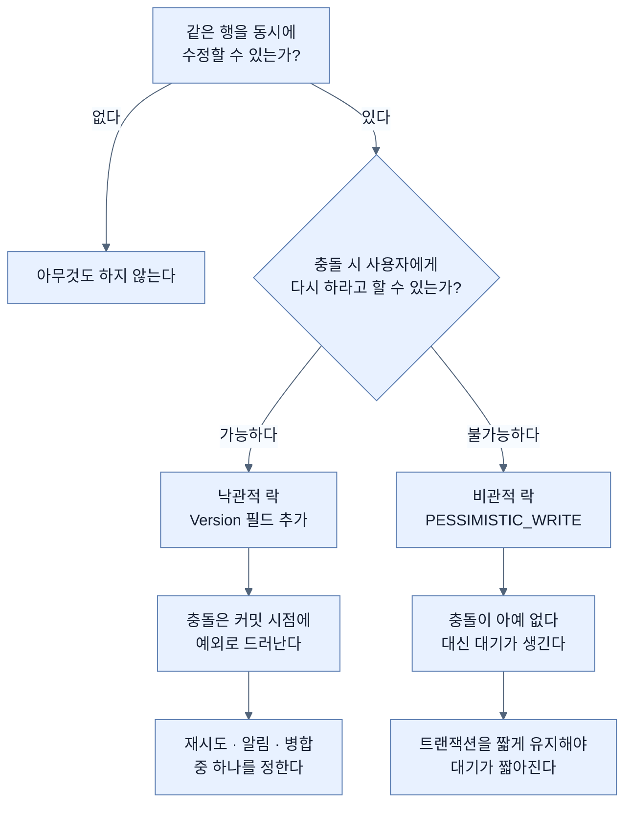

# 격리 수준과 낙관적·비관적 락

## 한눈에 보기

| 질문 | 핵심 답 |
|---|---|
| 관리자 둘이 동시에 고치면? | 나중에 커밋한 쪽이 앞의 변경을 조용히 덮어쓴다. |
| 격리 수준이 막아 주나? | `READ COMMITTED`에서는 막지 못한다. PostgreSQL 기본값이 그것이다. |
| 낙관적 락은 무엇을 잠그나? | **아무것도 잠그지 않는다.** 버전을 비교해 충돌을 탐지할 뿐이다. |
| 비관적 락은? | 실제로 DB 행을 잠근다. `select ... for update`로 번역된다. |
| CosmoRoute의 현재 상태는? | `@Version`이 없다. 덮어쓰기가 조용히 일어날 수 있다. |

## 1. 왜 이게 필요한가

### 출발 장면: 두 관리자가 같은 원료를 연다

운영자 A와 B가 같은 원료의 편집 화면을 연다. A는 이름을 고치고, B는 출처 URL을 고친다. 둘 다 저장한다.

```text
시각  운영자 A                          운영자 B
 t1   SELECT material WHERE id=X
 t2                                    SELECT material WHERE id=X
 t3   material.rename("새 이름")
 t4                                    material.updateSource("새 URL")
 t5   커밋
 t6                                    커밋
```

`t6` 이후 DB에는 무엇이 남을까.

앞 챕터에서 확인한 사실 두 가지가 여기서 만난다. 첫째, Hibernate의 기본 UPDATE는 **바뀌지 않은 컬럼까지 전부 포함**한다. 둘째, `Company`와 `Material` 어디에도 `@Version` 필드가 없다.

그래서 B의 UPDATE가 A의 이름 변경까지 **t2 시점의 옛 값으로 되돌린다.** A의 작업은 사라지고, **아무 에러도 나지 않는다.** A는 자기 변경이 저장됐다고 믿는다.

### 여기서 뭐가 무너지나

먼저 흔한 오해를 정리해야 한다. "트랜잭션을 걸었으니 괜찮지 않나?"

**[[격리-수준]]**(=동시 트랜잭션이 서로의 중간 상태를 얼마나 볼 수 있는지 정하는 수준)이 이 문제를 막아 주지 않는다.

PostgreSQL의 기본값은 `READ COMMITTED`다. 이 수준이 보장하는 것은 "커밋되지 않은 데이터를 읽지 않는다"뿐이다. 위 시나리오에서 A와 B는 각각 **커밋된 데이터를 정상적으로 읽었다.** 격리 규칙을 하나도 어기지 않았다.

문제는 다른 데 있다. 이 패턴은 **읽고 → 애플리케이션에서 고치고 → 쓰는** 세 단계인데, 읽은 시점과 쓰는 시점 사이에 다른 트랜잭션이 끼어들 수 있다. DB는 그 사이에 무슨 일이 있었는지 판정할 근거가 없다 — **B가 보낸 UPDATE는 그 자체로 완벽하게 정상적인 문장**이다.

`REPEATABLE READ`로 올리면 어떨까. PostgreSQL의 `REPEATABLE READ`는 실제로 이 충돌을 감지해 직렬화 실패로 거부한다. 그런데 격리 수준을 올리면 **그 트랜잭션의 모든 읽기**가 영향을 받고, 재시도 처리를 애플리케이션 전반에 넣어야 한다. 특정 엔티티의 동시 수정을 막으려고 전역 규칙을 바꾸는 셈이다.

### 그래서 나온 생각

DB에게 "내가 읽었던 그 상태가 아직 그대로인가"를 물을 수 있으면 된다. 그 물음을 UPDATE 문 안에 넣는다.

```sql
UPDATE material SET name = ?, version = 8 WHERE id = ? AND version = 7
```

이 문장이 갱신한 행이 **0건이면 그 사이 누군가 먼저 고친 것**이다. 7이 아니라 8이 되어 있으니 조건에 안 맞는다. 이 판정 근거가 **[[버전-필드]]**(=낙관적 락의 판정 근거가 되는 필드. `@Version`을 붙이면 JPA가 UPDATE마다 값을 올리고 `WHERE`에 이전 값을 넣는다)이고, 이 방식이 **[[낙관적-락]]**(="충돌은 드물다"고 가정하고 충돌이 실제로 일어났을 때만 실패시키는 방식)이다.

반대로 애초에 남이 못 건드리게 잠가 버리는 방식이 **[[비관적-락]]**(="충돌이 날 것"이라 가정하고 미리 DB 행을 잠그는 방식)이다.

비유하자면 **위키 문서 편집**이다. 낙관적은 저장할 때 "그 사이 다른 사람이 이 문서를 고쳤습니다"라고 알려 주는 방식이고, 비관적은 편집을 시작하는 순간 문서를 잠가 다른 사람이 못 들어오게 하는 방식이다.

→ 비유가 깨지는 지점: 위키의 잠금은 사람이 풀 수도 있고 타임아웃도 있다. DB의 비관적 락은 **그 트랜잭션이 끝날 때까지 무조건 유지된다.** 트랜잭션 안에 외부 API 호출 같은 느린 작업이 하나만 있어도, 그동안 그 행을 건드리려는 모든 요청이 멈춘다. 앞 노트에서 "트랜잭션을 길게 잡지 말라"고 한 것이 여기서 실제 비용이 된다.

## 2. 어떻게 동작하는가

### 2.1 낙관적 락의 전 과정

```java
@Entity
public class Material {
    @Version
    @Column(name = "version", nullable = false)
    private long version;
}
```

1. **엔티티를 조회하면 버전 값도 함께 읽힌다.** — 나중에 비교할 기준이 필요하기 때문이다.
2. **필드를 고친다.** 더티 체킹이 변경을 감지한다. — 앞 챕터 그대로다.
3. **플러시 시점에 UPDATE를 만들면서 `WHERE`에 읽었던 버전을 넣는다.** — "내가 읽은 그 상태인가"를 DB에게 묻기 위해서다.
4. **동시에 `SET version = 읽은값 + 1`을 넣는다.** — 다음 트랜잭션이 이 변경을 감지할 수 있게 하기 위해서다.
5. **갱신된 행 수를 확인한다.** 1이면 성공, **0이면 예외를 던진다.** — 0은 "그 사이 누군가 고쳤다"는 유일한 신호이기 때문이다.

**락이라는 이름이 붙었지만 어느 단계에서도 아무것도 잠그지 않는다.** 읽는 동안 다른 트랜잭션은 자유롭게 읽고 쓴다. 충돌은 막지 않고 **탐지**한다.

### 2.2 탐지한 다음에 무엇을 할 것인가

낙관적 락은 예외를 던지는 데서 끝난다. 그다음은 애플리케이션이 정해야 한다.

- **사용자에게 알린다.** "다른 관리자가 이 원료를 수정했습니다. 새로고침 후 다시 시도하세요." 관리자 화면처럼 사람이 개입하는 경로에 맞는다.
- **재시도한다.** 다시 읽고 다시 고쳐서 다시 쓴다. 자동 처리 경로에 맞지만, 무한 재시도가 되지 않게 횟수를 제한해야 한다.
- **병합한다.** A의 이름과 B의 URL을 둘 다 살린다. 가장 좋지만 도메인마다 규칙을 정해야 해서 비싸다.

첫 번째가 기본이다. **"충돌을 조용히 덮어쓰지 않는다"는 것만으로 이미 큰 개선**이고, 그것이 낙관적 락의 최소 목표다.

### 2.3 비관적 락 — 실제로 잠근다

```java
@Lock(LockModeType.PESSIMISTIC_WRITE)
@Query("SELECT m FROM Material m WHERE m.id = :id")
Optional<Material> findForUpdate(UUID id);
```

Hibernate가 이것을 `select ... for update`로 번역한다. 잠긴 행은 다른 트랜잭션이 수정하려 하면 **대기**한다.

| 모드 | SQL | 뜻 |
|---|---|---|
| `PESSIMISTIC_WRITE` | `for update` | 배타적 잠금. 읽기도 쓰기도 막는다 |
| `PESSIMISTIC_READ` | `for share` (지원 시) | 공유 잠금. 다른 읽기는 허용 |
| `PESSIMISTIC_FORCE_INCREMENT` | 위 + 버전 증가 | 변경이 없어도 버전을 올린다 |

대기가 곤란하면 옵션이 있다. Hibernate의 `UPGRADE_NOWAIT`는 이미 잠긴 행이면 **즉시 실패**하고, `UPGRADE_SKIPLOCKED`는 **잠긴 행을 건너뛴다.** 후자는 작업 큐를 여러 워커가 나눠 가질 때 쓰인다.

주의할 점 하나 — Hibernate의 `LockMode`와 JPA의 `LockModeType`은 이름이 겹치지만 의미가 완전히 같지 않다. JPA의 `READ`와 `WRITE`는 Hibernate의 `OPTIMISTIC`과 `OPTIMISTIC_FORCE_INCREMENT`에 해당한다. **`WRITE`가 비관적 락이 아니다.**

### 2.4 어느 것을 고를 것인가

| 기준 | 낙관적 | 비관적 |
|---|---|---|
| 충돌 빈도 | 낮을 때 | 높을 때 |
| 잠금 | 없음 | 있음 (대기 발생) |
| 실패 시점 | 커밋할 때 | 읽을 때 (대기 후) |
| 사용자에게 | "다시 하세요" 가능해야 함 | 기다리게 함 |
| 읽기 성능 | 영향 없음 | 잠긴 동안 막힘 |
| 교착 위험 | 없음 | 있음 |

판별 질문 — **"충돌했을 때 사용자에게 다시 하라고 할 수 있는가?"** 있으면 낙관적, 없으면(예: 재고 차감처럼 금액이 걸린 것) 비관적이다.

### 2.5 CosmoRoute에 지금 무엇이 필요한가

확인된 사실은 이렇다.

- `Material`·`Company` 어디에도 `@Version`이 없다.
- 스키마에도 `version` 컬럼이 없다.
- 관리자 큐레이션 경로는 운영자가 여럿이고, 같은 원료를 동시에 열 가능성이 있다.
- 앞 챕터에서 본 대로 `@DynamicUpdate`를 붙이려면 `@Version`이 선행되어야 한다.

즉 **낙관적 락 도입은 하나의 결정이 아니라 세 가지를 함께 푸는 열쇠**다 — 덮어쓰기 방지, `@DynamicUpdate` 안전성 확보, 그리고 "누가 먼저 고쳤는가"를 판정할 근거 마련.

도입 비용도 명확하다. Flyway 마이그레이션으로 `version bigint NOT NULL DEFAULT 0`을 추가하고, 엔티티에 필드를 붙이고, 서비스에서 `OptimisticLockException`을 읽을 수 있는 409로 변환하면 된다. CosmoRoute가 이미 RFC 9457 Problem Details를 쓰고 있으므로 변환 자리도 마련되어 있다.

**다만 이건 지금 할 일이 아니다.** 첫 슬라이스는 매핑과 N+1이 목표이고, 동시 수정은 아직 실제로 발생한 문제가 아니다. *"이 문제 때문에 도입했다"*는 근거가 생겼을 때 하는 것이 순서고, 그때 ADR 하나가 나온다.

## 3. 그림으로 보기

### 덮어쓰기가 일어나는 순간

```text
[@Version 이 없을 때]

  t1  A: SELECT ... → name="구", source="구URL"
  t2  B: SELECT ... → name="구", source="구URL"
  t3  A: name="신"
  t4  B: source="신URL"
  t5  A: UPDATE material SET name='신', source='구URL' WHERE id=X   ← 전체 컬럼
  t6  B: UPDATE material SET name='구', source='신URL' WHERE id=X   ← 전체 컬럼

  결과: name='구'  ← A 의 변경이 사라졌다. 에러 없음.


[@Version 이 있을 때]

  t1  A: SELECT ... → version=7
  t2  B: SELECT ... → version=7
  t5  A: UPDATE ... SET version=8 WHERE id=X AND version=7  → 1행 ✅
  t6  B: UPDATE ... SET version=8 WHERE id=X AND version=7  → 0행 ❌
                                                    → OptimisticLockException

  결과: B 가 "다른 사람이 먼저 고쳤다"를 알게 된다.
```

### 두 전략의 시간 축



## 4. 이 노트에 나온 용어

| 용어 | 한 줄 풀이 | 자세히 |
|---|---|---|
| 격리 수준 | 동시 트랜잭션이 서로의 중간 상태를 얼마나 보는지 | [[_glossary#격리-수준]] |
| 낙관적 락 | 충돌을 막지 않고 버전 비교로 탐지하는 방식 | [[_glossary#낙관적-락]] |
| 비관적 락 | 미리 DB 행을 잠가 충돌 자체를 없애는 방식 | [[_glossary#비관적-락]] |
| 버전 필드 | 낙관적 락의 판정 근거가 되는 `@Version` 필드 | [[_glossary#버전-필드]] |

## 5. 자주 헷갈리는 것

### 격리 수준 vs 락

| 축 | 격리 수준 | 낙관적·비관적 락 |
|---|---|---|
| 제공 주체 | DB | 애플리케이션(낙관적) / DB(비관적) |
| 범위 | 트랜잭션 전체 | 특정 엔티티·행 |
| 조정 단위 | 전역 설정에 가깝다 | 필요한 곳에만 |
| 이 문제 해결 | `READ COMMITTED`로는 못 함 | 낙관적으로 가능 |

"격리 수준을 올리면 되지 않나"는 자연스러운 발상이지만, 전역 규칙으로 국소 문제를 푸는 셈이라 대가가 크다.

### 낙관적 "락"이라는 이름

**아무것도 잠그지 않는다.** 이름 때문에 "읽는 동안 다른 사람이 못 건드린다"고 오해하기 쉽다. 실제로는 전부 자유롭게 읽고 쓰며, 충돌은 커밋 시점에야 드러난다. 이름이 오해를 부르는 대표적인 예다.

### JPA `LockModeType.WRITE` vs 비관적 락

`WRITE`는 비관적 락이 아니다. Hibernate의 `OPTIMISTIC_FORCE_INCREMENT`에 해당하는 **낙관적** 모드다. 비관적으로 잠그려면 `PESSIMISTIC_WRITE`를 써야 한다.

### 버전 증가와 더티 체킹

버전은 **실제 변경이 있을 때만** 올라간다. 조회만 한 엔티티는 버전이 그대로다. 그래서 "읽기만 했는데 충돌했다"는 상황은 기본적으로 생기지 않는다. 읽은 사실 자체로 버전을 올리고 싶으면 `OPTIMISTIC_FORCE_INCREMENT`를 명시해야 한다.

## 6. 언제 안 쓰나 / 경계

- **모든 엔티티에 `@Version`을 붙이지 않는다.** 동시 수정이 실제로 가능한 엔티티에만 붙인다. 붙이면 모든 UPDATE에 조건이 하나 더 붙고, 배치 갱신에서 충돌이 잦아진다.
- **비관적 락을 긴 트랜잭션 안에서 잡지 않는다.** 외부 API 호출이 트랜잭션 안에 있으면 그 시간만큼 다른 요청이 전부 멈춘다.
- **격리 수준을 올려서 해결하려 하지 않는다.** 재시도 처리가 애플리케이션 전반에 필요해지고, 문제와 무관한 읽기까지 영향을 받는다.
- **낙관적 락 예외를 삼키지 않는다.** `catch`하고 무시하면 원래의 덮어쓰기와 결과가 같아진다. 최소한 사용자에게 알려야 한다.
- **지금 도입할 이유가 없으면 도입하지 않는다.** CosmoRoute의 첫 슬라이스는 매핑과 쿼리 수가 목표다. 동시 수정이 실제 문제로 나타났을 때 근거와 함께 도입한다.

## 7. 연결

- [[03-transactional-propagation-and-proxy-limits]] — 락의 유효 범위는 트랜잭션 경계다. 경계가 어디서 시작하고 끝나는지 모르면 락이 언제 풀리는지도 모른다.
- [[01-n-plus-one-when-it-happens]] — 비관적 락을 잡은 채 N+1이 돌면 그 시간만큼 다른 트랜잭션이 대기한다. 쿼리 수가 곧 락 유지 시간이 된다.
- [[05-open-session-in-view]] — OSIV는 컨텍스트를 요청 끝까지 늘리지만 트랜잭션은 그렇지 않다. 락이 어디서 풀리는지 헷갈리기 쉬운 지점이다.

## 8. 스스로 확인

1. `READ COMMITTED`에서 덮어쓰기가 막히지 않는 이유를 "읽고-고치고-쓰기" 패턴으로 설명할 수 있는가?
2. 낙관적 락이 실제로 잠그는 것이 무엇인지 답할 수 있는가?
3. `@Version`이 붙었을 때 UPDATE 문이 어떻게 달라지는지 SQL로 쓸 수 있는가?
4. 갱신된 행이 0건이라는 사실이 왜 충돌의 신호인가?
5. 충돌을 탐지한 뒤의 선택지 세 가지와 각각이 맞는 상황은 무엇인가?
6. 낙관적과 비관적을 가르는 판별 질문 하나를 말할 수 있는가?
7. `PESSIMISTIC_WRITE`와 `LockModeType.WRITE`가 다른 이유는 무엇인가?
8. CosmoRoute에서 `@Version` 도입이 세 가지 문제를 함께 푸는 이유는 무엇인가?
9. 그런데 지금 도입하지 않는 이유는 무엇인가?

<!-- ==== 아래는 내 영역 · 스킬 수정 금지 ==== -->

## 내 설명 시도


## 막혔던 지점


## 리뷰 이력
