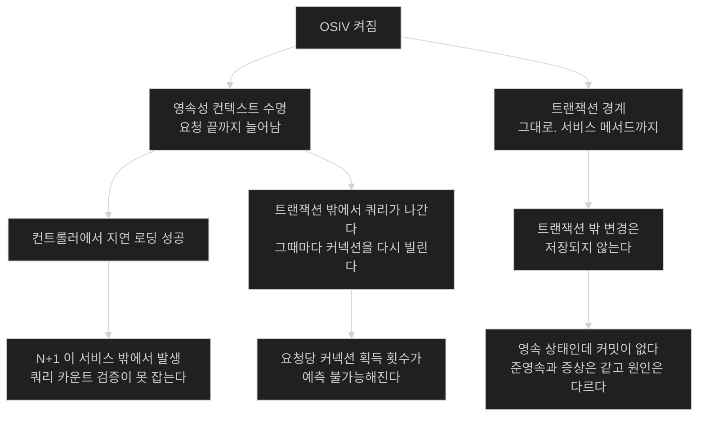

# OSIV — 컨텍스트를 요청 끝까지 열어 두기

## 한눈에 보기

| 질문 | 핵심 답 |
|---|---|
| 기본값은? | **켜짐.** Spring Boot 웹 애플리케이션이 인터셉터를 자동 등록한다. |
| 무엇을 늘리나? | 영속성 컨텍스트의 수명. **트랜잭션은 늘리지 않는다.** |
| 얻는 것은? | 컨트롤러·응답 변환 단계에서도 지연 로딩이 된다. |
| 잃는 것은? | 쿼리가 트랜잭션 밖에서 나간다. 커넥션을 요청마다 여러 번 다시 빌린다. |
| CosmoRoute는? | 설정이 없어 켜져 있다. **꺼야 한다** — 서버 뷰 자체가 없다. |

## 1. 왜 이게 필요한가

### 출발 장면: 설정에 없는데 켜져 있다

CosmoRoute의 `application.yaml`에서 `spring.jpa` 아래를 보면 이렇다.

```yaml
jpa:
  hibernate:
    ddl-auto: validate
  properties:
    hibernate:
      jdbc:
        time_zone: UTC
```

`open-in-view`가 없다. 그런데 없다고 꺼져 있는 것이 아니다. Spring Boot 공식 문서는 이렇게 적는다.

> *"웹 애플리케이션에서 Spring Boot는 기본적으로 `OpenEntityManagerInViewInterceptor`를 등록해 'Open EntityManager in View' 패턴을 사용하며, 뷰에서의 지연 로딩을 지원한다. 이 동작은 `spring.jpa.open-in-view`를 `false`로 설정해 끌 수 있다."*

**기본값이 켜짐**이다. 그래서 애플리케이션을 띄우면 Spring Boot가 시작 로그에 경고를 하나 남긴다 — 이 설정이 켜져 있으니 명시적으로 지정해 경고를 없애라는 내용이다. 이 경고가 존재하는 것 자체가 힌트다. **기본값인데 경고를 하는 설정은 흔치 않다.**

이 패턴이 **[[OSIV]]**(=웹 요청이 끝날 때까지 영속성 컨텍스트를 열어 두는 패턴)다.

### 여기서 뭐가 무너지나

OSIV가 없으면 어떤 코드가 깨지는지부터 보자.

```java
@GetMapping("/api/materials/{id}")
public MaterialDetail detail(@PathVariable UUID id) {
    Material m = service.findById(id);        // @Transactional 이 여기서 끝난다

    return new MaterialDetail(
            m.getName(),
            m.getCompany().getCompanyName(),  // ← 프록시 초기화
            m.getSubstanceLinks().size());    // ← 컬렉션 초기화
}
```

앞 챕터에서 본 대로, 트랜잭션이 끝나면 엔티티는 준영속이 되고 프록시는 `LazyInitializationException`을 던진다. **OSIV가 없으면 이 컨트롤러는 터진다.**

OSIV를 켜면 터지지 않는다. 컨텍스트가 아직 살아 있어서 프록시가 초기화된다. 편리하다.

그런데 그 편리함의 정체를 정확히 봐야 한다. **문제가 사라진 것이 아니라 보이지 않게 된 것**이다.

- 앞 노트의 N+1이 **서비스 계층 밖에서** 발생한다. 쿼리 수를 세는 테스트는 서비스 메서드를 감싸는데, 실제 쿼리는 컨트롤러에서 나간다.
- 응답 직렬화가 getter를 전부 호출하므로, DTO 변환을 빠뜨리고 엔티티를 그대로 반환하면 **객체 그래프 전체가 조용히 로딩된다.**
- **DB 쿼리가 트랜잭션 밖에서 나간다.** 응답 변환 중 프록시가 초기화되면 그 SELECT는 어떤 `@Transactional` 안에도 들어 있지 않다.

마지막에 대해 널리 퍼진 설명이 하나 있는데, **현재 Spring Boot 기본값에서는 정확하지 않다.** "OSIV를 켜면 커넥션을 요청이 끝날 때까지 붙잡는다"는 요약이 그것이다. Hibernate 공식 문서는 RESOURCE_LOCAL 트랜잭션에 대해 이렇게 적는다.

> *"RESOURCE_LOCAL 트랜잭션에서는 커넥션을 **필요할 때 획득하고 트랜잭션이 끝난 뒤 반환한다.**"*

Spring Boot의 JPA 구성이 RESOURCE_LOCAL이고 커넥션 처리 모드가 `DELAYED_ACQUISITION_AND_RELEASE_AFTER_TRANSACTION`이므로, **서비스 트랜잭션이 커밋되는 순간 커넥션은 풀로 돌아간다.** OSIV가 늘리는 것은 영속성 컨텍스트이지 커넥션 임대가 아니다.

그러면 무엇이 비싼가. 컨트롤러에서 프록시를 건드리는 순간 그 쿼리도 커넥션이 필요하고, **트랜잭션 밖이므로 그때 다시 빌려야 한다.** 요청 하나가 풀을 한 번 길게 쓰는 것이 아니라 **예측할 수 없는 시점에 여러 번** 쓴다. 앞 노트의 N+1이 응답 변환 단계에서 터지면 그 횟수만큼 풀을 때린다.

고전적 요약이 아주 틀린 것도 아니다. 커넥션 처리 모드를 `*_AND_HOLD`로 바꾸거나 옛 Hibernate 기본값을 쓰면 실제로 요청 내내 점유한다. **그래서 이 주장은 "내 애플리케이션에서 확인할 것"으로 다뤄야 한다** — `hibernate.connection.handling_mode` 실제 값과 HikariCP의 `hikaricp.connections.active`·`hikaricp.connections.pending` 지표를 보면 어느 쪽인지 바로 드러난다.

### 그래서 나온 생각 — 무엇이 늘어나는지 정확히 구분한다

여기서 가장 자주 틀리는 것이 "OSIV가 트랜잭션을 늘린다"는 오해다. 그렇지 않다.

**[[트랜잭션-경계]]**(=트랜잭션이 시작되고 끝나는 지점. `@Transactional` 메서드의 진입과 반환)는 그대로다. OSIV가 늘리는 것은 **영속성 컨텍스트의 수명**뿐이다.

```text
[OSIV 꺼짐]
  요청 ─┬─ 컨트롤러 ─┬─ 서비스 @Transactional ─┬─ 응답 ─┐
        │            │  ├ 트랜잭션 시작        │        │
        │            │  ├ 컨텍스트 생성        │        │
        │            │  └ 커밋 · 컨텍스트 종료 │        │
        │            │                         └ 준영속 │
        └────────────┴─────────────────────────────────┘
                                    ▲ 여기서 지연 로딩 = 예외

[OSIV 켜짐]
  요청 ─┬─ 컨트롤러 ─┬─ 서비스 @Transactional ─┬─ 응답 ─┐
        │  컨텍스트 생성                        │        │
        │            │  ├ 트랜잭션 시작        │        │
        │            │  └ 커밋 (트랜잭션만 끝남)│        │
        │            │                         │        │
        └────────────┴─────────────────────────┴────────┘
             컨텍스트는 여기까지 살아 있다
                        ▲ 지연 로딩 성공. 단 변경은 저장되지 않는다.
```

**트랜잭션이 끝난 뒤의 변경은 저장되지 않는다.** 엔티티는 여전히 영속 상태라 더티 체킹 대상이지만, 커밋할 트랜잭션이 없다. 컨트롤러에서 엔티티를 고치면 아무 일도 일어나지 않는다 — 앞 챕터의 준영속 사고와 증상이 같은데 원인은 다르다.

비유하자면 **도서관의 대출 창구와 열람실**이다. 대출 창구(트랜잭션)는 닫혔는데 열람실(컨텍스트)은 계속 열어 둔다. 책을 더 꺼내 볼 수는 있지만 빌려 갈 수는 없다.

→ 비유가 깨지는 지점: 열람실에서는 내가 책을 몇 권 더 꺼내 보든 도서관의 다른 사람에게 영향이 없다. 여기서는 다르다 — 책을 꺼낼 때마다 **사서(커넥션)를 한 명 불러야 하고**, 사서는 열 명뿐이며 모든 열람실이 그들을 공유한다. 게다가 언제 몇 번 부를지가 **열람실 밖에서는 보이지 않는다.** 서비스 계층의 쿼리는 셀 수 있는데 응답 변환 중의 호출은 그 집계에 잡히지 않는다. "열어 두면 편하니까 열어 두자"가 성립하지 않는 이유는 좌석값이 아니라 **비용이 측정되지 않는 자리로 옮겨 간다**는 데 있다.

## 2. 어떻게 동작하는가

### 2.1 인터셉터가 하는 일

1. **요청이 들어오면 인터셉터가 영속성 컨텍스트를 만들어 스레드에 바인딩한다.** — 이후 어느 계층에서든 같은 컨텍스트를 쓰게 하기 위해서다.
2. **서비스의 `@Transactional`이 그 컨텍스트에 트랜잭션을 붙인다.** — 새로 만들지 않고 이미 있는 것에 참여한다.
3. **서비스가 끝나면 트랜잭션만 커밋되고 컨텍스트는 유지된다.** — 뷰나 응답 변환에서 지연 로딩이 되게 하기 위해서다.
4. **컨트롤러·직렬화 단계의 지연 로딩이 성공한다.** — 컨텍스트가 살아 있기 때문이다. 다만 트랜잭션 밖이라 읽기만 가능하다.
5. **응답이 끝나면 인터셉터가 컨텍스트를 닫는다.** — 3번과 4번 사이에 커넥션은 이미 풀로 돌아갔고, 4번의 지연 로딩은 그때마다 다시 빌려 쓴다.

### 2.2 끄면 무엇이 달라지나

```yaml
spring:
  jpa:
    open-in-view: false
```

- 시작 경고가 사라진다.
- 트랜잭션이 끝나는 순간 컨텍스트가 닫힌다. 커넥션은 어차피 트랜잭션 종료와 함께 반환되므로, 달라지는 것은 **그 뒤로 커넥션을 다시 빌릴 일이 없어진다**는 점이다.
- 서비스 밖에서 지연 로딩을 하면 **즉시 예외**가 난다.

세 번째가 핵심이다. 불편해 보이지만 **"어디까지 읽을지를 서비스 계층에서 정하라"는 강제**다. 그러면 이런 것들이 자연히 따라온다.

- 페치 전략을 서비스 안에서 결정하게 된다. 앞 노트의 페치 조인·엔티티 그래프·배치 페칭 선택이 한곳에 모인다.
- 쿼리 수 검증이 실제로 유효해진다. 서비스 메서드를 감싸면 그 안에서 모든 쿼리가 끝나기 때문이다.
- 엔티티가 계층 밖으로 새는 것이 예외로 드러난다. DTO 변환 경계가 강제된다.

**예외는 비용이 아니라 신호다.** OSIV를 끄면 지금까지 조용히 일어나던 것이 소리를 낸다.

### 2.3 CosmoRoute는 꺼야 한다

일반론이 아니라 이 저장소의 구조 때문이다.

**첫째, 서버 뷰가 없다.** OSIV의 "View"는 서버가 HTML을 렌더링하는 단계를 뜻한다. CosmoRoute의 프론트는 Nuxt와 Vue SPA로 완전히 분리되어 있고, 백엔드는 `contracts/openapi.yaml` 계약에 따라 JSON만 반환한다. **지연 로딩이 필요한 뷰 렌더링 단계 자체가 존재하지 않는다.**

**둘째, 응답 타입이 이미 DTO다.** `CompanySummary`·`MaterialSummary`가 모듈의 공개 타입으로 따로 있다. 엔티티가 컨트롤러 밖으로 나갈 일이 설계상 없다. 그렇다면 컨트롤러 단계의 지연 로딩도 필요 없다.

**셋째, 모듈 경계를 테스트가 검증하는 저장소다.** ADR-0008에 따라 `internal` 패키지와 경계 테스트로 계층을 강제한다. OSIV는 그 경계를 흐리는 방향으로 작동한다 — 서비스가 반환한 것을 컨트롤러가 더 파고들 수 있게 해 주기 때문이다.

**넷째, 첫 슬라이스가 N+1을 다룬다.** OSIV가 켜져 있으면 쿼리가 서비스 밖에서 나가므로, 앞 노트에서 만든 쿼리 카운트 검증이 실제 동작을 못 잡는다.

즉 이 저장소에서 OSIV는 **얻는 것이 없고 잃는 것만 있다.** 설정 한 줄을 명시적으로 적고, 그 이유를 주석으로 남기는 것이 이 프로젝트의 다른 설정들과도 일관된다 — `application.yaml`의 다른 항목들이 전부 "왜 이 값인지"를 주석으로 달고 있다.

### 2.4 끌 때 실제로 무엇이 깨질 수 있나

지금은 거의 없다. 확인된 사실 기준으로 연관관계 매핑이 `Material.company` 하나뿐이고, 서비스가 DTO를 반환한다. 다만 첫 슬라이스에서 성분 연결 컬렉션이 생기면 주의할 지점이 생긴다.

```java
@Transactional(readOnly = true)
public MaterialDetail detail(UUID id) {
    Material m = repository.findDiscoveryDetail(id).orElseThrow();
    // ↑ 엔티티 그래프로 company 와 substanceLinks 를 함께 읽어 둬야 한다
    return MaterialDetail.from(m);   // ← 변환도 이 트랜잭션 안에서
}
```

**DTO 변환을 트랜잭션 안에서 끝내는 것**이 규칙이 된다. 변환을 컨트롤러로 미루면 OSIV 없이는 예외가 난다. 이 제약이 오히려 "엔티티는 서비스 밖으로 나가지 않는다"는 경계를 코드로 강제해 준다.

## 3. 그림으로 보기

### 커넥션이 묶여 있는 구간

```text
[OSIV 켜짐 — 기본값]  원료 20건 목록, 회사를 응답 변환에서 읽는다

  요청 ────────────────────────────────────────────────▶ 응답
  │                                                      │
  ├─ 컨텍스트 생성 (커넥션 없음 — 지연 획득)              │
  │     ┌─ 서비스 트랜잭션 ─┐                            │
  │     │  커넥션 획득       │                            │
  │     │  SELECT material   │                            │
  │     └─ 커밋 · 커넥션 반환┘                            │
  │                                                      │
  │        컨트롤러 · 직렬화 — 컨텍스트는 살아 있다        │
  │        getCompany() × 20                             │
  │          └ 획득·SELECT·반환  × 20                     │
  │            트랜잭션 밖이다                            │
  └──────────────────────────────────────────────────────┘

  → 요청 하나가 풀을 21번 빌린다. 그중 20번은 트랜잭션 밖이라
    서비스 메서드를 감싼 쿼리 카운트 검증에 잡히지 않는다.


[OSIV 꺼짐]

  요청 ────────────────────────────────────────────────▶ 응답
  │     ┌─ 서비스 트랜잭션 ────────────┐                 │
  │     │  커넥션 획득                  │                 │
  │     │  SELECT material + company    │  ← 페치 전략을   │
  │     │  DTO 변환까지 이 안에서       │    여기서 정한다 │
  │     └─ 커밋 · 커넥션 반환 ──────────┘                 │
  │                        컨트롤러 · 직렬화 (DB 접근 없음)│
  └──────────────────────────────────────────────────────┘

  → 요청 하나가 풀을 1번 빌린다. 그리고 그 횟수가 측정된다.
    줄어든 것은 "점유 시간"이 아니라 "획득 횟수와 그 예측 불가능성"이다.
```

### 무엇이 늘어나고 무엇이 그대로인가



## 4. 이 노트에 나온 용어

| 용어 | 한 줄 풀이 | 자세히 |
|---|---|---|
| OSIV | 요청이 끝날 때까지 영속성 컨텍스트를 열어 두는 패턴 | [[_glossary#OSIV]] |
| 트랜잭션 경계 | 트랜잭션이 시작되고 끝나는 지점 | [[_glossary#트랜잭션-경계]] |

## 5. 자주 헷갈리는 것

### OSIV vs 트랜잭션 연장

| 축 | OSIV | 트랜잭션 연장 |
|---|---|---|
| 늘어나는 것 | 영속성 컨텍스트 수명 | 트랜잭션 |
| 지연 로딩 | 가능 | 가능 |
| 변경 저장 | **안 된다** | 된다 |
| 커넥션 | 요청 끝까지 | 트랜잭션 끝까지 |

OSIV가 켜졌다고 컨트롤러의 변경이 저장되지는 않는다. 이걸 혼동하면 "왜 저장이 안 되지"에서 막힌다.

### `LazyInitializationException`이 안 나는 두 가지 이유

하나는 OSIV가 켜져 있어서, 다른 하나는 필요한 것을 이미 페치해 뒀기 때문이다. 후자가 맞는 이유이고, 전자는 **문제를 가린 것**이다. 예외가 안 난다는 사실만으로 안심하면 안 되는 이유가 이것이다.

### OSIV 끄기 vs 트랜잭션을 컨트롤러까지 넓히기

둘 다 예외를 없애지만 정반대 방향이다. 후자는 앞 노트에서 본 문제 — 긴 트랜잭션, 락 유지, 커넥션 점유 — 를 전부 키운다. **예외를 없애는 것이 목표가 아니라 경계를 명확히 하는 것이 목표**다.

### "커넥션을 요청 끝까지 붙잡는다"는 요약

**널리 퍼져 있지만 현재 Spring Boot 기본값에서는 맞지 않는다.** RESOURCE_LOCAL + `DELAYED_ACQUISITION_AND_RELEASE_AFTER_TRANSACTION`에서는 트랜잭션이 끝나면 커넥션이 반환된다. 이 요약은 `*_AND_HOLD` 모드나 옛 기본값에서 유래했다.

바뀌는 것은 결론이 아니라 **진단 방향**이다. 점유 시간이 문제라면 풀을 키우는 것이 임시방편이라도 되지만, 실제 문제가 **획득 횟수와 그 위치**라면 풀을 키워도 N+1은 그대로다. 고쳐야 할 것은 "어디서 몇 번 읽는가"이고, 그건 페치 전략의 문제다.

## 6. 언제 안 쓰나 / 경계

- **서버 사이드 렌더링이 없으면 켤 이유가 없다.** OSIV의 "View"가 존재하지 않는다. API 전용 백엔드가 대표적이다.
- **끄기 전에 DTO 변환 경계를 먼저 확인한다.** 엔티티를 그대로 반환하는 컨트롤러가 있으면 끄는 순간 예외가 난다. 그 예외가 고쳐야 할 지점을 알려 주지만, 배포 전에 확인해야 한다.
- **끈다고 N+1이 사라지지 않는다.** 발생 위치가 서비스 안으로 옮겨질 뿐이다. 대신 그 위치가 측정 가능한 곳이 된다.
- **켜 두기로 했다면 명시적으로 적는다.** 기본값에 의존하지 말고 `true`라고 적고 이유를 남긴다. 그래야 다음 사람이 "검토한 결과"인지 "몰라서 그런 것"인지 구분할 수 있다.
- **템플릿 엔진을 쓰는 프로젝트라면 판단이 달라진다.** Thymeleaf 뷰에서 지연 로딩이 실제로 필요하다면 OSIV의 값이 있다. 그때는 뷰가 연관을 몇 번 건드리는지가 곧 풀 사용량이므로, 렌더링 중 쿼리 수를 따로 봐야 한다.

## 7. 연결

- [[03-transactional-propagation-and-proxy-limits]] — OSIV는 컨텍스트만 늘리고 트랜잭션 경계는 그대로 둔다. 두 수명을 구분하지 못하면 이 노트 전체가 흐려진다.
- [[01-n-plus-one-when-it-happens]] — OSIV가 켜져 있으면 N+1이 서비스 밖에서 발생해 쿼리 카운트 검증을 빠져나간다. 끄는 것이 그 측정을 유효하게 만든다.
- [[04-isolation-and-optimistic-locking]] — 락은 트랜잭션이 끝나면 풀린다. 컨텍스트가 살아 있어도 락은 이미 없다. 두 수명의 구분이 여기서도 필요하다.

## 8. 스스로 확인

1. Spring Boot에서 OSIV의 기본값은 무엇이고, 설정에 없을 때 어떻게 확인할 수 있는가?
2. OSIV가 늘리는 것과 늘리지 않는 것을 각각 말할 수 있는가?
3. OSIV가 켜져 있는데도 컨트롤러의 변경이 저장되지 않는 이유는 무엇인가?
4. "OSIV는 커넥션을 요청 끝까지 붙잡는다"가 현재 기본값에서 왜 부정확한가? 대신 무엇이 비용인가?
5. OSIV를 끄면 나는 예외가 왜 "비용이 아니라 신호"인가?
6. CosmoRoute에서 꺼야 하는 이유 네 가지를 댈 수 있는가?
7. 끄면 DTO 변환을 어디에서 해야 하는가? 왜 그런가?
8. 켜 두기로 했더라도 명시적으로 적어야 하는 이유는 무엇인가?


> 여덟 문항을 스스로 답한 **뒤에** [[_05-open-session-in-view]]에서 모범답안과 대조한다. 먼저 열면 이 문항들은 다시 인출 문제로 쓸 수 없다.

<!-- ==== 아래는 내 영역 · 스킬 수정 금지 ==== -->

## 내 설명 시도


## 막혔던 지점


## 리뷰 이력
