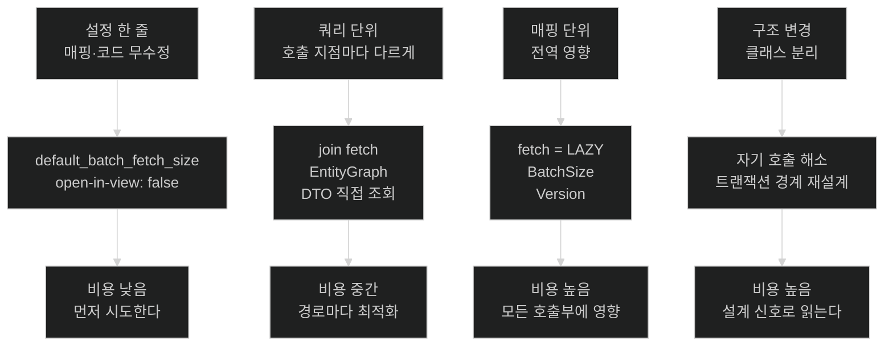

# chapter-j3 개념 지도 — 성능과 트랜잭션

> 목차가 아니라 관계도다. 세션을 열 때와 닫을 때 항상 펼친다.
>
> 이 챕터가 답하는 한 문장짜리 질문: **"매핑이 맞게 됐는데도 느리거나 틀리는 경우, 원인은 어디에 있고 무엇을 조정하는가?"**

## 축 1: 무엇이 잘못되는가 — 세 가지 실패의 성격

앞 두 챕터가 "어떻게 매핑하는가"였다면 이 챕터는 "매핑이 맞아도 생기는 문제"다. 성격이 셋으로 갈린다.

| 실패 | 증상 | 결과의 정확성 | 어디서 드러나나 | 노트 |
|---|---|---|---|---|
| 쿼리가 갈라진다 | 느리다 | **맞다** | 운영 데이터에서만 | [[01-n-plus-one-when-it-happens]] |
| 해법이 다른 문제를 만든다 | 페이징이 깨지거나 전송량이 는다 | 경우에 따라 틀리다 | 경고 로그 | [[02-fetch-join-entitygraph-batch-size]] |
| 경계가 의도와 다르다 | 전파가 안 먹고, 롤백이 통째로 난다 | **틀리다** | 예외 또는 조용히 | [[03-transactional-propagation-and-proxy-limits]] |
| 동시 수정이 덮어써진다 | 데이터가 사라진다 | **틀리다** | **아무 데서도** | [[04-isolation-and-optimistic-locking]] |
| 컨텍스트가 너무 오래 산다 | 커넥션이 묶인다 | 맞다 | 부하가 걸릴 때 | [[05-open-session-in-view]] |

- **핵심 질문**: 이 문제는 테스트로 잡히는가, 아니면 운영에서만 드러나는가?
- 표의 마지막 열이 이 챕터의 난이도다. **네 번째 행이 최악이다** — 결과가 틀렸는데 어디서도 드러나지 않는다.

## 축 2: 두 개의 수명 — 헷갈리면 절반이 틀린다

이 챕터의 반복되는 혼동은 전부 이 구분에서 나온다.

```text
  요청 시작                                                    요청 끝
    │                                                            │
    │   ┌──── 트랜잭션 경계 ────┐                                 │
    │   │  @Transactional 진입  │                                 │
    │   │  락이 잡힌다          │                                 │
    │   │  더티 체킹이 커밋된다 │                                 │
    │   │  커밋 · 락 해제       │                                 │
    │   └───────────────────────┘                                 │
    │                                                            │
    │   ┌──── 영속성 컨텍스트 수명 (OSIV 켜짐) ──────────────────┐│
    │   │  1차 캐시가 산다 · 프록시 초기화가 된다                ││
    │   │  단 트랜잭션이 없어 변경은 저장되지 않는다             ││
    │   └────────────────────────────────────────────────────────┘│
    └────────────────────────────────────────────────────────────┘
```

| 질문 | 답의 근거 |
|---|---|
| 지연 로딩이 되는가? | **컨텍스트** 수명 |
| 변경이 저장되는가? | **트랜잭션** 경계 |
| 락이 유지되는가? | **트랜잭션** 경계 |
| 커넥션이 묶이는가? | **컨텍스트** 수명 (OSIV 켜짐 시) |

- **핵심 질문**: 지금 이야기하는 것이 컨텍스트인가 트랜잭션인가?
- 주요 노드: [[05-open-session-in-view]], [[03-transactional-propagation-and-proxy-limits]]

## 축 3: 조정 수단이 놓인 층



- **핵심 질문**: 가장 값싼 층에서 해결되는가? 위층으로 올라가기 전에 아래층을 다 써 봤는가?

## 축 4: CosmoRoute에 지금 적용할 것과 미룰 것

| 항목 | 판단 | 근거 |
|---|---|---|
| `default_batch_fetch_size` 켜기 | **지금** | 설정 한 줄, 페이징과 호환, 잃을 것이 없다 |
| `open-in-view: false` 명시 | **지금** | 프론트가 분리되어 서버 뷰가 없다 |
| 목록에 엔티티 그래프(단일 연관만) | **지금** | 컬렉션을 넣으면 페이징이 깨진다 |
| 목록 API 쿼리 카운트 검증 | **지금** | Testcontainers 기반이 이미 있다 |
| DTO 변환을 트랜잭션 안으로 | **지금** | OSIV를 끄면 강제된다 |
| `fail_on_pagination_over_collection_fetch` | 다음 | 경고를 예외로 승격. 첫 슬라이스 안정화 후 |
| `@Version` 추가 | **미룸** | 동시 수정이 실제 문제가 됐을 때. ADR 감 |
| `@DynamicUpdate` | **미룸** | `@Version`이 선행 조건 |
| 2차 캐시 · 커넥션 풀 튜닝 | **미룸** | 측정 없이 조정할 값이 아니다 |

**"지금"과 "미룸"을 가르는 기준은 하나다** — 실제로 관측된 문제가 있는가. 미룬 항목들은 전부 "생길 수 있는 문제"이고, 지금 하는 항목들은 전부 "지금 구조에서 확실히 이득"이다. 이 구분이 곧 포트폴리오에서 말할 수 있는 판단 근거가 된다.

## 나의 취약 엣지

아직 인출 시도가 없다. 사용자가 노트를 읽고 인출 연습을 한 뒤 채운다. 추정으로 미리 채우지 않는다.

## 앞 챕터에서 이어지는 곳

| 앞 챕터의 결론 | 이 챕터에서의 전개 |
|---|---|
| 지연 로딩은 미루는 것이지 안 읽는 것이 아니다 (j2) | 그 "미룸"이 N+1이 되는 조건 |
| 더티 체킹은 스냅샷 비교다 (j1) | 그 UPDATE가 동시 수정에서 덮어쓰기가 되는 과정 |
| `@DynamicUpdate`는 `@Version` 없이 위험하다 (j1) | 낙관적 락이 그 선행 조건인 이유 |
| 컨텍스트가 닫히면 프록시가 예외를 던진다 (j2) | OSIV가 그 경계를 어디까지 미루는가 |
| 전이는 컨텍스트를 통과하는 연산만 (j2) | 벌크 연산이 트랜잭션 경계와 어떻게 어긋나는가 |

## `part-0` 트랙이 끝나고 이어지는 곳

| 이 트랙의 산출 | 다음 |
|---|---|
| 첫 슬라이스의 결정 목록이 근거와 함께 완성됨 | `slice/material-substance-mapping` spec 작성 |
| 책이 다루지 않는 층의 노트 14개 | `part-2/chapter-3` 읽기 — 이제 그 책이 무엇을 전제하는지 보인다 |
| "지금 vs 미룸" 판단 기준 | 측정 후 ADR로 승격 |

## 관련 카테고리

- `part-0/chapter-j1-persistence-context` — 더티 체킹과 플러시가 이 챕터의 성능·동시성 문제의 출발점이다.
- `part-0/chapter-j2-associations-and-proxies` — 프록시와 지연 로딩이 N+1의 메커니즘이다.
- `part-2/chapter-3-querying-for-data-with-spring-boot` — 책의 리포지토리·쿼리 절이 이 층 위에 올라간다.
- `part-3/chapter-6-configuring-an-application-with-spring-boot` — `default_batch_fetch_size`·`open-in-view` 같은 설정을 환경별로 나누는 이야기가 거기서 이어진다.
