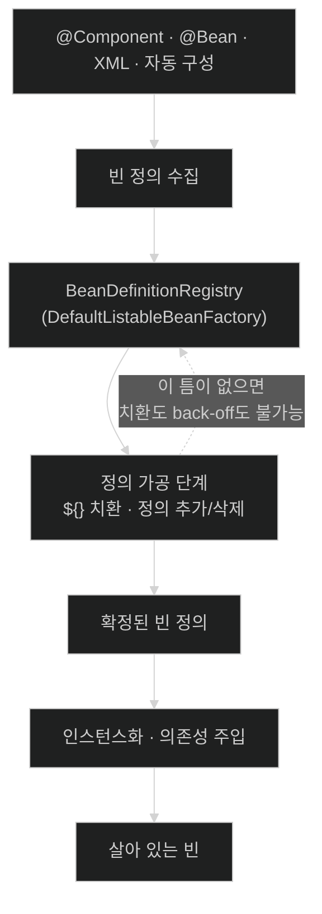

# BeanDefinition — 객체가 만들어지기 전에 먼저 만들어지는 것

## 한눈에 보기

| 질문 | 핵심 답 |
|---|---|
| `@Component`를 붙이면 그 즉시 객체가 만들어지나? | 아니다. 먼저 **설계도**(BeanDefinition)가 등록되고, 객체는 그다음 단계에서 만들어진다. |
| 왜 굳이 두 단계로 나눴나? | 객체가 생기기 전에 **설계도를 고칠 기회**를 만들기 위해서다. `${}` 치환도 자동 구성의 back-off도 전부 이 틈에서 일어난다. |
| 설계도에는 뭐가 들어 있나? | 클래스·이름·스코프·생성자 인자·프로퍼티·지연 초기화·오토와이어 모드·init/destroy 메서드. |
| 싱글턴은 언제 만들어지나? | 컨테이너를 만들 때 **미리 전부** 만든다(기본값). 설정 오류를 시작 시점에 터뜨리기 위해서다. |
| 그래서 시작이 성공했다는 건 무슨 뜻인가? | "설정이 유효하다"가 아니라 **"싱글턴 빈을 전부 실제로 만들어 봤다"**는 뜻이다. |

## 1. 왜 이게 필요한가

### 출발 장면: 아직 존재하지 않는 값을 생성자에 넣어야 한다

설정 파일에서 값을 받는 흔한 코드다.

```java
@Component
public class GithubClient {

    private final String token;

    public GithubClient(@Value("${cosmoroute.github.token}") String token) {
        this.token = token;
    }
}
```

여기서 순서를 따져 보자. `GithubClient` 객체를 만들려면 생성자를 불러야 하고, 생성자를 부르려면 `token` 문자열이 **이미 준비돼 있어야** 한다. 그런데 `${cosmoroute.github.token}`은 아직 글자 그대로의 문자열이다. 누군가 이 자리를 실제 값으로 바꿔치기해야 하는데, 그 일은 **객체가 만들어지기 전에** 끝나 있어야 한다.

객체를 만들면서 동시에 그 객체의 재료를 고칠 수는 없다. 그래서 Spring은 **재료 목록을 먼저 만들어 두고, 그 목록을 손볼 시간을 준 다음, 마지막에 객체를 찍어낸다.**

### 여기서 뭐가 무너지나

만약 Spring이 `@Component`를 발견하는 즉시 `new GithubClient(...)`를 했다면 어떻게 될까.

- `${...}` 치환을 끼워 넣을 자리가 없다. 발견 순간이 곧 생성 순간이라 그 사이에 아무것도 낄 수 없다.
- 자동 구성의 back-off(사용자가 같은 타입의 빈을 직접 만들었으면 물러남)가 불가능하다. "사용자 빈이 있는지"를 알려면 **전체 목록이 다 모인 뒤**여야 하는데, 발견 즉시 생성하면 뒤에 올 정의를 아직 모른다.
- 프록시로 감쌀 기회도 없다. 이미 원본 객체를 만들어 다른 곳에 넘겨 버린 뒤다.

Spring이 실제로 이 셋을 다 해낸다는 사실 자체가, 발견과 생성 사이에 **틈**이 있다는 증거다.

### 그래서 나온 생각

클래스를 스캔해서 찾아낸 것을 곧바로 객체로 만들지 않고, **"이런 객체를 이렇게 만들어라"라는 설명서**로 바꿔서 보관한다. 그 설명서가 **[[빈-정의]]**(= 빈 하나를 어떻게 만들지 적어 둔 메타데이터 객체. 아직 객체가 아니다)다.

쉽게 말하면 **주문서와 완성품의 차이**다. 주방에 "파스타 하나, 면은 곱빼기, 매운맛"이라고 적힌 주문서가 붙어 있는 것과, 접시에 담긴 파스타가 실제로 나와 있는 것은 다른 상태다. 주문서는 고칠 수 있다 — 손님이 "매운맛 빼 주세요"라고 하면 조리 전에 종이를 고치면 된다. 이미 나온 파스타는 못 고친다.

→ 비유가 깨지는 지점: 주문서는 손님이 고치고 주방은 따르기만 한다. 빈 정의는 **컨테이너 자신이 고용한 확장점**([[02-two-postprocessor-extension-points]])이 고친다 — 주방이 스스로 주문서를 고쳐 쓰는 셈이다. 게다가 주문서는 요리가 나오면 역할이 끝나지만, 빈 정의는 컨테이너가 살아 있는 내내 남아 스코프·소멸 메서드 같은 정보를 계속 참조당한다.

## 2. 어떻게 동작하는가

### 2.1 두 단계로 나뉜 시작

공식 문서는 컨테이너가 **[[설정-메타데이터]]**(= XML·Java 코드·애노테이션 중 어떤 형태로든 표현된 "빈을 어떻게 만들지"에 대한 기술)를 소비해 완성된 시스템을 만든다고 설명한다. 그 소비 과정이 두 단계다.

1. **정의 수집 단계.** `@Component` 스캔, `@Bean` 메서드, XML, 자동 구성 클래스에서 읽어낸 것을 전부 [[빈-정의]] 객체로 바꿔 **[[빈-정의-등록기]]**(= 빈 정의를 이름으로 보관하는 컨테이너 내부의 레지스트리. 구현체는 `DefaultListableBeanFactory`)에 담는다. — 아직 아무 객체도 만들지 않아야, 뒤에 올 정의까지 전부 모인 상태에서 판단할 수 있기 때문이다.
2. **정의 가공 단계.** 모인 정의를 훑으며 고친다. `${}` 치환이 여기서 일어난다. — 객체 생성에 쓰일 재료를 **재료가 쓰이기 전에** 확정하기 위해서다.
3. **인스턴스화 단계.** 확정된 정의대로 객체를 만들고 의존성을 채운다. — 이 시점에는 더 이상 정의가 바뀌지 않는다는 보장이 있어야, 만들어진 객체가 반쪽짜리 설정을 물고 태어나지 않기 때문이다.

2번과 3번의 주인이 각각 다르다. 그 둘이 [[02-two-postprocessor-extension-points]]에서 다루는 두 확장점이다.

### 2.2 빈 정의가 들고 있는 것

공식 문서가 표로 제시하는 항목은 아홉 가지다.

| 항목 | 무엇을 정하나 | 없으면 |
|---|---|---|
| Class | 실제로 인스턴스화할 클래스 | 무엇을 만들지 모른다 |
| Name | 컨테이너 안에서의 이름(들) | 주입할 때 지목할 수 없다 |
| Scope | singleton / prototype / request … | 몇 개를 만들지 모른다 |
| Constructor arguments | 생성자에 넣을 값·참조 | 생성자를 부를 수 없다 |
| Properties | setter로 넣을 값·참조 | 선택적 의존성이 빈 채 남는다 |
| Autowiring mode | 어떤 방식으로 짝을 찾을지 | 참조를 해석할 규칙이 없다 |
| Lazy initialization mode | 시작 때 만들지, 요청 때 만들지 | 생성 시점이 정해지지 않는다 |
| Initialization method | 준비가 끝난 뒤 부를 메서드 | 초기화 훅이 없다 |
| Destruction method | 컨테이너 종료 시 부를 메서드 | 자원을 못 닫는다 |

여기서 눈여겨볼 것은 **`Class`와 `Scope`가 나란히 있다**는 점이다. "무엇을 만들지"와 "몇 개를 만들지"가 같은 층의 메타데이터다 — 클래스 코드 어디에도 안 적혀 있고, 오직 정의에만 있다. 같은 클래스를 서로 다른 스코프의 빈 두 개로 등록할 수 있는 이유가 이것이다.

### 2.3 이름의 유래

`BeanDefinition`은 "빈의 **정의**"다. 여기서 "정의(definition)"는 사전적 뜻풀이가 아니라 **선언**에 가깝다 — 변수를 선언하는 것과 값을 대입하는 것이 다른 일이듯, 빈을 정의하는 것과 빈을 만드는 것은 다른 일이다. 이름 자체가 "이건 아직 실물이 아니라 선언일 뿐"이라고 말하고 있다.

같은 이유로 `BeanFactory`의 `Factory`도 문자 그대로다 — 정의(주문서)를 받아 제품(빈)을 찍어내는 공장이다. 공장은 주문서가 다 모이고 확정된 뒤에야 가동된다.

### 2.4 싱글턴을 미리 다 만드는 이유

공식 문서는 컨테이너가 만들어질 때 각 빈의 설정을 검증한다고 하면서, 곧바로 중요한 단서를 붙인다 — **"그러나 빈 프로퍼티 자체는 빈이 실제로 만들어지기 전까지는 설정되지 않는다."**

즉 정의 단계의 검증만으로는 부족하다. 정의는 멀쩡한데 실제로 만들어 보면 터지는 경우가 있다. 문서의 표현대로, 정상적으로 로드된 컨테이너가 나중에 객체를 요청받는 순간 예외를 낼 수 있다.

그래서 기본 동작이 **[[사전-인스턴스화]]**(= 싱글턴 빈을 컨테이너 생성 시점에 미리 전부 만들어 두는 것)다. 공식 문서는 그 이유를 명시한다 — 미리 만드는 데 드는 시간과 메모리를 지불하는 대신, **설정 문제를 나중이 아니라 `ApplicationContext`가 만들어지는 시점에 발견**하기 위해서다.

이 사실이 실무에서 갖는 의미는 크다. **"애플리케이션이 떴다"는 것은 "설정 파일이 문법에 맞다"가 아니라 "싱글턴 빈을 전부 실제로 만들어 봤고 하나도 안 터졌다"는 뜻이다.** 시작 로그가 지나갔다면 그 검증을 이미 통과한 것이다.

Spring Boot는 이 기본을 뒤집는 스위치도 준다. `spring.main.lazy-initialization=true`를 켜면 빈을 필요할 때 만든다. Boot 공식 문서는 시작 시간이 줄어드는 대신 **"문제 발견이 늦어진다"**는 것을 단점으로 명시하고, 그래서 기본값이 아니라고 적는다. 웹 애플리케이션에서는 많은 웹 관련 빈이 HTTP 요청이 들어올 때까지 초기화되지 않는다는 점도 함께 경고한다.

## 3. 그림으로 보기

### 발견에서 객체까지 — 틈이 어디에 있는가



### 같은 클래스, 다른 정의

```text
[클래스 코드 — 여기엔 스코프가 없다]

  public class GithubClient {
      GithubClient(String token) { ... }
  }

[빈 정의 A]                      [빈 정의 B]
  name:  githubClient              name:  adminGithubClient
  class: GithubClient              class: GithubClient        ← 같은 클래스
  scope: singleton                 scope: prototype           ← 다른 스코프
  args:  ${cosmoroute.token}       args:  ${cosmoroute.admin-token}

        │                                 │
        ▼                                 ▼
  하나만 만들어 공유              요청할 때마다 새로 생성

  → "무엇을 만들지"(class)와 "어떻게·몇 개 만들지"(scope, args)가
    클래스가 아니라 정의에 적혀 있다. 그래서 코드를 한 줄도 안 고치고
    같은 클래스를 성격이 다른 빈 둘로 등록할 수 있다.
```

## 4. 이 노트에 나온 용어

| 용어 | 한 줄 풀이 | 자세히 |
|---|---|---|
| 빈 정의 | 빈 하나를 어떻게 만들지 적어 둔 메타데이터. 아직 객체가 아니다 | [[_glossary#빈-정의]] |
| 설정 메타데이터 | 애노테이션·Java 코드·XML로 표현된 "빈을 어떻게 만들지"에 대한 기술 | [[_glossary#설정-메타데이터]] |
| 사전 인스턴스화 | 싱글턴 빈을 컨테이너 생성 시점에 미리 전부 만들어 두는 것 | [[_glossary#사전-인스턴스화]] |
| 빈 정의 등록기 | 빈 정의를 이름으로 보관하는 컨테이너 내부 레지스트리 | [[_glossary#빈-정의-등록기]] |

## 5. 자주 헷갈리는 것

### 빈 정의 vs 빈

| 축 | 빈 정의 | 빈 |
|---|---|---|
| 정체 | 메타데이터 객체 | 실제 인스턴스 |
| 개수 | 이름 하나당 하나 | 스코프에 따라 0개~N개 |
| 언제 생기나 | 시작 초반, 스캔·파싱 직후 | 정의가 확정된 뒤 |
| 고칠 수 있는 시점 | 인스턴스화 전까지 | 만들어진 뒤엔 프록시로 감싸는 정도 |
| `prototype`이면 | 정의는 **하나** | 인스턴스는 요청할 때마다 새로 |

마지막 행이 결정적이다. prototype 빈이 100개 만들어져도 **빈 정의는 여전히 하나**다. "정의는 틀이고 빈은 결과물"이라는 관계가 여기서 눈에 보인다.

### 컨테이너 시작 성공 ≠ 설정이 옳다

시작이 성공했다면 싱글턴은 전부 만들어 본 것이 맞다. 하지만 다음은 여전히 안 잡힌다.

- `@Lazy` 빈, prototype 빈 — 아직 안 만들어졌다.
- `spring.main.lazy-initialization=true`인 경우 — 대부분이 안 만들어졌다.
- 값은 주입됐지만 그 값이 **틀린** 경우 — 타입이 맞으면 컨테이너는 통과시킨다.

## 6. 언제 안 쓰나 / 경계

- **`BeanDefinition`을 코드에서 직접 조작할 일은 드물다.** 애플리케이션 코드가 아니라 프레임워크·스타터·라이브러리를 만들 때 쓰는 층이다. 애플리케이션에서 이걸 만지고 있다면 대개 더 간단한 방법이 있다.
- **런타임에 빈을 새로 등록하는 것은 공식 지원 대상이 아니다.** 공식 문서는 라이브 상태의 팩터리에 동시 접근하며 빈을 등록하는 것을 지원하지 않는다고 명시하고, 동시 접근 예외나 컨테이너의 불일치 상태로 이어질 수 있다고 경고한다. 정의 등록은 시작 단계에 끝나야 한다.
- **`lazy-initialization`을 시작 시간 단축용으로 가볍게 켜지 않는다.** Boot 문서가 경고하듯 문제 발견이 런타임으로 밀리고, 시작 때 안 만들던 빈까지 결국 다 만들어지므로 힙 크기를 먼저 점검해야 한다.

## 7. 연결

- [[02-two-postprocessor-extension-points]] — 이 노트가 말한 "정의를 고칠 틈"에 실제로 들어가는 두 확장점을 다룬다. 정의 단계와 인스턴스 단계를 나눈 이유가 거기서 완성된다.
- [[03-bean-creation-and-lifecycle-callbacks]] — 확정된 정의로부터 객체가 만들어지는 3단계 이후의 상세 순서다. 이 노트의 `Initialization method`·`Destruction method` 항목이 실제로 언제 불리는지가 거기 있다.
- [[04-eager-singletons-and-circular-references]] — [[사전-인스턴스화]]가 왜 기본값인지, 그리고 그 때문에 순환 참조가 왜 시작 시점에 터지는지를 이어서 다룬다.

## 8. 스스로 확인

1. `@Component`를 붙인 클래스가 객체가 되기까지, 그 사이에 반드시 있어야 하는 단계는 무엇이고 왜 필요한가?
2. `${}` 치환이 "객체 생성 전"에 끝나야 하는 이유를 생성자 호출 순서로 설명할 수 있는가?
3. 자동 구성의 back-off가 "발견 즉시 생성" 방식에서 불가능한 이유는 무엇인가?
4. 빈 정의가 들고 있는 항목 중 클래스 코드에는 없고 정의에만 있는 것은 무엇인가? 그게 왜 중요한가?
5. 싱글턴을 미리 다 만드는 것의 비용과 이득은 각각 무엇인가?
6. "애플리케이션이 정상 기동했다"가 보장하는 것과 보장하지 않는 것을 구분할 수 있는가?
7. prototype 빈 100개가 만들어졌을 때 빈 정의는 몇 개인가? 그 답이 뜻하는 바는?
8. `spring.main.lazy-initialization=true`의 대가는 무엇인가?


> 여덟 문항을 스스로 답한 **뒤에** [[_01-beandefinition-and-metadata-phase]]에서 모범답안과 대조한다. 먼저 열면 이 문항들은 다시 인출 문제로 쓸 수 없다.

<!-- ==== 아래는 내 영역 · 스킬 수정 금지 ==== -->

## 내 설명 시도


## 막혔던 지점


## 리뷰 이력
