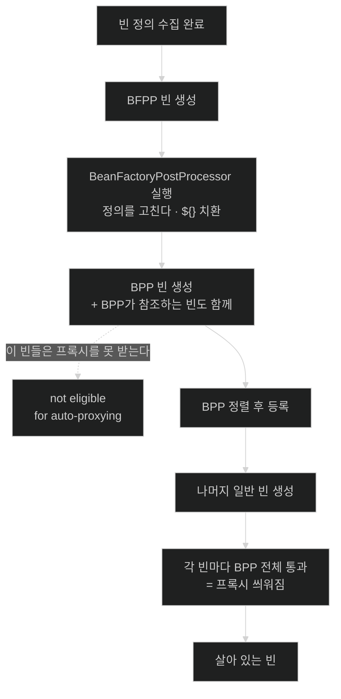

# 두 개의 후처리기 — 정의를 고치는 쪽과 인스턴스를 고치는 쪽

## 한눈에 보기

| 질문 | 핵심 답 |
|---|---|
| 확장점이 왜 두 개인가? | 고치는 **대상**이 다르다. 하나는 [[빈-정의]](메타데이터), 하나는 인스턴스(객체). |
| `${}` 치환은 어느 쪽인가? | 정의 쪽([[빈-팩터리-후처리기]]). 객체가 생기기 전에 재료를 확정해야 하기 때문이다. |
| `@Transactional` 프록시는 어느 쪽인가? | 인스턴스 쪽([[빈-후처리기]]). **AOP 자동 프록시 자체가 빈 후처리기다.** |
| 그래서 무슨 함정이 생기나? | 후처리기가 참조하는 빈은 **프록시를 못 받는다.** `@Transactional`이 조용히 무효가 된다. |
| 그 함정의 신호는? | 시작 로그의 `is not eligible for getting processed by all BeanPostProcessors` 경고. |

## 1. 왜 이게 필요한가

### 출발 장면: `@Transactional`이 붙어 있는데 트랜잭션이 안 열린다

시작할 때 데이터를 검증하는 후처리기를 하나 만들었다고 하자. 검증하려면 리포지토리가 필요하니 주입받는다.

```java
@Component
public class SchemaSanityChecker implements BeanPostProcessor {

    private final MaterialService materialService;   // ← @Transactional 이 붙은 서비스

    public SchemaSanityChecker(MaterialService materialService) {
        this.materialService = materialService;
    }

    @Override
    public Object postProcessAfterInitialization(Object bean, String beanName) {
        return bean;
    }
}
```

`MaterialService`는 클래스에 `@Transactional`이 붙어 있다. 다른 곳에서는 잘 동작한다. 그런데 이 코드를 넣은 뒤로 **애플리케이션 전체에서 `MaterialService`의 트랜잭션이 열리지 않는다.** 애노테이션은 그대로다. 코드도 안 고쳤다.

로그를 뒤지면 `INFO` 레벨로 한 줄 지나가 있다.

```text
Bean 'materialService' of type [com.cosmoroute.MaterialService] is not eligible
for getting processed by all BeanPostProcessors (for example: not eligible for auto-proxying)
```

에러가 아니라 정보 로그다. 대부분 그냥 지나간다. 그런데 이 한 줄이 "당신의 `@Transactional`은 지금 아무 일도 하지 않는다"는 뜻이다.

### 여기서 뭐가 무너지나

원인을 알려면 두 가지 사실을 이어 붙여야 한다.

**첫째, `@Transactional` 프록시는 [[빈-후처리기]]가 만든다.** 공식 문서가 명시한다 — *"AOP 자동 프록시 생성 자체가 `BeanPostProcessor`로 구현돼 있다."* 프록시는 마법이 아니라 "만들어진 빈을 받아서 감싼 것을 대신 돌려주는" 후처리 작업이다.

**둘째, 후처리기는 남들보다 먼저 만들어져야 한다.** 모든 빈을 후처리하려면 그 빈들보다 먼저 존재해야 한다. 그래서 공식 문서는 *"모든 `BeanPostProcessor` 인스턴스와 그것이 직접 참조하는 빈들은 `ApplicationContext`의 특수한 시작 단계의 일부로 시작 시점에 인스턴스화된다"*고 적는다.

두 사실을 합치면 결론이 나온다. `SchemaSanityChecker`가 `MaterialService`를 생성자에서 참조하는 순간, `MaterialService`는 **AOP 후처리기가 아직 등록되기 전에** 만들어져 버린다. 만들 사람이 아직 자리에 없으니 프록시가 씌워질 수 없다. 공식 문서의 표현대로 — *"`BeanPostProcessor` 인스턴스도, 그것이 직접 참조하는 빈도 자동 프록시 대상이 될 수 없고 따라서 애스펙트가 위빙되지 않는다."*

비유하자면 **개찰구를 설치하러 온 작업자**다. 개찰구를 설치하려면 작업자가 역 안에 먼저 들어가야 한다. 작업자와, 작업자가 데리고 들어간 조수는 개찰구를 통과하지 않은 채 안에 있게 된다 — 개찰구가 아직 없었으니까.

→ 비유가 깨지는 지점: 실제 역이라면 작업자도 나중에 한 번 나갔다 들어오면 개찰구를 통과할 수 있다. 빈은 그렇게 못 한다. **싱글턴은 한 번 만들어지면 그것으로 끝이고, 나중에 다시 감쌀 기회가 없다.** 그래서 이 문제는 "순서를 놓쳤다"가 아니라 "영구히 프록시 없이 산다"가 된다.

### 그래서 나온 생각

확장점을 하나로 두면 이 문제를 풀 수 없다. **아직 객체가 없는 시점**에 개입해야 하는 일(값 치환)과 **객체가 생긴 뒤**에 개입해야 하는 일(프록시로 감싸기)은 시점이 다르기 때문이다. 그래서 Spring은 확장점을 둘로 나눴다.

| | [[빈-팩터리-후처리기]] | [[빈-후처리기]] |
|---|---|---|
| 고치는 대상 | [[빈-정의]] (메타데이터) | 빈 인스턴스 (객체) |
| 언제 | 어떤 빈도 만들어지기 전 | 빈이 만들어진 직후 |
| 몇 번 | 컨테이너당 한 번, 정의 전체에 | **빈 하나마다** |
| 대표 예 | `PropertySourcesPlaceholderConfigurer` | AOP 자동 프록시 생성기 |
| 할 수 있는 일 | 정의 추가·삭제·값 교체 | 감싸기·검사·교체 |

## 2. 어떻게 동작하는가

### 2.1 빈 팩터리 후처리기 — 주문서를 고친다

**[[빈-팩터리-후처리기]]**(= 빈이 만들어지기 전에 빈 정의 자체를 읽고 고치는 확장점)의 계약을 공식 문서는 이렇게 규정한다 — *"컨테이너가 **`BeanFactoryPostProcessor` 인스턴스 외의** 어떤 빈도 인스턴스화하기 전에, 설정 메타데이터를 읽고 잠재적으로 변경할 수 있게 해 준다."*

"BFPP 외의"라는 단서가 핵심이다. 후처리기 자신은 만들어져야 일을 할 수 있으니 예외가 된다.

1. **컨테이너가 [[빈-정의]]를 전부 모은다.** — 일부만 모인 상태에서 고치면 뒤에 올 정의를 못 보기 때문이다.
2. **BFPP 타입의 빈만 먼저 만든다.** — 정의를 고칠 주체 자신은 객체여야 일할 수 있기 때문이다.
3. **각 BFPP에 레지스트리를 통째로 넘긴다.** — 개별 빈이 아니라 정의 **전체**를 봐야 "이 이름이 이미 있는가" 같은 판단이 가능하기 때문이다.
4. **BFPP가 정의를 고친다.** `${jdbc.url}` 자리를 실제 값으로 바꾸는 것이 대표적이다. — 그 값이 생성자 인자로 쓰이기 전에 확정돼야 하기 때문이다.
5. **그다음에야 나머지 빈을 만든다.** — 확정된 정의로만 객체를 찍기 위해서다.

공식 문서는 여기서 하지 말아야 할 일도 못박는다 — BFPP 안에서 `BeanFactory.getBean()`으로 빈 인스턴스를 다루는 것이 *"기술적으로는 가능하지만, 이른 빈 인스턴스화를 유발해 표준 컨테이너 생명주기를 위반한다"*고 적는다. 앞 절의 함정이 정확히 이 위반의 결과다.

### 2.2 빈 후처리기 — 완성품을 검사하고 바꿔치기한다

**[[빈-후처리기]]**(= 만들어진 빈 하나하나를 가로채 검사하거나 다른 객체로 바꿔치기하는 확장점)는 메서드가 정확히 둘이다.

```java
public interface BeanPostProcessor {
    Object postProcessBeforeInitialization(Object bean, String beanName);
    Object postProcessAfterInitialization(Object bean, String beanName);
}
```

이름의 `Before`/`After`는 **초기화 콜백**(`@PostConstruct`·`afterPropertiesSet()`·init 메서드)을 기준으로 한 앞뒤다. 빈 생성 전후가 아니다 — 두 메서드 다 빈이 이미 만들어진 뒤에 불린다. 이 기준점을 헷갈리면 순서가 통째로 어긋나므로, 정확한 위치는 [[03-bean-creation-and-lifecycle-callbacks]]에서 전체 순서와 함께 본다.

반환 타입이 `void`가 아니라 `Object`인 것이 결정적이다. **받은 빈과 다른 객체를 돌려줘도 된다.** 공식 문서의 표현대로 후처리기는 *"빈을 프록시로 감쌀 수 있다"*. 프록시를 돌려주면 컨테이너는 그때부터 원본이 아니라 프록시를 그 이름의 빈으로 취급하고, 다른 빈에도 프록시를 주입한다.

이 반환값 하나가 **[[자동-프록시-생성기]]**(= AOP 대상 빈을 찾아 프록시로 바꿔치기하는 빈 후처리기)가 존재할 수 있는 이유다. `@Transactional`·`@Async`·`@Cacheable`이 전부 이 경로로 동작한다. 어떻게 프록시를 만드는지는 c2 챕터의 주제다.

### 2.3 특수 시작 단계 — 함정의 정체

**[[특수-시작-단계]]**(= 일반 빈보다 먼저 후처리기와 그 참조 빈을 만드는 `ApplicationContext`의 별도 시작 구간)에서 무슨 일이 일어나는지가 앞의 함정을 설명한다.

1. **BFPP를 만들고 실행한다.** — 정의를 확정하기 위해서다.
2. **BPP 타입의 빈을 전부 만든다.** — 나머지 빈을 후처리하려면 후처리기가 먼저 존재해야 하기 때문이다.
3. **BPP가 생성자로 참조하는 빈도 이때 딸려 만들어진다.** — 후처리기를 만들려면 그 의존성이 먼저 있어야 하기 때문이다.
4. **BPP들을 정렬해 등록한다.** — 순서가 결과를 바꾸므로(감싼 위에 또 감싸는 일이 생긴다) 정해진 순서가 필요하기 때문이다.
5. **이제부터 만들어지는 모든 빈이 등록된 BPP 전체를 거친다.** — 3번에서 딸려 만들어진 빈은 이 줄에 서지 못했다.

공식 문서는 3번의 결과를 일반화해 적는다 — *"더 일반적으로, 이 이른 단계에서 인스턴스화되는 어떤 빈이든 모든 `BeanPostProcessor` 인스턴스에 의한 완전한 후처리 대상이 되지 못한다."* 출발 장면의 `MaterialService`가 바로 그 "어떤 빈"이었다.

### 2.4 순서 — `Ordered`가 통하는 곳과 안 통하는 곳

BPP·BFPP 모두 `Ordered` 인터페이스를 구현하면 `order` 값으로 순서를 정할 수 있고, 공식 문서는 직접 만들 때 이를 구현할 것을 권한다.

여기에 예외가 하나 있다. 공식 문서가 별도로 짚는다 — *"프로그래밍 방식으로 추가된 `BeanPostProcessor` 인스턴스는 `Ordered` 인터페이스를 존중하지 않는다. 여기서는 등록 순서가 실행 순서를 결정한다."* `context.getBeanFactory().addBeanPostProcessor(...)`로 직접 꽂은 경우가 그렇다. `order`를 아무리 지정해도 무시되고 꽂은 순서대로 돈다.

### 2.5 함정을 피하는 방법

후처리기가 다른 빈을 꼭 써야 한다면, **생성자에서 참조하지 않는 것**이 요점이다.

```java
@Component
public class SchemaSanityChecker implements BeanPostProcessor {

    private final ObjectProvider<MaterialService> materialServiceProvider;   // 지연 조회

    public SchemaSanityChecker(ObjectProvider<MaterialService> provider) {
        this.materialServiceProvider = provider;
    }

    @Override
    public Object postProcessAfterInitialization(Object bean, String beanName) {
        // 실제로 필요한 순간에 꺼낸다 — 그때는 이미 프록시가 씌워진 뒤다
        // materialServiceProvider.getObject().check(...)
        return bean;
    }
}
```

`ObjectProvider`는 **참조를 들고 있을 뿐 즉시 만들지 않는다.** 후처리기가 만들어지는 시점에 `MaterialService`가 딸려 나오지 않으므로, 그 빈은 정상적인 순서를 밟아 프록시를 받는다. `@Lazy`를 붙이는 것도 같은 원리다.

더 나은 선택은 대개 **후처리기를 쓰지 않는 것**이다. 시작 시 한 번 무언가를 하고 싶은 것뿐이라면 `ApplicationRunner`나 `@EventListener(ApplicationReadyEvent.class)`가 맞는 자리다. 그 시점에는 컨테이너가 이미 완성돼 있어 어떤 함정도 없다.

## 3. 그림으로 보기

### 두 확장점이 개입하는 지점



### 같은 서비스, 두 갈래 운명

```text
[정상 경로 — 일반 빈이 MaterialService 를 주입받는다]

  BPP 등록 완료
      │
      ▼
  MaterialService 생성 → BPP 전체 통과 → 자동 프록시 생성기가 감쌈
      │
      ▼
  컨테이너에 등록되는 것: MaterialService$$Proxy      ← @Transactional 동작


[함정 경로 — BeanPostProcessor 가 생성자로 참조한다]

  SchemaSanityChecker(BPP) 를 만들어야 함
      │  생성자에 MaterialService 가 필요
      ▼
  MaterialService 를 지금 만든다   ← BPP 등록 전이다
      │
      ▼
  컨테이너에 등록되는 것: MaterialService (원본)       ← @Transactional 무효
      │
      ▼
  로그: "is not eligible for getting processed by all BeanPostProcessors"

  → "후처리기(post-processor)"라는 이름은 "빈이 만들어진 **뒤에**(post)
    처리한다"는 뜻이다. 그런데 그 뒤처리를 할 사람 자신은 남보다 먼저
    태어나야 한다. 이 순서의 역설이 함정의 뿌리다.
```

## 4. 이 노트에 나온 용어

| 용어 | 한 줄 풀이 | 자세히 |
|---|---|---|
| 빈 팩터리 후처리기 | 빈이 만들어지기 전에 빈 정의 자체를 읽고 고치는 확장점 | [[_glossary#빈-팩터리-후처리기]] |
| 빈 후처리기 | 만들어진 빈을 가로채 검사하거나 다른 객체로 바꿔치기하는 확장점 | [[_glossary#빈-후처리기]] |
| 특수 시작 단계 | 일반 빈보다 먼저 후처리기와 그 참조 빈을 만드는 별도 시작 구간 | [[_glossary#특수-시작-단계]] |
| 자동 프록시 생성기 | AOP 대상 빈을 찾아 프록시로 바꿔치기하는 빈 후처리기 | [[_glossary#자동-프록시-생성기]] |

## 5. 자주 헷갈리는 것

### `BeanFactoryPostProcessor` vs `BeanPostProcessor`

이름이 한 단어 차이라 섞이기 쉽다. **`Factory`가 붙은 쪽이 "공장을 손본다" = 정의를 손본다**로 읽으면 갈린다.

| 축 | `BeanFactoryPostProcessor` | `BeanPostProcessor` |
|---|---|---|
| 이름의 뜻 | 빈 **팩터리**를 후처리 | **빈**을 후처리 |
| 인자로 받는 것 | `ConfigurableListableBeanFactory` (전체) | `Object bean, String beanName` (하나) |
| 호출 횟수 | 컨테이너당 1회 | 빈 개수만큼 |
| 반환 | `void` | `Object` — **바꿔치기 가능** |

### `postProcessBeforeInitialization`의 "Before"는 무엇의 앞인가

빈 **생성** 전이 아니다. 이미 만들어지고 의존성까지 주입된 빈을 받는다. 앞뒤의 기준은 **초기화 콜백**이다. 순서 전체는 [[03-bean-creation-and-lifecycle-callbacks]]에 있다.

### 후처리기 vs 초기화 콜백

`@PostConstruct`도 "빈이 만들어진 뒤 하는 일"이라 헷갈린다. 결정적 차이는 **누구의 코드인가**다. 초기화 콜백은 **그 빈 자신의 메서드**이고 자기 자신만 손댄다. 후처리기는 **제3자**이고 컨테이너의 모든 빈에 개입한다. 그래서 프록시로 감싸는 일은 후처리기만 할 수 있다 — 자기가 자기를 감쌀 수는 없다.

## 6. 언제 안 쓰나 / 경계

- **"시작할 때 한 번 실행"이 목적이면 후처리기를 쓰지 않는다.** `ApplicationRunner`·`CommandLineRunner`·`@EventListener(ApplicationReadyEvent.class)`가 맞는 도구다. 컨테이너가 완성된 뒤라 순서 함정이 없다.
- **후처리기에서 애플리케이션 빈을 생성자로 주입받지 않는다.** 받는 순간 그 빈이 프록시를 잃는다. 꼭 필요하면 `ObjectProvider`나 `@Lazy`로 미룬다.
- **BFPP 안에서 `getBean()`을 부르지 않는다.** 공식 문서가 표준 생명주기 위반이라고 명시한다.
- **프로그래밍 방식으로 등록한 BPP에 `Ordered`를 기대하지 않는다.** 등록 순서가 이긴다.
- **모든 빈을 감싸는 후처리기는 시작 시간과 디버깅 난이도를 함께 올린다.** 스택 트레이스에 프록시 프레임이 끼고, 빈 하나당 조건 평가가 추가된다.

## 7. 연결

- [[01-beandefinition-and-metadata-phase]] — 이 노트의 두 확장점이 개입하는 "틈"이 왜 존재하는지가 거기에 있다. 정의와 인스턴스를 나눈 설계가 확장점 둘의 전제다.
- [[03-bean-creation-and-lifecycle-callbacks]] — `postProcessBefore/AfterInitialization`이 정확히 어느 지점에 끼는지, 초기화 콜백과의 순서가 거기서 확정된다.
- [[04-eager-singletons-and-circular-references]] — [[특수-시작-단계]]에서 빈이 앞당겨 만들어지는 것과, 순환 참조로 빈이 미완성 상태로 노출되는 것은 둘 다 "정상 순서를 벗어난 생성"이라는 같은 문제의 두 얼굴이다.

## 8. 스스로 확인

1. 확장점이 두 개여야 하는 이유를 "고치는 대상"으로 설명할 수 있는가?
2. `${}` 치환이 `BeanPostProcessor`가 아니라 `BeanFactoryPostProcessor`인 이유는?
3. `@Transactional`이 붙었는데 트랜잭션이 안 열리는 이 노트의 시나리오를, 순서를 따라 설명할 수 있는가?
4. `is not eligible for getting processed by all BeanPostProcessors` 경고를 보면 무엇을 의심해야 하는가?
5. `BeanPostProcessor`의 반환 타입이 `void`가 아니라 `Object`인 것이 왜 결정적인가?
6. `postProcessBeforeInitialization`의 "Before"는 무엇의 앞인가?
7. 후처리기가 다른 빈을 참조해야 할 때 `ObjectProvider`가 함정을 피하는 원리는?
8. `Ordered`가 무시되는 경우는 언제인가?
9. 초기화 콜백과 후처리기의 결정적 차이는 무엇이고, 그래서 프록시 씌우기를 왜 후처리기만 할 수 있는가?


> 아홉 문항을 스스로 답한 **뒤에** [[_02-two-postprocessor-extension-points]]에서 모범답안과 대조한다. 먼저 열면 이 문항들은 다시 인출 문제로 쓸 수 없다.

<!-- ==== 아래는 내 영역 · 스킬 수정 금지 ==== -->

## 내 설명 시도


## 막혔던 지점


## 리뷰 이력
