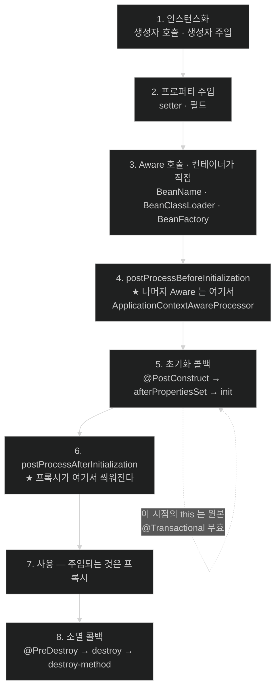

# 빈 하나가 태어나는 순서 — 그리고 프록시가 씌워지는 정확한 지점

## 한눈에 보기

| 질문 | 핵심 답 |
|---|---|
| `@PostConstruct`에 `@Transactional`을 붙이면? | **트랜잭션이 안 열린다.** 프록시가 아직 안 씌워졌기 때문이다. |
| 프록시는 정확히 언제 씌워지나? | 초기화 콜백이 **전부 끝난 뒤**, `postProcessAfterInitialization` 시점. |
| 초기화 콜백 세 개의 순서는? | `@PostConstruct` → `afterPropertiesSet()` → 커스텀 `init` 메서드. |
| 소멸 콜백 순서는? | 같은 순서. `@PreDestroy` → `destroy()` → 커스텀 `destroy` 메서드. |
| `Aware`는 언제 불리나? | **하나가 아니다.** 셋은 컨테이너가 직접(3단계), 나머지는 후처리기가(4단계). |
| prototype 빈의 소멸 콜백은? | **안 불린다.** 컨테이너가 기억하지 않는다. |

## 1. 왜 이게 필요한가

### 출발 장면: `@PostConstruct` 안에서만 트랜잭션이 안 열린다

시작할 때 기본 데이터를 한 번 넣어 두는 흔한 코드다.

```java
@Service
public class CatalogBootstrapService {

    private final MaterialRepository repository;

    public CatalogBootstrapService(MaterialRepository repository) {
        this.repository = repository;
    }

    @PostConstruct
    @Transactional                       // ← 붙였는데 동작하지 않는다
    public void seedDefaults() {
        repository.save(new Material("기본 원료"));
        repository.save(new Material("기본 첨가물"));
        // ...
    }
}
```

`@Transactional`을 분명히 붙였다. 그런데 실행해 보면 두 `save` 사이에서 예외가 나도 **첫 번째 저장이 롤백되지 않는다.** 트랜잭션이 애초에 열리지 않았기 때문이다. 심지어 JPA를 쓰면 `TransactionRequiredException`이 나거나, 저장이 즉시 반영되지 않고 조용히 사라진다.

같은 메서드를 컨트롤러에서 부르면 트랜잭션이 정상으로 열린다. **호출자가 누구냐에 따라 애노테이션이 켜지고 꺼진다.**

### 여기서 뭐가 무너지나

원인은 순서 하나다. `@Transactional`은 [[자동-프록시-생성기]]가 빈을 프록시로 감싸야 동작하는데, **그 감싸기가 `@PostConstruct`보다 나중에 일어난다.**

`@PostConstruct`가 실행되는 순간 컨테이너 입장에서 이 빈은 아직 "만들어지는 중"이다. 프록시는 다 만들어진 빈을 받아서 감싸는 것이므로, 아직 완성되지 않은 빈을 감쌀 수 없다. 그래서 `@PostConstruct` 안의 `this`는 **원본 객체**다 — 프록시가 아니다. 프록시가 아닌 객체에서 `@Transactional`은 종잇조각이다.

컨트롤러에서 부를 때 동작하는 이유도 같은 논리다. 그때는 이미 프록시가 씌워졌고, 컨트롤러가 주입받은 것이 프록시이기 때문이다.

비유하자면 **집들이**다. 인테리어 업자가 집을 다 꾸미고 나간 뒤에야 손님을 부를 수 있다. `@PostConstruct`는 업자가 아직 안에서 일하는 중에 스스로 뭔가를 하는 것이고, 그 시점의 집에는 아직 보안 시스템(프록시)이 설치돼 있지 않다.

→ 비유가 깨지는 지점: 집은 나중에라도 보안 시스템을 달 수 있다. 빈은 못 한다. **초기화 시점에 이미 지나간 코드는 영원히 프록시 없이 실행된 것으로 끝난다** — 나중에 프록시가 씌워져도 소급되지 않는다.

### 그래서 나온 생각

빈 하나가 만들어지는 과정을 **여러 개의 명확한 지점**으로 쪼개고, 각 지점에 누가 끼어들 수 있는지를 고정한다. 그러면 "내 코드는 정확히 어느 지점에서 실행되는가"를 물을 수 있고, 방금 같은 문제를 **추측이 아니라 순서로** 설명할 수 있다.

## 2. 어떻게 동작하는가

### 2.1 생성부터 소멸까지의 전체 순서

확정된 [[빈-정의]] 하나를 받아 컨테이너가 밟는 순서다.

1. **인스턴스화.** 생성자를 호출한다. 생성자 주입이라면 이 시점에 의존성이 함께 들어온다. — 객체가 존재해야 그다음 어떤 작업도 할 수 있기 때문이다.
2. **프로퍼티 주입.** setter·필드 주입이 채워진다. — 생성자에 넣지 않은 선택적 의존성까지 갖춰야 빈이 일할 준비가 되기 때문이다.
3. **컨테이너가 직접 부르는 [[Aware-인터페이스]] 호출.** `BeanNameAware`·`BeanClassLoaderAware`·`BeanFactoryAware`가 여기다. — 빈이 자기 이름이나 자기를 만든 팩터리를 알아야 하는 경우가 있는데, 그 정보는 빈 스스로 알아낼 방법이 없기 때문이다. 공식 문서는 `BeanNameAware`의 시점을 *"보통의 빈 프로퍼티가 채워진 뒤, 그러나 `InitializingBean.afterPropertiesSet()`이나 커스텀 init 메서드 같은 초기화 콜백보다는 앞"*이라고 못박는다.
4. **`postProcessBeforeInitialization`.** 등록된 [[빈-후처리기]] 전체가 순서대로 이 빈을 본다. — 초기화가 시작되기 전에 마지막으로 손볼 기회를 주기 위해서다. **`ApplicationContextAware`를 비롯한 나머지 Aware 인터페이스가 실제로 처리되는 곳이 여기다** — 3단계가 아니다(2.4 참고).
5. **[[초기화-콜백]] 실행.** 뒤에서 순서를 따로 본다. — 의존성이 다 갖춰진 뒤에야 할 수 있는 준비 작업(연결 열기, 캐시 채우기)이 있기 때문이다.
6. **`postProcessAfterInitialization`.** 후처리기 전체가 다시 본다. **여기서 프록시가 씌워진다.** — 완성된 빈이어야 감쌀 수 있고, 감싼 결과를 컨테이너에 등록해야 이후 주입이 전부 프록시를 받기 때문이다.
7. **사용.** 다른 빈에 주입되고 호출된다. 이때 주입되는 것은 6번의 반환값, 즉 프록시다.
8. **[[소멸-콜백]] 실행.** 컨테이너가 닫힐 때. — 열어 둔 자원을 반납할 마지막 지점이 필요하기 때문이다.

**5번과 6번 사이가 출발 장면의 답이다.** `@PostConstruct`는 5번이고 프록시는 6번이다. 한 칸 차이로 애노테이션이 무효가 된다.

### 2.2 초기화 콜백 세 가지와 그 순서

같은 빈에 세 방식을 다 쓸 수 있다. 공식 문서가 실행 순서를 명시한다.

| 순서 | 방식 | 형태 | 성격 |
|---|---|---|---|
| 1 | `@PostConstruct` | 애노테이션 | 표준(Jakarta). Spring에 의존하지 않는다 |
| 2 | `InitializingBean` | 인터페이스 구현 | `afterPropertiesSet()`. Spring API에 결합된다 |
| 3 | 커스텀 init 메서드 | `@Bean(initMethod=...)` | 남의 코드(라이브러리 클래스)에도 붙일 수 있다 |

**[[초기화-콜백]]**(= 의존성이 모두 주입된 뒤 빈이 스스로 준비 작업을 하도록 컨테이너가 불러 주는 메서드)에서 이름 `afterPropertiesSet`은 문자 그대로 읽으면 된다 — "프로퍼티가 **세팅된 뒤**". 2번 단계가 끝났다는 것을 이름이 선언하고 있다. 왜 생성자로 충분하지 않은지도 여기서 나온다: 생성자는 setter·필드 주입이 채워지기 **전**에 끝나므로, 그 의존성을 써야 하는 준비 작업은 생성자에 넣을 수 없다.

셋 중에서는 `@PostConstruct`가 기본 선택이다. 표준 애노테이션이라 클래스가 Spring 타입을 import하지 않아도 되기 때문이다.

### 2.3 소멸 콜백 — 그리고 안 불리는 경우

**[[소멸-콜백]]**(= 컨테이너가 닫힐 때 빈이 자원을 반납하도록 불러 주는 메서드)도 세 방식이고 순서는 초기화와 대칭이다.

| 순서 | 방식 |
|---|---|
| 1 | `@PreDestroy` |
| 2 | `DisposableBean.destroy()` |
| 3 | 커스텀 destroy 메서드 |

여기에 **꼭 알아야 할 예외**가 있다. 공식 문서는 prototype 스코프에 대해 이렇게 적는다 — *"다른 스코프와 달리 Spring은 prototype 빈의 완전한 생명주기를 관리하지 않는다. 컨테이너는 prototype 객체를 인스턴스화하고 설정해 클라이언트에게 건네줄 뿐, 그 prototype 인스턴스에 대한 이후 기록을 갖지 않는다."*

그 결과가 결정적이다. **초기화 콜백은 스코프와 무관하게 불리지만, prototype 빈의 소멸 콜백은 불리지 않는다.** 컨테이너가 그 객체를 기억하지 않으니 닫을 때 부를 대상 목록에 없다. prototype 빈이 파일 핸들이나 커넥션을 들고 있으면 **누수가 난다** — 닫아 줄 사람이 아무도 없다.

### 2.4 Aware 인터페이스가 넘겨주는 것

**[[Aware-인터페이스]]**(= 컨테이너가 자기 내부 정보를 빈에게 건네주기 위한 콜백 인터페이스 묶음)의 주요 항목이다. **중요한 것은 이들이 전부 같은 시점에 불리지 않는다는 점이다.**

| 인터페이스 | 받는 것 | 누가 부르나 | 단계 |
|---|---|---|---|
| `BeanNameAware` | 이 빈이 컨테이너에서 갖는 이름 | 컨테이너가 직접 | **3** |
| `BeanClassLoaderAware` | 빈 클래스를 로드한 클래스로더 | 컨테이너가 직접 | **3** |
| `BeanFactoryAware` | 자기를 만든 `BeanFactory` | 컨테이너가 직접 | **3** |
| `ApplicationContextAware` | 자기를 담고 있는 `ApplicationContext` | `ApplicationContextAwareProcessor` | **4** |
| `ApplicationEventPublisherAware` | 이벤트 발행기 | 같음 | **4** |
| `ResourceLoaderAware` | 리소스 로더 | 같음 | **4** |
| `MessageSourceAware` | 메시지 해석 전략 | 같음 | **4** |
| `ServletContextAware` | 현재 `ServletContext` | `ServletContextAwareProcessor` | **4** |

이 구분은 `Aware` 인터페이스 자체의 javadoc이 못박는다 — *"`Aware`를 구현하는 것만으로는 아무 기본 기능도 제공되지 않는다. 처리는 **예를 들어 `BeanPostProcessor`에서 명시적으로 이뤄져야 한다.** 특정 `*Aware` 인터페이스 콜백을 처리하는 예로 `ApplicationContextAwareProcessor`를 참고하라."* `ServletContextAwareProcessor` 역시 javadoc에 *"`ServletContextAware`를 구현한 빈에 `ServletContext`를 넘기는 `BeanPostProcessor` 구현"*으로 적혀 있다.

**두 무리가 갈리는 기준은 "그 정보를 누가 아는가"다.**

- `BeanName`·`BeanClassLoader`·`BeanFactory`는 **`BeanFactory` 수준의 정보**라 컨테이너가 후처리기 없이도 줄 수 있다. 3단계다.
- 나머지는 **`ApplicationContext` 수준의 정보**라 그 컨텍스트를 아는 후처리기가 필요하다. 그래서 4단계이며, [[02-two-postprocessor-extension-points]]에서 본 [[빈-후처리기]] 메커니즘 위에 올라가 있다.

실무에서 이 차이가 드러나는 지점이 있다. **`BeanPostProcessor`를 직접 만들면서 `ApplicationContextAware`를 구현하면 위험하다** — 그 후처리기는 [[특수-시작-단계]]에 만들어지는데, 자기에게 컨텍스트를 넣어 줄 `ApplicationContextAwareProcessor`가 아직 등록되기 전일 수 있다. `BeanFactoryAware`는 같은 상황에서 안전하다.

> **근거의 층을 구분해 둔다.** 공식 레퍼런스가 시점을 문장으로 명시한 것은 `BeanNameAware` 하나뿐이다. 위 표의 "단계" 열 중 4단계 행들은 javadoc 서술(처리 주체가 `BeanPostProcessor`라는 것)에서 따라 나온 것이지, 레퍼런스가 단계 번호를 적어 준 것이 아니다.

Aware를 쓰면 **클래스가 Spring에 결합된다.** `ApplicationContextAware`를 구현한 클래스는 Spring 없이는 컴파일도 안 된다. 그래서 대부분의 경우 필요한 것을 그냥 주입받는 편이 낫다 — 이벤트를 쏘고 싶으면 `ApplicationEventPublisher`를 생성자로 받으면 되고, `ApplicationEventPublisherAware`를 구현할 이유가 없다. Aware가 정당한 자리는 주입으로는 얻을 수 없는 것(자기 빈 이름)이나 프레임워크성 코드를 쓸 때다.

## 3. 그림으로 보기

### 빈 하나의 전체 타임라인



### 왜 `@PostConstruct`의 `@Transactional`이 죽는가

```text
   시간 ──────────────────────────────────────────────▶

   [원본 객체가 존재하는 구간]
   ┌──────────────────────────────────────┐
   │ 생성자 → 주입 → Aware(3단계분) → BPP  │
   │            → @PostConstruct          │  ← 여기서 this = 원본
   │               seedDefaults() 실행     │     @Transactional 을 읽어 줄
   │                                       │     프록시가 아직 없다
   └──────────────────────────────────────┘
                    │
                    ▼  BPP.after — 자동 프록시 생성기가 감싼다
   [프록시가 존재하는 구간]
   ┌──────────────────────────────────────┐
   │ 컨테이너 등록 · 다른 빈에 주입        │  ← 여기서부터 호출은 전부
   │ controller.service.seedDefaults()     │     프록시를 지난다
   └──────────────────────────────────────┘

   → "초기화(initialization)"라는 말이 두 가지를 가리켜서 헷갈린다.
     빈 입장의 초기화(= 내 준비 작업)는 5번에서 끝나지만,
     컨테이너 입장의 초기화(= 이 빈을 완성해 등록하는 일)는 6번까지다.
     @PostConstruct 는 앞의 초기화이고 프록시는 뒤의 초기화다.

   → 해결: 시작 시 작업은 @PostConstruct 가 아니라
     ApplicationRunner 또는 @EventListener(ApplicationReadyEvent.class) 로 옮긴다.
     그 시점엔 컨테이너가 완성돼 있어 프록시를 지난다.
```

## 4. 이 노트에 나온 용어

| 용어 | 한 줄 풀이 | 자세히 |
|---|---|---|
| 초기화 콜백 | 의존성이 다 주입된 뒤 빈이 준비 작업을 하도록 컨테이너가 불러 주는 메서드 | [[_glossary#초기화-콜백]] |
| 소멸 콜백 | 컨테이너가 닫힐 때 빈이 자원을 반납하도록 불러 주는 메서드 | [[_glossary#소멸-콜백]] |
| Aware 인터페이스 | 컨테이너가 자기 내부 정보를 빈에게 건네주기 위한 콜백 인터페이스 묶음 | [[_glossary#Aware-인터페이스]] |

## 5. 자주 헷갈리는 것

### 생성자 vs `@PostConstruct`

| 축 | 생성자 | `@PostConstruct` |
|---|---|---|
| 시점 | 1단계 | 5단계 |
| 쓸 수 있는 의존성 | 생성자 주입분만 | 생성자 + setter/필드 전부 |
| `this`의 정체 | 원본 | 원본 (아직 프록시 아님) |
| 실패하면 | 빈 생성 실패 | 빈 생성 실패 |
| 넣을 것 | 필드 대입, 검증 | 주입 완료 후에야 가능한 준비 작업 |

**둘 다 프록시 이전**이라는 점이 중요하다. "생성자는 너무 이르니 `@PostConstruct`로 옮기자"는 것은 프록시 문제의 해법이 아니다. 한 칸 옮겼을 뿐 여전히 프록시 앞이다.

### `@PostConstruct` vs `ApplicationRunner`

| 축 | `@PostConstruct` | `ApplicationRunner` |
|---|---|---|
| 시점 | 그 빈 하나가 만들어지는 중 | **모든 빈이 완성된 뒤** |
| 다른 빈의 상태 | 아직 안 만들어졌을 수 있다 | 전부 준비됨 |
| 프록시 | 자기 자신은 아직 없음 | 전부 씌워짐 |
| `@Transactional` | 자기 메서드엔 무효 | 정상 동작 |

"시작할 때 한 번 실행"이 목적이라면 거의 항상 오른쪽이 정답이다.

### 초기화 콜백은 불리는데 소멸 콜백은 안 불리는 경우

prototype 스코프가 그렇다. 공식 문서 표현대로 초기화 콜백은 스코프와 무관하게 모든 객체에 불리지만, prototype에서는 **설정된 소멸 콜백이 불리지 않는다.** "만들어 주기는 하지만 뒤는 안 봐준다"가 prototype의 계약이다.

## 6. 언제 안 쓰나 / 경계

- **`@PostConstruct`에 `@Transactional`·`@Async`·`@Cacheable`을 붙이지 않는다.** 프록시 이전이라 전부 무효다. 조용히 실패하므로 더 위험하다.
- **`@PostConstruct`에서 다른 빈을 호출하는 것을 조심한다.** 그 빈이 아직 완성되지 않았을 수 있다. 순서 의존은 [[04-eager-singletons-and-circular-references]]가 다루는 순환 참조 문제와 이어진다.
- **prototype 빈에 `@PreDestroy`를 걸고 자원 반납을 기대하지 않는다.** 안 불린다. 자원을 쥔 객체라면 클라이언트가 직접 닫거나 try-with-resources를 쓴다.
- **`ApplicationContextAware`를 습관적으로 구현하지 않는다.** 클래스가 Spring에 결합되고 테스트가 무거워진다. 필요한 협력자를 그냥 주입받는 쪽이 낫다.
- **세 가지 초기화 방식을 한 빈에 섞지 않는다.** 순서를 알아야만 읽히는 코드가 된다. 하나로 통일한다.

## 7. 연결

- [[02-two-postprocessor-extension-points]] — 4·6단계의 주인공이 거기 있는 [[빈-후처리기]]다. 이 노트의 순서표는 그 확장점이 정확히 어디에 끼는지를 확정한 것이다.
- [[01-beandefinition-and-metadata-phase]] — 이 노트의 1단계가 시작되기 전에 [[빈-정의]]가 확정돼 있어야 한다. 정의의 `Initialization method`·`Destruction method` 항목이 여기서 실제로 쓰인다.
- [[04-eager-singletons-and-circular-references]] — 이 순서가 **여러 빈 사이에서** 얽히면 무슨 일이 생기는지를 다룬다. 순환 참조는 "1단계가 끝나기 전에 다른 빈이 나를 필요로 하는" 상황이다.

## 8. 스스로 확인

1. `@PostConstruct`에 붙인 `@Transactional`이 무효인 이유를, 8단계 순서 중 몇 번과 몇 번의 차이로 설명할 수 있는가?
2. 같은 메서드가 컨트롤러에서 부를 때는 동작하는 이유는?
3. 초기화 콜백 세 가지의 실행 순서는? 각각을 언제 고르는가?
4. `afterPropertiesSet`이라는 이름이 알려주는 사실은 무엇인가? 왜 생성자로는 그 일을 못 하는가?
5. `Aware` 인터페이스가 **두 무리로 갈리는** 기준은 무엇인가? 각각 몇 단계이고 왜 그런가?
6. prototype 빈에서 초기화 콜백은 불리는데 소멸 콜백은 안 불리는 이유는?
7. "생성자가 너무 이르니 `@PostConstruct`로 옮기면 프록시 문제가 풀린다"는 왜 틀렸는가?
8. 시작 시 1회 작업을 `ApplicationRunner`에 두는 것이 나은 이유를 세 가지 축으로 말할 수 있는가?
9. `ApplicationContextAware` 대신 생성자 주입을 권하는 이유는?


> 아홉 문항을 스스로 답한 **뒤에** [[_03-bean-creation-and-lifecycle-callbacks]]에서 모범답안과 대조한다. 먼저 열면 이 문항들은 다시 인출 문제로 쓸 수 없다.

<!-- ==== 아래는 내 영역 · 스킬 수정 금지 ==== -->

## 내 설명 시도


## 막혔던 지점


## 리뷰 이력
