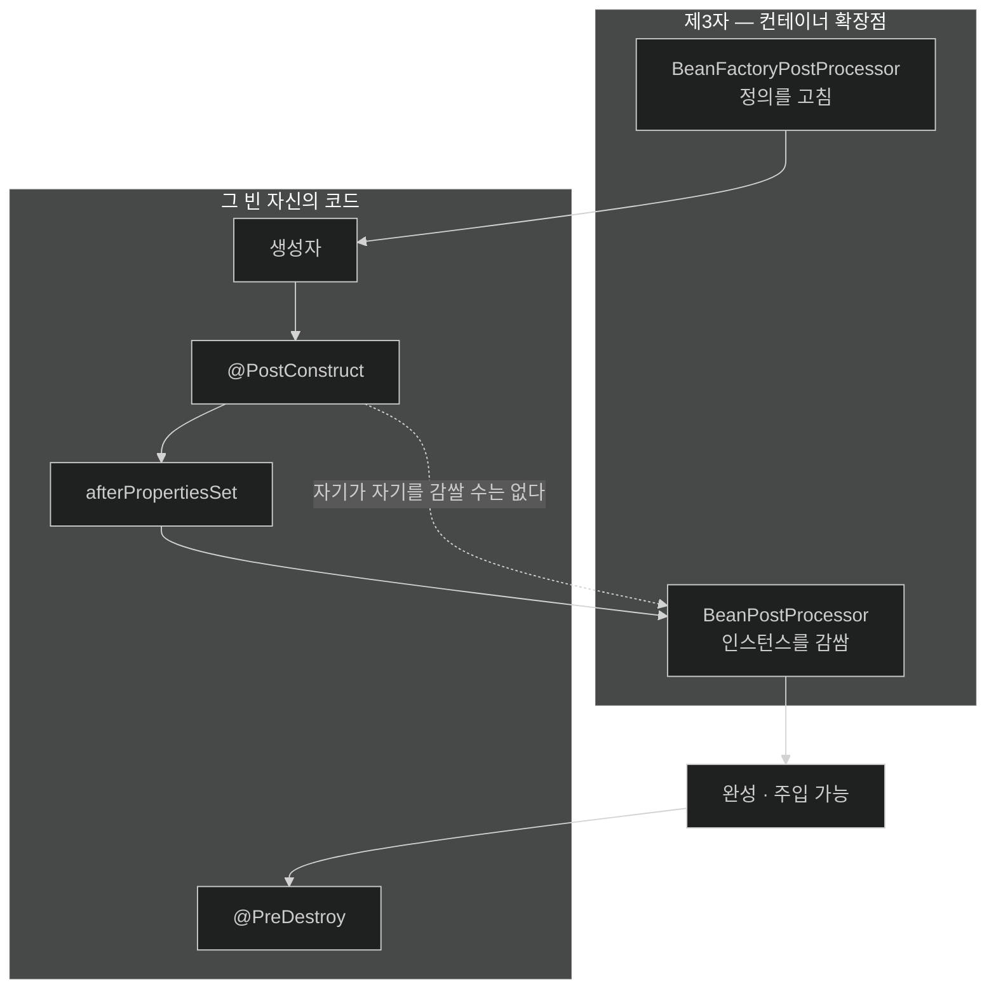

# chapter-c1 개념 지도 — 컨테이너 생명주기

> 목차가 아니라 관계도다. 세션을 열 때와 닫을 때 항상 펼친다.
>
> 이 챕터가 답하는 한 문장짜리 질문: **"내 코드가 실행되는 그 순간, 컨테이너는 이 빈을 어디까지 만들어 놓은 상태인가?"**

## 축 1: 시간축 — 모든 함정이 이 한 줄 위에 있다

이 챕터의 노트 네 개는 전부 같은 타임라인의 서로 다른 구간을 본다.

```text
  ├──────────── 정의 단계 ────────────┤├─────────── 인스턴스 단계 ───────────┤

  스캔·파싱      BFPP 실행        BPP 생성      빈 생성 (반복)        완성
     │              │               │              │                   │
     ▼              ▼               ▼              ▼                   ▼
  빈 정의       ${} 치환        후처리기 등록   생성자→주입→Aware    프록시 씌움
  등록          정의 추가/삭제   ⚠ 여기 딸려온   →BPP.before         →BPP.after
                                 빈은 프록시     →초기화 콜백
                                 를 못 받는다    ⚠ 여기의 this는 원본

   [01]            [02]            [02]           [03]                [03]
                                                   └─── 여러 빈이 얽히면 [04] ───┘
```

| 구간 | 무엇이 아직 없는가 | 그래서 무엇이 안 되는가 | 노트 |
|---|---|---|---|
| 정의 단계 | 객체 자체 | `getBean()` 금지 — 부르면 생명주기 위반 | [[01-beandefinition-and-metadata-phase]] |
| BPP 생성 구간 | 등록된 후처리기 | 이때 만들어진 빈은 **영구히** 프록시 없음 | [[02-two-postprocessor-extension-points]] |
| 초기화 콜백 | 자기 자신의 프록시 | `@PostConstruct`의 `@Transactional` 무효 | [[03-bean-creation-and-lifecycle-callbacks]] |
| 조기 노출 구간 | 상대 빈의 완성 상태 | 미완성 객체 메서드 호출 시 NPE | [[04-eager-singletons-and-circular-references]] |

- **핵심 질문**: 지금 이 코드가 도는 시점에 프록시는 씌워졌는가?

## 축 2: 두 종류의 "아직 아니다"

같아 보이지만 원인이 다른 두 실패다. 섞으면 진단이 틀린다.

| 축 | 순서 함정 (02·03) | 사이클 (04) |
|---|---|---|
| 증상 | **조용히 동작 안 함** | **시작 실패** |
| 애플리케이션은 | 뜬다 | 안 뜬다 |
| 알아채는 법 | INFO 로그 한 줄 / 롤백이 안 됨 | 기동 실패 화면의 고리 그림 |
| 원인 | 내 코드가 프록시보다 먼저 실행됨 | 만들 순서가 존재하지 않음 |
| 해결 | 실행 지점을 뒤로 옮긴다 | 의존 방향을 끊는다 |
| 위험도 | **더 높다** — 조용하기 때문 | 낮다 — 즉시 드러난다 |

**마지막 행이 이 챕터의 요점이다.** 시작이 실패하는 쪽은 친절한 문제다. 진짜 위험한 것은 애플리케이션이 멀쩡히 뜬 채 `@Transactional`만 죽어 있는 상태다.

## 축 3: 누가 개입하는가 — 내 코드 vs 남의 코드



| 축 | 자신의 코드 | 제3자 확장점 |
|---|---|---|
| 손대는 범위 | 자기 자신만 | 컨테이너의 모든 빈 |
| 바꿔치기 | 불가능 | **가능** (`Object` 반환) |
| 대표 | `@PostConstruct` | 자동 프록시 생성기 |
| 그래서 | 프록시를 못 만든다 | 프록시를 만든다 |

- **핵심 질문**: 이 작업은 빈 자신이 할 수 있는 일인가, 제3자만 할 수 있는 일인가?

## 축 4: 문제를 만났을 때의 판단 순서

| 증상 | 먼저 의심할 것 | 확인 방법 | 노트 |
|---|---|---|---|
| `@Transactional`이 안 먹는다 | ① 자기 호출 ② **BPP 참조로 프록시 상실** ③ `@PostConstruct` 안 | 시작 로그에서 `not eligible` 검색 | [[02-two-postprocessor-extension-points]], [[03-bean-creation-and-lifecycle-callbacks]] |
| 시작이 실패하고 고리 그림이 나온다 | 생성자 순환 참조 | 그림에 찍힌 빈 이름 | [[04-eager-singletons-and-circular-references]] |
| 시작 때 NPE가 난다 | 조기 노출 구간의 미완성 객체 접근 | `allow-circular-references`가 켜져 있는지 | [[04-eager-singletons-and-circular-references]] |
| `@Scope("prototype")`인데 항상 같은 객체 | 싱글턴에 주입해 1회성이 됨 | 주입 지점이 싱글턴인지 | [[04-eager-singletons-and-circular-references]] |
| prototype 빈의 자원이 안 닫힌다 | 소멸 콜백 미호출 | 스코프 확인 | [[03-bean-creation-and-lifecycle-callbacks]] |
| `${}`가 치환되지 않은 문자열로 들어온다 | 정의 단계 문제 | 프로퍼티 소스 등록 여부 | [[01-beandefinition-and-metadata-phase]] |

- **핵심 질문**: 이 증상은 "조용한 실패"인가 "시끄러운 실패"인가? 조용하면 프록시를 먼저 의심한다.

## 나의 취약 엣지

아직 인출 시도가 없다. 사용자가 노트를 읽고 인출 연습을 한 뒤 채운다. 추정으로 미리 채우지 않는다.

## 이 챕터에서 이어지는 곳

| 이 챕터의 결론 | 다음 챕터에서의 전개 |
|---|---|
| 프록시는 `postProcessAfterInitialization`에서 씌워진다 | **c2** — 그 프록시를 **무엇으로** 만드는가 (JDK 동적 프록시 vs CGLIB) |
| 자동 프록시 생성기가 대상 빈을 "찾는다" | **c2** — 무엇을 보고 대상인지 판정하는가 (Advisor·Pointcut) |
| `@Configuration`도 빈 정의를 만드는 경로다 | **c2** — 그 클래스 자신이 CGLIB로 강화되는 이유 |
| 조건에 따라 정의를 넣고 빼는 일이 정의 단계에 있다 | **c4** — 자동 구성의 조건 평가가 정확히 그 자리다 |
| 컨트롤러도 빈이고 같은 순서를 밟는다 | **c3** — 그 빈이 HTTP 요청과 어떻게 연결되는가 |

## 관련 카테고리

- `part-0-spring-core-internals/chapter-c2-aop-proxy-internals` — 이 챕터가 "언제"를 답했다면 c2는 "무엇으로·어떻게"를 답한다.
- `part-0-jpa-foundations/chapter-j3-performance-and-transactions` — `03-transactional-propagation-and-proxy-limits`가 자기 호출 문제를 다룬다. 이 챕터는 그 프록시가 **어느 시점에 생기는지**를 채워 준다. 두 노트를 함께 읽으면 `@Transactional`이 죽는 경로가 전부 모인다.
- `part-1-the-basics-of-spring-boot/chapter-1-core-features-of-spring-boot` — 책이 말한 "자동 구성이 빈을 등록한다"의 내부가 이 챕터다.
- `part-0-web-foundations/chapter-w1-servlet-and-containers` — 서블릿 컨테이너의 생명주기와 Spring 컨테이너의 생명주기는 다른 층이다. 섞이기 쉬운 지점이다.
