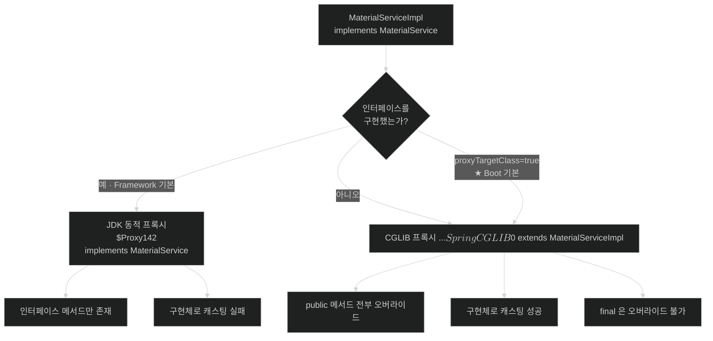

# 프록시는 무엇으로 만들어지는가 — JDK 동적 프록시와 CGLIB

## 한눈에 보기

| 질문 | 핵심 답 |
|---|---|
| 프록시는 어떤 클래스인가? | 런타임에 **새로 생성된 클래스**다. 소스 코드에 없다. |
| 만드는 방법이 몇 가지인가? | 둘. 인터페이스를 구현하거나(JDK), 클래스를 상속하거나(CGLIB). |
| Framework의 선택 규칙은? | 인터페이스를 **하나라도** 구현하면 JDK, 아니면 CGLIB. |
| Spring Boot에서는? | **다르다. Boot는 기본이 CGLIB다.** `spring.aop.proxy-target-class=false`로 되돌린다. |
| 그래서 무슨 차이가 생기나? | JDK 프록시는 **인터페이스에 없는 메서드를 아예 갖지 못한다.** 캐스팅도 실패한다. |
| 왜 Boot가 기본을 바꿨나? | 인터페이스 없는 클래스에도 일관되게 적용되고, 타입 캐스팅 실패를 줄이기 때문이다. |

## 1. 왜 이게 필요한가

### 출발 장면: 주입은 되는데 캐스팅이 실패한다

`@Transactional`이 붙은 서비스를 인터페이스와 함께 만들었다.

```java
public interface MaterialService {
    List<Material> findAll();
}

@Service
@Transactional
public class MaterialServiceImpl implements MaterialService {

    public List<Material> findAll() { ... }

    public void reindexInternal() { ... }   // 인터페이스에 없는 public 메서드
}
```

어딘가에서 구현체의 메서드가 필요해 이렇게 썼다.

```java
@Autowired
private MaterialService materialService;

public void warmUp() {
    ((MaterialServiceImpl) materialService).reindexInternal();
}
```

Framework 기본 설정이라면 런타임에 이렇게 터진다.

```text
java.lang.ClassCastException: class jdk.proxy2.$Proxy142 cannot be cast to
class com.cosmoroute.catalog.MaterialServiceImpl
```

주입은 성공했다. 컴파일도 통과했다. 그런데 캐스팅에서 죽는다. `$Proxy142`라는, 소스 어디에도 없는 클래스 이름이 튀어나온다.

### 여기서 뭐가 무너지나

주입된 것이 `MaterialServiceImpl`이 아니기 때문이다. `@Transactional` 때문에 자동 프록시 생성기가 원본 대신 프록시를 등록했고, 그 프록시는 **`MaterialService` 인터페이스는 구현했지만 `MaterialServiceImpl`을 상속하지는 않았다.**

Java의 타입 규칙상 이건 캐스팅될 수 없다. `$Proxy142`와 `MaterialServiceImpl`은 `MaterialService`라는 공통 부모를 가진 형제일 뿐, 상속 관계가 아니다.

같은 이유로 `reindexInternal()`은 프록시에 **존재조차 하지 않는다.** 인터페이스에 선언되지 않았으니 프록시가 흉내 낼 대상이 아니다.

비유하자면 **역할 대역 배우**다. 원작 배우가 못 나오게 되어 대역을 세웠는데, 대역에게 준 것은 **대본에 적힌 대사 목록**(인터페이스)뿐이다. 대역은 대본에 있는 장면은 완벽히 소화하지만, 원작 배우가 사석에서 하던 취미(인터페이스에 없는 메서드)는 아예 모른다. 대역을 원작 배우로 착각해 그 취미를 요구하면 아무것도 나오지 않는다.

→ 비유가 깨지는 지점: 대역 배우는 사람이라 대본에 없는 즉흥 연기라도 할 수 있다. JDK 프록시는 못 한다 — **인터페이스에 없는 메서드는 클래스 파일에 아예 생성되지 않으므로** 호출할 방법 자체가 존재하지 않는다. "안 하는 것"이 아니라 "없는 것"이다.

### 그래서 나온 생각

인터페이스가 없는 클래스도 프록시하고 싶고, 인터페이스에 없는 메서드도 살리고 싶다. 그러려면 **인터페이스를 구현하는 대신 클래스를 상속**해야 한다. 그 방식이 CGLIB이고, 두 방식이 공존하는 이유가 이것이다.

## 2. 어떻게 동작하는가

### 2.1 두 방식이 만드는 클래스의 모양

```text
[원본]
  interface MaterialService { findAll(); }
  class MaterialServiceImpl implements MaterialService {
      findAll(); reindexInternal();
  }

[JDK 동적 프록시]                      [CGLIB 프록시]
  class $Proxy142                        class MaterialServiceImpl$$SpringCGLIB$$0
        implements MaterialService             extends MaterialServiceImpl
  ├── findAll()          ← 있다          ├── findAll()          ← 오버라이드
  └── reindexInternal()  ← 없다          └── reindexInternal()  ← 오버라이드

  타깃을 필드로 들고 위임               타깃을 필드로 들고 위임
  (MaterialServiceImpl) 캐스팅 실패      (MaterialServiceImpl) 캐스팅 성공
```

핵심은 **상속 관계의 유무**다. CGLIB 프록시는 원본의 하위 클래스이므로 원본 타입으로 캐스팅된다. JDK 프록시는 형제라 안 된다.

### 2.2 Framework의 선택 규칙

공식 문서의 규칙은 한 문장이다 — *"프록시될 대상 객체가 인터페이스를 최소 하나 구현하면 JDK 동적 프록시가 사용되고, 대상 타입이 구현한 모든 인터페이스가 프록시된다. 대상 객체가 아무 인터페이스도 구현하지 않으면 대상 타입의 런타임 생성 하위 클래스인 CGLIB 프록시가 만들어진다."*

1. **자동 프록시 생성기가 대상 빈을 판정한다.** — 어드바이스를 붙일 필요가 없는 빈까지 감싸면 낭비이기 때문이다(판정 방법은 [[02-advisor-pointcut-and-auto-proxy-creation]]).
2. **대상 타입이 인터페이스를 구현하는지 본다.** — 두 생성 방식 중 하나를 골라야 하기 때문이다.
3. **구현했으면 그 인터페이스들로 JDK 프록시를 만든다.** — 표준 JDK 기능만으로 되고 별도 바이트코드 라이브러리가 필요 없기 때문이다.
4. **안 했으면 대상 타입을 상속한 하위 클래스를 만든다.** — 인터페이스가 없으면 흉내 낼 계약이 없어 상속밖에 방법이 없기 때문이다.
5. **어느 쪽이든 타깃 객체를 필드로 들고 호출을 위임한다.** — 실제 로직은 원본에 있고 프록시는 앞뒤로 어드바이스만 끼우는 역할이기 때문이다.

### 2.3 Spring Boot는 이 기본을 뒤집는다

여기가 **책이나 일반적인 설명과 실제 프로젝트가 갈리는 지점**이다.

Framework 문서 자신이 단서를 단다 — *"전역 기본 프록시 타입은 설정에 따라 다를 수 있다. 코어 프레임워크는 기본적으로 인터페이스 기반 프록시를 제안하지만, Spring Boot는 설정 프로퍼티에 따라 클래스 기반 프록시를 기본으로 활성화할 수 있다."*

Boot 문서는 확정적으로 적는다 — *"기본적으로 Spring Boot의 자동 구성은 Spring AOP가 CGLib 프록시를 사용하도록 구성한다. JDK 프록시를 쓰려면 `spring.aop.proxy-target-class`를 `false`로 설정한다."*

**정리하면 이렇다.**

| 환경 | 인터페이스가 있을 때 기본 |
|---|---|
| 순수 Spring Framework | JDK 동적 프록시 |
| **Spring Boot (자동 구성)** | **CGLIB 프록시** |

그래서 출발 장면의 `ClassCastException`은 **Boot 프로젝트에서는 대개 안 난다.** 같은 코드가 순수 Framework 설정에서만 터진다. "Spring은 인터페이스가 있으면 JDK 프록시를 쓴다"는 설명을 외운 채 Boot에서 실험하면 재현이 안 되는 이유가 이것이다.

Boot가 기본을 바꾼 이유는 실용적이다. 인터페이스 유무에 따라 프록시 타입이 달라지면 **같은 코드가 클래스 구조를 바꿨다는 이유만으로 다르게 동작한다.** 인터페이스를 하나 추가하는 순간 캐스팅이 깨지는 식이다. CGLIB로 통일하면 그 변동이 사라진다.

### 2.4 `proxyTargetClass`를 켜는 두 가지 경로

**[[프록시-대상-클래스]]**(= 인터페이스가 있어도 강제로 CGLIB를 쓰게 하는 플래그)는 여러 자리에서 설정할 수 있다.

```properties
# Spring Boot — 이것이 기본값이며, false 로 두면 JDK 프록시로 돌아간다
spring.aop.proxy-target-class=true
```

```java
// 애노테이션 기반 설정에서 개별 지정
@EnableTransactionManagement(proxyTargetClass = true)
@EnableAspectJAutoProxy(proxyTargetClass = true)
```

공식 문서는 XML 설정에서 한 가지를 경고한다 — `<tx:annotation-driven/>`, `<aop:aspectj-autoproxy/>`, `<aop:config/>` 중 어느 하나에 `proxy-target-class="true"`를 쓰면 **셋 모두에 CGLIB가 강제된다.** 한 곳만 바꿨다고 생각했는데 전역이 바뀌는 종류의 설정이다.

### 2.5 이름의 유래

**JDK 동적 프록시**의 "동적(dynamic)"은 **클래스가 컴파일 시점이 아니라 실행 시점에 만들어진다**는 뜻이다. `$Proxy142`의 숫자는 그 JVM에서 몇 번째로 생성된 프록시인지를 나타낸다 — 소스에 없는 이름이 스택 트레이스에 찍히는 이유다.

**CGLIB**는 Code Generation Library의 약자다. 이름 그대로 바이트코드를 생성하는 라이브러리이며, 지금은 Spring이 자체적으로 재패키징해 내장하고 있다. 생성된 클래스 이름에 `$$SpringCGLIB$$`가 들어가는 것이 그 흔적이다.

## 3. 그림으로 보기

### 같은 빈, 두 가지 프록시



### 호출이 지나가는 길

```text
  caller.findAll()
      │
      ▼
  ┌─────────────────────────────────────────┐
  │ 프록시 (JDK 또는 CGLIB)                  │
  │                                          │
  │  1. 이 메서드에 붙은 어드바이스가 있나?  │
  │  2. 있으면 인터셉터 체인 실행            │
  │       예: 트랜잭션 시작                  │
  │  3. 타깃 객체의 같은 메서드 호출  ────┐  │
  │  4. 돌아오면 체인의 뒷부분 실행       │  │
  │       예: 커밋 또는 롤백              │  │
  └───────────────────────────────────────┼──┘
                                          │
                                          ▼
                          ┌───────────────────────────┐
                          │ 타깃 객체                  │
                          │ MaterialServiceImpl        │
                          │  실제 findAll() 로직       │
                          │                            │
                          │  ⚠ 여기서 this.other() 를  │
                          │    부르면 프록시 밖이다     │
                          └───────────────────────────┘

  → 프록시가 들고 있는 것은 "로직"이 아니라 "타깃에 대한 참조"다.
    그래서 프록시는 원본을 대체하는 것이 아니라 원본 앞에 서 있는 것이다.
    "프록시(proxy)"가 법률·외교에서 "대리인"을 뜻하는 것과 같다 —
    대리인은 본인을 대신해 나서지만 본인 자체는 아니다.
```

## 4. 이 노트에 나온 용어

| 용어 | 한 줄 풀이 | 자세히 |
|---|---|---|
| JDK 동적 프록시 | 인터페이스를 구현한 클래스를 런타임에 만드는 표준 방식 | [[_glossary#JDK-동적-프록시]] |
| CGLIB 프록시 | 대상 타입을 상속한 하위 클래스를 런타임에 만드는 방식 | [[_glossary#CGLIB-프록시]] |
| 프록시 대상 클래스 | 인터페이스가 있어도 강제로 CGLIB를 쓰게 하는 플래그 | [[_glossary#프록시-대상-클래스]] |

## 5. 자주 헷갈리는 것

### "인터페이스를 만들면 JDK 프록시"는 Boot에서 틀린다

가장 널리 퍼진 오해다. 순수 Framework에서는 맞지만 **Boot 프로젝트에서는 기본이 CGLIB**라 인터페이스가 있어도 클래스 기반 프록시가 만들어진다. 어느 쪽인지 확인하려면 로그를 찍어 보면 된다.

```java
System.out.println(materialService.getClass().getName());
// jdk.proxy2.$Proxy142                        → JDK
// com...MaterialServiceImpl$$SpringCGLIB$$0   → CGLIB
```

`AopUtils.isCglibProxy(bean)`·`AopUtils.isJdkDynamicProxy(bean)`로도 판정할 수 있다.

### 프록시 타입과 자기 호출 문제는 별개다

| 축 | 프록시 타입 (이 노트) | 자기 호출 ([[03-why-final-private-and-self-invocation-break]]) |
|---|---|---|
| 무엇이 문제 | 어떤 클래스가 만들어지는가 | 호출이 프록시를 지나는가 |
| CGLIB로 바꾸면 | 캐스팅·비인터페이스 메서드 해결 | **해결 안 됨** |
| 해결 방법 | `proxyTargetClass=true` | 구조 변경 |

`@Transactional`이 안 먹을 때 "CGLIB로 바꿔 보자"는 대개 헛수고다. 자기 호출은 프록시 종류와 무관하게 깨진다 — 둘 다 "프록시를 지나야 동작한다"는 전제 위에 있기 때문이다.

### `@Async`·`@Cacheable`도 같은 메커니즘이다

`@Transactional`만의 이야기가 아니다. 프록시로 구현되는 모든 기능이 이 규칙을 공유한다. 하나를 이해하면 나머지가 따라온다.

## 6. 언제 안 쓰나 / 경계

- **프록시된 빈을 구현 클래스로 캐스팅하지 않는다.** 프록시 타입에 따라 되기도 하고 안 되기도 하는 코드는 설정 변경 하나로 깨진다. 필요한 메서드가 있으면 인터페이스에 올린다.
- **`final` 클래스에 `@Transactional`을 붙이지 않는다.** CGLIB가 상속할 수 없어 프록시가 만들어지지 않는다. Kotlin에서 클래스가 기본 `final`이라 자주 걸린다.
- **프록시 타입을 코드 동작의 전제로 삼지 않는다.** `getClass()` 결과로 분기하는 코드는 설정에 결합된다.
- **네이티브 이미지(GraalVM)에서는 프록시 클래스가 빌드 시점에 생성돼야 한다.** Boot 문서가 명시하듯 런타임 동적 생성에 의존하던 것이 빌드 타임 처리로 옮겨간다 — 리플렉션·프록시 힌트가 필요할 수 있다.
- **프록시가 답이 아닌 경우가 있다.** 생성자·필드 접근·`private` 메서드에 개입해야 한다면 프록시로는 불가능하다. AspectJ 위빙이 필요한 자리다.

## 7. 연결

- [[02-advisor-pointcut-and-auto-proxy-creation]] — 이 노트는 "무엇으로 만드는가"를, 그 노트는 "누구를 대상으로 만드는가"를 답한다. 프록시가 만들어지기 **전에** 대상 판정이 먼저 있다.
- [[03-why-final-private-and-self-invocation-break]] — 이 노트의 "상속해서 오버라이드한다"는 한 문장이 그 노트의 모든 한계를 낳는다. 원인과 결과의 관계다.
- [[04-configuration-class-cglib-enhancement]] — `@Configuration` 클래스도 CGLIB로 강화된다. 같은 기술이 AOP가 아닌 목적에 쓰이는 사례다.

## 8. 스스로 확인

1. `ClassCastException: $Proxy142 cannot be cast to ...Impl`이 나는 이유를 타입 관계로 설명할 수 있는가?
2. JDK 프록시에서 인터페이스에 없는 메서드가 "호출되지 않는" 것이 아니라 "존재하지 않는" 이유는?
3. Framework의 프록시 선택 규칙을 한 문장으로 말할 수 있는가?
4. Spring Boot에서 그 규칙이 어떻게 달라지는가? 왜 바꿨는가?
5. 지금 내 빈이 어떤 프록시인지 확인하는 방법 두 가지는?
6. `@Transactional`이 안 먹을 때 CGLIB로 바꾸는 것이 대개 헛수고인 이유는?
7. `final` 클래스에 `@Transactional`을 붙이면 무슨 일이 생기는가?
8. 프록시가 들고 있는 것이 "로직"이 아니라 "참조"라는 말의 의미는?
9. `$Proxy142`의 "동적"과 CGLIB의 "Code Generation"은 각각 무엇을 가리키는 이름인가?


> 아홉 문항을 스스로 답한 **뒤에** [[_01-jdk-dynamic-proxy-vs-cglib]]에서 모범답안과 대조한다. 먼저 열면 이 문항들은 다시 인출 문제로 쓸 수 없다.

<!-- ==== 아래는 내 영역 · 스킬 수정 금지 ==== -->

## 내 설명 시도


## 막혔던 지점


## 리뷰 이력
