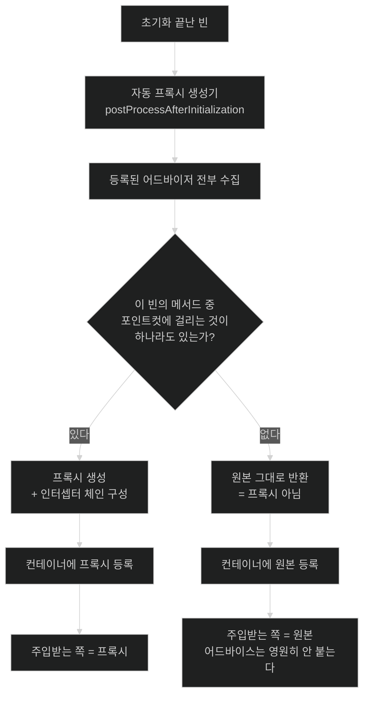

# 누구를 감쌀지 어떻게 정하는가 — 어드바이저와 포인트컷

## 한눈에 보기

| 질문 | 핵심 답 |
|---|---|
| 모든 빈이 프록시로 감싸지나? | **아니다.** 매칭되는 [[포인트컷]]이 하나도 없으면 프록시하지 않는다. |
| 그럼 무엇을 보고 판정하나? | 등록된 [[어드바이저]]들의 포인트컷을 **빈의 메서드마다** 평가한다. |
| 어드바이저가 뭔가? | [[어드바이스]](무엇을 할지) + [[포인트컷]](어디에 할지)의 **짝**. |
| 왜 꼭 짝이어야 하나? | 평가할 포인트컷이 없으면 "이 빈이 대상인가"를 판정할 수 없기 때문이다. |
| 판정은 언제 일어나나? | 컨테이너가 빈을 만드는 중. c1의 `postProcessAfterInitialization` 시점. |
| Spring AOP의 조인 포인트 범위는? | **메서드 실행뿐이다.** 필드 접근·생성자 호출에는 못 붙인다. |

## 1. 왜 이게 필요한가

### 출발 장면: 어떤 빈은 프록시고 어떤 빈은 아니다

트랜잭션이 안 먹는 문제를 쫓다가 빈의 실제 타입을 찍어 봤다.

```java
System.out.println(materialService.getClass().getName());
// com.cosmoroute.catalog.MaterialService$$SpringCGLIB$$0    ← 프록시다

System.out.println(auditLogger.getClass().getName());
// com.cosmoroute.audit.AuditLogger                          ← 프록시가 아니다
```

둘 다 `@Service`이고, 둘 다 같은 컨테이너 안에 있고, 둘 다 같은 자동 프록시 생성기를 거쳤다. 그런데 한쪽만 감싸졌다.

여기서 자연스러운 오해가 생긴다 — "Spring이 모든 빈을 프록시로 감싼다"고 알고 있으면 이 결과를 설명할 수 없다. 그러면 `AuditLogger`에 `@Transactional`을 붙였는데 안 먹는 상황에서 엉뚱한 곳을 뒤지게 된다.

### 여기서 뭐가 무너지나

Spring은 모든 빈을 감싸지 않는다. **감쌀 이유가 있는 빈만 감싼다.** 그 "이유"를 판정하는 규칙이 있고, 그걸 모르면 프록시의 존재 여부가 무작위처럼 보인다.

공식 문서가 판정 규칙을 명확히 적는다 — *"`DefaultAdvisorAutoProxyCreator`는 각 어드바이저에 담긴 포인트컷을 자동으로 평가해 각 비즈니스 객체에 어떤 어드바이스를 적용해야 하는지(있다면) 확인한다. (…) **어떤 어드바이저의 어떤 포인트컷도 비즈니스 객체의 어떤 메서드와도 매칭되지 않으면 그 객체는 프록시되지 않는다.**"*

즉 `AuditLogger`가 프록시가 아닌 이유는 단순하다. 그 클래스의 어떤 메서드도 등록된 포인트컷 중 무엇과도 매칭되지 않았다. `@Transactional`이 붙어 있었다면 트랜잭션 어드바이저의 포인트컷이 매칭됐을 것이고, 그러면 프록시가 됐을 것이다.

**감싸지 않는 것이 최적화**이기도 하다. 감싸면 호출마다 인터셉터 체인을 거치고, 스택 트레이스가 길어지고, 메모리를 더 쓴다. 필요 없는 빈까지 감싸는 것은 순수한 손해다.

비유하자면 **공항 보안 검색의 정밀 검사 대상 선별**이다. 모두가 기본 검색은 거치지만, 정밀 검사는 특정 조건(목적지, 수하물 스캔 결과)에 걸린 사람만 받는다. 조건에 안 걸린 사람은 정밀 검사대 자체를 지나가지 않는다.

→ 비유가 깨지는 지점: 공항은 사람을 통과시킨 뒤 필요하면 다시 부를 수 있다. 컨테이너는 못 한다 — **판정은 빈이 만들어지는 그 한 번뿐**이고, 그때 프록시가 아니면 그 빈은 애플리케이션이 살아 있는 내내 프록시가 아니다. 나중에 조건이 바뀌어도 소급되지 않는다.

### 그래서 나온 생각

"무엇을 할지"와 "어디에 할지"를 분리해서 각각 독립적으로 정의하고, 둘을 짝지어 등록한다. 그러면 컨테이너는 빈마다 그 짝들을 훑으며 "이 빈의 이 메서드가 여기 걸리는가"만 물으면 된다. 이 분리가 AOP의 핵심 설계다.

## 2. 어떻게 동작하는가

### 2.1 다섯 개의 용어가 만드는 한 문장

AOP 용어가 많아 보이지만, 실은 한 문장을 조각낸 것이다.

> **[[위빙]]** 시점에, **[[포인트컷]]**에 매칭되는 **[[조인-포인트]]**에서, **[[어드바이스]]**를 **[[타깃-객체]]** 대신 실행한다.

| 용어 | 공식 정의(요약) | `@Transactional`에서는 |
|---|---|---|
| [[조인-포인트]] | 어드바이스를 끼울 수 있는 실행 지점. **Spring AOP에서는 항상 메서드 실행** | `MaterialService.findAll()` 호출 |
| [[포인트컷]] | 조인 포인트를 골라내는 술어 | "`@Transactional`이 붙은 메서드" |
| [[어드바이스]] | 그 지점에서 실제로 하는 일 | 트랜잭션 시작·커밋·롤백 코드 |
| [[어드바이저]] | 어드바이스 + 포인트컷의 짝 | 트랜잭션 어드바이저 |
| [[타깃-객체]] | 어드바이스되는 원본 객체 | `MaterialService` 인스턴스 |
| [[위빙]] | 애스펙트를 객체와 엮는 작업 | **런타임**(프록시 생성 시점) |

공식 문서는 [[어드바이스]]에 대해 중요한 구현 힌트를 준다 — Spring을 포함한 많은 AOP 프레임워크가 어드바이스를 **인터셉터로 모델링하고 조인 포인트 주위에 인터셉터 체인을 유지한다.** 그래서 한 메서드에 어드바이스가 여럿 붙으면 양파 껍질처럼 겹겹이 감싸인다.

### 2.2 왜 반드시 "짝"이어야 하는가

[[어드바이저]]가 왜 별도 개념인지를 공식 문서가 직접 설명한다. 자동 프록시 생성기에 등록하는 것은 인터셉터나 순수 어드바이스가 아니라 **반드시 어드바이저여야 한다** — *"평가할 포인트컷이 있어야 후보 빈 정의에 대해 각 어드바이스의 적용 가능 여부를 검사할 수 있기 때문이다."*

풀어 쓰면 이렇다. 어드바이스만 있으면 "무엇을 할지"는 알지만 "누구에게 할지"를 모른다. 컨테이너는 빈 수천 개를 훑으며 판정해야 하는데, 판정 기준이 없으면 전부 감싸거나 하나도 안 감싸는 수밖에 없다. 포인트컷이 그 기준이다.

### 2.3 판정과 생성의 실제 순서

1. **컨테이너가 빈을 만들고 초기화를 끝낸다.** — 완성된 객체여야 감쌀 수 있기 때문이다(c1의 8단계 중 5번까지).
2. **자동 프록시 생성기가 `postProcessAfterInitialization`으로 그 빈을 받는다.** — 자동 프록시 생성 자체가 빈 후처리기로 구현돼 있기 때문이다.
3. **컨텍스트에 등록된 [[어드바이저]]를 전부 가져온다.** — 어떤 규칙이 적용될 수 있는지 후보를 알아야 하기 때문이다.
4. **각 어드바이저의 포인트컷을 이 빈의 메서드 하나하나에 평가한다.** — 클래스 단위가 아니라 메서드 단위로 매칭되어야 "어떤 메서드에만 트랜잭션"이 가능하기 때문이다.
5. **하나라도 매칭되면 프록시를 만들고, 매칭된 어드바이스들로 인터셉터 체인을 구성한다.** — 매칭된 메서드만 어드바이스를 거치게 하기 위해서다.
6. **하나도 매칭 안 되면 원본을 그대로 반환한다.** — 불필요한 프록시의 호출 비용과 스택 깊이를 아끼기 위해서다.
7. **반환값이 컨테이너에 등록되고 이후 모든 주입에 쓰인다.** — 주입받는 쪽이 프록시를 받아야 어드바이스가 실제로 실행되기 때문이다.

**4번이 "메서드 단위"라는 점이 중요하다.** 클래스에 메서드가 열 개 있고 그중 하나만 `@Transactional`이면, 프록시는 만들어지되 나머지 아홉 개는 어드바이스 없이 곧장 타깃으로 위임된다.

### 2.4 두 종류의 자동 프록시 생성기

공식 문서가 소개하는 대표 구현이 둘이다.

| | `BeanNameAutoProxyCreator` | `DefaultAdvisorAutoProxyCreator` |
|---|---|---|
| 판정 기준 | **빈 이름**(리터럴·와일드카드) | **포인트컷 평가** |
| 설정 | 이름 목록을 직접 나열 | 나열 불필요 |
| 문서의 평가 | 최소한의 설정으로 여러 객체에 같은 구성 적용 | *"더 일반적이고 극도로 강력한"* |
| 새 빈이 추가되면 | 이름을 추가해야 함 | **자동으로 판정됨** |

`DefaultAdvisorAutoProxyCreator`에 대해 문서는 *"현재 컨텍스트의 적격 어드바이저를 자동 프록시 어드바이저의 빈 정의에 특정 빈 이름을 포함시킬 필요 없이 자동으로 적용한다"*고 적고, 새 비즈니스 객체의 빈 정의가 추가되면 필요에 따라 자동으로 프록시된다고 덧붙인다.

우리가 `@Transactional`만 붙이고 아무것도 등록하지 않아도 동작하는 이유가 이것이다. **Boot가 트랜잭션 어드바이저를 자동 구성으로 등록해 두었고**, 포인트컷 기반 판정이 나머지를 알아서 한다.

**다만 실제 프로젝트에서 `DefaultAdvisorAutoProxyCreator`라는 이름을 찾으면 안 나온다.** 공식 문서가 판정 규칙을 설명하며 드는 예가 이 클래스일 뿐, Boot 애플리케이션에 실제로 등록되는 것은 같은 계열의 다른 구현이다 — `@EnableAspectJAutoProxy` 경로의 `AnnotationAwareAspectJAutoProxyCreator`, 트랜잭션 경로의 `InfrastructureAdvisorAutoProxyCreator` 등이다. 전부 같은 추상 클래스(`AbstractAutoProxyCreator`)를 공유하므로 **"어드바이저의 포인트컷을 평가해, 매칭이 하나도 없으면 원본을 그대로 반환한다"는 규칙은 동일하다.** 이 노트가 설명하는 것은 그 공통 규칙이다.

### 2.5 이름의 유래

- **[[조인-포인트]]**는 "애스펙트와 원래 코드가 **합류(join)**하는 지점"이다. 두 흐름이 만나는 자리라는 뜻이다.
- **[[포인트컷]]**은 "지점들을 **잘라 낸(cut)** 것"이다. 모든 조인 포인트 중에서 관심 있는 부분집합을 잘라 낸다는 뜻이다.
- **[[위빙]]**은 직조, 즉 **실을 엮는 일**이다. 애스펙트라는 씨실을 원래 코드라는 날실에 끼워 넣어 하나의 천을 만든다는 은유다.
- **[[어드바이스]]**는 "조언"이 아니라 법률·의료에서 쓰는 "처방·지시"에 가깝다. 그 지점에서 취할 조치를 뜻한다.

→ 직조 비유가 깨지는 지점: 실제 직조는 천이 완성되면 씨실과 날실을 분리할 수 없다. Spring AOP의 런타임 위빙은 그렇지 않다 — 프록시를 벗기면 원본 객체가 그대로 나온다(`AopProxyUtils.ultimateTargetClass`). 진짜로 엮여 한 몸이 되는 것은 AspectJ의 바이트코드 위빙이고, Spring의 것은 "덧씌우기"에 가깝다.

## 3. 그림으로 보기

### 판정 흐름 — 왜 어떤 빈은 안 감싸지나



### 어드바이저의 구조와 인터셉터 체인

```text
  [어드바이저 = 어드바이스 + 포인트컷]

    ┌──────────────────────────────────────┐
    │ 포인트컷: @Transactional 붙은 메서드 │  ← 어디에
    ├──────────────────────────────────────┤
    │ 어드바이스: 트랜잭션 시작 / 커밋      │  ← 무엇을
    └──────────────────────────────────────┘


  [매칭된 메서드에 만들어지는 체인]

    호출 ──▶ ┌ 트랜잭션 어드바이스 ─────────────────┐
             │  begin()                              │
             │  ┌ 캐시 어드바이스 ─────────────────┐ │
             │  │  캐시 조회 · 있으면 여기서 반환   │ │
             │  │  ┌ 타깃 객체 ───────┐             │ │
             │  │  │ 실제 findAll()   │             │ │
             │  │  └──────────────────┘             │ │
             │  │  결과를 캐시에 저장                │ │
             │  └───────────────────────────────────┘ │
             │  commit() 또는 rollback()             │
             └────────────────────────────────────────┘

  → 어드바이스가 여럿이면 양파처럼 겹친다. 공식 문서가 어드바이스를
    "인터셉터로 모델링하고 조인 포인트 주위에 인터셉터 체인을 유지한다"고
    적은 것이 이 구조다. 순서는 @Order 로 정한다 —
    바깥쪽일수록 먼저 시작하고 나중에 끝난다.


  [같은 클래스의 다른 메서드 — 매칭 안 됨]

    호출 ──▶ 프록시 ──▶ 타깃 객체.otherMethod()
                        (체인 없이 곧장 위임)

  → 프록시가 있다고 모든 메서드에 어드바이스가 붙는 것이 아니다.
    판정은 메서드 단위다.
```

## 4. 이 노트에 나온 용어

| 용어 | 한 줄 풀이 | 자세히 |
|---|---|---|
| 조인 포인트 | 어드바이스를 끼울 수 있는 실행 지점. Spring AOP에서는 메서드 실행뿐 | [[_glossary#조인-포인트]] |
| 어드바이스 | 그 지점에서 실제로 하는 일 | [[_glossary#어드바이스]] |
| 포인트컷 | 조인 포인트를 골라내는 술어 | [[_glossary#포인트컷]] |
| 어드바이저 | 어드바이스와 포인트컷을 짝지은 것 | [[_glossary#어드바이저]] |
| 위빙 | 애스펙트를 객체와 엮어 어드바이스된 객체를 만드는 작업 | [[_glossary#위빙]] |
| 타깃 객체 | 어드바이스되는 원본 객체 | [[_glossary#타깃-객체]] |

## 5. 자주 헷갈리는 것

### 애스펙트 vs 어드바이저

둘 다 "어드바이스 + 포인트컷"을 담는데 층이 다르다.

| 축 | 애스펙트(`@Aspect`) | 어드바이저(`Advisor`) |
|---|---|---|
| 층 | 개발자가 쓰는 표현 | 프레임워크 내부 단위 |
| 담는 것 | 여러 개의 어드바이스 + 포인트컷 | **정확히 하나씩** |
| 관계 | `@Aspect` 하나가 어드바이저 여러 개로 분해된다 | 분해의 결과물 |

`@Aspect` 클래스에 `@Before`·`@After`를 세 개 쓰면 내부적으로 어드바이저 세 개가 된다. 자동 프록시 생성기가 평가하는 단위는 어드바이저다.

### "프록시가 아니다" vs "프록시인데 어드바이스가 안 걸렸다"

증상이 같아 보이지만 원인이 다르다.

| 상태 | `getClass()` | 원인 | 해결 |
|---|---|---|---|
| 프록시 아님 | 원본 클래스명 | 매칭되는 포인트컷 0개 | 애노테이션 확인 |
| 프록시인데 그 메서드만 안 걸림 | `$$SpringCGLIB$$` | 그 메서드가 포인트컷에 안 맞음 | `private`·`final` 여부 확인 |
| 프록시인데 안 지나감 | `$$SpringCGLIB$$` | 자기 호출 | 구조 변경 |

세 번째가 가장 헷갈린다 — 프록시도 있고 어드바이스도 걸렸는데 **호출이 그 길로 안 간다.** [[03-why-final-private-and-self-invocation-break]]의 주제다.

### Spring AOP는 메서드 실행에만 붙는다

공식 문서가 못박는다 — *"Spring AOP에서 조인 포인트는 항상 메서드 실행을 나타낸다."* 그래서 다음은 **불가능하다.**

- 필드 읽기·쓰기 가로채기
- 생성자 호출 가로채기
- `static` 메서드 가로채기

전부 프록시로는 개입할 수 없는 지점이다. 이런 게 필요하면 AspectJ 위빙이 답이다.

## 6. 언제 안 쓰나 / 경계

- **포인트컷을 너무 넓게 잡지 않는다.** `execution(* com.cosmoroute..*.*(..))` 같은 표현은 거의 모든 빈을 프록시로 만든다. 시작 시간, 메모리, 스택 깊이가 전부 늘고 디버깅이 어려워진다.
- **어드바이스에 무거운 로직을 넣지 않는다.** 매칭된 모든 호출에서 실행된다. 로깅 어드바이스 하나가 전체 처리량을 떨어뜨릴 수 있다.
- **어드바이스 순서에 의존하는 설계를 피한다.** `@Order`로 정할 수는 있지만, 순서가 결과를 바꾸는 구조는 나중에 어드바이스가 하나 추가되면 깨진다.
- **`@Aspect` 클래스 자신은 어드바이스 대상이 아니다.** 자기가 자기를 감쌀 수 없고, 감싸려 해도 c1의 **특수 시작 단계** 문제에 걸린다.
- **필드·생성자·`static`에 개입해야 한다면 Spring AOP가 도구가 아니다.** 조인 포인트 범위 밖이다.

## 7. 연결

- [[01-jdk-dynamic-proxy-vs-cglib]] — 이 노트가 "감쌀지 말지"를 정하고, 그 노트가 "감싼다면 무엇으로 만들지"를 정한다. 판정이 먼저이고 생성이 나중이다.
- [[03-why-final-private-and-self-invocation-break]] — 포인트컷에 매칭됐는데도 어드바이스가 안 도는 경우를 다룬다. 판정은 통과했지만 실행 경로가 프록시를 비껴가는 상황이다.
- [[04-configuration-class-cglib-enhancement]] — `@Configuration` 강화는 포인트컷 평가를 거치지 않는 별도 경로다. 같은 CGLIB를 쓰지만 AOP 판정 흐름 밖에 있다는 대조가 이 노트의 이해를 굳혀 준다.

## 8. 스스로 확인

1. 같은 컨테이너의 두 `@Service` 중 하나만 프록시인 이유를 설명할 수 있는가?
2. 매칭되는 포인트컷이 없을 때 프록시를 안 만드는 것이 왜 최적화인가?
3. 자동 프록시 생성기에 어드바이스가 아니라 어드바이저를 등록해야 하는 이유는?
4. 포인트컷 평가가 클래스 단위가 아니라 메서드 단위인 것이 왜 중요한가?
5. `@Transactional`만 붙이고 아무것도 등록 안 해도 동작하는 이유는?
6. `@Aspect` 하나와 어드바이저의 개수 관계는?
7. "프록시가 아니다"와 "프록시인데 안 지나간다"를 어떻게 구별하는가?
8. Spring AOP로 할 수 없는 세 가지 가로채기는? 그 이유는 프록시의 어떤 성질 때문인가?
9. 인터셉터 체인이 양파처럼 겹친다는 말의 의미와, 순서가 뜻하는 바는?
10. 위빙을 직조에 비유할 때, Spring AOP에서 그 비유가 깨지는 지점은?


> 열 문항을 스스로 답한 **뒤에** [[_02-advisor-pointcut-and-auto-proxy-creation]]에서 모범답안과 대조한다. 먼저 열면 이 문항들은 다시 인출 문제로 쓸 수 없다.

<!-- ==== 아래는 내 영역 · 스킬 수정 금지 ==== -->

## 내 설명 시도


## 막혔던 지점


## 리뷰 이력
