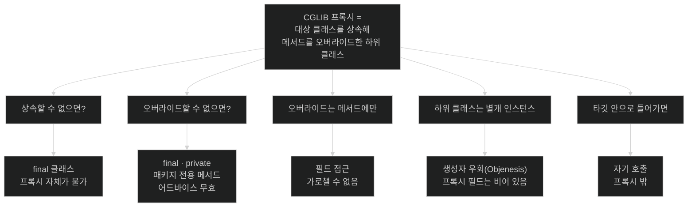

# 프록시의 한계는 전부 한 문장에서 나온다 — 상속해서 오버라이드한다

## 한눈에 보기

| 질문 | 핵심 답 |
|---|---|
| 프록시의 한계를 외워야 하나? | 아니다. **"상속해서 오버라이드한다"** 한 문장에서 전부 유도된다. |
| `final` 메서드에 `@Transactional`을 붙이면? | 조용히 무시된다. 오버라이드할 수 없기 때문이다. |
| `private` 메서드는? | 같은 이유로 무시된다. 경고도 오류도 없다. |
| 주입받은 빈의 필드를 직접 읽으면? | **`null`이 나올 수 있다.** 프록시의 필드는 초기화되지 않는다. |
| 왜 초기화가 안 되나? | 생성자를 부르지 않고 만들기 때문이다([[생성자-우회]]). |
| [[자기-호출]]은 Spring의 결함인가? | 아니다. `this.bar()`가 프록시를 안 지나는 건 **Java의 평범한 규칙**이다. |

## 1. 왜 이게 필요한가

### 출발 장면: 주입받은 빈의 필드가 `null`이다

설정값을 필드로 노출한 컴포넌트가 있다.

```java
@Component
public class CatalogPolicy {

    public final int maxSubstancesPerMaterial;   // 생성자에서 채운다

    public CatalogPolicy(@Value("${cosmoroute.max-substances:40}") int max) {
        this.maxSubstancesPerMaterial = max;
    }

    @Transactional                                // ← 이것 때문에 프록시가 된다
    public void enforce(...) { ... }
}
```

쓰는 쪽에서 필드를 직접 읽는다.

```java
@Service
public class MaterialService {
    private final CatalogPolicy policy;

    public void check(List<UUID> ids) {
        if (ids.size() > policy.maxSubstancesPerMaterial) {   // ← 항상 참이 된다
            throw new TooManySubstances();
        }
    }
}
```

`maxSubstancesPerMaterial`이 **`0`으로 읽힌다.** 프로퍼티에는 `40`이 들어 있고, `CatalogPolicy` 생성자에 브레이크포인트를 걸면 `40`이 제대로 대입된다. 그런데 읽는 쪽에서는 `0`이다.

`@Transactional`을 지우면 `40`이 나온다. **트랜잭션 애노테이션 하나가 전혀 상관없어 보이는 필드 값을 바꿨다.**

### 여기서 뭐가 무너지나

`@Transactional` 때문에 이 빈이 프록시가 됐고, 주입된 것은 `CatalogPolicy`가 아니라 `CatalogPolicy$$SpringCGLIB$$0`이다. 그 프록시는 `CatalogPolicy`의 **하위 클래스**이므로 `maxSubstancesPerMaterial` 필드를 물려받는다 — 필드가 **존재하기는 한다.** 하지만 그 필드에는 아무도 값을 넣지 않았다.

값이 들어 있는 것은 프록시가 감싸고 있는 **타깃 객체 쪽 필드**다. 프록시는 메서드 호출을 타깃에 위임하지만, **필드 읽기는 위임할 수 없다.** `policy.maxSubstancesPerMaterial`은 메서드 호출이 아니라 필드 접근이고, JVM은 이것을 프록시 인스턴스 자신의 필드에서 곧장 읽는다. 가로챌 지점이 없다.

여기에 [[생성자-우회]]가 겹친다. 공식 문서가 적듯 CGLIB 프록시 인스턴스는 Objenesis를 통해 만들어져 **프록시된 객체의 생성자가 두 번 호출되지 않는다.** 생성자를 아예 부르지 않으므로 `this.maxSubstancesPerMaterial = max` 줄이 프록시 인스턴스에서는 실행되지 않고, `int` 필드는 JVM 기본값 `0`으로 남는다.

> **정확히는 JVM에 달렸다.** 같은 공식 문서가 단서를 붙인다 — JVM이 생성자 우회를 허용하지 않으면 생성자가 두 번 불릴 수 있다. 그런 환경에서는 프록시 필드에도 `40`이 들어가 이 증상이 **재현되지 않는다.** 즉 값이 `0`이냐 `40`이냐가 환경에 따라 갈린다는 것 자체가 문제다 — 어느 쪽이든 **필드를 프록시 너머로 읽는 코드는 신뢰할 수 없다.**

비유하자면 **콜센터 대표번호**다. 대표번호로 전화하면 담당자에게 연결된다(메서드 위임). 그런데 대표번호가 적힌 명함의 뒷면에 담당자 개인 메모를 기대할 수는 없다 — 명함은 연결 수단일 뿐 담당자의 소지품을 갖고 있지 않다(필드).

→ 비유가 깨지는 지점: 명함에는 애초에 메모 칸이 없다. CGLIB 프록시에는 **필드가 물리적으로 존재한다** — 상속했기 때문이다. 존재하는데 비어 있다는 점이 더 나쁘다. 컴파일도 되고 접근도 되고 예외도 안 난다. 그냥 `0`이 나올 뿐이다.

### 그래서 나온 생각

한계 목록을 외우는 대신, **프록시가 무엇으로 만들어지는지를 한 문장으로 붙들면** 모든 사례가 유도된다.

> CGLIB 프록시는 **대상 클래스를 상속해 메서드를 오버라이드한** 하위 클래스다.

이 문장에서 나오는 것들: 상속할 수 없으면 프록시 불가(`final` 클래스), 오버라이드할 수 없으면 어드바이스 불가(`final`·`private`·패키지 전용), 오버라이드는 메서드에만 가능(필드 접근은 가로채기 불가), 하위 클래스 인스턴스는 별개의 객체(필드가 비어 있음), 그리고 타깃 안으로 들어간 뒤의 호출은 프록시 밖([[자기-호출]]).

## 2. 어떻게 동작하는가

### 2.1 공식 문서가 열거하는 제약과 그 공통 원인

공식 문서의 CGLIB 제약 목록이다. 오른쪽 열은 전부 같은 한 문장으로 환원된다.

| 공식 문서의 제약 | 왜 그런가 |
|---|---|
| `final` 클래스는 프록시할 수 없다 | 확장(상속)할 수 없기 때문 |
| `final` 메서드는 어드바이스할 수 없다 | 오버라이드할 수 없기 때문 |
| `private` 메서드는 어드바이스할 수 없다 | 오버라이드할 수 없기 때문 |
| 보이지 않는 메서드(다른 패키지 부모의 패키지 전용)는 어드바이스할 수 없다 | 사실상 private이라 오버라이드할 수 없기 때문 |
| 생성자가 두 번 호출되지 않는다(Objenesis) | 하위 클래스 인스턴스를 만들면 부모 생성자가 돌기 때문에, 그것을 우회한다 |
| Java 모듈 시스템에서 제약이 있을 수 있다 | 런타임 클래스 생성이 모듈 캡슐화와 충돌하기 때문 |

**네 번째 항목이 특히 조용하다.** 다른 패키지에 있는 부모 클래스의 패키지 전용 메서드는 문법상 `private`이 아닌데도 하위 클래스에서 오버라이드할 수 없다. 코드만 봐서는 왜 어드바이스가 안 붙는지 알 수 없다.

### 2.2 왜 아무 경고도 없는가

`private void doWork()`에 `@Transactional`을 붙이면 어떻게 되는지 단계로 따라가 보자.

1. **컴파일러는 통과시킨다.** — 애노테이션은 메타데이터일 뿐이고, 컴파일러는 그것이 런타임에 어떻게 쓰일지 모르기 때문이다.
2. **자동 프록시 생성기가 포인트컷을 평가한다.** — 대상 판정을 해야 하기 때문이다([[02-advisor-pointcut-and-auto-proxy-creation]]).
3. **트랜잭션 포인트컷은 오버라이드 가능한 메서드만 후보로 본다.** — 오버라이드할 수 없는 메서드에 어드바이스를 붙일 방법이 애초에 없기 때문이다.
4. **그 메서드는 매칭 목록에서 빠진다.** — 매칭시켜 봐야 실행할 수 없기 때문이다.
5. **다른 메서드가 매칭되면 프록시는 만들어진다.** — 클래스 전체가 아니라 메서드 단위로 판정하기 때문이다.
6. **`doWork()` 호출은 어드바이스 없이 곧장 실행된다.** — 프록시가 그 메서드를 오버라이드하지 않았으므로 가로챌 코드가 없기 때문이다.

**어느 단계에서도 "잘못됐다"고 판단할 근거가 없다.** 각 단계는 자기 규칙에 맞게 동작했을 뿐이다. 그래서 경고가 나오지 않는다. 이것이 이 함정이 위험한 이유다 — 실패가 아니라 **아무 일도 일어나지 않음**으로 나타난다.

### 2.3 자기 호출 — Spring이 아니라 Java의 문제다

공식 문서의 서술이 정확하다 — *"호출이 마침내 타깃 객체에 도달하고 나면, 그 객체가 자기 자신에게 하는 `this.bar()`나 `this.foo()` 같은 메서드 호출은 프록시가 아니라 `this` 참조에 대해 실행된다. (…) **자기 호출은 그 메서드 호출에 연결된 어드바이스가 실행될 기회를 얻지 못한다는 뜻이다.**"*

여기서 강조할 점은 **이것이 Spring의 버그나 한계가 아니라는 것**이다. Java에서 `this.bar()`는 자기 자신의 메서드를 부르는 것이고, 그 호출 경로에 프록시가 낄 자리가 문법적으로 없다. 프록시는 **외부에서 이 객체를 가리키는 참조**일 뿐, 객체 자신은 자기를 감싼 프록시의 존재를 모른다.

공식 문서의 권장 해법도 이 인식과 일치한다 — *"가장 좋은 접근은(여기서 '좋은'은 느슨하게 쓴 표현이다) 자기 호출이 일어나지 않도록 코드를 리팩터링하는 것이다."* 프레임워크 기능으로 우회하는 것이 아니라 **호출 구조 자체를 바꾸라**는 말이다.

`AopContext.currentProxy()`에 대한 문서의 평가는 냉정하다 — 이 방식은 *"코드를 Spring AOP에 완전히 결합시키고, 클래스 자신이 AOP 컨텍스트에서 사용되고 있다는 사실을 알게 만들어 AOP의 이점 일부를 없앤다."* `exposeProxy` 설정도 따로 켜야 한다.

문서는 대안도 언급한다 — **AspectJ의 컴파일 시점·로드 시점 위빙에는 이 자기 호출 문제가 없다.** 프록시가 아니라 바이트코드 안에 어드바이스를 직접 넣기 때문이다. 즉 자기 호출 문제는 "프록시 방식을 선택한 대가"이지 AOP 자체의 한계가 아니다.

### 2.4 어디까지가 프록시 밖인가

경계를 그리면 이렇다.

| 호출 형태 | 프록시를 지나는가 | 어드바이스 |
|---|---|---|
| 다른 빈이 주입받아 호출 | **지난다** | 동작 |
| 컨트롤러 → 서비스 | **지난다** | 동작 |
| 같은 클래스 안 `this.method()` | 안 지난다 | 무효 |
| 같은 클래스 안 `method()` (this 생략) | 안 지난다 | 무효 — `this.`가 생략됐을 뿐 같다 |
| `@PostConstruct` 안에서 자기 메서드 | 안 지난다 | 무효 — 게다가 프록시가 아직 없다 |
| 람다·익명 클래스 안에서 자기 메서드 | 안 지난다 | 무효 |
| 필드 직접 접근 | **가로챌 수 없다** | 해당 없음 |

**네 번째 행이 실무에서 가장 많이 놓친다.** `this.`를 안 썼다고 다른 호출이 되는 것이 아니다. 컴파일러가 `this.`를 넣어 주는 것뿐이라 동작이 완전히 같다.

### 2.5 Kotlin이 특히 자주 걸리는 이유

Java에서는 클래스와 메서드가 기본 `open`(오버라이드 가능)이지만, **Kotlin은 기본이 `final`이다.** 그래서 아무 생각 없이 쓴 Kotlin `@Service` 클래스는 CGLIB가 상속할 수 없어 프록시가 만들어지지 않는다.

Spring 생태계는 이 문제를 `kotlin-spring` 컴파일러 플러그인으로 푼다 — `@Component`·`@Transactional` 등이 붙은 클래스를 자동으로 `open`으로 바꿔 준다. Spring Initializr가 Kotlin 프로젝트에 이 플러그인을 기본 포함시키는 이유가 이것이다. **플러그인을 빼면 조용히 트랜잭션이 사라진다.**

## 3. 그림으로 보기

### 한 문장에서 유도되는 제약들



### 필드는 왜 비어 있는가

```text
  [컨테이너가 만드는 두 객체]

  ┌─────────────────────────────────┐      ┌─────────────────────────────────┐
  │ 타깃 객체                        │      │ 프록시 (하위 클래스)             │
  │ CatalogPolicy                    │◀─────│ CatalogPolicy$$SpringCGLIB$$0   │
  │                                  │ 참조 │                                  │
  │ maxSubstancesPerMaterial = 40    │      │ maxSubstancesPerMaterial = 0     │
  │   ↑ 생성자가 실행됐다             │      │   ↑ 생성자를 부르지 않았다       │
  │                                  │      │     (Objenesis 로 우회)          │
  │ enforce() 실제 로직              │      │ enforce() 오버라이드 → 위임      │
  └─────────────────────────────────┘      └─────────────────────────────────┘
                                                        ▲
                                                        │ 컨테이너에 등록되고
                                                        │ 주입되는 것은 이쪽
                                                        │
                                            policy.enforce()              → 위임됨 ✅
                                            policy.maxSubstancesPerMaterial → 0 ❌

  → 왜 생성자를 우회하나? 하위 클래스 인스턴스를 평범하게 만들면
    부모 생성자가 실행된다. 그런데 진짜 인스턴스는 이미 따로 있으므로
    생성자가 한 번 더 돌면 로그·카운터·자원 획득 같은 부수 효과가
    두 번 일어난다. 공식 문서가 "생성자가 두 번 호출되지 않는다"고
    적은 것이 이 회피다. 대가가 "프록시 필드는 초기화되지 않는다"이다.

  → 그래서 규칙은 하나다: 상태는 메서드로 노출한다.
    public int getMax() { return max; }  ← 위임되므로 40 이 나온다
```

## 4. 이 노트에 나온 용어

| 용어 | 한 줄 풀이 | 자세히 |
|---|---|---|
| 자기 호출 | 타깃 객체 안에서 자기 메서드를 부르는 것. 프록시를 지나지 않는다 | [[_glossary#자기-호출]] |
| 오버라이드 불가 메서드 | 상속으로 재정의할 수 없어 어드바이스를 붙일 수 없는 메서드 | [[_glossary#오버라이드-불가-메서드]] |
| 생성자 우회 | CGLIB 프록시를 만들 때 대상 생성자를 부르지 않는 기법 | [[_glossary#생성자-우회]] |

## 5. 자주 헷갈리는 것

### `private` 메서드의 `@Transactional`은 "안 되는" 게 아니라 "없는" 것이다

`@Transactional`이 실패하는 것이 아니다. **애초에 그 메서드는 어드바이스 후보 목록에 오르지 않는다.** 실행 시점에 트랜잭션 관련 코드가 한 줄도 개입하지 않는다. 그래서 로그도, 예외도, 경고도 없다.

### 프록시 종류를 바꿔도 자기 호출은 안 풀린다

| 문제 | JDK → CGLIB 전환으로 해결되나 |
|---|---|
| 인터페이스에 없는 메서드 호출 | **된다** |
| 구현체로 캐스팅 실패 | **된다** |
| 자기 호출 | 안 된다 |
| `final` 메서드 | 안 된다 (CGLIB에서 오히려 새로 생기는 제약) |
| 필드 접근 | 안 된다 |

`@Transactional`이 안 먹을 때 프록시 타입부터 바꿔 보는 것이 대개 헛수고인 이유다.

### 같은 현상, 다른 관점

`part-0-jpa-foundations`의 `chapter-j3` `03-transactional-propagation-and-proxy-limits`가 같은 자기 호출을 다룬다. 두 노트의 각도가 다르다.

| 축 | j3-03 | 이 노트 |
|---|---|---|
| 출발점 | `REQUIRES_NEW`가 안 먹는다 | 필드가 `null`이다 |
| 설명하는 것 | 트랜잭션 경계가 어떻게 어긋나는가 | 왜 프록시가 그 지점에 없는가 |
| 결론 | 전파와 롤백 규칙 | 상속·오버라이드라는 생성 방식 |

증상에서 출발할 때는 j3, 원인에서 출발할 때는 이 노트다.

### 인터페이스가 있으면 `final`이 안전한가

JDK 프록시라면 대상 클래스를 상속하지 않으므로 `final` 메서드도 문제가 없다 — 인터페이스에 선언돼 있기만 하면 프록시가 그 메서드를 갖는다. 하지만 **Spring Boot 기본이 CGLIB**([[01-jdk-dynamic-proxy-vs-cglib]])이므로 실제 프로젝트에서는 안전하지 않다. "인터페이스를 뒀으니 괜찮다"는 가정은 설정에 의존한다.

## 6. 언제 안 쓰나 / 경계

- **프록시 대상 클래스에 `final`을 붙이지 않는다.** 클래스든 메서드든 마찬가지다. Kotlin에서는 `kotlin-spring` 플러그인 유무를 확인한다.
- **상태를 `public` 필드로 노출하지 않는다.** 프록시를 거치면 값이 비어 있다. getter로 노출하면 위임된다.
- **`private` 메서드에 AOP 애노테이션을 붙이지 않는다.** 조용히 무시된다. IDE 경고도 대부분 없다.
- **`this.` 생략이 다른 호출이라고 기대하지 않는다.** 컴파일러가 채워 넣을 뿐 동일하다.
- **`AopContext.currentProxy()`를 쓰지 않는다.** 공식 문서가 AOP의 이점을 없앤다고 평가한다.
- **자기 호출이 반복적으로 문제가 되면 프록시 방식 자체를 재검토한다.** AspectJ 위빙에는 이 문제가 없지만 빌드·실행 설정이 무거워진다. 대개는 클래스 분리가 더 싸다.

## 7. 연결

- [[01-jdk-dynamic-proxy-vs-cglib]] — 그 노트의 "상속해서 오버라이드한다"는 한 문장이 이 노트의 모든 제약을 낳는다. 원인과 결과다.
- [[02-advisor-pointcut-and-auto-proxy-creation]] — 오버라이드 불가 메서드는 그 노트의 포인트컷 매칭 단계에서 후보에서 빠진다. 판정 단계와 실행 단계의 구분이 이 노트를 이해하는 열쇠다.
- [[04-configuration-class-cglib-enhancement]] — `@Configuration` 클래스도 CGLIB로 상속되므로 같은 제약(`final` 불가)을 받는다. 목적은 달라도 물리적 한계는 동일하다는 대조다.

## 8. 스스로 확인

1. 주입받은 빈의 `public` 필드가 `0`으로 읽히는 과정을 두 객체 그림으로 설명할 수 있는가?
2. CGLIB가 생성자를 우회하는 이유는? 우회하지 않으면 무엇이 문제인가?
3. 공식 문서의 CGLIB 제약 네 가지를 "상속해서 오버라이드한다"로 전부 유도할 수 있는가?
4. `private` 메서드의 `@Transactional`에 경고가 없는 이유를 판정 단계로 설명할 수 있는가?
5. 자기 호출이 Spring의 결함이 아니라 Java의 규칙인 이유는?
6. `this.`를 생략하면 다른가?
7. 프록시 타입을 CGLIB로 바꿔서 해결되는 문제와 안 되는 문제를 구분할 수 있는가?
8. Kotlin 프로젝트가 특히 자주 걸리는 이유와 그 해결책은?
9. AspectJ 위빙에 자기 호출 문제가 없는 이유는? 그럼에도 대개 클래스 분리를 택하는 이유는?
10. "인터페이스를 뒀으니 `final`이 안전하다"가 왜 위험한 가정인가?


> 열 문항을 스스로 답한 **뒤에** [[_03-why-final-private-and-self-invocation-break]]에서 모범답안과 대조한다. 먼저 열면 이 문항들은 다시 인출 문제로 쓸 수 없다.

<!-- ==== 아래는 내 영역 · 스킬 수정 금지 ==== -->

## 내 설명 시도


## 막혔던 지점


## 리뷰 이력
