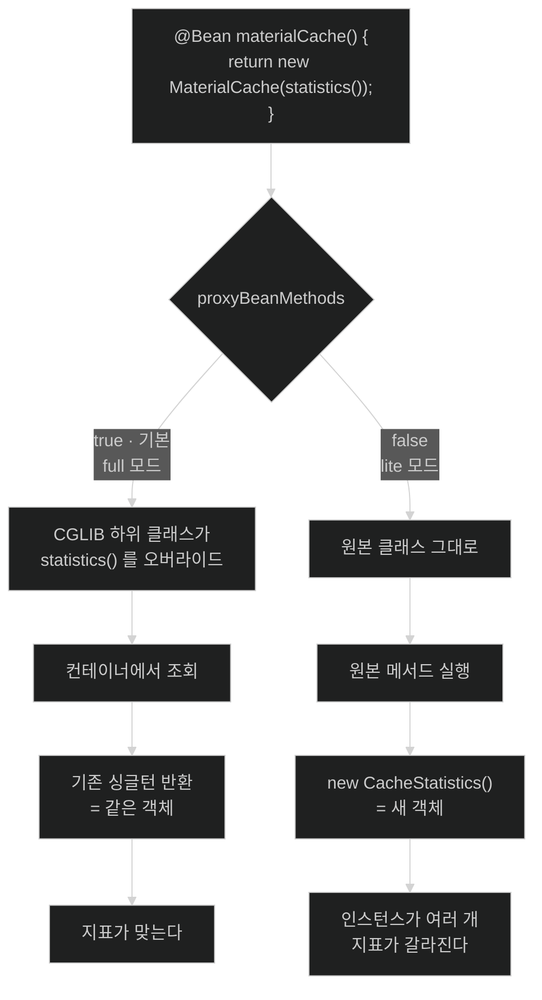

# @Configuration 클래스도 프록시다 — full 모드와 lite 모드

## 한눈에 보기

| 질문 | 핵심 답 |
|---|---|
| `@Bean` 메서드가 다른 `@Bean` 메서드를 부르면? | full 모드에서는 **가로채여 싱글턴이 반환**된다. 평범한 호출이 아니다. |
| 왜 가로채나? | 같은 `@Bean` 메서드가 자바 메서드 호출로 실수로 실행되는 것을 막기 위해서다. |
| 어떻게 가로채나? | `@Configuration` 클래스 자체를 **CGLIB 하위 클래스로 바꾼다.** |
| `proxyBeanMethods = false`면? | 강화가 사라지고 **평범한 메서드 호출이 되어 매번 새 인스턴스**가 만들어진다. |
| 그럼 왜 끄나? | CGLIB 하위 클래스 생성 오버헤드와 메모리를 줄이기 위해서다. |
| 끄면 무엇을 지켜야 하나? | **[[인터-빈-참조]]를 쓰지 않는다.** 필요한 빈은 메서드 인자로 받는다. |

## 1. 왜 이게 필요한가

### 출발 장면: 싱글턴이어야 할 객체가 두 개다

캐시 설정을 이렇게 썼다. 시작 시간을 줄이려고 `proxyBeanMethods = false`를 붙였다.

```java
@Configuration(proxyBeanMethods = false)
public class CatalogCacheConfig {

    @Bean
    public CacheStatistics statistics() {
        return new CacheStatistics();          // 히트/미스를 세는 상태 객체
    }

    @Bean
    public MaterialCache materialCache() {
        return new MaterialCache(statistics());   // ← 직접 호출
    }

    @Bean
    public SubstanceCache substanceCache() {
        return new SubstanceCache(statistics());  // ← 직접 호출
    }
}
```

운영에 올리고 나서 지표가 이상하다. `/actuator/metrics`로 노출한 캐시 히트율이 **실제의 절반 이하**로 나온다. `MaterialCache`가 기록한 히트가 지표에 안 잡힌다.

디버깅해 보면 `CacheStatistics` 인스턴스가 **세 개**다. 컨테이너에 등록된 것 하나, `MaterialCache`가 들고 있는 것 하나, `SubstanceCache`가 들고 있는 것 하나. 지표를 노출하는 쪽은 컨테이너에 등록된 것을 읽는데, 그건 아무도 기록하지 않는 빈 객체다.

`proxyBeanMethods = false`를 지우면 세 참조가 전부 같은 객체가 된다. **애노테이션 속성 하나가 싱글턴 보장을 껐다.**

### 여기서 뭐가 무너지나

`statistics()`는 자바 메서드다. 평범하게 부르면 `return new CacheStatistics()`가 실행되어 **새 객체가 나온다.** 그게 자바의 정상 동작이다.

그런데 `@Configuration` 기본 상태에서는 그렇게 동작하지 않는다. Spring이 `@Configuration` 클래스를 **CGLIB 하위 클래스로 바꿔** `@Bean` 메서드를 전부 오버라이드해 두었기 때문이다. 오버라이드된 `statistics()`는 `new`를 실행하는 대신 **"이 이름의 빈이 컨테이너에 이미 있으면 그걸 돌려준다"**로 동작한다.

이것이 **[[설정-클래스-강화]]**(= `@Configuration` 클래스를 CGLIB 하위 클래스로 바꿔 `@Bean` 메서드 호출을 가로채는 것)다. 공식 문서는 목적을 이렇게 적는다 — `@Bean` 메서드를 `@Configuration` 클래스 안에 선언하면 완전한 설정 클래스 처리가 적용되어 **메서드 간 참조가 컨테이너의 생명주기 관리로 리다이렉트**되며, 이는 *"같은 `@Bean` 메서드가 평범한 자바 메서드 호출을 통해 실수로 호출되는 것을 막아, 추적하기 어려운 미묘한 버그를 줄인다."*

`proxyBeanMethods = false`는 그 강화를 끈다. 그러면 `statistics()`는 정말로 평범한 자바 메서드가 되고, 공식 문서 표현대로 *"컨테이너에 가로채이지 않으며 따라서 평범한 메서드 호출처럼 동작해, 해당 빈의 기존 싱글턴(또는 스코프) 인스턴스를 재사용하는 대신 매번 새 인스턴스를 만든다."*

비유하자면 **회사 대표번호와 개인 휴대폰**이다. 대표번호로 "회계 담당자"를 찾으면 교환원이 항상 같은 담당자에게 연결한다(full 모드). 그런데 교환원을 없애면(lite 모드) "회계 담당자"라고 외칠 때마다 **새 직원을 채용해서 데려온다.** 매번 다른 사람이고, 앞사람이 처리한 내용을 모른다.

→ 비유가 깨지는 지점: 새 직원을 채용하면 누구나 이상하다는 걸 알아챈다. 새 `CacheStatistics`는 **아무도 못 알아챈다.** 타입이 맞고, `null`도 아니고, 메서드도 다 동작한다. 그저 다른 객체일 뿐이다. 그래서 이 버그는 지표가 이상하다는 형태로 한참 뒤에 드러난다.

### 그래서 나온 생각

강화에는 대가가 있다. 클래스마다 CGLIB 하위 클래스를 만들면 시작 시간과 메모리를 쓴다. 설정 클래스가 수백 개인 Spring Boot 애플리케이션에서는 무시할 수 없다. 그래서 Spring은 **강화를 켤지 끌지를 선택하게 하고**, 끈 경우에는 [[인터-빈-참조]]를 쓰지 않는 다른 작성 규칙을 요구한다.

## 2. 어떻게 동작하는가

### 2.1 두 모드의 경계

공식 문서가 정의하는 구분이다.

| | full 모드 | [[라이트-모드]] |
|---|---|---|
| 조건 | `@Configuration` (기본 `proxyBeanMethods = true`) | `@Configuration(proxyBeanMethods = false)`, 또는 `@Bean`이 `@Configuration` 아닌 클래스(`@Component` 등)에 있을 때 |
| CGLIB 하위 클래스 | 생성됨 | **생성 안 됨** |
| `@Bean` 메서드 직접 호출 | 가로채여 싱글턴 반환 | 평범한 호출 — 새 인스턴스 |
| 오버헤드 | 클래스당 하위 클래스 생성 | 없음 |
| 문서의 성격 규정 | 완전한 설정 클래스 처리 | *"특별한 런타임 처리 없는 범용 팩터리 메서드 메커니즘"* |

**"`@Bean`이 `@Configuration` 아닌 클래스에 있을 때"도 lite 모드**라는 점을 놓치기 쉽다. `@Component`에 `@Bean` 메서드를 쓰면 그것만으로 이미 lite 모드다.

### 2.2 강화가 일어나는 순서

1. **`@Configuration`이 붙은 클래스의 빈 정의가 등록된다.** — 설정 클래스도 결국 빈이기 때문이다.
2. **설정 클래스 후처리기가 `proxyBeanMethods` 값을 확인한다.** — 강화 여부를 결정해야 하기 때문이다.
3. **`true`면 그 클래스를 상속한 CGLIB 하위 클래스를 만들고 빈 정의의 클래스를 그것으로 교체한다.** — `@Bean` 메서드를 오버라이드해야 호출을 가로챌 수 있기 때문이다.
4. **하위 클래스의 각 `@Bean` 메서드는 "컨테이너에 이 빈이 있으면 그걸 반환, 없으면 원본 메서드 실행"으로 동작한다.** — 같은 이름의 빈이 두 번 만들어지지 않게 하기 위해서다.
5. **설정 클래스 인스턴스(=강화된 하위 클래스)가 만들어지고 `@Bean` 메서드가 호출되어 빈들이 등록된다.** — 팩터리 메서드가 실행돼야 실제 빈이 생기기 때문이다.

**3번이 [[03-why-final-private-and-self-invocation-break]]의 제약을 그대로 물려받는다.** 상속해야 하므로 `@Configuration` 클래스는 `final`이면 안 되고, `@Bean` 메서드도 `final`·`private`이면 오버라이드되지 않아 가로채기가 안 된다.

### 2.3 lite 모드에서 지켜야 하는 작성 규칙

강화를 끄면 코드 작성 방식도 바꿔야 한다. 공식 문서가 방침을 명시한다 — 런타임 프록시가 없는 클래스의 `@Bean` 메서드는 *"애초에 인터-빈 의존성을 선언하도록 의도된 것이 아니며"*, 대신 자기가 속한 컴포넌트의 필드나 **팩터리 메서드가 선언한 인자(자동 주입된 협력자)**로 동작해야 한다.

```java
@Configuration(proxyBeanMethods = false)
public class CatalogCacheConfig {

    @Bean
    public CacheStatistics statistics() {
        return new CacheStatistics();
    }

    @Bean
    public MaterialCache materialCache(CacheStatistics statistics) {   // ← 인자로 받는다
        return new MaterialCache(statistics);
    }

    @Bean
    public SubstanceCache substanceCache(CacheStatistics statistics) { // ← 인자로 받는다
        return new SubstanceCache(statistics);
    }
}
```

**메서드 인자로 받으면 컨테이너가 주입해 주므로 항상 같은 싱글턴이다.** 강화가 필요 없다. 그래서 이 형태는 두 모드 어디서나 옳게 동작한다 — full 모드에서 굳이 인자 주입을 쓰지 못할 이유도 없다.

정리하면 규칙은 하나다. **`@Bean` 메서드 안에서 다른 `@Bean` 메서드를 호출하지 않는다.** 그러면 `proxyBeanMethods` 값이 무엇이든 코드가 같게 동작한다.

### 2.4 Spring Boot가 lite 모드를 쓰는 이유

Spring Boot의 자동 구성 클래스들은 `@AutoConfiguration`을 쓰는데, 이 애노테이션은 `@Configuration(proxyBeanMethods = false)`를 메타 애노테이션으로 포함한다.

이유가 규모에 있다. 애플리케이션 하나가 수십~수백 개의 자동 구성 클래스를 평가하는데, 그 전부에 CGLIB 하위 클래스를 만들면 시작 시간과 메모리가 누적된다. 공식 문서 표현으로 lite 모드의 *"긍정적 부수 효과는 런타임에 CGLIB 하위 클래스를 적용할 필요가 없어 오버헤드와 메모리 사용이 줄어든다는 것"*이다.

네이티브 이미지에서는 더 직접적인 이득이 있다. Boot 문서가 적듯 CGLIB 프록시 클래스는 네이티브 이미지에서 **빌드 시점에 생성돼야** 하므로, 애초에 만들 필요가 없으면 그만큼 단순해진다.

**우리가 쓰는 애플리케이션 설정 클래스에는 이 논리가 그대로 적용되지 않는다.** 클래스가 몇 개뿐이라면 강화 비용이 미미하고, 반대로 실수의 대가는 출발 장면처럼 크다. 기본값(full)을 유지하는 편이 안전하다.

### 2.5 이름의 유래

- **full / lite**는 "설정 클래스 처리를 얼마나 완전하게 하는가"를 뜻한다. full은 메서드 호출 가로채기까지 포함한 완전한 처리, lite는 `@Bean` 메서드를 팩터리 메서드로만 인식하는 가벼운 처리다.
- **`proxyBeanMethods`**는 문자 그대로 "빈 메서드를 프록시할 것인가"다. 속성 이름 자체가 이 문서 전체를 요약하고 있다 — 가로채기의 정체가 프록시라는 것.

## 3. 그림으로 보기

### 같은 코드, 두 결과



### 인스턴스가 몇 개인가

```text
[full 모드 — proxyBeanMethods = true]

  컨테이너
    └─ statistics 빈 ──┬──────────────┬──────────────┐
       CacheStatistics │              │              │
       (단 하나)        ▼              ▼              ▼
                  MaterialCache  SubstanceCache  지표 노출
                                                     ↑
                    셋 다 같은 객체를 본다 ────────────┘


[lite 모드 — proxyBeanMethods = false + 직접 호출]

  컨테이너
    └─ statistics 빈  ──────────────────────────▶ 지표 노출
       CacheStatistics#1                          (아무도 기록 안 함)

    MaterialCache  ──▶ CacheStatistics#2   ← 여기에 기록됨
    SubstanceCache ──▶ CacheStatistics#3   ← 여기에 기록됨

  → 타입도 맞고 null 도 아니고 메서드도 다 동작한다.
    "다른 객체"라는 사실만 다르다. 그래서 조용히 틀린다.


[lite 모드 + 메서드 인자 주입 — 올바른 작성법]

  컨테이너
    └─ statistics 빈 ──┬──────────────┬──────────────┐
       CacheStatistics │  주입         │  주입        │
       (단 하나)        ▼              ▼              ▼
                  MaterialCache  SubstanceCache  지표 노출

  → 강화 없이도 싱글턴이 보장된다. 두 모드 모두에서 옳다.
```

## 4. 이 노트에 나온 용어

| 용어 | 한 줄 풀이 | 자세히 |
|---|---|---|
| 설정 클래스 강화 | `@Configuration` 클래스를 CGLIB 하위 클래스로 바꿔 `@Bean` 호출을 가로채는 것 | [[_glossary#설정-클래스-강화]] |
| 인터 빈 참조 | 한 `@Bean` 메서드가 같은 클래스의 다른 `@Bean` 메서드를 직접 호출하는 것 | [[_glossary#인터-빈-참조]] |
| 라이트 모드 | `@Bean` 메서드가 CGLIB 강화 없이 처리되는 모드 | [[_glossary#라이트-모드]] |

## 5. 자주 헷갈리는 것

### AOP 프록시와 설정 클래스 강화는 다른 것이다

같은 CGLIB를 쓰지만 목적도 판정 경로도 다르다.

| 축 | AOP 프록시 ([[02-advisor-pointcut-and-auto-proxy-creation]]) | 설정 클래스 강화 |
|---|---|---|
| 목적 | 횡단 관심사 삽입(트랜잭션·캐시) | `@Bean` 메서드의 싱글턴 보장 |
| 대상 판정 | [[포인트컷]] 평가 | `@Configuration` 애노테이션 유무 |
| 만드는 주체 | 자동 프록시 생성기(빈 후처리기) | 설정 클래스 후처리기 |
| 끄는 방법 | 애노테이션 제거 | `proxyBeanMethods = false` |
| 공통점 | **둘 다 CGLIB 상속** → `final` 불가 | 같음 |

마지막 행이 요점이다. 목적이 달라도 물리적 수단이 같아서 제약도 같다.

### `@Component`의 `@Bean`은 이미 lite 모드다

`proxyBeanMethods`를 명시하지 않았어도 그렇다. `@Configuration`이 아닌 클래스에 `@Bean`을 쓰면 강화가 없다. `@Component`에 `@Bean` 메서드를 두고 그 안에서 다른 `@Bean` 메서드를 부르면 출발 장면과 같은 문제가 난다.

### 인자 주입은 full 모드에서도 옳다

"full 모드니까 직접 호출해도 된다"는 맞지만, **인자 주입으로 쓰면 모드에 무관하게 옳다.** 나중에 누군가 `proxyBeanMethods = false`를 붙여도 안전하다. 습관으로 인자 주입을 쓰는 편이 낫다.

### `@Bean` 메서드를 `private`으로 만들면

오버라이드할 수 없으므로 full 모드에서도 가로채기가 안 된다([[03-why-final-private-and-self-invocation-break]]과 같은 이유). Spring 6.x부터 `private` `@Bean` 메서드 자체는 lite 모드에서 지원되지만, full 모드의 가로채기는 여전히 불가능하다. 헷갈릴 여지를 만들지 않는 것이 낫다.

## 6. 언제 안 쓰나 / 경계

- **애플리케이션 설정 클래스에 습관적으로 `proxyBeanMethods = false`를 붙이지 않는다.** 클래스 몇 개의 강화 비용은 미미하고, 실수의 대가는 조용한 버그다. 라이브러리·스타터를 만들거나 시작 시간을 실제로 측정해 문제를 확인했을 때만 끈다.
- **`@Bean` 메서드끼리 직접 호출하지 않는다.** 인자로 받으면 모드에 무관하게 옳다. 이 규칙 하나면 이 노트의 문제 전체가 사라진다.
- **`@Configuration` 클래스를 `final`로 만들지 않는다.** 상속할 수 없어 강화가 불가능하다. Kotlin에서는 `kotlin-spring` 플러그인을 확인한다.
- **`@Bean` 메서드에 `final`·`private`을 붙이지 않는다.** 오버라이드되지 않아 가로채기가 무효가 된다.
- **`@Configuration` 클래스에 상태를 두지 않는다.** 강화된 하위 클래스 인스턴스가 만들어지므로 [[03-why-final-private-and-self-invocation-break]]의 필드 문제와 같은 혼란이 생길 수 있다. 설정 클래스는 팩터리 메서드의 모음으로만 쓴다.

## 7. 연결

- [[01-jdk-dynamic-proxy-vs-cglib]] — 여기서 쓰이는 것도 그 노트의 CGLIB다. AOP가 아닌 목적에 같은 기술이 쓰이는 사례이며, 그래서 상속 기반 제약을 똑같이 받는다.
- [[03-why-final-private-and-self-invocation-break]] — `final`·`private` 제약이 그대로 적용된다. "상속해서 오버라이드한다"는 한 문장이 여기서도 지배한다.
- [[02-advisor-pointcut-and-auto-proxy-creation]] — 대조 대상이다. 설정 클래스 강화는 포인트컷 평가를 거치지 않는 별도 경로이며, 두 경로를 구분해야 "왜 이 빈이 프록시인가"를 정확히 답할 수 있다.

## 8. 스스로 확인

1. `@Bean` 메서드가 다른 `@Bean` 메서드를 부를 때 full 모드에서 무슨 일이 일어나는가?
2. 그 가로채기를 무엇으로 구현하는가? 그래서 `@Configuration` 클래스에 어떤 제약이 생기는가?
3. `proxyBeanMethods = false`로 바꾸면 정확히 무엇이 달라지는가?
4. 출발 장면에서 `CacheStatistics` 인스턴스가 세 개가 된 경로를 설명할 수 있는가?
5. 이 버그가 조용히 지나가는 이유는 무엇인가?
6. lite 모드에서 공식 문서가 요구하는 작성 방식은?
7. 인자 주입이 두 모드 모두에서 옳은 이유는?
8. Spring Boot 자동 구성이 lite 모드를 쓰는 이유 두 가지는?
9. AOP 프록시와 설정 클래스 강화의 차이 세 가지와 공통점 하나는?
10. `@Component`에 `@Bean` 메서드를 두면 어느 모드인가?


> 열 문항을 스스로 답한 **뒤에** [[_04-configuration-class-cglib-enhancement]]에서 모범답안과 대조한다. 먼저 열면 이 문항들은 다시 인출 문제로 쓸 수 없다.

<!-- ==== 아래는 내 영역 · 스킬 수정 금지 ==== -->

## 내 설명 시도


## 막혔던 지점


## 리뷰 이력
