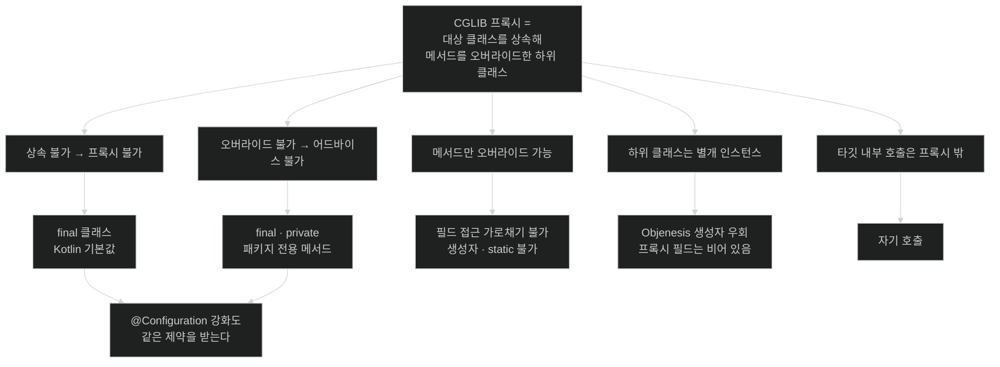

# chapter-c2 개념 지도 — AOP 프록시의 실체

> 목차가 아니라 관계도다. 세션을 열 때와 닫을 때 항상 펼친다.
>
> 이 챕터가 답하는 한 문장짜리 질문: **"`@Transactional`이 붙어 있는데도 동작하지 않는다. 어느 단계에서 끊겼는가?"**

## 축 1: 어드바이스가 실행되기까지 통과해야 하는 네 개의 관문

`@Transactional`이 실제로 트랜잭션을 열려면 **네 관문을 전부** 통과해야 한다. 이 챕터의 노트 넷은 각 관문에 하나씩 대응한다.

```text
  ①  대상 판정            ②  프록시 생성          ③  메서드 매칭        ④  호출 경로
  포인트컷에 걸리는가?    무엇으로 만드나?        오버라이드 가능한가?  프록시를 지나는가?
        │                       │                       │                     │
        ▼                       ▼                       ▼                     ▼
   걸리는 게 없으면        인터페이스 유무 /       final · private       this.method()
   프록시 자체가 없음      Boot 는 CGLIB 고정      → 후보에서 제외        → 프록시 밖
        │                       │                       │                     │
      [02]                    [01]                    [03]                  [03]
```

| 관문 | 실패하면 `getClass()`는 | 진단 단서 |
|---|---|---|
| ① 대상 판정 | **원본 클래스명** | 애노테이션이 실제로 붙었는지 |
| ② 프록시 생성 | `$Proxy142` 또는 `$$SpringCGLIB$$` | 캐스팅 실패·인터페이스 밖 메서드 |
| ③ 메서드 매칭 | `$$SpringCGLIB$$` (프록시는 있음) | `final`·`private`·패키지 전용 |
| ④ 호출 경로 | `$$SpringCGLIB$$` (프록시도 매칭도 정상) | 호출부가 같은 클래스 안인지 |

**③과 ④는 `getClass()`로 구별되지 않는다.** 프록시는 멀쩡히 있는데 그 메서드만 안 걸리거나, 걸렸는데 호출이 그 길로 안 간다. 이 챕터에서 가장 헷갈리는 지점이다.

- **핵심 질문**: 프록시가 없는 문제인가, 있는데 안 지나는 문제인가?

## 축 2: 하나의 문장에서 갈라져 나오는 제약들



**제약 목록을 외우지 않는다.** 루트 문장 하나를 붙들면 전부 유도된다 — 이것이 [[03-why-final-private-and-self-invocation-break]]의 요점이고, [[04-configuration-class-cglib-enhancement]]가 같은 제약을 물려받는 이유다.

- **핵심 질문**: 이 제약은 어느 성질에서 나왔는가?

## 축 3: 같은 CGLIB, 두 가지 목적

같은 기술이 전혀 다른 두 곳에 쓰인다. 섞으면 "왜 이 빈이 프록시인가"에 답할 수 없다.

| 축 | AOP 프록시 | 설정 클래스 강화 |
|---|---|---|
| 목적 | 횡단 관심사 삽입 | `@Bean` 싱글턴 보장 |
| 대상 | 포인트컷에 걸린 빈 | `@Configuration` 클래스 |
| 판정 | [[02-advisor-pointcut-and-auto-proxy-creation]] | 애노테이션 유무 + `proxyBeanMethods` |
| 만드는 주체 | 자동 프록시 생성기(빈 후처리기) | 설정 클래스 후처리기 |
| 끄는 법 | 애노테이션 제거 | `proxyBeanMethods = false` |
| 실패 증상 | 트랜잭션이 안 열림 | 싱글턴이 여러 개 |
| **공통** | **둘 다 상속 기반 → `final` 불가** | 같음 |

- **핵심 질문**: 지금 보는 프록시는 어느 경로로 만들어졌는가?

## 축 4: 조용한 실패 vs 시끄러운 실패

이 챕터의 함정은 대부분 **조용하다.** 그래서 위험도 순서가 직관과 반대다.

| 증상 | 소리 | 발견 시점 | 노트 |
|---|---|---|---|
| `ClassCastException` | **시끄럽다** | 즉시 | [[01-jdk-dynamic-proxy-vs-cglib]] |
| 프록시 자체가 없음 | 조용하다 | 롤백이 안 될 때 | [[02-advisor-pointcut-and-auto-proxy-creation]] |
| `private`·`final` 메서드 무시 | **매우 조용하다** | 데이터가 깨진 뒤 | [[03-why-final-private-and-self-invocation-break]] |
| 자기 호출 | **매우 조용하다** | 데이터가 깨진 뒤 | [[03-why-final-private-and-self-invocation-break]] |
| 프록시 필드가 `0`·`null` | 조용하다 | 값이 이상할 때 | [[03-why-final-private-and-self-invocation-break]] |
| lite 모드 인스턴스 분열 | **매우 조용하다** | 지표가 안 맞을 때 | [[04-configuration-class-cglib-enhancement]] |

**"매우 조용하다"에 해당하는 셋이 이 챕터를 배우는 이유다.** 예외가 나는 문제는 검색하면 나온다. 아무 일도 안 일어나는 문제는 원리를 모르면 영원히 못 찾는다.

- **핵심 질문**: 이 코드가 실패하면 나에게 알려 주는가?

## 나의 취약 엣지

아직 인출 시도가 없다. 사용자가 노트를 읽고 인출 연습을 한 뒤 채운다. 추정으로 미리 채우지 않는다.

## 앞 챕터에서 이어지는 곳

| c1의 결론 | 이 챕터에서의 전개 |
|---|---|
| 프록시는 `postProcessAfterInitialization`에서 씌워진다 | 그 시점에 **무엇을** 만드는가 — JDK냐 CGLIB냐 |
| 자동 프록시 생성기가 대상을 "찾는다" | 무엇을 보고 찾는가 — 어드바이저의 포인트컷 평가 |
| 후처리기가 참조하는 빈은 프록시를 못 받는다 | 그래서 `@Aspect` 자신도 어드바이스 대상이 아니다 |
| `@PostConstruct`의 `this`는 원본이다 | 왜 원본인지 — 프록시는 별개 인스턴스이기 때문 |
| `@Configuration`도 빈 정의를 만드는 경로다 | 그 클래스 자신이 CGLIB로 교체된다 |

## 이 챕터에서 이어지는 곳

| 이 챕터의 결론 | 다음 챕터에서의 전개 |
|---|---|
| Spring AOP의 조인 포인트는 메서드 실행뿐이다 | **c3** — 그럼 HTTP 요청 단위의 개입은 어디서 하는가(필터·인터셉터) |
| 컨트롤러도 프록시가 될 수 있다 | **c3** — 그 프록시가 핸들러 매핑·인자 해석과 어떻게 얽히는가 |
| `@AutoConfiguration`은 lite 모드다 | **c4** — 자동 구성 클래스가 왜 그렇게 설계됐는가 |
| 포인트컷 평가는 빈 생성 시점에 한 번뿐이다 | **c4** — 조건 평가도 같은 "한 번뿐" 성질을 갖는다 |

## 관련 카테고리

- `part-0-spring-core-internals/chapter-c1-container-lifecycle` — 프록시가 **언제** 씌워지는지가 거기 있다. c1 없이 이 챕터를 읽으면 "왜 하필 그 시점인가"가 빈다.
- `part-0-jpa-foundations/chapter-j3-performance-and-transactions` — `03-transactional-propagation-and-proxy-limits`가 같은 자기 호출을 **트랜잭션 증상** 쪽에서 다룬다. 이 챕터는 **생성 방식** 쪽에서 다룬다. 증상에서 출발하면 그쪽, 원인에서 출발하면 이쪽이다.
- `part-1-the-basics-of-spring-boot/chapter-1-core-features-of-spring-boot` — 책의 `@Bean`·`@Configuration` 예제가 실제로는 강화된 클래스에서 돈다는 사실이 [[04-configuration-class-cglib-enhancement]]에 있다.
- `part-3/chapter-8-going-native-with-spring-boot` — 네이티브 이미지에서 CGLIB 프록시가 빌드 시점에 생성돼야 한다는 제약이 이 챕터의 내용과 직접 이어진다.
