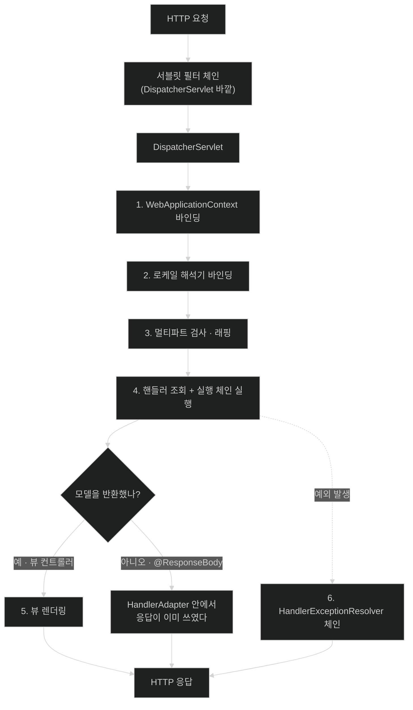

# DispatcherServlet — 모든 요청이 지나는 하나의 문

## 한눈에 보기

| 질문 | 핵심 답 |
|---|---|
| 요청 하나에 서블릿이 몇 개 관여하나? | **보통 하나다.** `DispatcherServlet`이 전부 받는다. |
| 그럼 컨트롤러는 서블릿인가? | 아니다. 서블릿은 하나뿐이고 컨트롤러는 그 서블릿이 **찾아서 호출하는 대상**이다. |
| 왜 하나로 모았나? | 모든 요청에 공통인 뼈대를 한 곳에 두고, 달라지는 부분만 위임하기 위해서다. |
| 위임 대상은 어떻게 정해지나? | 정해진 **[[특수-빈-타입]]**을 컨텍스트에서 찾는다. 없으면 Boot 자동 구성이 기본값을 넣는다. |
| 그래서 커스터마이징은? | 그 타입의 빈을 등록하면 그 단계만 바뀐다. |
| 요청 처리 순서는 몇 단계인가? | 공식 문서 기준 **6단계**. 컨텍스트 바인딩 → 로케일 → 멀티파트 → 핸들러 → 뷰 → 예외. |

## 1. 왜 이게 필요한가

### 출발 장면: 컨트롤러를 30개 만들었는데 서블릿은 하나다

애플리케이션에 컨트롤러가 서른 개 있다. 그런데 시작 로그를 보면 서블릿은 하나만 등록된다.

```text
o.s.b.w.embedded.tomcat.TomcatWebServer  : Tomcat initialized with port 8080 (http)
o.s.web.servlet.DispatcherServlet        : Initializing Servlet 'dispatcherServlet'
o.s.web.servlet.DispatcherServlet        : Completed initialization in 1 ms
```

`/materials`로 요청하든 `/companies/42`로 요청하든 **같은 서블릿이 받는다.** 서블릿 매핑은 `/`이고, 그 아래 모든 경로가 이 하나로 들어온다.

여기서 자연스러운 질문이 생긴다. 서블릿이 하나뿐이라면, `@GetMapping("/materials")`이 붙은 그 메서드는 대체 **누가 언제 부르는가?**

### 여기서 뭐가 무너지나

컨트롤러가 서블릿이라고 생각하면 설명이 안 되는 것들이 줄줄이 나온다.

- 컨트롤러 메서드의 시그니처가 제각각이다. 서블릿이라면 `service(HttpServletRequest, HttpServletResponse)` 하나로 고정돼야 한다.
- 반환값이 `String`일 때 어떤 경우엔 뷰 이름이고 어떤 경우엔 응답 본문이다. 서블릿에는 반환값 자체가 없다.
- 예외를 던지면 누군가 잡아서 JSON 오류 응답으로 바꿔 준다. 서블릿이라면 그냥 500이 나가야 한다.

이 셋은 전부 **컨트롤러와 서블릿 컨테이너 사이에 무언가가 끼어 있다**는 증거다. 그 무언가가 `DispatcherServlet`이고, 컨트롤러 메서드는 서블릿이 아니라 그것이 호출하는 **평범한 자바 메서드**다.

만약 이 중간층이 없다면, 컨트롤러마다 다음을 직접 해야 한다 — 경로 매칭, 쿼리 파라미터 파싱, JSON 역직렬화, 응답 직렬화, 상태 코드 결정, 예외 처리, 인코딩 설정. **서른 개 컨트롤러에 같은 코드가 서른 번 복사된다.**

### 그래서 나온 생각

공통 뼈대를 하나의 서블릿에 모으고, 요청마다 달라지는 부분만 갈아 끼울 수 있게 한다. 공식 문서가 Spring MVC의 설계를 이렇게 규정한다 — *"Spring MVC는 다른 많은 웹 프레임워크처럼 **[[프런트-컨트롤러]]** 패턴을 중심으로 설계됐다. 중앙 `Servlet`인 `DispatcherServlet`이 **요청 처리를 위한 공유 알고리즘**을 제공하고, 실제 작업은 설정 가능한 위임 컴포넌트들이 수행한다."*

쉽게 말하면 **건물의 안내 데스크**다. 방문객은 전부 로비의 한 창구로 들어온다. 안내원은 용건별 담당 부서를 알지 못해도 된다 — 방문 목적을 보고 부서 목록에서 찾아 연결하기만 하면 된다. 부서가 늘어나도 안내 절차는 그대로다.

→ 비유가 깨지는 지점: 안내원은 방문객을 연결한 뒤 손을 뗀다. `DispatcherServlet`은 **끝까지 관여한다** — 담당자가 낸 결과물을 받아 응답 형식으로 바꾸고, 담당자가 사고를 치면(예외) 그것까지 수습한다. 연결이 아니라 **전 과정의 진행**을 맡는다는 점에서 안내 데스크보다 훨씬 많은 일을 한다.

## 2. 어떻게 동작하는가

### 2.1 요청 하나가 지나가는 6단계

공식 문서가 제시하는 처리 순서다.

1. **`WebApplicationContext`를 찾아 요청 속성으로 바인딩한다.** 기본 키는 `DispatcherServlet.WEB_APPLICATION_CONTEXT_ATTRIBUTE`다. — 처리 과정의 컨트롤러와 다른 요소들이 컨테이너에 접근할 수 있어야 하기 때문이다.
2. **로케일 해석기를 요청에 바인딩한다.** — 뷰 렌더링·데이터 준비 등에서 어떤 로케일을 쓸지 각 요소가 결정할 수 있어야 하기 때문이다. 문서는 로케일 해석이 필요 없으면 이 해석기도 필요 없다고 덧붙인다.
3. **멀티파트 해석기가 있으면 요청에 멀티파트가 있는지 검사한다.** 있으면 요청을 `MultipartHttpServletRequest`로 감싼다. — 뒤따르는 요소들이 파일 파트를 일반 파라미터처럼 다룰 수 있어야 하기 때문이다.
4. **적절한 [[핸들러]]를 찾는다.** 찾으면 그 핸들러와 연결된 **[[실행-체인]]**(전처리기·후처리기·컨트롤러)이 실행되어 렌더링할 모델을 준비한다. — 요청마다 실행할 코드가 다르므로 그 대상을 먼저 결정해야 하기 때문이다.
5. **모델이 반환되면 뷰를 렌더링한다.** 모델이 없으면 렌더링하지 않는다. — 전·후처리기가 요청을 가로챘다면(예: 보안상 이유) 요청이 이미 완료됐을 수 있기 때문이다.
6. **`WebApplicationContext`에 선언된 [[예외-해석기]]들이 처리 중 발생한 예외를 해석한다.** — 예외를 그대로 컨테이너로 올려보내면 프레임워크가 제어할 수 없는 오류 페이지가 나가기 때문이다.

**4단계에 결정적인 단서가 붙어 있다.** 문서는 *"애노테이션 컨트롤러의 경우 뷰를 반환하는 대신 (`HandlerAdapter` 안에서) 응답이 렌더링될 수 있다"*고 적는다. 즉 `@RestController`를 쓰면 5단계의 뷰 렌더링을 아예 거치지 않고 4단계 안에서 응답이 완성된다. 이 사실이 [[05-exception-resolution-and-filter-vs-interceptor]]에서 다루는 `postHandle` 함정의 원인이다.

### 2.2 무엇을 위임하는가 — 특수 빈 타입

`DispatcherServlet`이 위임 대상을 찾는 방식은 **타입 기반**이다. 정해진 인터페이스를 구현한 빈을 컨텍스트에서 찾는다. 그 목록이 **[[특수-빈-타입]]**(= `DispatcherServlet`이 자기 일을 위임하기 위해 컨텍스트에서 찾는 정해진 타입의 빈들)이다.

| 타입 | 공식 문서의 책임 | 이 챕터의 어디 |
|---|---|---|
| `HandlerMapping` | 요청을 핸들러에, 전·후처리를 위한 인터셉터 목록과 함께 매핑 | [[02-handlermapping-and-handleradapter]] |
| `HandlerAdapter` | 핸들러가 실제로 어떻게 호출되는지와 무관하게 `DispatcherServlet`이 핸들러를 호출하도록 도움 | [[02-handlermapping-and-handleradapter]] |
| `HandlerExceptionResolver` | 예외를 해석해 핸들러·오류 뷰·기타 대상에 매핑 | [[05-exception-resolution-and-filter-vs-interceptor]] |
| `ViewResolver` | 핸들러가 반환한 논리적 뷰 이름을 실제 `View`로 해석 | [[03-argument-resolvers-and-return-value-handlers]] |
| `LocaleResolver`, `LocaleContextResolver` | 클라이언트의 `Locale`과 시간대를 해석해 국제화된 뷰 제공 | — |
| `MultipartResolver` | 멀티파트 요청(브라우저 파일 업로드 등) 파싱 추상화 | — |
| `FlashMapManager` | 리다이렉트를 가로질러 속성을 전달하는 `FlashMap` 저장·조회 | — |

**이 표가 곧 Spring MVC의 확장 지점 목록이다.** 동작을 바꾸고 싶으면 해당 타입의 빈을 등록한다. 등록하지 않으면 Boot의 자동 구성이 기본 구현을 넣는다 — 우리가 아무 설정 없이도 웹 애플리케이션을 쓸 수 있는 이유다.

### 2.3 "공유 알고리즘"이라는 표현의 무게

공식 문서의 *"shared algorithm"*은 정확한 단어 선택이다. 6단계 뼈대는 **모든 요청에 대해 항상 같고**, 요청마다 달라지는 것은 각 단계에서 어떤 구현체가 선택되는지뿐이다.

이 설계가 주는 것이 셋이다.

- **일관성.** 모든 엔드포인트가 같은 순서로 처리된다. `@RestController`든 뷰를 반환하는 컨트롤러든 4단계까지는 동일하다.
- **횡단 관심사의 자리.** 로깅·인증·트랜잭션을 끼울 지점이 정해져 있다. 컨트롤러마다 넣을 필요가 없다.
- **교체 가능성.** 단계마다 인터페이스가 있으므로 한 단계만 바꿔 끼울 수 있다.

대가도 있다. **호출 스택이 깊어지고**, 디버깅할 때 내 코드가 아닌 프레임워크 프레임을 여럿 지나야 한다. 이 챕터가 그 프레임들의 이름을 알려 주는 것이 실질적인 값어치다.

### 2.4 이름의 유래

**Dispatch**는 "발송하다·파견하다"라는 뜻이다. 들어온 요청을 받아 적절한 처리자에게 **파견**한다는 동작이 그대로 이름이 됐다. 서블릿 명세의 `RequestDispatcher`와 같은 어원이며, 실제로 서블릿 컨테이너가 오류 처리를 위해 하는 것도 "ERROR dispatch"다.

**Front controller**의 "front"는 건물 정면, 즉 **모든 출입이 지나는 앞면**이다. 뒤쪽에 여러 방이 있어도 문은 하나라는 구조를 가리킨다.

## 3. 그림으로 보기

### 요청 하나의 전체 경로



### 서블릿은 하나, 컨트롤러는 여럿

```text
[서블릿 컨테이너가 보는 그림]

   Tomcat
     └── 서블릿 매핑 "/"  ──▶  DispatcherServlet   ← 서블릿은 이것 하나뿐


[DispatcherServlet 안에서 벌어지는 일]

   DispatcherServlet
     │
     ├── HandlerMapping 에게 묻는다: "이 경로의 핸들러는?"
     │      └─▶ MaterialController#findAll  (평범한 자바 메서드)
     │
     ├── HandlerAdapter 에게 맡긴다: "이걸 실행해 줘"
     │      └─▶ 인자 해석 → 메서드 호출 → 반환값 처리
     │
     └── 예외가 나면 HandlerExceptionResolver 체인

   MaterialController      CompanyController      SubstanceController
   RecipeController        AuditController        ... 30개
        │
        └── 전부 서블릿이 아니다. 컨테이너는 이들의 존재를 모른다.


  → "dispatch(파견)"라는 이름 그대로다. 요청을 받는 창구는 하나이고,
    그 창구가 매번 다른 담당자에게 파견한다. 담당자가 늘어나도
    창구의 절차(6단계)는 바뀌지 않는다.
```

## 4. 이 노트에 나온 용어

| 용어 | 한 줄 풀이 | 자세히 |
|---|---|---|
| 프런트 컨트롤러 | 모든 요청을 하나의 중앙 진입점이 받아 공통 알고리즘을 수행하고 실제 처리는 위임하는 패턴 | [[_glossary#프런트-컨트롤러]] |
| 특수 빈 타입 | `DispatcherServlet`이 일을 위임하기 위해 컨텍스트에서 찾는 정해진 타입의 빈들 | [[_glossary#특수-빈-타입]] |

## 5. 자주 헷갈리는 것

### 컨트롤러는 서블릿이 아니다

| 축 | 서블릿 | 컨트롤러 |
|---|---|---|
| 등록 주체 | 서블릿 컨테이너 | Spring 컨테이너(빈) |
| 개수 | 보통 하나(`DispatcherServlet`) | 여럿 |
| 시그니처 | 고정 | **자유** |
| 반환값 | 없음 | 있음 — 뷰 이름·객체·`ResponseEntity` 등 |
| 컨테이너가 아는가 | 안다 | **모른다** |

이 표의 세 번째·네 번째 행이 이 챕터 전체의 이유다. 자유로운 시그니처와 반환값을 가능하게 하는 층이 [[03-argument-resolvers-and-return-value-handlers]]다.

### `@RestController`는 5단계를 건너뛴다

뷰 렌더링(5단계)이 일어나는 것은 모델이 반환됐을 때뿐이다. `@ResponseBody`·`ResponseEntity`는 4단계 안에서 응답을 완성하므로 `ViewResolver`가 아예 관여하지 않는다. **REST API만 만든다면 5단계는 평생 안 쓴다.**

### 서블릿 컨테이너 vs Spring 컨테이너

이름이 둘 다 "컨테이너"라 섞이기 쉽다.

| | 서블릿 컨테이너 | Spring 컨테이너 |
|---|---|---|
| 담는 것 | 서블릿·필터·리스너 | 빈 |
| 예 | Tomcat, Jetty | `ApplicationContext` |
| 이 챕터에서 | `DispatcherServlet`을 실행 | `DispatcherServlet`이 위임 대상을 찾는 곳 |

서블릿 층의 자세한 내용은 `part-0-web-foundations`의 `chapter-w1`이 원본이다.

## 6. 언제 안 쓰나 / 경계

- **`DispatcherServlet`을 직접 상속·수정하지 않는다.** 확장 지점이 [[특수-빈-타입]]으로 이미 열려 있다. 그 타입의 빈을 등록하는 것이 정석이다.
- **6단계를 통과해야만 하는 작업을 필터에 넣지 않는다.** 필터는 `DispatcherServlet` 바깥이라 핸들러가 무엇인지 모른다([[05-exception-resolution-and-filter-vs-interceptor]]).
- **WebFlux에는 이 알고리즘이 적용되지 않는다.** `DispatcherHandler`라는 대응물이 있지만 서블릿 기반이 아니고 실행 모델이 다르다. 두 스택을 섞어 설명하지 않는다.
- **함수형 엔드포인트(`RouterFunction`)는 다른 경로다.** 같은 애플리케이션에 공존할 수 있지만 `@RequestMapping` 기반의 핸들러 매핑과는 별개 메커니즘이다.
- **서블릿을 추가로 등록하는 것이 틀린 것은 아니다.** 레거시 통합이나 특수 프로토콜에는 별도 서블릿이 맞을 수 있다. 다만 그 경로는 `DispatcherServlet`의 6단계를 받지 못한다.

## 7. 연결

- [[02-handlermapping-and-handleradapter]] — 4단계 "적절한 핸들러를 찾는다"가 실제로 어떻게 일어나는지를 다룬다. 이 노트의 뼈대에서 가장 중요한 한 단계의 확대다.
- [[03-argument-resolvers-and-return-value-handlers]] — 컨트롤러 메서드가 서블릿과 달리 자유로운 시그니처를 가질 수 있는 이유가 거기 있다. 5번 표의 세 번째·네 번째 행에 대한 답이다.
- [[05-exception-resolution-and-filter-vs-interceptor]] — 6단계 예외 해석과, 이 파이프라인의 안팎을 가르는 필터·인터셉터의 경계를 다룬다.
- [[04-httpmessageconverter-and-content-negotiation]] — `@RestController`가 5단계를 건너뛰고 4단계 안에서 응답을 완성할 때 실제로 무엇이 그 변환을 하는지가 거기 있다.

## 8. 스스로 확인

1. 컨트롤러가 서른 개인데 서블릿이 하나인 구조를 설명할 수 있는가?
2. "컨트롤러가 서블릿이다"라고 가정하면 설명되지 않는 것 세 가지는?
3. 공식 문서의 처리 6단계를 순서대로 말할 수 있는가?
4. 4단계에 붙은 "애노테이션 컨트롤러는 `HandlerAdapter` 안에서 응답이 렌더링될 수 있다"는 단서가 왜 중요한가?
5. `DispatcherServlet`이 위임 대상을 찾는 방식은 무엇 기반인가? 그것이 커스터마이징과 어떻게 연결되는가?
6. 특수 빈 타입 일곱 개 중 REST API만 만들 때 안 쓰는 것은 무엇인가?
7. "공유 알고리즘"이라는 설계가 주는 이득 셋과 대가 하나는?
8. 서블릿 컨테이너와 Spring 컨테이너를 구분해 설명할 수 있는가?
9. "dispatch"라는 이름이 가리키는 동작은 무엇인가?


> 아홉 문항을 스스로 답한 **뒤에** [[_01-dispatcherservlet-as-front-controller]]에서 모범답안과 대조한다. 먼저 열면 이 문항들은 다시 인출 문제로 쓸 수 없다.

<!-- ==== 아래는 내 영역 · 스킬 수정 금지 ==== -->

## 내 설명 시도


## 막혔던 지점


## 리뷰 이력
