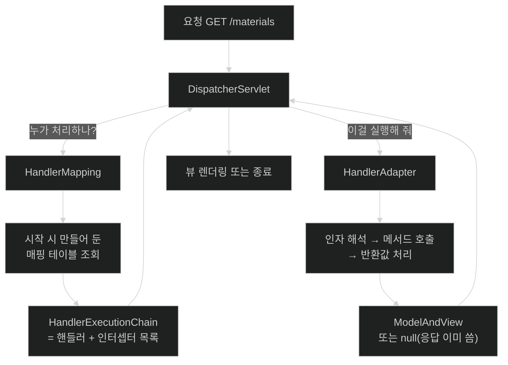

# 핸들러를 찾는 일과 호출하는 일은 다른 일이다

## 한눈에 보기

| 질문 | 핵심 답 |
|---|---|
| 매핑 테이블은 언제 만들어지나? | **시작할 때 한 번.** 요청마다 애노테이션을 다시 읽지 않는다. |
| 그래서 경로가 겹치면? | 첫 요청이 아니라 **기동 시점에** `Ambiguous mapping`으로 실패한다. |
| 왜 찾는 일과 호출하는 일을 나눴나? | `DispatcherServlet`이 **핸들러의 종류를 모르게** 하기 위해서다. |
| [[핸들러-매핑]]이 돌려주는 것은? | 핸들러 하나가 아니라 **핸들러 + 인터셉터 목록**([[실행-체인]])이다. |
| [[핸들러-어댑터]]의 목적은? | 공식 문서 표현으로 **`DispatcherServlet`을 호출 세부 사항으로부터 차단**하는 것. |
| 인터셉터가 적용될지는 누가 정하나? | 컨트롤러가 아니라 **핸들러 매핑**이 정한다. |

## 1. 왜 이게 필요한가

### 출발 장면: 첫 요청도 안 보냈는데 기동이 실패한다

컨트롤러를 나누는 리팩터링 중에 실수로 같은 경로를 두 곳에 뒀다.

```java
@RestController
public class MaterialController {
    @GetMapping("/materials")
    public List<MaterialSummary> findAll() { ... }
}

@RestController
public class MaterialSearchController {
    @GetMapping("/materials")                    // ← 같은 경로
    public List<MaterialSummary> search(...) { ... }
}
```

애플리케이션이 **아예 뜨지 않는다.**

```text
java.lang.IllegalStateException: Ambiguous mapping. Cannot map
'materialSearchController' method
com.cosmoroute.MaterialSearchController#search()
to {GET [/materials]}: There is already 'materialController' bean method
com.cosmoroute.MaterialController#findAll() mapped.
```

여기서 알 수 있는 것이 하나 있다. **`/materials`로 요청을 보내지도 않았는데 충돌을 발견했다.** 요청이 들어올 때 애노테이션을 읽어 판단하는 구조라면 첫 요청에서야 알았을 것이다. 그런데 기동 시점에 터졌다.

즉 **경로 → 메서드 매핑 테이블이 시작할 때 이미 완성돼 있다.**

### 여기서 뭐가 무너지나

요청마다 애노테이션을 읽는 구조를 상상해 보면 왜 그렇게 안 했는지 보인다.

- 요청 하나마다 컨트롤러 서른 개의 메서드 수백 개를 리플렉션으로 훑어야 한다. **처리량이 무너진다.**
- 충돌을 런타임에야 알게 된다. 잘 안 쓰는 경로라면 배포 후 며칠 뒤에 드러난다.
- 어떤 경로들이 존재하는지 목록을 만들 수 없다. Actuator의 매핑 조회, springdoc의 문서 생성이 전부 불가능해진다.

그래서 Spring MVC는 시작할 때 모든 `@RequestMapping`을 스캔해 **매핑 테이블을 한 번 만들고**, 요청이 오면 그 테이블을 조회한다. c1·c2에서 본 "판정은 시작할 때 한 번뿐"이라는 패턴이 여기서도 반복된다.

그런데 핸들러를 찾았다고 끝이 아니다. 찾은 것을 **실행**해야 하는데, 여기가 두 번째 문제다.

```java
// 이것도 핸들러다
@GetMapping("/materials")
public List<MaterialSummary> findAll(@RequestParam int page) { ... }

// 이것도 핸들러다 (정적 리소스)
ResourceHttpRequestHandler

// 이것도 핸들러다 (함수형)
RouterFunction
```

셋의 **호출 방법이 전부 다르다.** 첫 번째는 애노테이션을 해석해 인자를 채워 넣어야 하고, 두 번째는 파일을 찾아 스트림으로 쓰면 되고, 세 번째는 함수를 적용하면 된다.

`DispatcherServlet`이 이 셋을 전부 알아야 한다면, 새로운 종류의 핸들러가 추가될 때마다 `DispatcherServlet`을 고쳐야 한다.

비유하자면 **콜센터의 접수와 처리**다. 접수 담당자는 "이 문의는 요금제 팀 소관"이라는 것만 알면 되고, 요금제 팀이 어떤 시스템에 로그인해 무슨 절차를 밟는지는 몰라도 된다. 팀이 새로 생겨도 접수 절차는 바뀌지 않는다.

→ 비유가 깨지는 지점: 콜센터에서는 접수 담당자가 연결만 하고 빠진다. `DispatcherServlet`은 어댑터를 통해 **결과를 돌려받아** 다음 단계(뷰 렌더링, 예외 해석)를 이어 간다. 위임이지 이관이 아니다.

### 그래서 나온 생각

두 가지를 **다른 인터페이스로 분리**한다. "누가 처리할 것인가"를 답하는 [[핸들러-매핑]]과, "그것을 어떻게 실행할 것인가"를 답하는 [[핸들러-어댑터]]다. `DispatcherServlet`은 둘 다 인터페이스로만 알고, 구체적인 방법은 모른다.

## 2. 어떻게 동작하는가

### 2.1 두 인터페이스의 역할 분담

공식 문서의 정의를 나란히 놓으면 분담이 선명하다.

| | `HandlerMapping` | `HandlerAdapter` |
|---|---|---|
| 공식 문서의 책임 | *"요청을 핸들러에, 전·후처리를 위한 인터셉터 목록과 함께 매핑한다"* | *"핸들러가 실제로 어떻게 호출되는지와 무관하게 `DispatcherServlet`이 요청에 매핑된 핸들러를 호출하도록 돕는다"* |
| 답하는 질문 | **누가** 처리하는가 | **어떻게** 실행하는가 |
| 입력 | HTTP 요청 | 핸들러 객체 + 요청/응답 |
| 출력 | [[실행-체인]] | `ModelAndView` 또는 `null` |
| 주요 구현 | `RequestMappingHandlerMapping`, `SimpleUrlHandlerMapping` | `RequestMappingHandlerAdapter` 등 |

`HandlerAdapter`에 대해 공식 문서는 존재 이유를 직접 밝힌다 — *"예를 들어 애노테이션 컨트롤러를 호출하려면 애노테이션을 해석해야 한다. **`HandlerAdapter`의 주된 목적은 `DispatcherServlet`을 그런 세부 사항으로부터 차단하는 것이다.**"*

**"차단(shield)"이라는 단어가 설계 의도 전부다.** `DispatcherServlet`은 `Object handler`를 들고 있을 뿐 그것이 무엇인지 모르는 채로 어댑터에게 넘긴다.

### 2.2 매핑이 만들어지고 조회되는 순서

1. **시작 시점에 `RequestMappingHandlerMapping`이 모든 빈을 훑는다.** — 어떤 메서드가 요청을 받을 수 있는지 목록이 필요하기 때문이다.
2. **`@Controller`·`@RequestMapping`이 붙은 클래스의 메서드에서 매핑 조건을 추출한다.** 경로, HTTP 메서드, `params`, `headers`, `consumes`, `produces`가 전부 조건이다. — 같은 경로라도 조건이 다르면 다른 핸들러여야 하기 때문이다.
3. **조건 → 메서드 매핑을 테이블에 등록한다. 이때 완전히 같은 조건이 이미 있으면 `Ambiguous mapping`으로 기동을 실패시킨다.** — 어느 쪽을 부를지 결정할 수 없는 상태로 서비스를 시작하면 예측 불가능한 동작이 되기 때문이다.
4. **요청이 오면 테이블에서 조건에 맞는 후보를 찾고, 여럿이면 구체성 순으로 정렬해 가장 잘 맞는 것을 고른다.** — `/materials/{id}`와 `/materials/new`가 둘 다 맞을 때 후자가 이겨야 하기 때문이다.
5. **핸들러와 함께 적용될 인터셉터 목록을 묶어 [[실행-체인]]으로 반환한다.** — 인터셉터는 경로별로 다르게 등록되므로 핸들러가 정해진 뒤에야 결정할 수 있기 때문이다.
6. **`DispatcherServlet`이 그 핸들러를 지원하는 어댑터를 찾는다.** — 핸들러 종류마다 호출 방법이 다르기 때문이다.
7. **어댑터가 핸들러를 실행하고 결과를 `ModelAndView` 또는 `null`로 돌려준다.** — `DispatcherServlet`이 다음 단계(뷰 렌더링·예외 해석)를 이어 가려면 통일된 형태의 결과가 필요하기 때문이다.

**7번의 `null`이 [[01-dispatcherservlet-as-front-controller]]에서 본 "모델이 없으면 뷰를 렌더링하지 않는다"의 정체다.** `@ResponseBody` 핸들러는 어댑터 안에서 응답을 이미 다 썼으므로 돌려줄 모델이 없다.

### 2.3 매핑 조건은 경로만이 아니다

`@RequestMapping`이 받는 속성이 전부 매핑 조건이다.

```java
@GetMapping(value = "/materials", params = "format=summary")
public List<MaterialSummary> summary() { ... }

@GetMapping(value = "/materials", produces = MediaType.APPLICATION_XML_VALUE)
public MaterialList asXml() { ... }
```

두 메서드는 **경로가 같아도 충돌하지 않는다.** 조건이 다르기 때문이다. 반대로 출발 장면의 두 메서드는 경로·HTTP 메서드가 완전히 같아 충돌했다.

`produces`가 조건이라는 사실은 [[04-httpmessageconverter-and-content-negotiation]]과 이어진다 — 클라이언트의 `Accept` 헤더가 **어느 핸들러를 부를지까지** 바꿀 수 있다.

### 2.4 실행 체인 — 인터셉터는 여기서 결정된다

**[[실행-체인]]**(= 핸들러 하나와 그에 적용될 인터셉터 목록을 묶은 것)이 핸들러 매핑의 반환값이라는 점은 자주 놓친다.

이것이 뜻하는 바가 있다. **어떤 인터셉터가 적용될지는 컨트롤러가 정하지 않는다.** 컨트롤러 코드 어디에도 인터셉터에 대한 언급이 없고, 경로 패턴 기준으로 핸들러 매핑이 붙여 준다.

그래서 인터셉터를 디버깅할 때 봐야 할 곳은 컨트롤러가 아니라 **`WebMvcConfigurer`의 `addInterceptors` 등록부**다. 자세한 동작은 [[05-exception-resolution-and-filter-vs-interceptor]]에 있다.

### 2.5 이름의 유래

**Adapter**는 GoF의 어댑터 패턴 그대로다. 서로 맞지 않는 두 인터페이스(`DispatcherServlet`이 원하는 호출 방식 ↔ 각 핸들러의 실제 호출 방식) 사이에 끼워 넣어 변환한다. 전원 어댑터가 콘센트 모양을 바꿔 주듯, 여기서는 **호출 규약**을 바꿔 준다.

**Handler**라는 중립적인 이름을 쓴 것도 의도적이다. "Controller"라고 이름 붙였다면 애노테이션 컨트롤러가 아닌 처리 방식은 이 구조에 들어올 수 없었을 것이다.

## 3. 그림으로 보기

### 찾기와 실행하기의 분리



### 매핑 테이블은 언제 만들어지는가

```text
[시작 시점 — 딱 한 번]

  모든 빈 스캔
    │
    ▼
  @Controller / @RequestMapping 발견
    │
    ▼
  조건 추출: 경로 · HTTP 메서드 · params · headers · consumes · produces
    │
    ▼
  ┌──────────────────────────────────────────────────────┐
  │ 매핑 테이블                                           │
  │  {GET /materials}              → MaterialController#findAll
  │  {GET /materials, params=...}  → MaterialController#summary
  │  {GET /materials/{id}}         → MaterialController#findOne
  │  {POST /materials}             → MaterialController#create
  └──────────────────────────────────────────────────────┘
        ▲
        └── 같은 조건이 두 번 들어오면 여기서 기동 실패
            IllegalStateException: Ambiguous mapping


[요청 시점 — 매번]

  GET /materials?format=summary
        │
        ▼
  테이블 조회 → 조건 맞는 후보들 → 구체성 순 정렬 → 가장 잘 맞는 하나

  → 요청마다 애노테이션을 다시 읽지 않는다.
    c1 의 "빈 정의는 시작할 때 확정된다", c2 의 "포인트컷 평가는
    빈 생성 시 한 번"과 같은 패턴이다 —
    Spring 은 비싼 판정을 시작 시점으로 몰아 두고 런타임에는 조회만 한다.
```

## 4. 이 노트에 나온 용어

| 용어 | 한 줄 풀이 | 자세히 |
|---|---|---|
| 핸들러 | 요청을 실제로 처리할 대상. 컨트롤러 메서드일 수도, 다른 형태일 수도 있다 | [[_glossary#핸들러]] |
| 핸들러 매핑 | 요청을 핸들러와 인터셉터 목록에 매핑하는 전략 | [[_glossary#핸들러-매핑]] |
| 핸들러 어댑터 | `DispatcherServlet`이 호출 방법을 몰라도 되도록 실제 호출을 대신하는 전략 | [[_glossary#핸들러-어댑터]] |
| 실행 체인 | 핸들러 하나와 그에 적용될 인터셉터 목록을 묶은 것 | [[_glossary#실행-체인]] |

## 5. 자주 헷갈리는 것

### 404가 나는 두 가지 원인

| 원인 | 어디서 | 로그 |
|---|---|---|
| 매핑 테이블에 그 조건이 없다 | 핸들러 매핑 | `No mapping for GET /xxx` |
| 핸들러는 찾았는데 리소스가 없다 | 핸들러 내부 | 컨트롤러가 던진 예외 |

앞의 것은 **경로·HTTP 메서드·`produces` 조건**을 봐야 하고, 뒤의 것은 컨트롤러 로직을 봐야 한다. 매핑 목록은 Actuator의 `/actuator/mappings`로 확인할 수 있다.

### 405는 매핑이 "부분적으로" 맞았다는 뜻이다

`POST /materials`에 `GET`만 등록돼 있으면 404가 아니라 **405 Method Not Allowed**가 난다. 경로는 테이블에 있는데 HTTP 메서드 조건이 안 맞았다는 뜻이다. 이 구별이 디버깅에서 유용하다 — **405는 "경로는 맞다"는 신호**다.

**단 405까지만 이 논리가 그대로 간다.** 415·406은 사정이 다르다 — **원인이 둘**이기 때문이다.

| 코드 | 원인 A — 매핑 단계 | 원인 B — 컨버터 단계 |
|---|---|---|
| 415 | `consumes` 조건 불일치 | 요청 `Content-Type`을 **읽을 컨버터가 없음** |
| 406 | `produces` 조건 불일치 | 응답을 **쓸 컨버터가 없음** |

두 원인이 같은 예외(`HttpMediaTypeNotSupportedException`·`HttpMediaTypeNotAcceptableException`)로 수렴해 같은 상태 코드가 나간다. 그래서 **415를 보고 `consumes`만 뒤지면 못 찾는 경우가 있다.**

오히려 공식 문서가 명시하는 쪽은 컨버터다. `DefaultHandlerExceptionResolver`의 javadoc은 415 처리 메서드를 *"PUT 또는 POST된 컨텐츠에 대해 **메시지 컨버터를 찾지 못한** 경우를 처리한다"*로, 406 처리 메서드를 *"클라이언트가 (`Accept` 헤더로 표현한) 요구에 **맞는 메시지 컨버터를 찾지 못한** 경우를 처리한다"*로 적는다.

진단 순서는 **컨버터 먼저, `consumes`/`produces`는 그다음**이 실용적이다. 대부분의 프로젝트에는 `consumes`·`produces` 선언 자체가 없기 때문이다. 컨버터 쪽 상세는 [[04-httpmessageconverter-and-content-negotiation]]에 있다.

### `HandlerMapping`과 `@RequestMapping`은 다른 층이다

이름이 비슷해 섞인다. `@RequestMapping`은 **개발자가 쓰는 선언**이고, `HandlerMapping`은 **그 선언들을 모아 테이블로 만들고 조회하는 전략**이다. `RequestMappingHandlerMapping`이라는 긴 이름이 둘의 관계를 그대로 담고 있다 — "`@RequestMapping`을 다루는 `HandlerMapping`".

### 어댑터가 `null`을 돌려주는 것은 오류가 아니다

`@ResponseBody` 핸들러는 어댑터 안에서 응답을 다 쓰고 `null`을 반환한다. 이것이 정상이며, `DispatcherServlet`은 그때 뷰 렌더링을 건너뛴다.

## 6. 언제 안 쓰나 / 경계

- **같은 경로에 조건 없이 두 메서드를 두지 않는다.** 기동이 실패한다. 다행히 조용하지 않은 실패라 발견은 쉽다.
- **매핑 조건을 지나치게 정교하게 쓰지 않는다.** `params`·`headers` 조건으로 분기를 만들면 어느 메서드가 불릴지 코드만 보고 알기 어려워진다. 대개는 경로를 나누는 편이 읽기 쉽다.
- **`HandlerMapping`·`HandlerAdapter`를 직접 구현할 일은 드물다.** 프레임워크나 통합 라이브러리를 만들 때의 층이다. 애플리케이션에서는 `WebMvcConfigurer`로 충분하다.
- **매핑 테이블이 시작 시 고정된다는 것은 런타임 경로 추가가 안 된다는 뜻이다.** 동적 라우팅이 필요하면 하나의 핸들러 안에서 분기하거나 함수형 라우팅을 고려한다.
- **인터셉터 적용 여부를 컨트롤러에서 찾지 않는다.** 등록부(`addInterceptors`)에 있다.

## 7. 연결

- [[01-dispatcherservlet-as-front-controller]] — 이 노트는 그 6단계 중 4단계 하나를 확대한 것이다. `DispatcherServlet`이 "핸들러의 종류를 모른다"는 설계가 왜 가능한지가 여기서 완성된다.
- [[03-argument-resolvers-and-return-value-handlers]] — [[핸들러-어댑터]] 안에서 실제로 일어나는 일이 거기 있다. 이 노트가 "어댑터에게 맡긴다"까지, 그 노트가 "어댑터가 무엇을 하는가"를 답한다.
- [[04-httpmessageconverter-and-content-negotiation]] — `produces`·`consumes`가 매핑 조건이라는 점에서 이어진다. `Accept` 헤더가 어느 핸들러를 부를지까지 바꾼다.
- [[05-exception-resolution-and-filter-vs-interceptor]] — [[실행-체인]]에 실린 인터셉터가 실제로 어떻게 동작하는지, 그리고 매핑 실패 시 예외가 어디로 가는지를 다룬다.

## 8. 스스로 확인

1. `Ambiguous mapping`이 기동 시점에 나는 것이 무엇을 알려 주는가?
2. 요청마다 애노테이션을 읽는 구조라면 무엇이 무너지는가? 세 가지를 말할 수 있는가?
3. 찾는 일과 호출하는 일을 왜 다른 인터페이스로 나눴는가? "차단"이라는 단어로 설명할 수 있는가?
4. 핸들러 매핑이 돌려주는 것은 핸들러 하나인가? 아니면 무엇인가?
5. 매핑 조건에는 경로 말고 무엇이 더 있는가? 그것이 충돌 여부를 어떻게 바꾸는가?
6. 404와 405를 구별하면 무엇을 알 수 있는가? 415·406에서 405와 달라지는 점은 무엇인가?
7. 어댑터가 `null`을 반환하는 경우와 그때 `DispatcherServlet`이 하는 일은?
8. `@RequestMapping`과 `HandlerMapping`의 층위 차이를 설명할 수 있는가?
9. 인터셉터가 적용될지를 정하는 주체는 누구인가? 그래서 디버깅할 때 어디를 보는가?
10. "시작 시점에 비싼 판정을 끝내고 런타임에는 조회만 한다"는 패턴이 c1·c2의 무엇과 같은가?


> 열 문항을 스스로 답한 **뒤에** [[_02-handlermapping-and-handleradapter]]에서 모범답안과 대조한다. 먼저 열면 이 문항들은 다시 인출 문제로 쓸 수 없다.

<!-- ==== 아래는 내 영역 · 스킬 수정 금지 ==== -->

## 내 설명 시도


## 막혔던 지점


## 리뷰 이력
