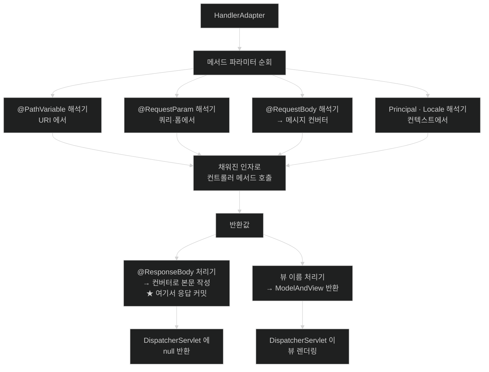

# 컨트롤러 시그니처가 자유로운 이유 — 인자 해석기와 반환값 처리기

## 한눈에 보기

| 질문 | 핵심 답 |
|---|---|
| 컨트롤러 메서드는 왜 시그니처가 자유로운가? | 파라미터마다 담당 **[[인자-해석기]]**가 값을 채워 주기 때문이다. |
| `BindingResult`는 아무 데나 둬도 되나? | **아니다.** 검증 대상 인자 **바로 뒤**여야 한다. 아니면 예외가 난다. |
| 애노테이션을 안 붙이면? | 단순 타입이면 `@RequestParam`, 아니면 `@ModelAttribute`로 해석된다. |
| 같은 `String` 반환이 왜 다르게 동작하나? | `@ResponseBody` 유무에 따라 다른 **[[반환값-처리기]]**가 맡기 때문이다. |
| 응답은 언제 쓰이나? | `@ResponseBody`면 **핸들러 어댑터 안에서** 쓰이고 커밋된다. |
| 그래서 무슨 함정이? | 그 뒤의 인터셉터 `postHandle`에서 헤더를 추가할 수 없다. |

## 1. 왜 이게 필요한가

### 출발 장면: 검증 오류를 잡으려 했는데 400이 튀어나온다

입력 검증 결과를 직접 다루려고 `BindingResult`를 받았다.

```java
@PostMapping("/materials")
public ResponseEntity<?> create(
        @Valid @RequestBody MaterialRequest request,
        Locale locale,                    // ← 중간에 하나 끼워 넣었다
        BindingResult errors) {

    if (errors.hasErrors()) {
        return ResponseEntity.badRequest().body(toProblem(errors, locale));
    }
    return ResponseEntity.ok(service.create(request));
}
```

의도는 검증 실패를 직접 포맷해서 돌려주는 것이었다. 그런데 잘못된 본문을 보내면 **`errors.hasErrors()` 분기에 아예 들어오지 않고** 프레임워크 기본 400 응답이 나간다. `MethodArgumentNotValidException`이 던져진 것이다.

`Locale locale`을 한 줄 아래로 옮기면 정상 동작한다.

```java
        @Valid @RequestBody MaterialRequest request,
        BindingResult errors,             // ← 검증 대상 바로 뒤
        Locale locale) {
```

**파라미터 순서가 동작을 바꿨다.** 자바에서 파라미터 순서는 보통 호출부만 신경 쓰면 되는 문제인데, 여기서는 프레임워크의 동작이 달라진다.

### 여기서 뭐가 무너지나

컨트롤러 메서드는 **우리가 부르는 메서드가 아니다.** 프레임워크가 리플렉션으로 부른다. 그러려면 파라미터 개수만큼의 값을 어디선가 만들어 채워야 한다.

`HttpServletRequest` 하나만 넘겨 주는 서블릿과 달리, Spring MVC는 파라미터 **하나하나를 따로 해석한다.** 그 해석을 담당하는 것이 **[[인자-해석기]]**(= 컨트롤러 메서드의 파라미터 하나를 실제 값으로 채워 주는 전략)이고, `@PathVariable`·`@RequestParam`·`@RequestBody`·`Locale`·`Principal`마다 담당자가 따로 있다.

그런데 `BindingResult`만은 **독립적으로 해석될 수 없다.** "무엇에 대한 검증 결과인가"가 있어야 의미가 생기기 때문이다. 그래서 규칙이 위치로 정해졌다 — 공식 문서는 `Errors`·`BindingResult` 인자가 검증된 `@ModelAttribute`·`@RequestBody`·`@RequestPart` 인자 **바로 다음에 선언되어야 한다**고 명시한다.

바로 뒤에 없으면 프레임워크는 "이 검증 결과를 받을 사람이 없다"고 판단하고, 검증 실패를 예외로 던진다. 출발 장면에서 일어난 일이 정확히 이것이다.

비유하자면 **서류와 그 서류의 검토 의견서**다. 의견서에는 "이 서류에 대한 검토"라고 적혀 있지 않고, **바로 앞에 붙어 있다는 사실**로만 대상이 식별된다. 사이에 다른 서류가 끼면 짝이 깨진다.

→ 비유가 깨지는 지점: 종이 서류라면 사람이 보고 "아, 이건 앞앞 서류에 대한 것이겠지"라고 추론할 수 있다. 프레임워크는 추론하지 않는다 — **위치가 곧 규칙**이고, 어긋나면 조용히 다른 경로(예외 던지기)로 간다.

### 그래서 나온 생각

메서드 시그니처를 프레임워크가 강제하는 대신, **파라미터 타입과 애노테이션을 보고 값을 만들어 주는 전략들의 목록**을 둔다. 새로운 종류의 파라미터가 필요하면 해석기를 추가하면 되고, 컨트롤러 코드는 필요한 것만 선언하면 된다.

반환값도 대칭이다. 반환 타입마다 담당 **[[반환값-처리기]]**가 있어, 같은 `String`이라도 어떤 처리기가 맡느냐에 따라 뷰 이름이 되기도 하고 응답 본문이 되기도 한다.

## 2. 어떻게 동작하는가

### 2.1 핸들러 어댑터 안에서 벌어지는 세 단계

[[02-handlermapping-and-handleradapter]]에서 "어댑터에게 맡긴다"까지 봤다. 그 안이 이렇다.

1. **메서드의 파라미터를 하나씩 순회한다.** — 각각을 채워야 리플렉션으로 호출할 수 있기 때문이다.
2. **각 파라미터를 지원하는 [[인자-해석기]](`HandlerMethodArgumentResolver`)를 찾아 값을 만든다.** — 파라미터 종류마다 값을 얻는 방법이 완전히 다르기 때문이다(`@PathVariable`은 URI에서, `@RequestBody`는 본문에서, `Principal`은 보안 컨텍스트에서).
3. **채워진 인자로 메서드를 호출한다.** — 여기가 우리가 쓴 코드가 실행되는 유일한 지점이다.
4. **반환값을 지원하는 [[반환값-처리기]](`HandlerMethodReturnValueHandler`)를 찾아 응답으로 바꾼다.** — 반환 타입마다 응답을 만드는 방법이 다르기 때문이다.
5. **`@ResponseBody` 계열이면 이 안에서 응답을 쓰고 커밋한다.** — 뷰 렌더링 단계가 필요 없으므로 여기서 끝내는 것이 자연스럽기 때문이다.
6. **뷰를 쓰는 경우에는 `ModelAndView`를 `DispatcherServlet`에 돌려준다.** — 뷰 해석과 렌더링은 어댑터가 아니라 `DispatcherServlet`의 5단계 일이기 때문이다.

**5번이 이 챕터에서 가장 중요한 사실 중 하나다.** REST 컨트롤러의 응답은 `DispatcherServlet`으로 돌아오기 전에 이미 나가 있다.

### 2.2 애노테이션 없는 파라미터의 폴백 규칙

공식 문서가 규칙을 한 문장으로 못박는다 — *"메서드 인자가 앞선 표의 어떤 값에도 매칭되지 않고 **단순 타입**(`BeanUtils#isSimpleProperty` 기준)이면 `@RequestParam`으로 해석된다. 그렇지 않으면 `@ModelAttribute`로 해석된다."*

이 규칙이 두 가지 일상을 설명한다.

```java
// ① 애노테이션 없이도 동작한다 — int 는 단순 타입 → @RequestParam
@GetMapping("/materials")
public List<MaterialSummary> list(int page, int size) { ... }

// ② 이것도 동작하지만 의미가 다르다 — 객체 → @ModelAttribute
@GetMapping("/materials/search")
public List<MaterialSummary> search(MaterialFilter filter) { ... }
```

②는 `@RequestParam`이 아니라 **데이터 바인딩**이다. 쿼리 파라미터 이름과 `MaterialFilter`의 필드 이름을 맞춰 채운다. 없는 파라미터는 그냥 비어 있고 **오류가 나지 않는다.** 필수값이 안 왔는데 200이 나가는 상황이 여기서 생긴다.

**폴백 규칙에 기대지 말고 애노테이션을 명시하는 편이 낫다.** 코드를 읽는 사람이 `BeanUtils#isSimpleProperty`의 판정을 머릿속으로 돌려야 하는 코드는 좋은 코드가 아니다.

### 2.3 주요 인자 해석기 — 무엇을 어디서 가져오는가

| 인자 | 어디서 가져오는가 | 실패하면 |
|---|---|---|
| `@PathVariable` | URI 템플릿 변수 | 매핑 자체가 안 됨 |
| `@RequestParam` | 쿼리 스트링·폼·멀티파트 | 필수면 400 |
| `@RequestHeader` | 헤더 | 필수면 400 |
| `@CookieValue` | 쿠키 | 필수면 400 |
| `@RequestBody` | **본문 — [[메시지-컨버터]] 경유** | 415 또는 400 |
| `HttpEntity<B>` | 헤더 + 본문 | 같음 |
| `@RequestPart` | 멀티파트 파트 — 컨버터 경유 | 400 |
| `@ModelAttribute` | 여러 소스에서 데이터 바인딩 | 대개 조용히 비어 있음 |
| `Errors`, `BindingResult` | **바로 앞 인자의 검증 결과** | 위치가 틀리면 예외 |
| `Principal` | 인증 컨텍스트 | `null` |
| `Locale`, `TimeZone`, `ZoneId` | 로케일 해석기 | 기본값 |
| `Model`, `ModelMap` | 뷰에 넘길 모델 | — |
| `RedirectAttributes` | 리다이렉트용 속성·플래시 | — |
| `HttpSession` | 세션 — **`null`이 아니다** | — |
| `UriComponentsBuilder` | 현재 요청 기준 URL 빌더 | — |

**`@RequestBody`가 [[메시지-컨버터]]를 거친다는 점**이 [[04-httpmessageconverter-and-content-negotiation]]으로 이어진다. 인자 해석기는 "본문을 이 타입으로 만들어 줘"라고 위임할 뿐, 실제 역직렬화는 컨버터가 한다.

`HttpSession`에 대해 공식 문서가 붙이는 단서도 알아 둘 만하다 — **절대 `null`이 아니며**, 따라서 이 인자를 선언하는 것만으로 세션이 강제로 만들어진다. 그리고 `synchronizeOnSession=true`가 아니면 스레드 안전하지 않다.

### 2.4 같은 `String`, 다른 운명

반환값 쪽의 분기가 초심자에게 가장 혼란스러운 지점이다.

```java
@Controller
public class ViewController {
    @GetMapping("/hello")
    public String hello() {
        return "hello";        // → 뷰 이름. templates/hello.html 을 찾는다
    }
}

@RestController                 // = @Controller + @ResponseBody
public class ApiController {
    @GetMapping("/hello")
    public String hello() {
        return "hello";        // → 응답 본문 그대로 "hello"
    }
}
```

코드가 글자 하나 다르지 않은데 결과가 완전히 다르다. 이유는 담당 [[반환값-처리기]]가 다르기 때문이다 — `@ResponseBody`가 있으면 본문 작성 처리기가, 없으면 뷰 이름 처리기가 맡는다.

주요 반환 타입은 이렇다.

| 반환 타입 | 처리 | 뷰 렌더링 |
|---|---|---|
| `String` (`@ResponseBody` 없음) | 논리 뷰 이름 | **거친다** |
| `String` (`@ResponseBody` 있음) | 응답 본문 | 안 거침 |
| `ModelAndView` | 뷰 + 모델 | **거친다** |
| 임의 객체 (`@ResponseBody`) | 컨버터로 직렬화 | 안 거침 |
| `ResponseEntity<T>` | 상태·헤더·본문 전부 제어 | 안 거침 |
| `void` | 응답을 직접 썼거나 응답 없음 | 안 거침 |
| `Callable`, `DeferredResult` | 비동기 처리 | 나중에 결정 |

### 2.5 이름의 유래

**Resolver(해석기)**는 "미정 상태를 확정 상태로 바꾸는 것"이다. 파라미터는 선언만 있고 값이 없는 미정 상태이고, 해석기가 요청에서 값을 찾아 확정한다. `ViewResolver`(뷰 이름 → 실제 뷰), `LocaleResolver`(요청 → 로케일)도 같은 어법이다.

**Handler(처리기)**는 [[02-handlermapping-and-handleradapter]]의 [[핸들러]]와 같은 단어지만 층이 다르다. 저기서는 "요청을 처리하는 것", 여기서는 "반환값을 처리하는 것"이다. Spring에서 `Handler`는 특정 개념이 아니라 **"무언가를 맡아 처리하는 전략"**을 가리키는 일반 접미사로 쓰인다.

## 3. 그림으로 보기

### 핸들러 어댑터 내부



### BindingResult의 위치 규칙

```text
[올바른 배치]

  create(@Valid @RequestBody MaterialRequest request,
         BindingResult errors,        ← 바로 뒤. 짝이 성립한다
         Locale locale)

  검증 실패 → errors 에 담김 → 내 코드가 처리
                              → 내가 만든 응답이 나간다


[잘못된 배치]

  create(@Valid @RequestBody MaterialRequest request,
         Locale locale,               ← 사이에 끼어들었다
         BindingResult errors)        ← 짝이 깨졌다

  검증 실패 → 받을 사람이 없다고 판단
           → MethodArgumentNotValidException 던짐
           → 프레임워크 기본 400 응답
           → 내 분기는 실행조차 안 된다


  → 왜 위치로 정했나? BindingResult 는 "무엇에 대한 검증 결과인가"가
    있어야 의미가 있는데, 타입만으로는 그 대상을 알 수 없다.
    @Valid 인자가 여럿일 수도 있으므로 "직전 인자"라는 위치 규칙이
    가장 단순하고 모호하지 않은 짝짓기 방법이다.

  → 실무 권장: 애초에 BindingResult 를 받지 말고 예외가 던져지게 둔 뒤
    @RestControllerAdvice 에서 한 곳에 모아 처리하는 편이 낫다.
    컨트롤러마다 같은 분기를 반복하지 않아도 된다.
```

## 4. 이 노트에 나온 용어

| 용어 | 한 줄 풀이 | 자세히 |
|---|---|---|
| 인자 해석기 | 컨트롤러 메서드 파라미터 하나를 실제 값으로 채워 주는 전략 | [[_glossary#인자-해석기]] |
| 반환값 처리기 | 컨트롤러 메서드의 반환값을 응답으로 바꾸는 전략 | [[_glossary#반환값-처리기]] |

## 5. 자주 헷갈리는 것

### `@RequestParam` vs `@ModelAttribute` — 애노테이션을 생략했을 때

| 축 | 단순 타입 → `@RequestParam` | 객체 → `@ModelAttribute` |
|---|---|---|
| 예 | `int page` | `MaterialFilter filter` |
| 값이 없으면 | 필수면 **400** | 그냥 비어 있음 |
| 이름 매칭 | 파라미터 이름 하나 | 객체의 **필드 이름들** |
| 타입 변환 실패 | 400 | 바인딩 오류로 수집 |

**"값이 없으면"의 차이가 위험하다.** 객체로 받으면 필수값 누락이 오류가 아니라 빈 필드가 된다.

### `@ResponseBody`가 있으면 뷰 렌더링은 아예 없다

"뷰 리졸버가 못 찾아서 본문으로 나가는 것"이 아니다. **애초에 다른 처리기가 맡아 뷰 단계를 거치지 않는다.** 그래서 `@RestController`만 쓰는 프로젝트에서는 `ViewResolver` 설정이 아무 영향이 없다.

### 응답이 이미 커밋됐다는 것의 의미

`@ResponseBody`·`ResponseEntity`는 어댑터 안에서 응답을 쓰고 커밋한다. 커밋 후에는 **상태 코드도 헤더도 바꿀 수 없다.** 이것이 [[05-exception-resolution-and-filter-vs-interceptor]]에서 다루는 두 함정의 원인이다 — 인터셉터 `postHandle`의 무력함과, 응답 도중 발생한 예외를 오류 응답으로 바꾸지 못하는 상황.

### `HttpSession` 인자는 세션을 만든다

`null`이 아니라는 보장은 편리하지만 부작용이 있다. 세션이 없으면 **만들어서** 준다. 무상태 REST API에서 무심코 선언하면 요청마다 세션이 생성될 수 있다. 읽기만 하려면 `@SessionAttribute`나 `WebRequest`를 쓴다.

## 6. 언제 안 쓰나 / 경계

- **`BindingResult`를 컨트롤러마다 받지 않는다.** 예외가 던져지게 두고 `@RestControllerAdvice`에서 한 곳에 모아 처리하는 편이 반복이 적다.
- **애노테이션 생략에 기대지 않는다.** 폴백 규칙을 아는 사람만 읽을 수 있는 코드가 된다.
- **파라미터를 열 개씩 받지 않는다.** 요청 객체 하나로 묶는 편이 낫다. 해석기가 많이 붙을수록 호출 비용도 는다.
- **무상태 API에서 `HttpSession`을 선언하지 않는다.** 세션이 생성된다.
- **커스텀 인자 해석기를 만들기 전에 기존 것으로 되는지 확인한다.** `@ModelAttribute`와 커스텀 `Converter` 조합으로 해결되는 경우가 많다.
- **반환 타입을 `Object`로 두지 않는다.** 어느 처리기가 맡을지 컴파일 시점에 알 수 없어진다.

## 7. 연결

- [[02-handlermapping-and-handleradapter]] — 이 노트는 그 노트의 [[핸들러-어댑터]] 안을 확대한 것이다. "어댑터가 애노테이션을 해석한다"는 문장의 실제 내용이 여기 있다.
- [[04-httpmessageconverter-and-content-negotiation]] — `@RequestBody` 해석기와 `@ResponseBody` 처리기가 본문 변환을 위임하는 대상이 거기 있다. 인자 해석과 본문 변환은 다른 층이다.
- [[05-exception-resolution-and-filter-vs-interceptor]] — 이 노트에서 본 "응답이 어댑터 안에서 커밋된다"가 그 노트의 두 함정의 원인이다.
- [[01-dispatcherservlet-as-front-controller]] — 컨트롤러가 서블릿과 달리 자유로운 시그니처를 갖는다는 그 노트의 대조표에 대한 답이 이 노트다.

## 8. 스스로 확인

1. `BindingResult`의 위치가 동작을 바꾸는 이유를 "짝짓기"로 설명할 수 있는가?
2. 위치가 틀렸을 때 실제로 무슨 일이 일어나는가?
3. 애노테이션을 생략했을 때의 폴백 규칙 두 갈래는? 각각 값이 없으면 어떻게 되는가?
4. 컨트롤러 메서드가 자유로운 시그니처를 가질 수 있는 메커니즘을 한 문장으로 말할 수 있는가?
5. 핸들러 어댑터 안의 6단계를 순서대로 말할 수 있는가?
6. 같은 `String` 반환이 뷰 이름도 되고 본문도 되는 이유는?
7. `@ResponseBody`일 때 응답이 커밋되는 시점은 언제인가? 그것이 왜 중요한가?
8. `@RequestBody` 해석기가 직접 하지 않고 위임하는 일은 무엇인가?
9. `HttpSession` 인자를 선언하는 것의 부작용은?
10. `Resolver`와 `Handler`라는 접미사가 Spring에서 각각 어떤 어법으로 쓰이는가?


> 열 문항을 스스로 답한 **뒤에** [[_03-argument-resolvers-and-return-value-handlers]]에서 모범답안과 대조한다. 먼저 열면 이 문항들은 다시 인출 문제로 쓸 수 없다.

<!-- ==== 아래는 내 영역 · 스킬 수정 금지 ==== -->

## 내 설명 시도


## 막혔던 지점


## 리뷰 이력
