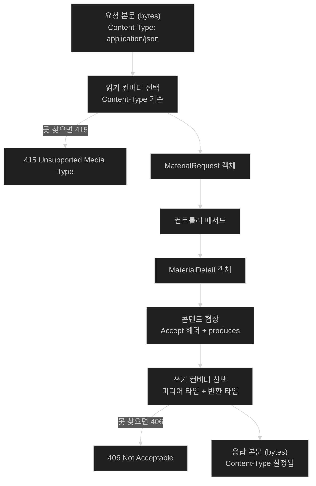

# 객체가 JSON이 되는 지점 — 메시지 컨버터와 콘텐트 협상

## 한눈에 보기

| 질문 | 핵심 답 |
|---|---|
| Spring이 JSON을 기본으로 쓰나? | **아니다.** Jackson이 클래스패스에 있으면 그 컨버터가 등록될 뿐이다. |
| 누가 객체를 JSON으로 바꾸나? | **[[메시지-컨버터]]**다. 컨트롤러도 `DispatcherServlet`도 아니다. |
| 어떤 컨버터를 쓸지 어떻게 정하나? | **[[콘텐트-협상]]** 결과와 각 컨버터의 지원 미디어 타입을 대조해 고른다. |
| 협상은 무엇을 보나? | 공식 문서 기준 **기본은 `Accept` 헤더만** 본다. |
| 406은 무슨 뜻인가? | 클라이언트가 원하는 형식을 만들 수 있는 컨버터가 없다는 뜻이다. |
| 415는? | 클라이언트가 보낸 형식을 읽을 수 있는 컨버터가 없다는 뜻이다. |

## 1. 왜 이게 필요한가

### 출발 장면: 같은 코드가 406으로 죽는다

XML도 지원해 달라는 요구가 들어와 의존성을 추가했다. 며칠 뒤, 아무것도 안 고쳤는데 일부 클라이언트에서 응답이 깨진다는 제보가 온다.

```java
@RestController
public class MaterialController {

    @GetMapping("/materials/{id}")
    public MaterialDetail findOne(@PathVariable UUID id) {
        return service.findOne(id);
    }
}
```

curl로 재현해 본다.

```bash
$ curl -H 'Accept: application/json' localhost:8080/materials/abc
{"id":"abc","name":"글리세린",...}                       # 정상

$ curl -H 'Accept: text/csv' localhost:8080/materials/abc
HTTP/1.1 406 Not Acceptable                              # ?

$ curl -H 'Accept: */*' localhost:8080/materials/abc
<MaterialDetail><id>abc</id>...</MaterialDetail>         # XML 이 나왔다!
```

세 번째가 문제였다. `Accept: */*`(아무거나 좋다)를 보내는 클라이언트에게 **전에는 JSON이 나갔는데 이제 XML이 나간다.** 컨트롤러 코드는 한 글자도 안 바뀌었다. 바뀐 것은 클래스패스뿐이다.

### 여기서 뭐가 무너지나

"`@RestController`니까 JSON이 나간다"고 알고 있으면 이 현상을 설명할 수 없다. 실제로는 **어디에도 "JSON으로 응답하라"는 지시가 없다.**

컨트롤러는 `MaterialDetail` 객체를 반환할 뿐이다. 그 객체가 바이트 스트림이 되려면 누군가 직렬화해야 하고, 그 일을 하는 것이 **[[메시지-컨버터]]**(= HTTP 본문과 자바 객체를 양방향으로 변환하는 전략)다.

컨버터는 여럿 등록돼 있고, 각자 **자기가 다룰 수 있는 미디어 타입 목록**을 갖는다. Jackson 컨버터는 `application/json`을, XML 컨버터는 `application/xml`을 다룬다. 그러면 남는 질문은 하나다 — **여럿 중 어느 것을 쓸 것인가?**

그 결정이 **[[콘텐트-협상]]**(= 클라이언트가 원하는 표현 형식과 서버가 만들 수 있는 형식을 맞춰 응답 미디어 타입을 결정하는 과정)이다. `Accept: application/json`이면 답이 명확하지만, `Accept: */*`이면 **서버가 고른다.** 그리고 서버의 선택 순서는 등록된 컨버터의 순서에 달려 있어, 의존성을 추가하면 바뀔 수 있다.

비유하자면 **통역사 배정**이다. 방문객이 "한국어로 해 주세요"라고 하면 한국어 통역사가 배정된다. "아무 언어나 좋아요"라고 하면 **접수처가 명단 순서대로** 배정하는데, 새 통역사가 명단 앞쪽에 들어오면 그날부터 다른 언어가 나온다. 방문객은 아무것도 안 바꿨는데 경험이 달라진다.

→ 비유가 깨지는 지점: 사람은 예상 밖의 언어가 나오면 즉시 알아채고 항의한다. HTTP 클라이언트는 그러지 못한다 — **200 OK로 정상 응답이 온 것**이므로, 파싱 단계에 가서야 깨진다. 게다가 `Accept: */*`은 클라이언트 라이브러리의 기본값인 경우가 많아, 개발자가 명시적으로 선택한 적조차 없다.

### 그래서 나온 생각

**"무엇을 반환할 것인가"(컨트롤러)와 "그것을 어떤 형식으로 내보낼 것인가"(컨버터)를 분리한다.** 그러면 같은 컨트롤러가 JSON·XML·CSV를 전부 지원할 수 있고, 형식이 늘어나도 컨트롤러 코드는 그대로다.

대신 **어느 형식을 고를지 결정하는 규칙**이 필요해진다. 그것이 콘텐트 협상이다.

## 2. 어떻게 동작하는가

### 2.1 읽기와 쓰기, 양방향

메시지 컨버터는 이름 그대로 양방향이다.

| 방향 | 트리거 | 하는 일 | 실패 시 |
|---|---|---|---|
| 읽기 | `@RequestBody`, `HttpEntity`, `@RequestPart` | 요청 본문 → 자바 객체 | **415** Unsupported Media Type |
| 쓰기 | `@ResponseBody`, `ResponseEntity` | 자바 객체 → 응답 본문 | **406** Not Acceptable |

읽기 쪽에서 판단 기준이 되는 헤더는 `Content-Type`(클라이언트가 **보낸** 형식)이고, 쓰기 쪽은 `Accept`(클라이언트가 **원하는** 형식)다. 두 헤더를 혼동하면 415와 406을 반대로 진단하게 된다.

[[03-argument-resolvers-and-return-value-handlers]]에서 본 `@RequestBody` 인자 해석기는 본문을 직접 파싱하지 않는다. **"이 본문을 `MaterialRequest` 타입으로 만들어 줘"라고 컨버터에 위임할 뿐이다.**

### 2.2 응답 형식이 결정되는 순서

1. **[[콘텐트-협상]]이 클라이언트가 원하는 미디어 타입 목록을 구한다.** 공식 문서 기준 **기본적으로 `Accept` 헤더만 확인한다.** — 어떤 형식을 만들어야 할지는 클라이언트만 알기 때문이다.
2. **핸들러의 `produces` 조건이 있으면 그것과 교집합을 낸다.** — 서버가 만들 수 없다고 선언한 형식을 시도해 봐야 소용없기 때문이다. `produces`는 [[02-handlermapping-and-handleradapter]]에서 본 대로 매핑 조건이기도 하다.
3. **등록된 컨버터 중 그 미디어 타입과 반환 타입을 함께 지원하는 것을 순서대로 찾는다.** — 미디어 타입만 맞아도 특정 자바 타입은 못 쓰는 컨버터가 있기 때문이다.
4. **찾으면 그 컨버터로 직렬화하고 `Content-Type` 헤더를 설정한다.** — 클라이언트가 받은 것을 어떻게 파싱할지 알아야 하기 때문이다.
5. **못 찾으면 406을 낸다.** — 아무 형식으로나 내보내면 클라이언트가 파싱에 실패하고, 그것은 서버가 요구를 만족시키지 못했다는 사실을 감추는 일이기 때문이다.

**1번의 "기본적으로 `Accept` 헤더만"이 출발 장면의 열쇠다.** `*/*`은 "전부 수용 가능"이므로 1번에서 걸러지지 않고, 3번에서 **등록 순서가 이긴다.**

### 2.3 URL 기반 협상과 공식 문서의 권고

`Accept` 헤더 대신 URL로 형식을 지정하는 방법도 있다.

| 전략 | 형태 | 공식 문서의 태도 |
|---|---|---|
| `Accept` 헤더 | `Accept: application/json` | **기본값** |
| 쿼리 파라미터 | `/materials/abc?format=json` | URL 기반이 꼭 필요하면 **이쪽을 권장** |
| 경로 확장자 | `/materials/abc.json` | 권장하지 않음 |

공식 문서의 표현은 명확하다 — *"URL 기반 콘텐트 타입 해석을 꼭 써야 한다면, 경로 확장자보다 쿼리 파라미터 전략을 고려하라."*

경로 확장자가 밀려난 데는 보안 이유가 있다. 경로 끝의 확장자를 형식 지정으로 해석하면 `/materials/report.html` 같은 요청이 의도치 않은 형식으로 처리될 수 있고, 이것이 RFD(Reflected File Download) 계열 공격의 표면이 된다. 접미사 매칭 자체가 현대 Spring에서 기본 비활성화된 것도 같은 흐름이다.

설정은 `ContentNegotiationConfigurer`로 한다.

```java
@Configuration
public class WebConfiguration implements WebMvcConfigurer {
    @Override
    public void configureContentNegotiation(ContentNegotiationConfigurer configurer) {
        configurer.mediaType("json", MediaType.APPLICATION_JSON);
        configurer.mediaType("xml", MediaType.APPLICATION_XML);
    }
}
```

### 2.4 출발 장면을 막는 방법

**핸들러에 `produces`를 명시하는 것이 가장 확실하다.**

```java
@GetMapping(value = "/materials/{id}", produces = MediaType.APPLICATION_JSON_VALUE)
public MaterialDetail findOne(@PathVariable UUID id) { ... }
```

이렇게 두면 `Accept: */*`이 와도 JSON만 나간다. 클래스패스에 무엇이 추가되든 응답 형식이 흔들리지 않는다. 게다가 이 선언은 **매핑 조건**이기도 해서, `Accept: text/csv`인 요청은 매핑 단계에서 걸러진다.

전역으로는 협상 설정에서 기본 타입을 못 박을 수도 있다. **API 서버라면 형식을 고정하는 편이 예측 가능성 면에서 낫다** — 콘텐트 협상은 하나의 URL이 여러 표현을 갖는 하이퍼미디어 스타일에서 값어치가 있고, 형식이 하나뿐인 API에서는 위험만 남는다.

### 2.5 이름의 유래

**Message converter**의 "message"는 HTTP 메시지, 즉 **헤더와 본문으로 이뤄진 하나의 HTTP 단위**를 가리킨다. 자바 객체와 HTTP 메시지 본문 사이를 오간다는 뜻이 이름 그대로다.

**Content negotiation**의 "negotiation(협상)"은 HTTP 명세의 용어다. **클라이언트가 선호를 제시하고(`Accept`) 서버가 그중에서 고른다**는 구조가 협상이다. 일방적 지정이 아니라는 점이 핵심이다 — 그래서 클라이언트가 `*/*`처럼 선호를 포기하면 결정권이 통째로 서버에 넘어간다.

## 3. 그림으로 보기

### 본문이 오가는 양방향



### `Accept: */*`이 위험한 이유

```text
[의존성 추가 전]

  등록된 쓰기 컨버터 (순서대로)
    1. ByteArrayHttpMessageConverter
    2. StringHttpMessageConverter
    3. MappingJackson2HttpMessageConverter   ← JSON

  Accept: */*  → "아무거나 좋다"
       │
       ▼
  MaterialDetail 을 쓸 수 있는 첫 컨버터 = 3번 → JSON ✅


[XML 의존성 추가 후]

  등록된 쓰기 컨버터 (순서대로)
    1. ByteArrayHttpMessageConverter
    2. StringHttpMessageConverter
    3. MappingJackson2XmlHttpMessageConverter  ← XML 이 앞에 끼어들 수 있다
    4. MappingJackson2HttpMessageConverter

  Accept: */*  → "아무거나 좋다"
       │
       ▼
  첫 컨버터 = 3번 → XML ❌   같은 요청, 다른 응답


[produces 를 명시하면]

  @GetMapping(value="...", produces = APPLICATION_JSON_VALUE)

  Accept: */*  ∩  produces=application/json  =  application/json
       │
       ▼
  JSON 고정. 클래스패스가 바뀌어도 흔들리지 않는다 ✅

  → "협상(negotiation)"이라는 이름 그대로, 클라이언트가 선호를
    포기하면(*/*) 결정권이 서버로 넘어간다. 서버가 그 결정을
    등록 순서라는 우연에 맡기지 않도록 produces 로 못 박는 것이다.
```

## 4. 이 노트에 나온 용어

| 용어 | 한 줄 풀이 | 자세히 |
|---|---|---|
| 메시지 컨버터 | HTTP 본문과 자바 객체를 양방향으로 변환하는 전략 | [[_glossary#메시지-컨버터]] |
| 콘텐트 협상 | 클라이언트의 선호와 서버의 능력을 맞춰 응답 미디어 타입을 정하는 과정 | [[_glossary#콘텐트-협상]] |

## 5. 자주 헷갈리는 것

### 415 vs 406 — 방향이 반대다

| | 415 Unsupported Media Type | 406 Not Acceptable |
|---|---|---|
| 방향 | **읽기**(요청 본문) | **쓰기**(응답 본문) |
| 보는 헤더 | `Content-Type` | `Accept` |
| 매핑 조건 | `consumes` | `produces` |
| 의미 | 네가 보낸 걸 못 읽겠다 | 네가 원하는 걸 못 만들겠다 |
| 흔한 원인 | 클라이언트가 `Content-Type` 안 붙임 | `Accept`가 서버 지원 형식과 불일치 |

**415는 "요청이 이상하다", 406은 "요구가 과하다"**로 기억하면 방향이 안 헷갈린다.

### `@RestController`가 JSON을 보장하지 않는다

`@RestController`는 `@Controller` + `@ResponseBody`일 뿐이다. **"본문에 직접 쓴다"는 뜻이지 "JSON으로 쓴다"는 뜻이 아니다.** 형식은 협상 결과다.

### 직렬화 실패는 컨버터 선택 실패가 아니다

컨버터가 정해진 뒤 그 안에서 실패하는 경우가 있다 — 순환 참조, 알 수 없는 필드, 날짜 포맷 문제. 이건 406이 아니라 **500**이 난다. 406은 "고를 컨버터가 없다", 500은 "골랐는데 그 안에서 터졌다"이다.

JPA 엔티티를 그대로 반환할 때 자주 겪는다. 지연 로딩 프록시를 Jackson이 직렬화하려다 실패하거나, 양방향 연관에서 무한 재귀에 빠진다. `part-0-jpa-foundations`의 프록시 내용과 이 층이 만나는 지점이다. **엔티티 대신 DTO를 반환하면 이 문제가 통째로 사라진다.**

### 컨버터 등록 순서에 의존하지 않는다

순서는 자동 구성과 클래스패스에 따라 정해지고, 의존성 하나로 바뀔 수 있다. `produces`로 명시하는 편이 안전하다.

## 6. 언제 안 쓰나 / 경계

- **형식이 하나뿐인 API에서 협상에 기대지 않는다.** `produces`로 못 박는다. 협상은 한 URL이 여러 표현을 갖는 설계에서 값어치가 있다.
- **경로 확장자 전략을 쓰지 않는다.** 공식 문서가 쿼리 파라미터를 권하고, 보안상으로도 그쪽이 낫다.
- **JPA 엔티티를 그대로 반환하지 않는다.** 직렬화 시점에 지연 로딩·순환 참조 문제가 터진다. DTO로 변환한다.
- **커스텀 컨버터를 만들기 전에 Jackson 설정으로 되는지 본다.** 대부분의 요구는 `ObjectMapper` 커스터마이징으로 해결된다.
- **`Accept: */*`을 보내는 클라이언트를 전제하지 않는다.** 서버가 형식을 고정해 주는 것이 양쪽 모두에게 안전하다.
- **본문이 커밋된 뒤에는 형식도 상태 코드도 바꿀 수 없다.** 직렬화 도중 예외가 나면 오류 응답으로 갈아탈 수 없다([[05-exception-resolution-and-filter-vs-interceptor]]).

## 7. 연결

- [[03-argument-resolvers-and-return-value-handlers]] — `@RequestBody` 해석기와 `@ResponseBody` 처리기가 본문 변환을 이 노트의 컨버터에 위임한다. 인자 해석과 본문 변환은 다른 층이라는 구분이 핵심이다.
- [[02-handlermapping-and-handleradapter]] — `produces`·`consumes`가 매핑 조건이기도 하다. 그래서 `Accept` 헤더가 **어느 핸들러를 부를지까지** 바꿀 수 있다.
- [[05-exception-resolution-and-filter-vs-interceptor]] — 직렬화 도중 응답이 이미 커밋되면 예외 해석이 무력해진다. 이 노트의 "커밋 이후"가 그 노트의 전제다.
- [[01-dispatcherservlet-as-front-controller]] — `@ResponseBody`가 6단계 중 5단계(뷰 렌더링)를 건너뛴다는 사실의 실제 내용이 이 노트다.

## 8. 스스로 확인

1. 컨트롤러 코드를 안 고쳤는데 응답이 XML로 바뀐 과정을 설명할 수 있는가?
2. `Accept: */*`이 왜 위험한가? 협상의 어느 성질 때문인가?
3. 415와 406의 방향·헤더·매핑 조건을 각각 말할 수 있는가?
4. `@RestController`가 JSON을 보장하지 않는 이유는?
5. 응답 형식이 결정되는 5단계를 순서대로 말할 수 있는가?
6. 공식 문서가 경로 확장자보다 쿼리 파라미터를 권하는 이유는?
7. `produces`를 명시하면 무엇이 고정되는가? 그것이 매핑에도 영향을 주는가?
8. 406과 500을 가르는 기준은 무엇인가?
9. JPA 엔티티를 그대로 반환할 때 이 층에서 무슨 일이 생기는가?
10. "협상"이라는 이름이 클라이언트와 서버의 역할을 어떻게 나누고 있는가?


> 열 문항을 스스로 답한 **뒤에** [[_04-httpmessageconverter-and-content-negotiation]]에서 모범답안과 대조한다. 먼저 열면 이 문항들은 다시 인출 문제로 쓸 수 없다.

<!-- ==== 아래는 내 영역 · 스킬 수정 금지 ==== -->

## 내 설명 시도


## 막혔던 지점


## 리뷰 이력
