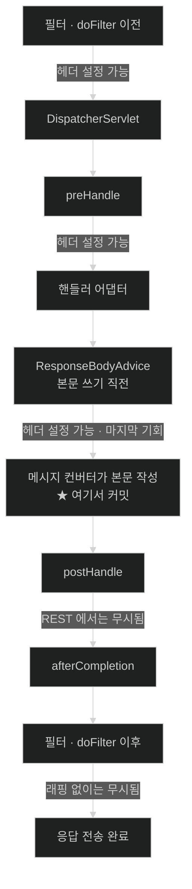

# 파이프라인의 안과 밖 — 필터·인터셉터와 예외 해석

## 한눈에 보기

| 질문 | 핵심 답 |
|---|---|
| 인터셉터 `postHandle`에서 헤더를 추가하면? | **REST API에서는 안 붙는다.** 응답이 이미 커밋된 뒤다. |
| 그럼 어디서 붙이나? | **[[서블릿-필터]]** 또는 `ResponseBodyAdvice`. |
| 필터와 인터셉터의 결정적 차이는? | 필터는 `DispatcherServlet` **밖**, 인터셉터는 **안**. |
| 안쪽에 있으면 뭐가 좋은가? | **어떤 핸들러가 선택됐는지 안다.** 필터는 모른다. |
| 인증·인가는 어디서? | 공식 문서는 **필터 체인** 쪽을 권한다. 인터셉터는 보안 계층에 부적합. |
| 예외는 어떻게 응답이 되나? | **[[예외-해석기]] 체인**이 순서대로 시도하고, `null`이면 다음으로 넘긴다. |

## 1. 왜 이게 필요한가

### 출발 장면: 인터셉터가 붙인 헤더가 응답에 없다

모든 응답에 처리 시간을 담은 헤더를 붙이기로 했다. 인터셉터가 적당해 보인다.

```java
@Component
public class TimingInterceptor implements HandlerInterceptor {

    @Override
    public boolean preHandle(HttpServletRequest req, HttpServletResponse res, Object handler) {
        req.setAttribute("startedAt", System.nanoTime());
        return true;
    }

    @Override
    public void postHandle(HttpServletRequest req, HttpServletResponse res,
                           Object handler, ModelAndView mav) {
        long elapsed = System.nanoTime() - (long) req.getAttribute("startedAt");
        res.setHeader("X-Elapsed-Nanos", String.valueOf(elapsed));   // ← 안 붙는다
    }
}
```

`postHandle`에 브레이크포인트를 걸면 **실제로 실행된다.** `setHeader`도 예외 없이 지나간다. 그런데 클라이언트가 받은 응답에는 `X-Elapsed-Nanos`가 없다.

뷰를 반환하는 컨트롤러에서 테스트하면 헤더가 붙는다. `@RestController`에서만 사라진다.

### 여기서 뭐가 무너지나

원인은 [[03-argument-resolvers-and-return-value-handlers]]와 [[04-httpmessageconverter-and-content-negotiation]]에서 이미 나왔다. **`@ResponseBody`·`ResponseEntity`의 응답은 핸들러 어댑터 안에서 쓰이고 커밋된다.**

공식 문서가 이 함정을 직접 경고한다 — *"`@ResponseBody`와 `ResponseEntity` 컨트롤러 메서드의 경우, 응답이 `postHandle`이 호출되기 **전에** `HandlerAdapter` 안에서 쓰이고 커밋된다. 그것은 헤더 추가 같은 응답 변경을 하기에는 **이미 늦었다**는 뜻이다."*

HTTP 응답은 헤더가 먼저 나가고 본문이 뒤따른다. 본문 쓰기가 시작되는 순간 헤더는 이미 전송됐다 — 그것이 "커밋"이다. 커밋 후의 `setHeader`는 **오류가 아니라 무시**된다. 그래서 예외도 로그도 없다.

뷰 컨트롤러에서 동작하는 이유도 같은 논리다. 그쪽은 `postHandle` 이후에 뷰 렌더링(5단계)이 남아 있어 아직 커밋 전이다.

공식 문서는 대안까지 제시한다 — *"`ResponseBodyAdvice`를 구현해 `@ControllerAdvice` 빈으로 선언하거나 `RequestMappingHandlerAdapter`에 직접 설정할 수 있다."* 본문이 쓰이기 **직전**에 개입하는 지점이다.

비유하자면 **편지를 부친 뒤 봉투에 도장을 찍으려는 것**이다. 도장 찍는 동작은 아무 문제 없이 수행된다 — 다만 대상 편지가 이미 우체통 안에 없을 뿐이다.

→ 비유가 깨지는 지점: 편지는 없어진 것이 눈에 보인다. HTTP 응답은 **커밋된 뒤에도 객체가 그대로 손에 남아 있다.** `res.setHeader(...)`가 정상적으로 호출되고 반환된다. 아무 신호도 없이 효과만 사라진다는 점이 이 함정을 어렵게 만든다.

### 그래서 나온 생각

응답에 개입하려면 **커밋 이전의 지점**을 알아야 한다. 그러려면 요청 처리 파이프라인에 개입 지점이 여러 층으로 있고, 각 층이 언제 실행되는지를 알아야 한다.

Spring MVC에는 개입 지점이 크게 셋이다 — `DispatcherServlet` 바깥의 [[서블릿-필터]], 안쪽의 [[핸들러-인터셉터]], 그리고 예외에 특화된 [[예외-해석기]]다.

## 2. 어떻게 동작하는가

### 2.1 세 층의 위치와 그 결과

```text
   ┌─ 서블릿 필터 체인 ─────────────────────────────────────────┐
   │  요청 래핑 · 인코딩 · 인증 · CORS                          │
   │  ┌─ DispatcherServlet ────────────────────────────────┐   │
   │  │  ┌─ 핸들러 인터셉터 ────────────────────────────┐  │   │
   │  │  │  preHandle                                    │  │   │
   │  │  │  ┌─ 핸들러 어댑터 ─────────────────────────┐ │  │   │
   │  │  │  │  인자 해석 → 컨트롤러 → 반환값 처리      │ │  │   │
   │  │  │  │  ★ @ResponseBody 는 여기서 응답 커밋     │ │  │   │
   │  │  │  └──────────────────────────────────────────┘ │  │   │
   │  │  │  postHandle    ← 이미 늦은 경우가 있다        │  │   │
   │  │  │  (뷰 렌더링)                                   │  │   │
   │  │  │  afterCompletion                              │  │   │
   │  │  └───────────────────────────────────────────────┘  │   │
   │  │  예외 해석기 체인                                    │   │
   │  └──────────────────────────────────────────────────────┘   │
   └────────────────────────────────────────────────────────────┘
```

층이 다르면 **알 수 있는 것과 할 수 있는 것**이 다르다.

| 축 | [[서블릿-필터]] | [[핸들러-인터셉터]] |
|---|---|---|
| 관리 주체 | 서블릿 컨테이너 | Spring |
| 위치 | `DispatcherServlet` 밖 | 안 |
| 핸들러를 아는가 | **모른다** | **안다**(`Object handler` 인자) |
| 요청·응답 래핑 | **가능** | 불가능 |
| 정적 리소스 요청에도 적용 | 예 | 매핑된 경로만 |
| 예외 처리 | `try/catch`로 전체 감쌈 | Spring 예외 해석 뒤 |
| 적합한 일 | 인코딩·CORS·인증·응답 래핑 | 감사 로그·권한 세부 검사·모델 보강 |

**"핸들러를 아는가"가 결정적 차이다.** 인터셉터는 `preHandle(req, res, Object handler)`로 어떤 컨트롤러 메서드가 선택됐는지 받는다. 그래서 메서드에 붙은 커스텀 애노테이션을 읽어 분기할 수 있다. 필터는 아직 [[핸들러-매핑]]이 실행되기 전이라 그 정보가 없다.

### 2.2 인터셉터 세 콜백의 정확한 시점

1. **`preHandle`** — 실제 핸들러 실행 **전**. `boolean`을 반환하며, 공식 문서 표현으로 *"`true`를 반환하면 실행이 계속되고, `false`를 반환하면 나머지 실행 체인이 건너뛰어지고 핸들러가 호출되지 않는다."* — 요청을 아예 막을 수 있어야 하기 때문이다.
2. **`postHandle`** — 핸들러 실행 **후**. 뷰 렌더링 전이지만, `@ResponseBody`라면 이미 커밋 후다. — 모델을 보강할 마지막 기회를 주기 위해서다.
3. **`afterCompletion`** — 요청 전체가 끝난 **후**. 예외가 났어도 호출된다. — 자원 정리와 계측 종료 지점이 필요하기 때문이다.

`false`를 반환한 인터셉터가 있으면 **그 앞에서 `preHandle`이 성공한 인터셉터들의 `afterCompletion`만** 불린다. 자원을 `preHandle`에서 열었다면 정리는 `afterCompletion`에 두어야 짝이 맞는다.

**계측용 헤더처럼 응답을 손대야 하는 일은 `postHandle`이 아니라 필터에 둔다.** 필터는 `chain.doFilter()` 전후를 감싸고, 응답을 직접 래핑할 수도 있어 커밋 이후 문제에서 자유롭다.

### 2.3 공식 문서가 인터셉터를 보안에 권하지 않는 이유

문서의 경고가 분명하다 — *"인터셉터는 애노테이션 컨트롤러 경로 매칭과 불일치할 가능성 때문에 보안 계층으로 이상적이지 않다. 일반적으로 Spring Security를 쓰거나, 서블릿 필터 체인에 통합된 유사한 접근을 **가능한 한 이른 시점에** 적용할 것을 권한다."*

핵심은 "불일치 가능성"이다. 인터셉터의 경로 패턴과 `@RequestMapping`의 매칭 규칙이 완전히 같지 않아, **인터셉터가 걸리지 않는데 컨트롤러는 실행되는** 조합이 생길 수 있다. 보안에서 그런 틈은 곧 우회 경로다.

"가능한 한 이른 시점"이라는 표현도 의도적이다. 필터 체인의 앞쪽일수록 통과해야 할 관문이 많아진다.

### 2.4 예외가 응답이 되는 과정

**[[예외-해석기]]**(= 요청 처리 중 발생한 예외를 대체 처리로 바꾸는 전략)는 **체인**으로 동작한다. 공식 문서가 규정하는 반환값 계약이 그 체인을 만든다.

| 반환값 | 의미 | 다음 해석기 |
|---|---|---|
| 오류 뷰를 가리키는 `ModelAndView` | 오류 페이지로 처리 | 중단 |
| **빈 `ModelAndView`** | 해석기 안에서 처리 완료 | 중단 |
| **`null`** | 미해결 | **시도한다** |

문서의 표현대로 *"예외가 끝까지 남으면 서블릿 컨테이너로 올라가는 것이 허용된다."*

내장 구현 넷의 역할은 이렇다.

| 구현 | 언제 걸리나 |
|---|---|
| `ExceptionHandlerExceptionResolver` | `@ExceptionHandler` 메서드가 있을 때 — **우리가 주로 쓰는 것** |
| `ResponseStatusExceptionResolver` | 예외에 `@ResponseStatus`가 붙어 있을 때 |
| `DefaultHandlerExceptionResolver` | Spring MVC 자신이 던지는 예외(400·405·415·406 등) |
| `SimpleMappingExceptionResolver` | 예외 클래스명 → 오류 뷰 이름 매핑 |

순서 규칙도 문서에 있다 — 여러 해석기를 빈으로 선언하고 `order` 속성을 조정할 수 있으며, **`order` 값이 클수록 나중에 놓인다.**

끝까지 미해결이면 서블릿 컨테이너의 오류 처리로 넘어간다. 문서가 설명하듯 컨테이너는 설정된 URL(예: `/error`)로 **컨테이너 내부에서 ERROR 디스패치**를 하고, 그것이 다시 `DispatcherServlet`에 의해 처리된다. Spring Boot의 기본 오류 응답이 나오는 경로가 이것이다 — **같은 `DispatcherServlet`을 한 번 더 지나간다.**

### 2.5 커밋 이후에는 예외 해석도 무력하다

[[04-httpmessageconverter-and-content-negotiation]]의 마지막 경계와 이어지는 사실이다.

직렬화가 절반쯤 진행된 상태에서 예외가 나면, 응답은 이미 200 OK 헤더와 잘린 본문을 내보낸 뒤다. 예외 해석기가 아무리 훌륭한 오류 응답을 만들어도 **내보낼 자리가 없다.** 클라이언트는 200과 깨진 JSON을 받는다.

이것이 **컨트롤러에서 반환하는 객체를 단순하게 유지해야 하는 실질적 이유**다. 지연 로딩 프록시나 순환 참조가 있는 엔티티를 그대로 반환하면 실패가 하필 가장 나쁜 시점 — 커밋 이후 — 에 일어난다.

## 3. 그림으로 보기

### 헤더를 붙일 수 있는 지점과 없는 지점



### 예외 해석기 체인

```text
  컨트롤러가 MaterialNotFound 를 던졌다
        │
        ▼
  ┌─ ExceptionHandlerExceptionResolver ────────────────┐
  │  @ExceptionHandler(MaterialNotFound.class) 있나?   │
  │    있다 → 그 메서드 실행 → 결과 반환 ─────────────▶ 처리 완료
  │    없다 → null 반환                                │
  └────────────────────────────────────────────────────┘
        │ null
        ▼
  ┌─ ResponseStatusExceptionResolver ──────────────────┐
  │  예외에 @ResponseStatus 가 붙어 있나?              │
  │    있다 → 그 상태 코드로 응답 ────────────────────▶ 처리 완료
  │    없다 → null                                     │
  └────────────────────────────────────────────────────┘
        │ null
        ▼
  ┌─ DefaultHandlerExceptionResolver ──────────────────┐
  │  Spring MVC 표준 예외인가? (400·405·415·406…)      │
  │    아니다 → null                                    │
  └────────────────────────────────────────────────────┘
        │ null — 아무도 처리 못 함
        ▼
  서블릿 컨테이너로 전파
        │
        ▼
  컨테이너가 /error 로 ERROR 디스패치
        │
        ▼
  DispatcherServlet 이 다시 처리 → Boot 기본 오류 응답

  → "해석기(resolver)"가 null 을 반환한다는 것은 실패가 아니라
    "나는 이 예외의 담당이 아니다"라는 표시다. 그래서 체인이 성립한다.
    각 해석기가 자기 관심사만 알면 되고, 새 해석기를 끼워 넣어도
    기존 것을 고치지 않아도 된다.
```

## 4. 이 노트에 나온 용어

| 용어 | 한 줄 풀이 | 자세히 |
|---|---|---|
| 예외 해석기 | 처리 중 발생한 예외를 대체 처리(오류 응답)로 바꾸는 전략 | [[_glossary#예외-해석기]] |
| 서블릿 필터 | `DispatcherServlet` 바깥에서 요청·응답을 감싸는 서블릿 명세 컴포넌트 | [[_glossary#서블릿-필터]] |
| 핸들러 인터셉터 | `DispatcherServlet` 안쪽에서 핸들러 실행을 앞뒤로 감싸는 컴포넌트 | [[_glossary#핸들러-인터셉터]] |

## 5. 자주 헷갈리는 것

### 필터 vs 인터셉터 — 무엇을 기준으로 고르나

| 하고 싶은 일 | 골라야 할 것 | 이유 |
|---|---|---|
| 인코딩 설정 | 필터 | 본문을 읽기 전이어야 한다 |
| 인증·인가 | **필터**(Spring Security) | 공식 문서 권고. 매핑 불일치 위험 |
| CORS 헤더 | 필터 | preflight는 핸들러가 없다 |
| 응답 본문 가공 | 필터(래핑) 또는 `ResponseBodyAdvice` | 커밋 이전이어야 한다 |
| 요청 처리 시간 헤더 | **필터** | `postHandle`은 이미 늦다 |
| 컨트롤러 애노테이션 기반 분기 | **인터셉터** | 핸들러를 알아야 한다 |
| 감사 로그(어느 API인지 기록) | 인터셉터 | 핸들러 정보가 유용하다 |
| 모델에 공통 속성 추가 | 인터셉터(`postHandle`) | 뷰 컨트롤러 한정 |

**"핸들러를 알아야 하는가"와 "응답을 손대야 하는가"** 두 질문으로 대부분 갈린다.

### `@ExceptionHandler`와 `@ControllerAdvice`의 범위

`@ExceptionHandler`를 컨트롤러 안에 두면 그 컨트롤러에만 적용되고, `@ControllerAdvice`(REST면 `@RestControllerAdvice`) 클래스에 두면 전역에 적용된다. 둘 다 있으면 **컨트롤러 로컬이 우선**이다.

### 예외 해석기가 못 잡는 예외가 있다

필터에서 던진 예외는 `DispatcherServlet` 밖이므로 [[예외-해석기]]가 볼 수 없다. Spring Security의 인증 실패 응답이 `@RestControllerAdvice`에 안 잡히는 이유가 이것이다 — 그쪽은 필터 체인 안에서 자체 진입점(`AuthenticationEntryPoint`)으로 처리된다.

**"내 `@ExceptionHandler`가 안 걸린다"면 먼저 그 예외가 파이프라인 안에서 났는지 확인한다.**

### `afterCompletion`은 예외가 나도 불린다

`preHandle`이 `true`를 반환한 인터셉터에 한해 그렇다. 그래서 `preHandle`에서 연 자원의 정리는 `postHandle`이 아니라 `afterCompletion`에 둔다 — `postHandle`은 예외 시 건너뛰어진다.

## 6. 언제 안 쓰나 / 경계

- **`postHandle`에서 응답 헤더·상태 코드를 바꾸지 않는다.** REST API에서는 무시된다. 필터나 `ResponseBodyAdvice`를 쓴다.
- **인터셉터로 인증·인가를 구현하지 않는다.** 공식 문서가 매핑 불일치 위험을 이유로 권하지 않는다. Spring Security를 쓴다.
- **필터에서 핸들러 정보를 기대하지 않는다.** 아직 매핑 전이다.
- **엔티티를 그대로 반환하지 않는다.** 직렬화 실패가 커밋 이후에 일어나 예외 해석기가 무력해진다.
- **예외 해석기를 직접 구현하기 전에 `@ExceptionHandler`로 되는지 본다.** 대부분의 요구는 `@RestControllerAdvice` 하나로 끝난다.
- **필터에서 던진 예외를 `@ExceptionHandler`가 잡을 것으로 기대하지 않는다.** 층이 다르다.
- **인터셉터를 많이 쌓지 않는다.** 매 요청마다 전부 실행되고, `preHandle`/`afterCompletion` 짝짓기가 복잡해진다.

## 7. 연결

- [[03-argument-resolvers-and-return-value-handlers]] — "응답이 어댑터 안에서 커밋된다"는 그 노트의 사실이 이 노트 `postHandle` 함정의 직접적 원인이다.
- [[04-httpmessageconverter-and-content-negotiation]] — 직렬화 도중 예외가 나면 커밋 이후라 예외 해석이 무력해진다. 두 노트가 같은 경계를 양쪽에서 본다.
- [[01-dispatcherservlet-as-front-controller]] — 6단계 중 마지막 예외 해석 단계의 확대이며, 그 6단계 전체가 필터의 **안쪽**에 있다는 위치 관계를 확정한다.
- [[02-handlermapping-and-handleradapter]] — 인터셉터 목록이 [[핸들러-매핑]]의 반환값([[실행-체인]])에 실려 온다. 어떤 인터셉터가 걸릴지는 거기서 정해진다.

## 8. 스스로 확인

1. `postHandle`에서 붙인 헤더가 사라지는 과정을 커밋 개념으로 설명할 수 있는가?
2. 왜 뷰 컨트롤러에서는 같은 코드가 동작하는가?
3. 그 함정에 예외도 로그도 없는 이유는?
4. 필터와 인터셉터의 위치 차이가 만드는 능력 차이 두 가지는?
5. 공식 문서가 인터셉터를 보안 계층으로 권하지 않는 이유는? "가능한 한 이른 시점"은 무슨 뜻인가?
6. 인터셉터 세 콜백의 시점과, 예외 발생 시 각각 불리는지를 말할 수 있는가?
7. 예외 해석기가 `null`을 반환하는 것이 왜 실패가 아닌가? 그것이 어떤 설계를 가능하게 하는가?
8. 아무도 처리 못 한 예외는 어디로 가는가? Boot 기본 오류 응답이 나오는 경로는?
9. Spring Security의 인증 실패가 `@RestControllerAdvice`에 안 잡히는 이유는?
10. 직렬화 도중 예외가 나면 왜 200과 깨진 본문이 나가는가? 그것을 피하는 실무 원칙은?


> 열 문항을 스스로 답한 **뒤에** [[_05-exception-resolution-and-filter-vs-interceptor]]에서 모범답안과 대조한다. 먼저 열면 이 문항들은 다시 인출 문제로 쓸 수 없다.

<!-- ==== 아래는 내 영역 · 스킬 수정 금지 ==== -->

## 내 설명 시도


## 막혔던 지점


## 리뷰 이력
