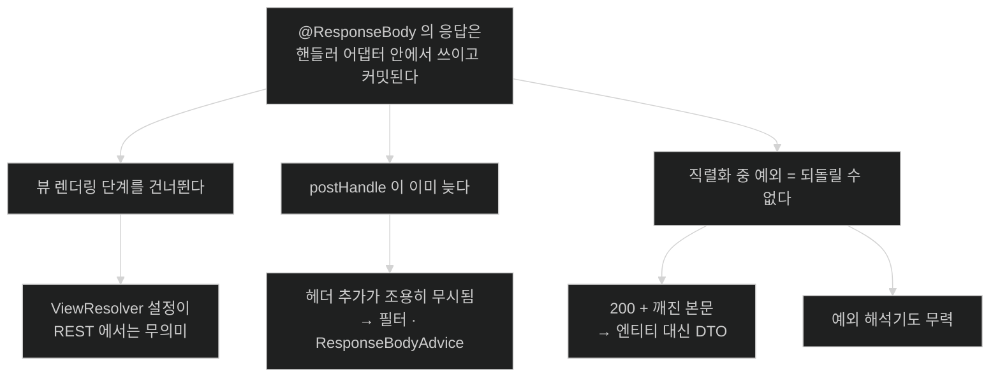

# chapter-c3 개념 지도 — MVC 요청 파이프라인

> 목차가 아니라 관계도다. 세션을 열 때와 닫을 때 항상 펼친다.
>
> 이 챕터가 답하는 한 문장짜리 질문: **"HTTP 요청이 들어와서 응답이 나가기까지, 내 코드는 어느 지점에서 실행되고 그 앞뒤에는 무엇이 있는가?"**

## 축 1: 하나의 타임라인 — 다섯 노트가 모두 같은 선 위에 있다

```text
  요청 ─▶ 필터 ─▶ DispatcherServlet ─▶ 매핑 ─▶ 인터셉터 ─▶ 어댑터 ─▶ 컨트롤러
                                                              │
                              ┌───────────────────────────────┘
                              ▼
                         인자 해석 ─▶ 메서드 실행 ─▶ 반환값 처리 ─▶ 컨버터
                                                                      │
                                                            ★ 여기서 응답 커밋
                                                                      │
                              ┌───────────────────────────────────────┘
                              ▼
                        postHandle ─▶ (뷰 렌더링) ─▶ afterCompletion ─▶ 필터 ─▶ 응답
                              ▲
                    예외 발생 시 ─▶ 예외 해석기 체인

   [05]      [01]        [02]        [05]      [02·03]     [03]      [04]     [05]
```

| 구간 | 이 구간에서만 할 수 있는 일 | 노트 |
|---|---|---|
| 필터 | 요청·응답 **래핑**, 인코딩, 인증 | [[05-exception-resolution-and-filter-vs-interceptor]] |
| 매핑 | 핸들러 선택, 인터셉터 결정 | [[02-handlermapping-and-handleradapter]] |
| `preHandle` | 요청 **차단**(`false` 반환), 핸들러를 알고 분기 | [[05-exception-resolution-and-filter-vs-interceptor]] |
| 인자 해석 | 파라미터를 값으로 채우기 | [[03-argument-resolvers-and-return-value-handlers]] |
| 컨버터 | 객체 ↔ 본문 변환, 형식 결정 | [[04-httpmessageconverter-and-content-negotiation]] |
| 커밋 이후 | **아무것도 못 한다** | [[05-exception-resolution-and-filter-vs-interceptor]] |

- **핵심 질문**: 내가 하려는 일은 커밋 전인가 후인가?

## 축 2: 이 챕터의 함정은 전부 "커밋 시점"에서 나온다



**세 함정이 하나의 사실에서 나온다.** 이 사실 하나를 붙들면 셋을 따로 외울 필요가 없다.

- **핵심 질문**: 응답은 아직 안 나갔는가?

## 축 3: 층위 — 무엇을 알 수 있는가로 갈린다

각 층이 무엇을 **알 수 있는지**가 그 층에서 할 수 있는 일을 결정한다.

| 층 | 요청을 아는가 | 핸들러를 아는가 | 반환값을 아는가 | 응답을 고칠 수 있는가 |
|---|---|---|---|---|
| 서블릿 필터 | ✅ | ❌ | ❌ | ✅ (래핑 시) |
| `preHandle` | ✅ | ✅ | ❌ | ✅ |
| 인자 해석기 | ✅ | ✅ | ❌ | — |
| 반환값 처리기 | ✅ | ✅ | ✅ | ✅ |
| `ResponseBodyAdvice` | ✅ | ✅ | ✅ | ✅ **마지막 기회** |
| `postHandle` | ✅ | ✅ | ✅ | ❌ (REST) |
| 예외 해석기 | ✅ | ✅ | — | 커밋 전이면 ✅ |

**표를 아래로 읽으면 아는 것이 늘어나고, 고칠 수 있는 힘은 줄어든다.** 이 트레이드오프가 층을 고르는 기준이다 — 핸들러를 알아야 하면 안쪽으로, 응답을 손대야 하면 바깥쪽이나 컨버터 직전으로.

- **핵심 질문**: 이 일을 하려면 무엇을 알아야 하는가?

## 축 4: 상태 코드로 역추적하기

응답 코드가 어느 단계에서 실패했는지를 말해 준다.

| 코드 | 실패한 단계 | 봐야 할 것 | 노트 |
|---|---|---|---|
| 404 | 매핑 — 조건에 맞는 핸들러 없음 | 경로·HTTP 메서드 | [[02-handlermapping-and-handleradapter]] |
| 405 | 매핑 — 경로는 맞고 메서드가 안 맞음 | `@GetMapping` vs `@PostMapping` | [[02-handlermapping-and-handleradapter]] |
| 415 | 읽기 컨버터 선택 | 요청의 `Content-Type`, `consumes` | [[04-httpmessageconverter-and-content-negotiation]] |
| 406 | 쓰기 컨버터 선택 | 요청의 `Accept`, `produces` | [[04-httpmessageconverter-and-content-negotiation]] |
| 400 | 인자 해석 — 필수 파라미터·검증 | `@RequestParam` 필수 여부, `@Valid` | [[03-argument-resolvers-and-return-value-handlers]] |
| 500 | 컨트롤러 내부 또는 **직렬화 중** | 스택 트레이스, 엔티티 직렬화 여부 | [[04-httpmessageconverter-and-content-negotiation]] |
| 200 + 깨진 본문 | 직렬화 중 실패 **(커밋 이후)** | 반환 객체의 구조 | [[05-exception-resolution-and-filter-vs-interceptor]] |

**마지막 행이 가장 진단하기 어렵다.** 상태 코드가 정상이라 모니터링에도 안 잡힌다.

- **핵심 질문**: 이 코드는 어느 단계가 낸 것인가?

## 나의 취약 엣지

아직 인출 시도가 없다. 사용자가 노트를 읽고 인출 연습을 한 뒤 채운다. 추정으로 미리 채우지 않는다.

## 앞 챕터에서 이어지는 곳

| 앞 챕터의 결론 | 이 챕터에서의 전개 |
|---|---|
| `DispatcherServlet`은 서블릿 하나다 (w1) | 그 안에서 6단계가 돈다 |
| 컨트롤러도 빈이고 같은 생명주기를 밟는다 (c1) | 그 빈이 HTTP 요청과 매핑 테이블로 연결된다 |
| 프록시는 메서드 실행만 가로챈다 (c2) | 그래서 HTTP 요청 단위 개입은 필터·인터셉터가 맡는다 |
| 판정은 시작 시점에 한 번뿐이다 (c1·c2) | 매핑 테이블도 같은 패턴이다 |
| 컨트롤러도 프록시가 될 수 있다 (c2) | 프록시된 컨트롤러도 핸들러 어댑터를 통해 호출된다 |

## 이 챕터에서 이어지는 곳

| 이 챕터의 결론 | 다음 챕터에서의 전개 |
|---|---|
| 특수 빈 타입을 등록하지 않으면 기본값이 들어온다 | **c4** — 그 기본값을 넣는 것이 자동 구성이다 |
| 메시지 컨버터는 클래스패스에 따라 등록된다 | **c4** — `@ConditionalOnClass`가 그 판정을 한다 |
| `DispatcherServlet` 자체도 누군가 등록한 것이다 | **c4** — `DispatcherServletAutoConfiguration` |
| 조건이 바뀌면 응답 형식이 바뀐다 | **c4** — 조건 평가 결과를 확인하는 방법 |

## 관련 카테고리

- `part-0-web-foundations/chapter-w1-servlet-and-containers` — 서블릿·서블릿 컨테이너·내장 실행이 이 챕터의 **아래층**이다. `DispatcherServlet`이 "서블릿"이라는 사실의 의미가 거기 있다.
- `part-0-spring-core-internals/chapter-c1-container-lifecycle` — 컨트롤러·컨버터·해석기가 전부 빈이다. 그 빈들이 언제 만들어지는지가 c1이다.
- `part-0-spring-core-internals/chapter-c2-aop-proxy-internals` — 컨트롤러에 `@Transactional`을 붙이면 프록시가 된다. 그 프록시가 이 파이프라인의 어디에 끼는지는 두 챕터를 합쳐야 보인다.
- `part-0-jpa-foundations/chapter-j3-performance-and-transactions` — `05-open-session-in-view`가 영속성 컨텍스트의 수명을 이 파이프라인의 어디까지 늘릴지를 다룬다. 직렬화 시점에 지연 로딩이 되는지가 그 설정에 달려 있다.
- `part-1-the-basics-of-spring-boot/chapter-2-creating-web-and-api-applications-with-spring-boot` — 책이 다루는 컨트롤러 작성법이 이 파이프라인 위에 올라간다.
