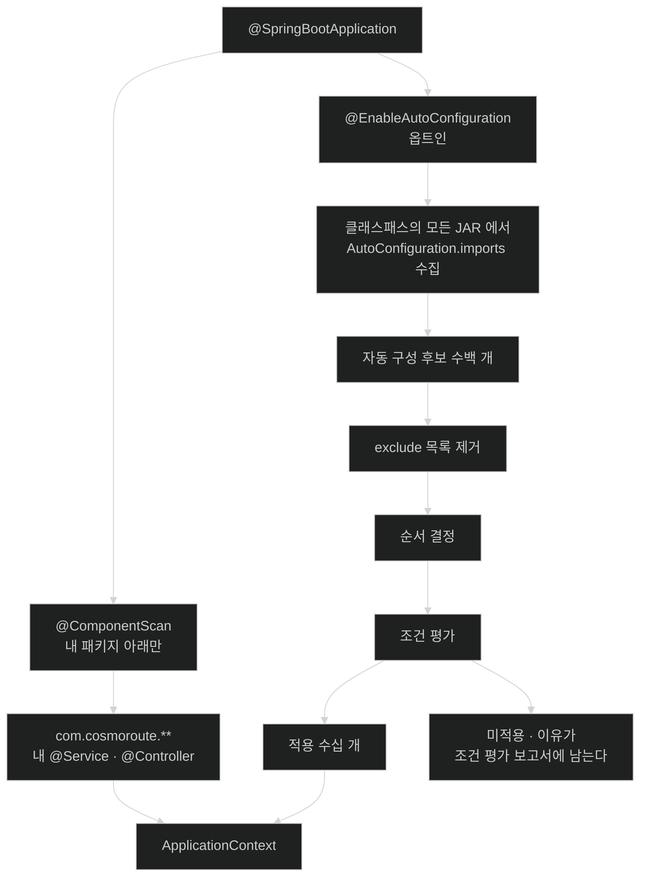

# 자동 구성 후보는 어디에 적혀 있는가 — imports 파일

## 한눈에 보기

| 질문 | 핵심 답 |
|---|---|
| 자동 구성 클래스는 컴포넌트 스캔으로 찾나? | **절대 아니다.** 공식 문서가 스캔 대상이 되면 안 된다고 못박는다. |
| 그럼 어떻게 찾나? | JAR 안의 **[[임포트-파일]]** 한 줄씩 적힌 목록으로만 찾는다. |
| 왜 스캔이 아닌가? | 자동 구성은 **남의 JAR 안**에 있다. 스캔 범위를 거기까지 넓힐 수 없다. |
| 목록에 있으면 적용되나? | 아니다. **후보**일 뿐이고 조건을 통과해야 적용된다. |
| 후보가 몇 개나 되나? | 수백 개. 그중 수십 개만 적용된다. |
| 특정 자동 구성을 끄려면? | `@SpringBootApplication(exclude = ...)` 또는 `spring.autoconfigure.exclude`. |

## 1. 왜 이게 필요한가

### 출발 장면: 내 패키지 밖의 클래스가 빈을 등록한다

`@SpringBootApplication`은 컴포넌트 스캔을 켠다. 그 스캔 범위는 **그 클래스가 있는 패키지와 그 하위**다.

```java
package com.cosmoroute;

@SpringBootApplication          // com.cosmoroute 아래를 스캔한다
public class CosmoRouteApplication { ... }
```

그런데 시작하면 `DataSource`, `EntityManagerFactory`, `ObjectMapper`, `DispatcherServlet`이 전부 빈으로 등록돼 있다. 이 클래스들은 `com.cosmoroute` 아래에 하나도 없다. **전부 `org.springframework.boot.*` 패키지의 JAR 안에 있다.**

스캔 범위 밖의 클래스가 어떻게 빈을 등록했을까? `@ComponentScan`의 `basePackages`에 Spring 패키지를 추가한 적도 없다.

### 여기서 뭐가 무너지나

만약 자동 구성이 컴포넌트 스캔으로 발견되는 구조라면, 그것을 쓰려면 스캔 범위를 라이브러리 패키지까지 넓혀야 한다.

```java
@ComponentScan({"com.cosmoroute", "org.springframework.boot.autoconfigure"})   // 이렇게?
```

이러면 세 가지가 망가진다.

- **원하지 않는 빈이 딸려 온다.** 그 패키지의 `@Component`가 조건 없이 전부 등록된다. 조건부 적용이라는 자동 구성의 핵심이 무너진다.
- **시작이 느려진다.** 클래스패스의 수천 개 클래스를 스캔하고 애노테이션을 읽어야 한다.
- **의존성을 추가할 때마다 스캔 목록을 손봐야 한다.** 라이브러리마다 패키지 이름이 다르다.

무엇보다 **순서 문제**가 있다. 컴포넌트 스캔으로 발견된 빈은 사용자 빈과 뒤섞여 등록되므로, "사용자가 이미 만들었는가"를 판정할 안정된 시점이 없어진다. [[02-conditional-evaluation-and-backoff]]에서 볼 back-off가 성립하지 않는다.

### 그래서 나온 생각

**"내가 스캔해서 찾는다" 대신 "라이브러리가 자기 목록을 신고한다"로 뒤집는다.** 각 JAR이 자기 안에 "내가 제공하는 자동 구성은 이것들이다"라는 목록 파일을 넣어 두고, Boot는 클래스패스의 모든 JAR에서 그 파일을 읽어 모은다.

비유하자면 **호텔 컨시어지의 제휴 업체 목록**이다. 컨시어지가 도시를 직접 돌아다니며 식당을 찾는 것(스캔)이 아니라, 제휴한 업체들이 자기 정보를 등록해 둔 바인더를 넘겨보는 것이다. 새 업체가 제휴하면 바인더에 한 줄이 추가될 뿐, 컨시어지의 절차는 그대로다.

→ 비유가 깨지는 지점: 바인더에 실린 업체는 영업 중이면 곧바로 안내할 수 있다. 자동 구성 후보는 **목록에 있어도 대개 적용되지 않는다.** 수백 개 중 수십 개만 조건을 통과한다. 목록은 "가능한 것"의 목록이지 "적용될 것"의 목록이 아니다 — 이 구분이 [[02-conditional-evaluation-and-backoff]]의 출발점이다.

## 2. 어떻게 동작하는가

### 2.1 후보가 모이고 걸러지는 순서

1. **`@EnableAutoConfiguration`(또는 그것을 포함한 `@SpringBootApplication`)이 자동 구성을 켠다.** — 공식 문서 표현으로 자동 구성은 **옵트인**이다. 명시적으로 켜지 않으면 아무 일도 일어나지 않는다.
2. **클래스패스의 모든 JAR에서 [[임포트-파일]]을 찾아 읽는다.** — 어떤 라이브러리가 무엇을 제공하는지는 그 라이브러리만 알기 때문이다.
3. **읽은 클래스 이름들을 [[자동-구성-후보]] 목록으로 만든다.** — 평가할 대상 집합이 확정돼야 다음 단계로 갈 수 있기 때문이다.
4. **`exclude`·`spring.autoconfigure.exclude`에 지정된 것을 목록에서 뺀다.** — 사용자가 명시적으로 거부한 것을 평가할 이유가 없기 때문이다.
5. **[[03-autoconfiguration-ordering-and-user-precedence]]의 규칙으로 순서를 정한다.** — 조건 평가가 "지금까지 처리된 것"에 의존하므로 순서가 결과를 바꾸기 때문이다.
6. **각 후보의 [[조건-애노테이션]]을 평가해 통과한 것만 적용한다.** — 클래스패스에 없는 기술의 설정을 등록하면 시작이 실패하기 때문이다.

**1번의 "옵트인"이 자주 잊힌다.** `@SpringBootApplication`이 세 애노테이션(`@SpringBootConfiguration` + `@EnableAutoConfiguration` + `@ComponentScan`)의 묶음이라 자동으로 되는 것처럼 보일 뿐, 실제로는 명시적 활성화다.

### 2.2 imports 파일의 정확한 위치와 형식

```text
JAR 내부 구조

  spring-boot-autoconfigure-4.0.3.jar
   └── META-INF/
        └── spring/
             └── org.springframework.boot.autoconfigure.AutoConfiguration.imports
```

파일 내용은 클래스 이름 한 줄씩이다.

```text
org.springframework.boot.autoconfigure.jdbc.DataSourceAutoConfiguration
org.springframework.boot.autoconfigure.orm.jpa.HibernateJpaAutoConfiguration
org.springframework.boot.autoconfigure.web.servlet.DispatcherServletAutoConfiguration
...
```

공식 문서의 규정은 이렇다 — Boot는 발행된 JAR 안에 이 파일이 있는지 확인하며, 파일에는 **한 줄에 클래스 이름 하나씩** 설정 클래스들을 나열해야 한다.

### 2.3 "스캔 대상이 되면 안 된다"는 강한 금지

공식 문서가 세 가지를 연달아 금지한다.

- 자동 구성은 **임포트 파일에 이름이 적히는 것으로만** 로드되어야 한다.
- 특정 패키지 공간에 정의해 **컴포넌트 스캔의 대상이 절대 되지 않도록** 해야 한다.
- 자동 구성 클래스 자신이 추가 컴포넌트를 찾기 위해 **컴포넌트 스캔을 켜서도 안 된다.**

세 번째가 특히 중요하다. 자동 구성이 스캔을 켜면 그 스캔이 사용자 패키지까지 훑을 수 있고, 그러면 사용자 빈이 예상 밖의 시점에 등록되어 [[02-conditional-evaluation-and-backoff]]의 순서 보장이 깨진다.

이 금지가 실무에 주는 함의가 있다. **자동 구성 클래스를 실수로 스캔 범위 안에 두면 조건과 무관하게 등록될 수 있다.** 스타터를 직접 만든다면 자동 구성 클래스를 애플리케이션 패키지와 확실히 분리해야 한다.

### 2.4 후보를 목록에서 빼는 세 가지 방법

```java
// ① 클래스가 클래스패스에 있을 때
@SpringBootApplication(exclude = { DataSourceAutoConfiguration.class })
public class CosmoRouteApplication { }
```

```java
// ② 클래스가 클래스패스에 없을 때 — 문자열로
@SpringBootApplication(excludeName = { "org.springframework.boot.autoconfigure.jdbc.DataSourceAutoConfiguration" })
public class CosmoRouteApplication { }
```

```properties
# ③ 프로퍼티로 — 환경별로 다르게 할 수 있다
spring.autoconfigure.exclude=org.springframework.boot.autoconfigure.jdbc.DataSourceAutoConfiguration
```

공식 문서는 ②를 클래스가 클래스패스에 없을 때의 방법으로 명시하고, 애노테이션 수준과 프로퍼티 양쪽에서 제외를 정의할 수 있다고 적는다.

**제외는 대개 마지막 수단이다.** 자동 구성은 [[백오프]]로 물러나도록 설계돼 있으므로, 사용자 빈을 정의하는 것만으로 대체되는 경우가 대부분이다. 제외가 필요한 것은 "이 기능 자체가 아예 없어야 하는" 경우다 — 예를 들어 데이터베이스를 안 쓰는데 JPA 스타터가 전이 의존성으로 딸려 온 상황.

### 2.5 이름의 유래

**imports**는 "가져오기"다. Spring의 `@Import` 애노테이션이 설정 클래스를 명시적으로 가져오는 것과 같은 어법이며, 실제로 이 목록은 `@Import` 메커니즘 위에서 처리된다. "스캔해서 발견"이 아니라 **"명시적으로 가져옴"**이라는 성격이 이름에 담겨 있다.

파일 이름이 `org.springframework.boot.autoconfigure.AutoConfiguration.imports`로 긴 것도 의도적이다. **애노테이션의 정규화된 이름 자체가 파일 이름**이라, 다른 종류의 임포트 목록이 생겨도 충돌하지 않는다.

## 3. 그림으로 보기

### 스캔과 임포트 목록의 경계



### 왜 목록 파일인가

```text
[만약 컴포넌트 스캔이었다면]

  @ComponentScan({"com.cosmoroute", "org.springframework.boot.autoconfigure", ...})
                                     ▲
                                     └── 의존성 추가할 때마다 여기에 한 줄씩?

  문제 1. 조건 없이 전부 등록된다 → 조건부 적용이라는 핵심이 사라진다
  문제 2. 수천 개 클래스를 스캔 → 시작이 느려진다
  문제 3. 사용자 빈과 뒤섞여 등록 → "이미 있는가" 판정 시점이 불안정해진다


[실제 — 각 JAR 이 자기 목록을 신고한다]

  spring-boot-autoconfigure.jar
    └── META-INF/spring/....AutoConfiguration.imports
         DataSourceAutoConfiguration
         HibernateJpaAutoConfiguration
         DispatcherServletAutoConfiguration      ← 이 JAR 이 제공하는 것

  내가 만든 스타터.jar
    └── META-INF/spring/....AutoConfiguration.imports
         CosmoRouteMetricsAutoConfiguration      ← 내 스타터가 제공하는 것

  → Boot 는 클래스패스 전체에서 이 파일들을 모아 하나의 후보 목록으로 만든다.
    의존성을 추가하는 것만으로 후보가 늘어나고, 내 코드는 한 줄도 안 바뀐다.
    "스타터를 추가하면 알아서 된다"는 경험의 정체가 이것이다.

  → 그리고 결정적으로, 이 목록은 사용자 빈 정의가 전부 등록된 **뒤에**
    평가된다. 그 순서 보장이 back-off 를 가능하게 한다.
```

## 4. 이 노트에 나온 용어

| 용어 | 한 줄 풀이 | 자세히 |
|---|---|---|
| 자동 구성 후보 | `@EnableAutoConfiguration`이 평가 대상으로 올리는 설정 클래스 | [[_glossary#자동-구성-후보]] |
| 임포트 파일 | 후보 목록이 한 줄씩 적힌 JAR 안의 `AutoConfiguration.imports` | [[_glossary#임포트-파일]] |

## 5. 자주 헷갈리는 것

### `@SpringBootApplication`은 하나가 아니라 셋이다

| 구성 애노테이션 | 하는 일 | 이 챕터와의 관계 |
|---|---|---|
| `@SpringBootConfiguration` | 이 클래스가 설정 클래스임을 표시 | — |
| `@ComponentScan` | **내 패키지 아래**를 스캔 | 자동 구성과 무관 |
| `@EnableAutoConfiguration` | **임포트 파일 기반** 후보 수집 | 이 챕터의 주제 |

**두 발견 메커니즘이 완전히 분리돼 있다는 것**이 요점이다. 내 빈은 스캔으로, 라이브러리의 빈은 목록 파일로 온다.

### 후보 목록에 있다 ≠ 적용된다

가장 흔한 오해다. 후보는 수백 개이고 적용은 수십 개다. "그 자동 구성 클래스가 JAR에 있는데 왜 안 되지?"라는 질문의 답은 거의 항상 **조건 불통과**이며, 그 이유는 [[04-condition-evaluation-report]]에서 확인한다.

### `spring.factories`는 옛 방식이다

Boot 2.7 이전에는 `META-INF/spring.factories`의 `EnableAutoConfiguration` 키에 목록을 적었다. 지금은 `AutoConfiguration.imports`가 표준이다. 오래된 블로그나 예제를 볼 때 이 차이를 알아두면 혼란이 준다.

### 제외(exclude)와 백오프는 다른 것이다

| 축 | exclude | [[백오프]] |
|---|---|---|
| 하는 일 | 후보 목록에서 **제거** | 조건 평가에서 **불통과** |
| 시점 | 조건 평가 **전** | 조건 평가 **중** |
| 트리거 | 명시적 지정 | 사용자 빈의 존재 |
| 쓸 때 | 기능 자체가 없어야 할 때 | 기본값만 바꾸고 싶을 때 |

대부분의 커스터마이징에는 백오프면 충분하다.

## 6. 언제 안 쓰나 / 경계

- **자동 구성 클래스를 애플리케이션 패키지 안에 두지 않는다.** 스캔에 걸리면 조건과 무관하게 등록될 수 있다. 공식 문서가 명시적으로 금지한다.
- **자동 구성 클래스에서 컴포넌트 스캔을 켜지 않는다.** 같은 이유이며, 순서 보장까지 깨진다.
- **`exclude`를 습관적으로 쓰지 않는다.** 대부분은 사용자 빈 정의만으로 대체된다. 제외는 기능 자체를 없애야 할 때다.
- **`@ComponentScan`의 범위를 라이브러리 패키지로 넓히지 않는다.** 자동 구성이 조건 없이 등록되어 예측 불가능해진다.
- **`spring.factories`를 새로 쓰지 않는다.** 현행 방식은 `AutoConfiguration.imports`다.
- **후보 목록을 직접 조작하려 하지 않는다.** 필요한 것은 대개 조건 하나이거나 사용자 빈 하나다.

## 7. 연결

- [[02-conditional-evaluation-and-backoff]] — 후보가 **실제로 적용될지**를 정하는 다음 단계다. 이 노트가 "무엇이 후보인가"까지, 그 노트가 "후보 중 무엇이 적용되는가"를 답한다.
- [[03-autoconfiguration-ordering-and-user-precedence]] — 이 노트의 5단계(순서 결정)의 확대이며, 자동 구성이 사용자 빈보다 **나중에** 처리된다는 보장이 왜 필요한지를 다룬다.
- [[04-condition-evaluation-report]] — "후보에 있는데 왜 적용 안 됐지?"에 답하는 도구다. 이 노트에서 생긴 질문을 실제로 확인하는 방법이 거기 있다.

## 8. 스스로 확인

1. 내 패키지 밖의 클래스가 빈을 등록하는 메커니즘을 설명할 수 있는가?
2. 자동 구성을 컴포넌트 스캔으로 찾는다면 무엇이 무너지는가? 세 가지를 말할 수 있는가?
3. 임포트 파일의 정확한 경로와 형식은?
4. 공식 문서가 금지하는 세 가지는 무엇이고, 세 번째가 특히 중요한 이유는?
5. `@SpringBootApplication`의 세 구성 요소와 각각의 역할은?
6. "후보 목록에 있다"와 "적용된다"의 차이는?
7. 후보를 목록에서 빼는 세 가지 방법과, 그것이 백오프와 다른 점은?
8. "옵트인"이라는 성격이 뜻하는 바는?
9. `imports`라는 이름이 "스캔"과 대비해 무엇을 말하고 있는가?


> 아홉 문항을 스스로 답한 **뒤에** [[_01-enableautoconfiguration-and-imports-file]]에서 모범답안과 대조한다. 먼저 열면 이 문항들은 다시 인출 문제로 쓸 수 없다.

<!-- ==== 아래는 내 영역 · 스킬 수정 금지 ==== -->

## 내 설명 시도


## 막혔던 지점


## 리뷰 이력
