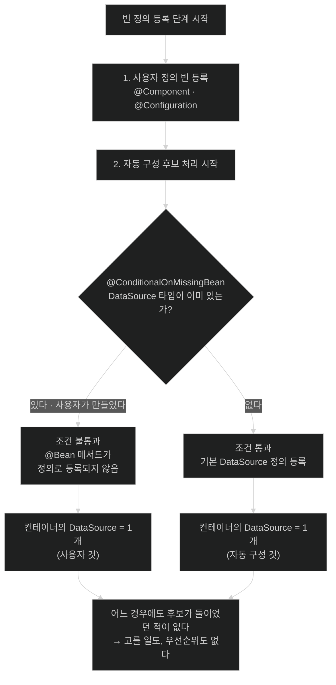

# back-off는 양보가 아니라 조건이다

## 한눈에 보기

| 질문 | 핵심 답 |
|---|---|
| 내 `DataSource` 빈을 만들면 왜 자동 구성이 물러나나? | 양보하는 것이 아니라 `@ConditionalOnMissingBean` 조건이 **불통과**한 것이다. |
| 그럼 우선순위 규칙이 있는 건가? | 없다. **"없으면 만든다"가 곧 "있으면 안 만든다"**일 뿐이다. |
| 조건은 언제 평가되나? | 빈 정의가 등록되는 단계. 인스턴스가 만들어지기 **전**이다. |
| 조건 평가의 위험한 성질은? | **지금까지 처리된 것을 기준으로** 평가한다. 순서에 민감하다. |
| 그래서 공식 문서의 권고는? | 빈 조건은 **자동 구성 클래스에만** 쓴다. |
| 클래스 조건이 안전한 이유는? | 클래스패스는 시작 내내 안 바뀌므로 순서와 무관하다. |

## 1. 왜 이게 필요한가

### 출발 장면: 내 `@Bean` 하나가 자동 구성 전체를 바꾼다

Boot는 아무 설정 없이도 `DataSource`를 만들어 준다. 그런데 커넥션 풀 설정을 직접 잡으려고 빈을 하나 정의했다.

```java
@Configuration
public class DataSourceConfig {

    @Bean
    public DataSource dataSource() {
        HikariConfig config = new HikariConfig();
        config.setJdbcUrl("jdbc:postgresql://localhost/cosmoroute");
        config.setMaximumPoolSize(20);
        return new HikariDataSource(config);
    }
}
```

이제 애플리케이션에는 `DataSource`가 **하나만** 있다. Boot가 만들던 것은 사라졌다. 충돌도 없고, `@Primary`를 붙인 적도 없고, 경고도 없다.

여기서 흔한 오해가 생긴다 — "Spring이 사용자 빈을 **우선시**하는구나." 그렇게 이해하면 다음 질문에 답할 수 없다.

- 그 우선순위는 어디에 적혀 있나?
- 내가 만든 빈의 이름이 `dataSource`가 아니라 `myPool`이어도 물러나나?
- 내가 만든 빈이 `@Lazy`라면? prototype이라면?

### 여기서 뭐가 무너지나

**"우선순위"라는 모델이 틀렸다.** 우선순위가 있으려면 두 빈이 모두 존재하고 그중 하나를 고르는 단계가 있어야 하는데, 실제로는 **애초에 하나만 만들어진다.**

일어난 일은 훨씬 단순하다. `DataSourceAutoConfiguration`의 `@Bean` 메서드에 `@ConditionalOnMissingBean`이 붙어 있고, 조건 평가 시점에 이미 `DataSource` 타입의 빈 정의가 있었으므로 **조건이 불통과했다.** 그래서 그 `@Bean` 메서드는 빈 정의로 등록조차 되지 않았다.

공식 문서는 이 성질을 자동 구성의 정체성으로 규정한다 — 자동 구성은 **비침습적(non-invasive)**이며, 어느 시점에든 자기 설정을 정의해 자동 구성의 특정 부분을 대체할 수 있다. 자기 `DataSource` 빈을 추가하면 **기본 내장 데이터베이스 지원이 물러난다.**

이것이 **[[백오프]]**(= 사용자가 같은 역할의 빈을 직접 정의하면 자동 구성이 물러나는 동작)이고, 메커니즘은 조건 하나다.

비유하자면 **"우산이 없으면 사 온다"는 규칙**이다. 집에 우산이 있으면 안 사 온다. 이건 "집에 있는 우산을 더 좋아해서"가 아니라 조건문이 그렇게 생겼기 때문이다. 규칙에는 우산의 품질을 비교하는 부분이 아예 없다.

→ 비유가 깨지는 지점: 사람은 집 우산이 부러진 걸 보면 규칙을 어기고 새로 산다. 조건 평가에는 그런 판단이 없다. **내 `DataSource`가 잘못 설정돼 있어도 자동 구성은 그대로 물러난다.** 조건은 "있는가"만 보고 "쓸 만한가"는 보지 않는다.

### 그래서 나온 생각

우선순위 시스템을 따로 만들지 않고, **조건 하나로 "기본값 제공"과 "사용자 우선"을 동시에 표현한다.** `@ConditionalOnMissingBean`은 읽는 방향에 따라 두 뜻이 된다.

- 자동 구성의 관점: "없으면 내가 만들어 준다" → 편의성
- 사용자의 관점: "내가 만들면 넌 빠져라" → 제어권

같은 한 줄이 둘 다다. 별도의 override 메커니즘도, 우선순위 설정도 필요 없다.

## 2. 어떻게 동작하는가

### 2.1 조건 애노테이션의 종류

**[[조건-애노테이션]]**(= 자동 구성 후보가 실제로 적용될지를 판정하는 `@Conditional*` 계열)을 성격별로 묶으면 이렇다.

| 무리 | 애노테이션 | 무엇을 보나 | 순서에 민감한가 |
|---|---|---|---|
| 클래스 | `@ConditionalOnClass`, `@ConditionalOnMissingClass` | 클래스패스 | **아니다** |
| 빈 | `@ConditionalOnBean`, `@ConditionalOnMissingBean` | 지금까지 등록된 빈 정의 | **매우 그렇다** |
| 프로퍼티 | `@ConditionalOnProperty`, `@ConditionalOnBooleanProperty` | `Environment` 값 | 아니다 |
| 리소스 | `@ConditionalOnResource` | 파일·클래스패스 리소스 | 아니다 |
| 웹 | `@ConditionalOnWebApplication`, `@ConditionalOnNotWebApplication`, `@ConditionalOnWarDeployment` | 애플리케이션 타입 | 아니다 |
| 표현식 | `@ConditionalOnExpression` | SpEL 결과 | 경우에 따라 |

**"순서에 민감한가" 열이 이 노트의 핵심이다.** 클래스패스는 시작 내내 바뀌지 않으므로 언제 평가하든 답이 같다. 등록된 빈 정의는 **평가하는 시점마다 달라진다.**

### 2.2 왜 빈 조건만 위험한가

공식 문서의 경고가 정확하다 — *"빈 정의가 추가되는 순서에 매우 주의해야 한다. 이 조건들은 **지금까지 처리된 것을 기준으로** 평가되기 때문이다. 이런 이유로 `@ConditionalOnBean`과 `@ConditionalOnMissingBean` 애노테이션은 **자동 구성 클래스에만** 사용할 것을 권한다 — 자동 구성 클래스는 어떤 사용자 정의 빈 정의든 추가된 **뒤에** 로드되는 것이 보장되기 때문이다."*

단계로 풀면 이렇다.

1. **사용자 설정(`@Component` 스캔, `@Configuration`)의 빈 정의가 먼저 전부 등록된다.** — 자동 구성이 "사용자가 이미 만들었는가"를 판정하려면 그 답이 확정돼 있어야 하기 때문이다.
2. **그다음 자동 구성 후보들이 순서대로 처리된다.** — 이 순서 보장이 없으면 back-off가 우연에 좌우되기 때문이다.
3. **각 후보의 조건을 평가한다. 빈 조건은 이 시점까지 등록된 정의를 본다.** — 아직 처리되지 않은 후보가 나중에 등록할 빈은 보이지 않기 때문이다.
4. **통과한 것의 `@Bean` 메서드가 빈 정의로 등록된다.** — 정의 단계가 끝나야 인스턴스화로 넘어갈 수 있기 때문이다.
5. **모든 정의가 확정된 뒤에야 인스턴스가 만들어진다.** — c1의 정의 단계와 인스턴스 단계 구분 그대로다.

> **조건 평가가 두 단계로 나뉘어 있다.** 위 3번을 더 정확히 말하면, Spring은 조건 평가 시점을 두 국면으로 구분한다 — 설정 클래스를 파싱하는 국면과, 빈 정의를 등록할지 판정하는 국면이다. **`OnBeanCondition`(즉 `@ConditionalOnBean`·`@ConditionalOnMissingBean`)은 뒤쪽 국면에서만 평가된다.** 어떤 빈 정의가 모였는지 알아야 "없다"를 판정할 수 있기 때문이다. 클래스·프로퍼티 조건은 앞쪽에서도 평가될 수 있다.
>
> 이 구분이 §2.2의 "지금까지 처리된 것을 기준으로"에 구체적인 이름을 준다. 책 트랙 `part-1-the-basics-of-spring-boot/chapter-1-core-features-of-spring-boot/01-autoconfiguring-spring-beans`가 이 두 국면을 이름으로 짚는다.

**3번의 "이 시점까지"가 위험의 근원이다.** 자동 구성 A가 자동 구성 B의 빈을 `@ConditionalOnBean`으로 기다린다면, A가 B보다 나중에 처리돼야 한다. 그 순서를 보장하는 것이 [[03-autoconfiguration-ordering-and-user-precedence]]다.

**사용자 코드에서 `@ConditionalOnMissingBean`을 쓰면 안 되는 이유**도 여기서 나온다. 사용자 설정은 1단계에 처리되는데, 그때는 자동 구성이 아직 아무것도 등록하지 않았다. 그래서 "자동 구성이 만든 빈이 없으면 내가 만들겠다"는 의도로 쓰면 **항상 조건이 통과해** 의도와 반대로 동작한다.

### 2.3 클래스 조건이 여는 문

`@ConditionalOnClass`가 자동 구성의 첫 관문인 이유가 있다.

```java
@AutoConfiguration
@ConditionalOnClass({ DataSource.class, EmbeddedDatabaseType.class })
public class DataSourceAutoConfiguration { ... }
```

만약 이 조건이 없다면, JDBC를 안 쓰는 애플리케이션에서도 이 클래스가 로드되면서 `DataSource` 타입을 참조하려다 `NoClassDefFoundError`가 난다.

그런데 여기에 닭과 달걀이 있다. **조건을 읽으려면 애노테이션을 읽어야 하고, 애노테이션 값이 `Class` 객체인데 그 클래스가 없다면?** 리플렉션으로 읽는 순간 터진다.

Spring은 이것을 **애노테이션 메타데이터를 바이트코드에서 읽는 것**으로 푼다. 애노테이션에 적힌 값을 `Class` 객체가 아니라 **클래스 이름 문자열**로 꺼내므로, 없는 클래스를 참조해도 읽는 단계에서는 아무 일도 일어나지 않는다. 그다음 그 이름이 클래스패스에 있는지만 확인한다.

정확히 말하면 **"아무것도 로드하지 않는다"가 아니라 "자동 구성 클래스 자신을 로드하지 않고도 판정할 수 있다"**이다. 조건이 불통과하면 그 설정 클래스는 끝까지 로드되지 않고, 그래서 `NoClassDefFoundError`가 나지 않는다.

이 성질이 "의존성을 추가하면 기능이 켜진다"는 경험을 만든다. **스타터를 추가하는 것 = 클래스패스에 클래스가 생기는 것 = 클래스 조건이 통과하는 것.**

### 2.4 클래스 레벨 조건과 메서드 레벨 조건의 차이

공식 문서가 미묘한 차이를 짚는다 — *"`@ConditionalOnBean`과 `@ConditionalOnMissingBean`은 `@Configuration` 클래스가 **생성되는 것 자체를 막지는 않는다.** 클래스 레벨에서 이 조건을 쓰는 것과 포함된 각 `@Bean` 메서드에 애노테이션을 붙이는 것의 유일한 차이는, 전자는 조건이 맞지 않을 때 **`@Configuration` 클래스가 빈으로 등록되는 것**을 막는다는 점이다."*

실무적으로는 이렇게 갈린다.

| 위치 | 효과 | 언제 |
|---|---|---|
| 클래스 레벨 | 조건 불통과 시 설정 클래스 자체가 빈으로 등록 안 됨 | 그 설정 전체가 무의미할 때 |
| 메서드 레벨 | 그 `@Bean`만 등록 안 됨 | 일부만 대체 가능하게 할 때 |

Boot의 자동 구성이 **메서드 레벨을 많이 쓰는** 이유가 이것이다. 사용자가 `DataSource`만 직접 만들고 나머지(트랜잭션 매니저 등)는 자동 구성에 맡기는 부분 대체가 가능해야 하기 때문이다.

### 2.5 이름의 유래

**back off**는 "물러서다·손을 떼다"라는 뜻의 일상 표현이다. 공식 문서가 쓰는 *"backs away"*도 같은 뉘앙스다. 싸워서 진 것이 아니라 **자리를 비켜 준다**는 어감이다.

그런데 이 이름이 만드는 오해가 이 노트의 출발점이었다. "물러난다"는 말은 **행위자가 판단해서 양보한다**는 인상을 준다. 실제로는 아무도 판단하지 않는다 — 조건문의 결과일 뿐이다. **이름이 은유이고 메커니즘은 조건이라는 것**을 구분해야 앞의 세 질문("이름이 달라도 되나?" 등)에 답할 수 있다.

## 3. 그림으로 보기

### 우선순위가 아니라 조건이다



### 순서 민감성 — 왜 사용자 코드에서 쓰면 안 되나

```text
[정상 — 자동 구성 클래스에 쓸 때]

  시간 ──────────────────────────────────────────▶

  ① 사용자 빈 정의 등록
       DataSource(내 것) 등록됨
                    │
  ② 자동 구성 처리   │
       @ConditionalOnMissingBean 평가 ◀── 여기서 "있다"고 보인다 ✅
       → 불통과 → 물러남
                                          의도대로 동작


[오작동 — 사용자 코드에 쓸 때]

  시간 ──────────────────────────────────────────▶

  ① 사용자 빈 정의 등록
       내 @Configuration 안의
       @ConditionalOnMissingBean 평가 ◀── 자동 구성이 아직 아무것도
                                          등록하지 않았다 → "없다" ❌
       → 항상 통과 → 내 빈이 항상 등록됨
                    │
  ② 자동 구성 처리   │
       @ConditionalOnMissingBean 평가 → "있다" → 물러남

  → 결과적으로는 내 빈이 남지만, 이건 우연이다.
    "자동 구성 것이 없으면 내가"라는 의도는 절대 표현할 수 없다.
    조건이 항상 통과하기 때문이다.

  → 공식 문서가 "자동 구성 클래스에만 쓰라"고 하는 이유가 이것이다.
    그 클래스들만이 "사용자 빈이 전부 등록된 뒤"라는 시점을 보장받는다.
```

## 4. 이 노트에 나온 용어

| 용어 | 한 줄 풀이 | 자세히 |
|---|---|---|
| 조건 애노테이션 | 자동 구성 후보가 적용될지를 판정하는 `@Conditional*` 계열 | [[_glossary#조건-애노테이션]] |
| 백오프 | 사용자가 같은 역할의 빈을 정의하면 자동 구성이 물러나는 동작 | [[_glossary#백오프]] |

## 5. 자주 헷갈리는 것

### 백오프 vs `@Primary` vs `exclude`

세 가지 모두 "내 것을 쓰겠다"는 목적이지만 층이 다르다.

| 축 | 백오프 | `@Primary` | `exclude` |
|---|---|---|---|
| 빈이 몇 개 생기나 | **1개** | **2개 이상** | 1개(내 것) |
| 언제 작동 | 조건 평가 중 | 주입 시점 | 후보 수집 직후 |
| 자동 구성이 | 물러남 | 그대로 등록됨 | 목록에서 제거됨 |
| 쓸 때 | 기본값 대체 | 여러 개가 정말 필요할 때 | 기능 자체 제거 |

**`@Primary`가 필요하다는 것은 대개 백오프가 안 됐다는 신호다.** 자동 구성이 물러났다면 애초에 하나뿐이라 `@Primary`가 필요 없다.

### 조건은 품질을 보지 않는다

`@ConditionalOnMissingBean`은 "그 타입의 빈 정의가 있는가"만 본다. 그 빈이 잘못 설정돼 있어도, `@Lazy`여도, prototype이어도 **존재하면 조건은 불통과**한다. 자동 구성이 "더 나은 대안"으로 다시 들어오는 일은 없다.

### 이름이 아니라 타입으로 판정한다

내 빈 이름이 `dataSource`가 아니라 `myConnectionPool`이어도 백오프는 일어난다. `@ConditionalOnMissingBean`의 기본 판정 기준은 **타입**이기 때문이다. `name` 속성으로 이름 기준 판정을 지정할 수도 있지만 기본은 타입이다.

### 조건 평가 시점 ≠ 빈 생성 시점

조건은 **정의 단계**에서 평가된다(c1의 2.1 참고). 그래서 조건 안에서 다른 빈의 **인스턴스**를 보려 하면 안 된다 — 아직 아무것도 안 만들어졌다. 프로퍼티 값은 볼 수 있지만(`Environment`는 이미 준비됨) 빈의 상태는 볼 수 없다.

## 6. 언제 안 쓰나 / 경계

- **사용자 코드에 `@ConditionalOnMissingBean`을 쓰지 않는다.** 공식 문서가 자동 구성 클래스에만 쓰라고 권한다. 사용자 설정 단계에서는 항상 통과해 의도와 반대로 동작한다.
- **조건으로 "더 나은 것 고르기"를 표현하려 하지 않는다.** 조건은 존재 여부만 본다.
- **`@Primary`로 백오프를 대체하지 않는다.** 빈이 둘 생겨 자원이 낭비되고, 어느 것이 쓰이는지 추적이 어려워진다.
- **조건 안에서 빈 인스턴스에 접근하지 않는다.** 정의 단계라 존재하지 않는다.
- **`@ConditionalOnExpression`을 남용하지 않는다.** SpEL은 컴파일 시점 검증이 없어 오타가 런타임까지 간다. 전용 조건 애노테이션으로 표현되면 그쪽을 쓴다.
- **조건이 왜 불통과했는지 추측하지 않는다.** [[04-condition-evaluation-report]]가 이유를 문장으로 알려 준다.

## 7. 연결

- [[01-enableautoconfiguration-and-imports-file]] — 이 노트의 조건 평가는 그 노트가 모은 후보 목록을 대상으로 한다. "후보"와 "적용"을 가르는 것이 이 노트다.
- [[03-autoconfiguration-ordering-and-user-precedence]] — 빈 조건이 순서에 민감하다는 이 노트의 사실이 그 노트가 존재하는 이유다. 순서 보장 없이는 백오프가 성립하지 않는다.
- [[04-condition-evaluation-report]] — 조건이 통과했는지 안 했는지, 안 했다면 왜인지를 실제로 확인하는 방법이다. 이 노트의 메커니즘을 눈으로 보는 도구다.

## 8. 스스로 확인

1. 내 `DataSource` 빈을 만들었을 때 자동 구성 것이 사라지는 과정을, "우선순위"라는 말을 쓰지 않고 설명할 수 있는가?
2. 빈이 두 개 생겼다가 하나가 선택되는 것이 아니라는 점을 어떻게 알 수 있는가?
3. 조건 애노테이션 중 순서에 민감한 것은 무엇이고 왜인가?
4. 클래스 조건이 순서와 무관한 이유는?
5. 공식 문서가 빈 조건을 자동 구성 클래스에만 쓰라고 하는 이유를 시간축으로 설명할 수 있는가?
6. 사용자 코드에 `@ConditionalOnMissingBean`을 쓰면 왜 항상 통과하는가?
7. 클래스 레벨 조건과 메서드 레벨 조건의 차이는? Boot가 메서드 레벨을 많이 쓰는 이유는?
8. 백오프·`@Primary`·`exclude`가 각각 몇 개의 빈을 만드는가?
9. 내 빈 이름이 달라도 백오프가 되는 이유는?
10. "back off"라는 이름이 만드는 오해는 무엇인가?


> 열 문항을 스스로 답한 **뒤에** [[_02-conditional-evaluation-and-backoff]]에서 모범답안과 대조한다. 먼저 열면 이 문항들은 다시 인출 문제로 쓸 수 없다.

<!-- ==== 아래는 내 영역 · 스킬 수정 금지 ==== -->

## 내 설명 시도


## 막혔던 지점


## 리뷰 이력
