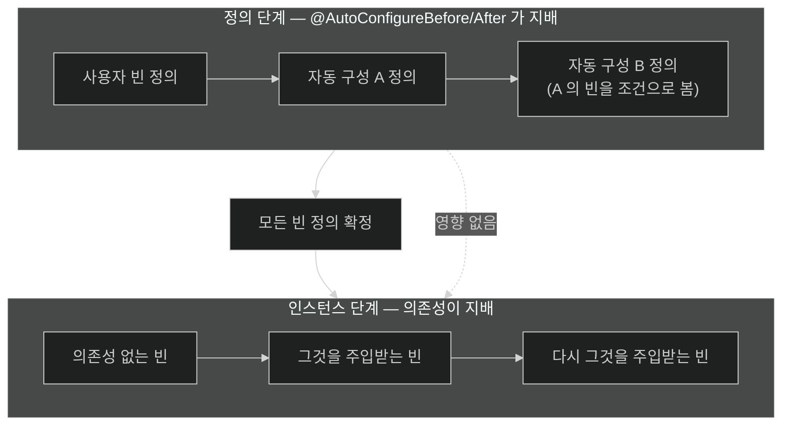

# 순서가 정하는 것과 정하지 않는 것

## 한눈에 보기

| 질문 | 핵심 답 |
|---|---|
| `@AutoConfigureAfter`는 무엇을 정하나? | **빈이 정의되는 순서.** 만들어지는 순서가 아니다. |
| 그럼 생성 순서는 누가 정하나? | 각 빈의 **의존성**과 `@DependsOn` 관계다. |
| 왜 순서가 필요한가? | 빈 조건이 **"지금까지 처리된 것"**을 보기 때문이다. |
| 자동 구성과 사용자 빈의 순서는? | 사용자 빈이 **항상 먼저**. 이 보장이 back-off의 전제다. |
| 순서 지정 방법은 몇 가지? | 셋. `@AutoConfiguration` 속성, 전용 애노테이션, `@AutoConfigureOrder`. |
| `@Order`를 쓰면 되나? | 자동 구성에는 **`@AutoConfigureOrder`**가 따로 있다. |

## 1. 왜 이게 필요한가

### 출발 장면: `@AutoConfigureAfter`를 붙였는데 여전히 순서가 틀리다

스타터를 만들면서 자동 구성 두 개를 짰다. `MetricsAutoConfiguration`이 `DataSourceAutoConfiguration`의 `DataSource`를 써야 한다.

```java
@AutoConfiguration(after = DataSourceAutoConfiguration.class)
public class CosmoRouteMetricsAutoConfiguration {

    @Bean
    public PoolMetricsCollector poolMetrics(DataSource dataSource) {
        return new PoolMetricsCollector(dataSource);   // 여기까진 잘 된다
    }
}
```

여기까지는 의도대로다. 그런데 다른 요구가 생겼다 — `PoolMetricsCollector`가 **`DataSource`보다 먼저 초기화되면 안 된다.** 초기화 시점에 커넥션을 한 번 열어 보기 때문이다.

`@AutoConfiguration(after = ...)`이 붙어 있으니 순서가 보장될 거라 생각했는데, 로그를 보면 초기화 순서가 매번 다르다. 어떤 실행에서는 메트릭 수집기가 먼저 초기화된다.

### 여기서 뭐가 무너지나

**"순서"라는 말이 두 가지를 가리키는데 그 둘을 섞었다.**

공식 문서가 이 구분을 명확히 적는다 — *"표준 `@Configuration` 클래스와 마찬가지로, 자동 구성 클래스가 적용되는 순서는 **그 빈들이 정의되는 순서에만 영향을 준다.** 그 빈들이 이후에 **생성되는 순서는 영향받지 않으며**, 각 빈의 의존성과 `@DependsOn` 관계가 결정한다."*

c1에서 본 두 단계 구분이 그대로 적용된다.

| 단계 | 무엇이 일어나나 | 무엇이 순서를 정하나 |
|---|---|---|
| **정의 단계** | 빈 정의가 레지스트리에 등록됨 | **[[자동-구성-순서]]** |
| **인스턴스 단계** | 실제 객체가 만들어짐 | **의존성**과 `@DependsOn` |

출발 장면의 첫 번째 요구(`DataSource`를 주입받기)는 정의 단계 문제였다 — `DataSource` **정의**가 먼저 있어야 조건이 통과하고 주입 대상을 찾을 수 있다. 그래서 `after`가 효과가 있었다.

두 번째 요구(초기화 순서)는 인스턴스 단계 문제다. **`after`는 여기에 아무 영향이 없다.**

비유하자면 **책의 목차 순서와 읽는 순서**다. 목차에서 3장이 5장보다 앞에 있다는 것은 편집 순서를 말할 뿐, 독자가 반드시 3장을 먼저 읽는다는 뜻은 아니다. 독자는 필요에 따라 5장부터 펼친다.

→ 비유가 깨지는 지점: 책은 독자가 마음대로 순서를 정하지만, 빈 생성 순서는 **의존 관계가 강제**한다. `PoolMetricsCollector`가 생성자에서 `DataSource`를 받는다면 그 순서는 반드시 지켜진다. 즉 "아무렇게나"가 아니라 **"다른 규칙이 지배한다"**는 것이 정확한 표현이다. 그래서 해법도 명확하다 — **생성 순서를 원하면 의존성으로 표현하면 된다.**

### 그래서 나온 생각

순서 지정 수단을 **정의 단계 전용**으로 한정하고, 생성 순서는 의존 관계라는 이미 있는 메커니즘에 맡긴다. 그러면 순서 애노테이션이 하는 일이 명확해지고, 생성 순서를 강제하려는 사람은 자연스럽게 의존성을 명시하게 된다.

## 2. 어떻게 동작하는가

### 2.1 왜 정의 순서가 필요한가

[[02-conditional-evaluation-and-backoff]]에서 본 사실 하나가 순서를 필수로 만든다 — **빈 조건은 "지금까지 처리된 것"을 기준으로 평가된다.**

```java
@AutoConfiguration
@ConditionalOnBean(DataSource.class)          // DataSource 정의가 이미 있어야 통과
public class CosmoRouteMetricsAutoConfiguration { ... }
```

이 조건이 `DataSourceAutoConfiguration`보다 **먼저** 평가되면 "없다"가 되어 불통과한다. 클래스패스도 프로퍼티도 문제없는데 순서 하나로 기능이 통째로 사라진다. 그것도 조용히.

그래서 순서 지정이 필요하고, 그 순서는 **정의 단계**에서만 의미가 있다. 조건 평가가 정의 단계에 일어나기 때문이다.

### 2.2 순서를 정하는 세 가지 수단

1. **`@AutoConfiguration`의 속성.** 공식 문서 표현으로 설정이 특정 순서로 적용돼야 하면 `before`·`beforeName`·`after`·`afterName` 속성을 쓴다. — 자동 구성 선언과 순서 선언을 한 자리에 두어 흩어지지 않게 하기 위해서다.
2. **전용 애노테이션 `@AutoConfigureBefore`·`@AutoConfigureAfter`.** — 같은 역할이며, 애노테이션을 분리해 쓰는 기존 스타일을 유지하기 위해서다.
3. **`@AutoConfigureOrder`.** 문서 표현으로 **서로를 직접 알지 못하는** 자동 구성들의 순서를 정할 때 쓰며, 일반 `@Order`와 같은 의미이되 **자동 구성 전용 순서**를 제공한다. — 상대 클래스 이름을 참조할 수 없는 경우(순환 의존이 되거나 클래스패스에 없을 수 있는 경우)에도 순서를 표현해야 하기 때문이다.

`beforeName`·`afterName`이 문자열을 받는 것도 같은 이유다. **상대 클래스가 클래스패스에 없을 수 있으므로** 타입 참조 대신 이름으로 지정한다.

### 2.3 사용자 빈이 항상 먼저인 이유

[[백오프]]가 성립하려면 반드시 지켜져야 하는 순서가 하나 더 있다 — **사용자 정의 빈이 자동 구성보다 먼저 처리되는 것.**

공식 문서가 이를 보장으로 명시한다. 빈 조건을 자동 구성 클래스에만 쓰라고 권하는 근거가 *"자동 구성 클래스는 어떤 사용자 정의 빈 정의든 추가된 **뒤에** 로드되는 것이 보장되기 때문"*이다.

```text
① @ComponentScan 으로 발견된 사용자 빈 정의
② @Configuration 클래스의 @Bean 정의
   ─────────────────────────── 여기까지가 사용자 영역 ───────────────────────────
③ 자동 구성 후보들 (자기들끼리는 @AutoConfigureBefore/After 순서)
```

이 경계가 있어서 자동 구성의 `@ConditionalOnMissingBean`이 **항상 사용자 빈을 볼 수 있다.** 반대로 사용자 코드에서 같은 조건을 쓰면 ①·② 단계라 자동 구성 것이 아직 없어 의미가 없다 — [[02-conditional-evaluation-and-backoff]]에서 본 오작동이 이 그림으로 설명된다.

### 2.4 생성 순서를 정말 강제해야 한다면

**[[정의-순서]]**(= 빈 정의가 레지스트리에 등록되는 순서)가 아니라 생성 순서가 필요한 경우의 선택지다.

| 방법 | 어떻게 | 언제 |
|---|---|---|
| **의존성으로 표현** | 필요한 빈을 생성자 인자로 받는다 | **대부분의 경우 — 정석** |
| `@DependsOn` | 이름으로 선행 빈을 지정 | 의존성이 코드에 안 드러나는 경우(정적 초기화 등) |
| `SmartLifecycle` | 컨테이너 시작 후 단계별 실행 | 컨테이너 전체가 준비된 뒤여야 할 때 |
| `ApplicationRunner` | 모든 빈 완성 후 1회 실행 | 시작 작업 |

출발 장면의 두 번째 요구는 **첫 번째 방법으로 이미 해결돼 있었다.** `PoolMetricsCollector`가 생성자로 `DataSource`를 받으므로, 그 빈이 만들어지려면 `DataSource`가 먼저 있어야 한다.

문제는 다른 데 있었을 가능성이 높다 — 초기화 시점에 커넥션을 여는 것 자체가 위험한 설계다. c1에서 봤듯 초기화 콜백은 프록시 이전이고, 다른 빈의 완성 상태를 가정할 수 없다. **그런 작업은 `ApplicationRunner`로 옮기는 것이 맞다.**

### 2.5 이름의 유래

**`@AutoConfigureBefore`/`@AutoConfigureAfter`**의 `AutoConfigure` 접두어가 범위를 말한다. 일반 `@Order`와 이름을 나눈 것은 **적용 대상이 다르기 때문**이다 — `@Order`는 같은 타입의 빈 여럿을 정렬할 때(인터셉터 체인, `BeanPostProcessor` 순서 등) 쓰이고, `@AutoConfigureOrder`는 자동 구성 클래스의 처리 순서만 다룬다.

이름을 나누지 않았다면 한 클래스에 붙은 `@Order`가 두 가지 의미로 해석될 수 있었다. 접두어가 그 모호함을 없앤다.

## 3. 그림으로 보기

### 두 개의 "순서"



### 순서 보장의 세 층

```text
  ┌─ ① 사용자 빈 정의 ────────────────────────────────────┐
  │   @ComponentScan · @Configuration 의 @Bean            │
  │                                                        │
  │   ⚠ 이 단계의 @ConditionalOnMissingBean 은            │
  │     자동 구성 것을 볼 수 없다 (아직 없음)             │
  └────────────────────────────────────────────────────────┘
                        │  이 경계가 back-off 의 전제다
                        ▼
  ┌─ ② 자동 구성 후보 처리 ───────────────────────────────┐
  │                                                        │
  │   DataSourceAutoConfiguration                          │
  │     @ConditionalOnMissingBean(DataSource) ◀── ① 을 본다 ✅
  │        │                                               │
  │        │ @AutoConfigureAfter(DataSourceAutoConfiguration)
  │        ▼                                               │
  │   CosmoRouteMetricsAutoConfiguration                   │
  │     @ConditionalOnBean(DataSource) ◀── 위 결과를 본다 ✅ │
  └────────────────────────────────────────────────────────┘
                        │  여기까지가 전부 "정의"다
                        ▼
  ┌─ ③ 인스턴스 생성 ─────────────────────────────────────┐
  │                                                        │
  │   PoolMetricsCollector(DataSource ds)                  │
  │        ▲                                               │
  │        └── 생성자가 요구하므로 DataSource 가 먼저 생성됨 │
  │            ← 이 순서는 @AutoConfigureAfter 와 무관하다  │
  └────────────────────────────────────────────────────────┘

  → ②의 순서는 "누가 무엇을 볼 수 있는가"를 정한다.
    ③의 순서는 "무엇이 먼저 존재해야 하는가"를 정한다.
    둘은 다른 질문이고, 다른 도구가 답한다.
```

## 4. 이 노트에 나온 용어

| 용어 | 한 줄 풀이 | 자세히 |
|---|---|---|
| 자동 구성 순서 | 자동 구성 후보들이 평가·적용되는 순서 | [[_glossary#자동-구성-순서]] |
| 정의 순서 | 빈 정의가 레지스트리에 등록되는 순서. 생성 순서와 다르다 | [[_glossary#정의-순서]] |

## 5. 자주 헷갈리는 것

### `@Order` vs `@AutoConfigureOrder`

| 축 | `@Order` | `@AutoConfigureOrder` |
|---|---|---|
| 대상 | 같은 타입 빈들의 정렬 | 자동 구성 클래스의 처리 순서 |
| 예 | 인터셉터·필터·`BeanPostProcessor` | 자동 구성 후보 |
| 단계 | 주로 사용 시점 | 정의 단계 |

자동 구성 클래스에 `@Order`를 붙이면 의도한 효과가 안 난다. 접두어가 붙은 쪽을 쓴다.

### `@AutoConfigureAfter`와 `@DependsOn`

| 축 | `@AutoConfigureAfter` | `@DependsOn` |
|---|---|---|
| 정하는 것 | 정의 순서 | **생성 순서** |
| 대상 | 자동 구성 클래스 | 빈 |
| 지정 방식 | 클래스·이름 | 빈 이름 |
| 조건 평가에 영향 | **있다** | 없다 |

"내 빈이 저 빈보다 나중에 **만들어져야** 한다"면 `@DependsOn`(또는 그냥 의존성)이고, "내 조건이 저 자동 구성의 결과를 **봐야** 한다"면 `@AutoConfigureAfter`다.

### 순서를 지정했는데 조건이 여전히 불통과라면

순서 문제가 아닐 수 있다. 클래스 조건이나 프로퍼티 조건에서 이미 걸렸을 가능성이 크다. **추측하지 말고 [[04-condition-evaluation-report]]로 확인한다** — 어느 조건이 왜 불통과했는지 문장으로 나온다.

### 순환 순서는 지정할 수 없다

A가 B 뒤에, B가 A 뒤에 오라고 하면 순서를 정할 수 없다. c1의 순환 참조와 같은 형태의 문제이며, 이 경우 설계를 다시 봐야 한다 — 대개 공통 부분을 제3의 자동 구성으로 빼는 것이 답이다.

## 6. 언제 안 쓰나 / 경계

- **`@AutoConfigureAfter`로 생성 순서를 강제하려 하지 않는다.** 정의 순서만 바뀐다. 생성 순서는 의존성으로 표현한다.
- **애플리케이션 코드의 `@Configuration`에 `@AutoConfigureAfter`를 붙이지 않는다.** 자동 구성 클래스 전용이며, 사용자 설정은 이미 자동 구성보다 먼저 처리된다.
- **초기화 콜백에서 다른 빈의 완성 상태를 가정하지 않는다.** 시작 작업은 `ApplicationRunner`로 옮긴다.
- **순서로 해결하려 하기 전에 조건을 의심한다.** 대부분의 "왜 안 되지"는 순서가 아니라 조건 불통과다.
- **순서 지정을 촘촘히 쌓지 않는다.** 자동 구성 간 순서 제약이 늘수록 스타터를 조합했을 때 순환이 생기기 쉽다.
- **`@Order`와 `@AutoConfigureOrder`를 혼용하지 않는다.** 층이 다르다.

## 7. 연결

- [[02-conditional-evaluation-and-backoff]] — 빈 조건이 "지금까지 처리된 것"을 본다는 그 노트의 사실이 이 노트가 존재하는 이유다. 순서가 곧 조건 평가의 입력이다.
- [[01-enableautoconfiguration-and-imports-file]] — 그 노트의 5단계(순서 결정)가 이 노트의 주제다. 후보 수집과 조건 평가 사이에 놓인 단계다.
- [[04-condition-evaluation-report]] — 순서가 의도대로 적용됐는지, 조건이 통과했는지를 확인하는 유일한 확실한 방법이다. 추측 대신 보고서를 읽는다.

## 8. 스스로 확인

1. `@AutoConfigureAfter`가 정하는 것과 정하지 않는 것을 구분해 말할 수 있는가?
2. 생성 순서는 무엇이 정하는가?
3. 정의 순서가 필요한 이유를 조건 평가와 연결해 설명할 수 있는가?
4. 순서를 정하는 세 가지 수단과 각각을 쓰는 상황은?
5. `beforeName`·`afterName`이 문자열을 받는 이유는?
6. 사용자 빈이 자동 구성보다 먼저 처리된다는 보장이 없으면 무엇이 무너지는가?
7. 생성 순서를 강제해야 할 때의 선택지 네 가지는? 정석은 무엇인가?
8. `@Order`와 `@AutoConfigureOrder`를 구분해야 하는 이유는?
9. `@AutoConfigureAfter`와 `@DependsOn`은 각각 어떤 질문에 답하는가?
10. 순서를 지정했는데도 조건이 불통과라면 무엇을 의심해야 하는가?


> 열 문항을 스스로 답한 **뒤에** [[_03-autoconfiguration-ordering-and-user-precedence]]에서 모범답안과 대조한다. 먼저 열면 이 문항들은 다시 인출 문제로 쓸 수 없다.

<!-- ==== 아래는 내 영역 · 스킬 수정 금지 ==== -->

## 내 설명 시도


## 막혔던 지점


## 리뷰 이력
