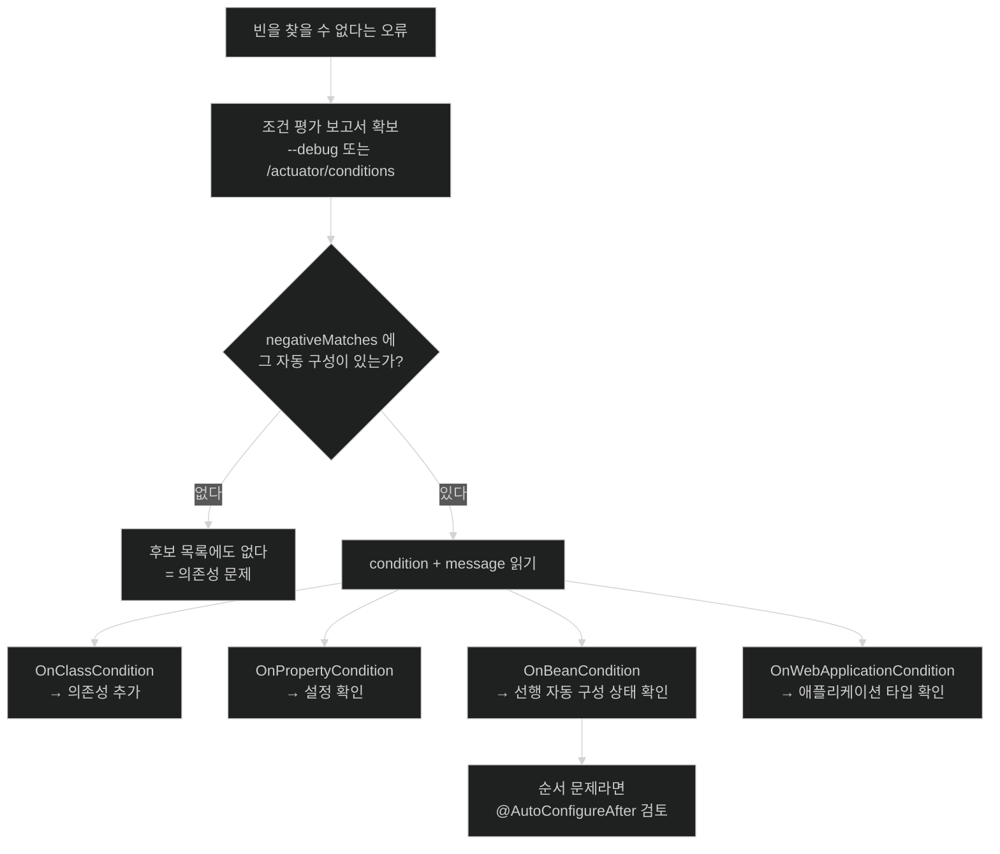

# 왜 그 빈이 없는가 — 조건 평가 보고서 읽기

## 한눈에 보기

| 질문 | 핵심 답 |
|---|---|
| "그 빈이 없다"는 오류를 만나면? | 소스를 뒤지지 말고 **[[조건-평가-보고서]]**를 읽는다. |
| 어떻게 보나? | `--debug`로 시작하거나 `/actuator/conditions`를 호출한다. |
| 보고서에 뭐가 있나? | `positiveMatches`, `negativeMatches`, `unconditionalClasses` 세 부분. |
| 가장 중요한 부분은? | **`negativeMatches`.** 왜 적용되지 않았는지가 문장으로 있다. |
| 메시지는 어떻게 생겼나? | `@ConditionalOnProperty (server...) did not find property '...'` 형태. |
| 진단에서 제외해도 되는 것은? | **[[무조건-클래스]]** — 조건이 없어 항상 적용되는 것들. |

## 1. 왜 이게 필요한가

### 출발 장면: 있어야 할 빈이 없다는데 이유를 모른다

Redis 캐시를 붙이려고 의존성을 넣고 프로퍼티를 설정했다. 그런데 기동이 실패한다.

```text
Parameter 0 of constructor in com.cosmoroute.catalog.MaterialService
required a bean of type 'org.springframework.data.redis.core.RedisTemplate'
that could not be found.
```

여기서 대부분 이렇게 한다 — 의존성이 제대로 들어갔는지 `./gradlew dependencies`로 확인하고, 프로퍼티 이름의 오타를 찾고, `RedisAutoConfiguration` 소스를 열어 `@Conditional*` 애노테이션을 하나씩 읽으며 어느 조건에서 걸렸을지 추측한다.

**소스를 읽어 추측하는 것이 문제다.** 조건 애노테이션은 중첩돼 있고, 메타 애노테이션으로 숨어 있기도 하고, 다른 자동 구성의 결과에 의존하기도 한다. 추측이 맞았는지 확인할 방법도 없다.

그런데 **Spring Boot는 이미 답을 갖고 있다.** 모든 조건을 평가하면서 그 결과와 이유를 전부 기록해 두었기 때문이다.

### 여기서 뭐가 무너지나

추측으로 진단하면 세 가지가 어긋난다.

- **조건이 여러 개 중첩돼 있으면 어느 것이 먼저 걸렸는지 모른다.** 클래스 조건에서 이미 탈락했는데 프로퍼티 이름을 몇 시간씩 들여다본다.
- **다른 자동 구성의 결과에 의존하는 조건은 소스만으로 판정할 수 없다.** `@ConditionalOnBean`은 [[03-autoconfiguration-ordering-and-user-precedence]]에서 봤듯 순서에 따라 결과가 달라진다.
- **"적용됐는데 다른 이유로 안 되는 경우"와 구별할 수 없다.** 자동 구성은 정상 적용됐고 빈 이름이 예상과 다른 것뿐일 수도 있다.

공식 문서가 이 상황을 정확히 짚는다 — *"Spring Boot 자동 구성은 '옳은 일을 하려고' 최선을 다하지만, 때때로 실패하고 **왜 그런지 알기 어려울 수 있다.**"* 그리고 곧바로 도구를 알려 준다 — *"모든 Spring Boot `ApplicationContext`에 정말 유용한 `ConditionEvaluationReport`가 있다."*

비유하자면 **비행 기록 장치**다. 사고 원인을 승무원의 기억에 의존해 재구성하는 대신, 모든 계기값이 이미 기록돼 있으므로 그것을 읽으면 된다. 추측할 필요가 없다.

→ 비유가 깨지는 지점: 블랙박스는 사고가 나야 열어 본다. 조건 평가 보고서는 **문제가 없을 때 읽는 것이 더 유용하다.** "지금 무엇이 켜져 있는지"를 알면 애초에 사고가 줄고, 의존성을 추가했을 때 무엇이 따라 들어왔는지도 보인다.

### 그래서 나온 생각

조건을 평가하면서 **그 결과와 이유를 함께 기록**해 둔다. 그러면 "왜 안 됐나"라는 질문이 "기록을 읽는다"로 바뀐다. 추측이 사실 확인으로 바뀌는 것이 이 도구의 값어치다.

## 2. 어떻게 동작하는가

### 2.1 보고서를 보는 두 가지 방법

**① `--debug` 스위치**

공식 문서 표현으로, 현재 어떤 자동 구성이 적용되고 있고 **왜** 그런지 알고 싶으면 `--debug` 스위치로 애플리케이션을 시작한다. 그러면 선택된 코어 로거들의 디버그 로그가 켜지고 **콘솔에 조건 보고서가 찍힌다.**

```bash
java -jar cosmoroute.jar --debug
# 또는
./gradlew bootRun --args='--debug'
# 또는 시스템 프로퍼티로
java -Ddebug -jar cosmoroute.jar
```

**② Actuator의 `conditions` 엔드포인트**

Actuator를 쓰면 `/actuator/conditions`가 같은 보고서를 JSON으로 렌더링한다. 공식 문서는 이 엔드포인트를 **"애플리케이션을 디버깅하고 Spring Boot가 런타임에 어떤 기능을 추가했는지(그리고 추가하지 않았는지) 보는 데" 쓰라**고 권한다.

```bash
curl localhost:8080/actuator/conditions
```

**실행 중인 애플리케이션을 진단할 때는 ②가 낫다.** 재시작하지 않아도 되고, 운영 환경의 실제 프로파일이 적용된 상태를 볼 수 있다.

### 2.2 보고서의 세 부분

```json
{
  "contexts": {
    "application": {
      "positiveMatches": [
        {
          "condition": "OnClassCondition",
          "message": "@ConditionalOnClass found required class 'org.springframework.web.servlet.DispatcherServlet'"
        }
      ],
      "negativeMatches": [
        {
          "condition": "OnPropertyCondition",
          "message": "@ConditionalOnProperty (server.servlet.session.persistent) did not find property 'server.servlet.session.persistent'"
        }
      ],
      "unconditionalClasses": [
        "org.springframework.boot.autoconfigure.context.ConfigurationPropertiesAutoConfiguration"
      ]
    }
  }
}
```

| 절 | 무엇이 있나 | 언제 보나 |
|---|---|---|
| `positiveMatches` | 조건이 맞아 **적용된** 것 + 그 이유 | "이 기능이 왜 켜졌지?" |
| `negativeMatches` | 조건이 안 맞아 **적용 안 된** 것 + **그 이유** | **"왜 이 빈이 없지?"** |
| [[무조건-클래스]] | 조건이 아예 없어 항상 적용되는 것 | 진단 대상에서 제외 |

**`negativeMatches`가 진단의 핵심이다.** 메시지가 `condition`(어느 조건 종류가 판정했는지)과 `message`(무엇을 찾았고 못 찾았는지)로 이뤄져 있어, 추측 없이 원인을 짚을 수 있다.

### 2.3 출발 장면을 보고서로 푸는 순서

1. **`/actuator/conditions`를 호출하거나 `--debug`로 재시작한다.** — 기록이 있어야 읽을 수 있기 때문이다.
2. **`negativeMatches`에서 `RedisAutoConfiguration`을 찾는다.** — 없다면 애초에 후보 목록에 없었다는 뜻이고, 그건 의존성 문제다([[01-enableautoconfiguration-and-imports-file]]).
3. **그 항목의 `condition`과 `message`를 읽는다.** — 어느 조건이 왜 걸렸는지가 문장으로 있기 때문이다.
4. **조건 종류에 따라 다음 행동을 정한다.** — 원인마다 고칠 자리가 다르기 때문이다.

| `condition` | 뜻 | 고칠 자리 |
|---|---|---|
| `OnClassCondition` | 필요한 클래스가 클래스패스에 없다 | **의존성** |
| `OnPropertyCondition` | 프로퍼티가 없거나 값이 다르다 | **설정 파일** |
| `OnBeanCondition` | 필요한 빈이 없거나, 이미 있어서 물러났다 | **다른 자동 구성의 상태** 또는 내 빈 |
| `OnWebApplicationCondition` | 웹 애플리케이션 타입이 안 맞는다 | 스타터·애플리케이션 타입 |

**3번에서 대부분 끝난다.** 몇 시간짜리 추측이 한 줄 읽기로 바뀐다.

### 2.4 `positiveMatches`도 유용하다

문제가 없을 때도 읽을 이유가 있다.

- **의존성 하나를 추가했을 때 무엇이 따라 켜졌는지** 확인할 수 있다. c3의 `04-httpmessageconverter-and-content-negotiation`에서 본 "XML 의존성을 추가했더니 응답 형식이 바뀐" 사고가 이것으로 미리 잡힌다.
- **내가 끈 줄 알았던 것이 여전히 켜져 있는지** 확인할 수 있다.
- **스타터를 만들 때 내 자동 구성이 의도한 조건에서 켜지는지** 검증할 수 있다.

### 2.5 조건 평가가 기록되는 원리

Spring Boot의 모든 조건은 `SpringBootCondition`을 상속하고, 그 클래스의 `matches()`가 템플릿 메서드로 동작한다.

```java
public final boolean matches(ConditionContext context, AnnotatedTypeMetadata metadata) {
    ConditionOutcome outcome = getMatchOutcome(context, metadata);   // 하위 클래스가 판정
    logOutcome(classOrMethodName, outcome);                          // 로그에 남기고
    recordEvaluation(context, classOrMethodName, outcome);           // 보고서에 기록한다
    return outcome.isMatch();
}
```

`matches()`가 `final`이라는 점이 설계 의도를 말한다 — **판정 로직은 하위 클래스가 바꿀 수 있지만, 기록하는 단계는 건너뛸 수 없다.** 그래서 모든 조건이 예외 없이 보고서에 남는다.

반환 타입이 `boolean`이 아니라 `ConditionOutcome`인 것도 같은 이유다. `true`/`false`만으로는 "왜"를 기록할 수 없다. **판정 결과와 그 이유를 함께 나르는 객체**가 있어야 보고서의 `message`가 만들어진다.

### 2.6 이름의 유래

**condition evaluation report**는 세 단어가 그대로 내용이다 — 조건(condition)을 평가(evaluation)한 결과의 보고서(report). 이름에 은유가 없다.

`positiveMatches`/`negativeMatches`의 "match"는 **포인트컷 매칭과 같은 어법**이다(c2 참고). "조건식이 이 대상과 맞아떨어졌는가"라는 뜻이며, positive/negative는 맞았는지 아닌지를 가리킨다. **`negative`가 "오류"를 뜻하지 않는다는 점**이 중요하다 — 대부분의 `negativeMatches`는 정상이다. 애플리케이션이 안 쓰는 기술의 자동 구성이 안 켜진 것뿐이다.

## 3. 그림으로 보기

### 진단 흐름



### 보고서가 답하는 질문들

```text
  ┌─ positiveMatches ────────────────────────────────────┐
  │  "@ConditionalOnClass found required class            │
  │   'org.springframework.web.servlet.DispatcherServlet'"│
  │                                                       │
  │  → 답하는 질문: "이 기능이 왜 켜졌지?"                 │
  │  → 쓰는 때: 의존성 추가 후 무엇이 따라왔는지 확인      │
  └───────────────────────────────────────────────────────┘

  ┌─ negativeMatches ────────────────────────────────────┐
  │  "@ConditionalOnProperty (server.servlet.session      │
  │   .persistent) did not find property '...'"           │
  │                                                       │
  │  → 답하는 질문: "왜 이 빈이 없지?"  ★ 진단의 핵심      │
  │  → 주의: negative 는 오류가 아니다.                   │
  │          안 쓰는 기술이 안 켜진 것도 여기 있다.        │
  └───────────────────────────────────────────────────────┘

  ┌─ unconditionalClasses ───────────────────────────────┐
  │  "org.springframework.boot.autoconfigure.context      │
  │   .ConfigurationPropertiesAutoConfiguration"          │
  │                                                       │
  │  → 답하는 질문: "조건과 무관하게 항상 켜지는 건?"      │
  │  → 쓰는 때: 진단 후보에서 제외한다                    │
  └───────────────────────────────────────────────────────┘

  → 세 절을 합치면 "이 애플리케이션에서 자동 구성이 무엇을 했고
    무엇을 하지 않았으며 각각 왜인지"가 빠짐없이 나온다.
    소스를 읽어 추측할 이유가 없다.
```

## 4. 이 노트에 나온 용어

| 용어 | 한 줄 풀이 | 자세히 |
|---|---|---|
| 조건 평가 보고서 | 각 자동 구성 후보의 조건이 어떻게 평가됐는지를 담은 기록 | [[_glossary#조건-평가-보고서]] |
| 무조건 클래스 | 조건 애노테이션이 없어 항상 적용되는 자동 구성 클래스 | [[_glossary#무조건-클래스]] |

## 5. 자주 헷갈리는 것

### `negativeMatches`가 많은 것은 정상이다

수백 개의 후보 중 대부분이 여기 들어온다. MongoDB를 안 쓰면 MongoDB 자동 구성이 `negativeMatches`에 있는 것이 **당연하고 옳다.** 목록이 길다고 문제가 아니다. **찾는 것은 "내가 켜지길 기대했는데 여기 있는 항목"** 하나다.

### `conditions` 엔드포인트는 기본 노출이 아니다

Actuator의 대부분 엔드포인트가 그렇듯 HTTP로 노출하려면 설정이 필요하다.

```properties
management.endpoints.web.exposure.include=health,info,conditions
```

**운영 환경에 무심코 노출하지 않는다.** 애플리케이션의 내부 구성이 그대로 드러난다.

### 세 진단 엔드포인트의 역할 분담

| 엔드포인트 | 답하는 질문 |
|---|---|
| `/actuator/conditions` | 자동 구성이 **왜** 됐/안 됐나 |
| `/actuator/beans` | 실제로 **어떤 빈**이 있나 |
| `/actuator/mappings` | 어떤 **요청 경로**가 있나 |
| `/actuator/configprops` | 어떤 **설정 값**이 적용됐나 |

"빈이 없다"면 `conditions`, "빈은 있는데 다른 것 같다"면 `beans`, "404가 난다"면 `mappings`(c3의 `02-handlermapping-and-handleradapter`와 이어진다), "설정이 안 먹는다"면 `configprops`다.

### `--debug`는 로그 레벨 변경이 아니다

`--debug`는 **선택된 코어 로거들만** 디버그로 올리고 조건 보고서를 찍는다. 전체 로그를 디버그로 올리는 `--trace`나 `logging.level.root=DEBUG`와 다르다. 조건 보고서만 필요하면 `--debug`로 충분하다.

## 6. 언제 안 쓰나 / 경계

- **소스를 읽어 조건을 추측하지 않는다.** 보고서가 답을 갖고 있다. 추측은 중첩 조건과 순서 의존 앞에서 무너진다.
- **`conditions` 엔드포인트를 운영 환경에 무방비로 노출하지 않는다.** 내부 구성이 드러난다.
- **`negativeMatches`의 길이를 문제로 보지 않는다.** 대부분 정상이다.
- **보고서로 빈의 상태를 확인하려 하지 않는다.** 보고서는 **정의 단계**의 기록이다. 실제 빈 목록은 `/actuator/beans`, 설정 값은 `/actuator/configprops`가 답한다.
- **`--debug`를 운영 기동 옵션으로 남겨 두지 않는다.** 로그량이 늘고 시작이 느려진다.
- **조건이 통과했는데도 기능이 안 되면 보고서 밖을 본다.** 자동 구성은 정상이고 프로퍼티 값이 틀렸거나, 빈은 있는데 [[백오프]]로 내 빈이 쓰이고 있을 수 있다.

## 7. 연결

- [[02-conditional-evaluation-and-backoff]] — 이 노트는 그 노트의 조건 평가 결과를 **눈으로 보는 방법**이다. 메커니즘을 알아야 보고서의 메시지가 읽힌다.
- [[03-autoconfiguration-ordering-and-user-precedence]] — `OnBeanCondition`이 불통과했을 때 순서 문제인지 판정하려면 그 노트의 내용이 필요하다. 보고서가 증상을, 그 노트가 원인을 설명한다.
- [[01-enableautoconfiguration-and-imports-file]] — 보고서에 아예 안 나타나는 자동 구성은 후보 목록에 없다는 뜻이다. 그때 봐야 할 곳이 그 노트의 임포트 파일과 의존성이다.

## 8. 스스로 확인

1. "빈을 찾을 수 없다"는 오류를 만났을 때 소스를 읽는 것이 왜 나쁜 전략인가? 세 가지를 말할 수 있는가?
2. 보고서를 보는 두 가지 방법과, 실행 중인 애플리케이션에 더 나은 쪽은?
3. 보고서의 세 절과 각각이 답하는 질문은?
4. `negativeMatches` 항목의 `condition` 값에 따라 고칠 자리가 어떻게 달라지는가?
5. `negativeMatches`가 길다는 것이 문제가 아닌 이유는?
6. 보고서에 자동 구성이 **아예 안 나타나면** 무엇을 의심해야 하는가?
7. `SpringBootCondition.matches()`가 `final`인 것이 설계상 무엇을 강제하는가?
8. 반환 타입이 `boolean`이 아니라 `ConditionOutcome`인 이유는?
9. `positiveMatches`를 문제가 없을 때 읽을 이유 세 가지는?
10. 네 개의 진단 엔드포인트가 각각 답하는 질문을 구분할 수 있는가?


> 열 문항을 스스로 답한 **뒤에** [[_04-condition-evaluation-report]]에서 모범답안과 대조한다. 먼저 열면 이 문항들은 다시 인출 문제로 쓸 수 없다.

<!-- ==== 아래는 내 영역 · 스킬 수정 금지 ==== -->

## 내 설명 시도


## 막혔던 지점


## 리뷰 이력
