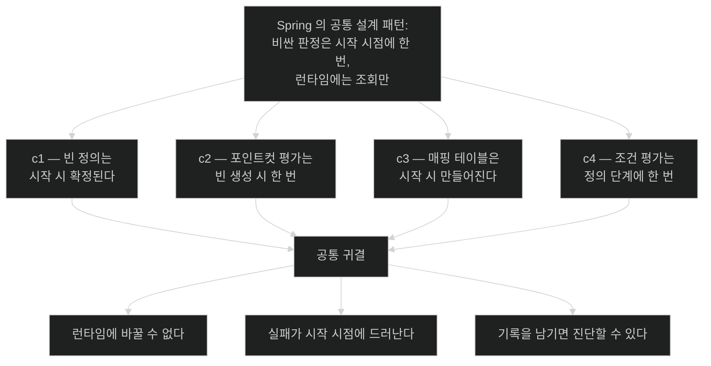

# chapter-c4 개념 지도 — 자동 구성의 내부

> 목차가 아니라 관계도다. 세션을 열 때와 닫을 때 항상 펼친다.
>
> 이 챕터가 답하는 한 문장짜리 질문: **"의존성 하나를 추가했더니 기능이 켜졌다. 무엇이 그 판단을 했고, 안 켜졌을 때 나는 어디를 봐야 하는가?"**

## 축 1: 후보에서 적용까지의 깔때기

```text
   클래스패스의 모든 JAR
        │
        ▼  imports 파일 수집                             [01]
   ┌────────────────────────────────────┐
   │  자동 구성 후보  수백 개            │
   └────────────────────────────────────┘
        │
        ▼  exclude 제거                                  [01]
   ┌────────────────────────────────┐
   │  평가 대상                      │
   └────────────────────────────────┘
        │
        ▼  순서 결정 (사용자 빈 이후 보장)               [03]
   ┌────────────────────────────┐
   │  정렬된 후보                │
   └────────────────────────────┘
        │
        ▼  조건 평가                                     [02]
   ┌──────────────┐        ┌───────────────────────────┐
   │  적용 수십 개 │        │  미적용 — 이유가 기록된다  │  [04]
   └──────────────┘        └───────────────────────────┘
```

| 단계 | 좁히는 기준 | 여기서 걸리면 | 노트 |
|---|---|---|---|
| 후보 수집 | JAR에 imports 파일이 있는가 | 보고서에 **아예 안 나온다** | [[01-enableautoconfiguration-and-imports-file]] |
| 제외 | 명시적 `exclude` | 의도한 것이다 | [[01-enableautoconfiguration-and-imports-file]] |
| 순서 | 다른 후보보다 앞/뒤 | 조건이 잘못된 시점에 평가된다 | [[03-autoconfiguration-ordering-and-user-precedence]] |
| 조건 | 클래스·빈·프로퍼티·웹 | `negativeMatches`에 이유가 남는다 | [[02-conditional-evaluation-and-backoff]] |

- **핵심 질문**: 지금 문제는 이 깔때기의 어느 칸에서 걸렸는가?

## 축 2: 세 가지 "안 켜짐"은 원인이 다르다

증상은 똑같이 "빈이 없다"인데 진단 경로가 갈린다.

| 보고서에서의 모습 | 원인 | 고칠 자리 |
|---|---|---|
| **어디에도 없다** | 후보 목록에 없음 | 의존성 — JAR이 없거나 imports 파일이 없다 |
| `negativeMatches` + `OnClassCondition` | 필요한 클래스가 없음 | 의존성 — 전이 의존성이 빠졌다 |
| `negativeMatches` + `OnPropertyCondition` | 프로퍼티 불일치 | 설정 파일 |
| `negativeMatches` + `OnBeanCondition` (없어서) | 선행 자동 구성이 안 켜짐 | **그 선행 것부터 진단** |
| `negativeMatches` + `OnBeanCondition` (이미 있어서) | 백오프 — 내 빈이 이겼다 | **정상.** 내 빈을 확인 |
| `positiveMatches`에 있는데 안 됨 | 자동 구성은 정상 | 빈 이름·프로퍼티 값·다른 층 |

**네 번째 행이 연쇄 진단의 시작점이다.** `OnBeanCondition`이 "없어서" 불통과했다면 그 빈을 만들었어야 할 자동 구성을 다시 보고서에서 찾는다. 원인이 두세 단계 거슬러 올라가는 일이 흔하다.

- **핵심 질문**: 이건 내 문제인가, 선행 자동 구성의 문제인가, 정상 동작인가?

## 축 3: 같은 패턴의 세 번째 등장 — "시작할 때 한 번"



**part-0-spring-core-internals 네 챕터가 같은 설계 원리의 네 사례다.** 이 패턴을 붙들면 처음 보는 Spring 기능도 "그럼 이건 언제 판정되지?"라는 질문으로 접근할 수 있다.

- **핵심 질문**: 이 판정은 언제 일어나고, 그 뒤에 바꿀 수 있는가?

## 축 4: 커스터마이징 수단의 비용 순서

같은 목적을 이룰 방법이 여럿일 때 싼 것부터 시도한다.

| 수단 | 비용 | 자동 구성이 | 언제 |
|---|---|---|---|
| 프로퍼티 설정 | **가장 낮음** | 그대로 동작 | 값만 바꾸면 될 때 |
| 사용자 빈 정의 (백오프) | 낮음 | 물러남 | 기본 구현을 대체할 때 |
| `@Bean`으로 부분 대체 | 낮음 | **일부만** 물러남 | 한 조각만 바꿀 때 |
| `exclude` | 중간 | 목록에서 제거 | 기능 자체가 없어야 할 때 |
| 자동 구성 직접 작성 | 높음 | 후보에 추가 | 스타터를 만들 때 |

**위에서 아래로 갈수록 되돌리기 어려워진다.** `exclude`를 쓰기 전에 백오프로 되는지 확인하는 습관이 대부분의 복잡도를 막는다.

- **핵심 질문**: 더 싼 수단으로 되는가?

## 나의 취약 엣지

아직 인출 시도가 없다. 사용자가 노트를 읽고 인출 연습을 한 뒤 채운다. 추정으로 미리 채우지 않는다.

## 앞 챕터에서 이어지는 곳

| 앞 챕터의 결론 | 이 챕터에서의 전개 |
|---|---|
| 정의 단계와 인스턴스 단계가 나뉜다 (c1) | 조건 평가가 **정의 단계**에 있다는 위치 확정 |
| 정의를 고칠 틈이 있다 (c1) | 자동 구성이 그 틈에서 정의를 추가한다 |
| 사전 인스턴스화로 실패가 시작 시점에 드러난다 (c1) | 조건 불통과도 같은 시점에 기록된다 |
| `@Configuration(proxyBeanMethods=false)`는 라이트 모드 (c2) | `@AutoConfiguration`이 그것을 쓰는 이유 |
| 특수 빈 타입을 등록 안 하면 기본값이 온다 (c3) | 그 기본값을 넣는 것이 자동 구성이다 |
| 메시지 컨버터는 클래스패스에 따라 등록된다 (c3) | `@ConditionalOnClass`가 그 판정을 한다 |

## part-0-spring-core-internals 트랙이 끝나고 이어지는 곳

| 이 트랙의 산출 | 다음 |
|---|---|
| "언제 판정되는가"를 묻는 습관 | 처음 보는 Spring 기능에도 같은 질문을 적용 |
| 조용한 실패 6종의 진단 경로 | 실무 디버깅에서 추측 대신 도구 사용 |
| 책 트랙 Ch. 1의 "자동 구성"이 실제로 무엇인지 | 책 Ch. 1을 다시 읽으면 표면 서술의 아래가 보인다 |
| 프록시·파이프라인·조건의 연결 | 면접에서 두세 단계 꼬리 질문 방어 |

## 관련 카테고리

- `part-0-spring-core-internals/chapter-c1-container-lifecycle` — 조건 평가가 **정의 단계**에 있다는 사실이 c1 없이는 이해되지 않는다. 이 트랙의 토대다.
- `part-0-spring-core-internals/chapter-c2-aop-proxy-internals` — `@AutoConfiguration`이 라이트 모드인 이유가 거기 있다. 후보 수백 개를 CGLIB로 강화하지 않으려는 결정이다.
- `part-0-spring-core-internals/chapter-c3-mvc-request-pipeline` — 그 챕터의 특수 빈 타입들이 전부 자동 구성으로 등록된다. "설정 안 해도 웹앱이 뜬다"의 정체가 이 챕터다.
- `part-1-the-basics-of-spring-boot/chapter-1-core-features-of-spring-boot` — 책이 결과로 설명한 자동 구성의 내부다. `01-autoconfiguring-spring-beans`와 이 챕터를 나란히 읽으면 표면과 내부가 맞춰진다.
- `part-3/chapter-6-configuring-an-application-with-spring-boot` — 프로퍼티 조건이 환경별 구성과 만나는 지점이다.
- `part-3/chapter-8-going-native-with-spring-boot` — 조건 평가가 빌드 시점으로 옮겨가는 AOT 이야기가 거기 있다.
