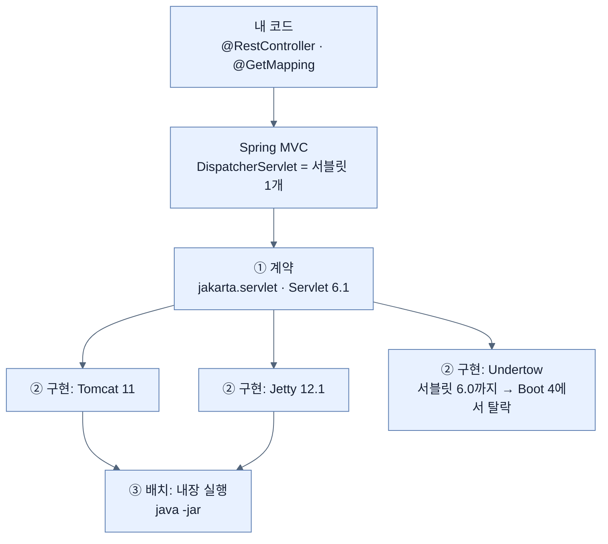
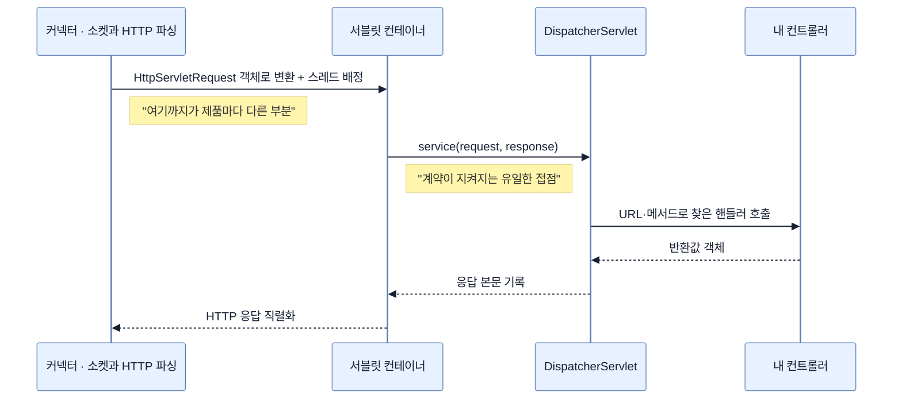

# 서블릿 · 서블릿 컨테이너 · 내장 실행

## 한눈에 보기

| 질문 | 핵심 답 |
|---|---|
| Tomcat·Jetty·Undertow는 "서블릿"과 어떤 관계인가? | 서블릿은 지켜야 할 계약이고, 셋은 그 계약을 각자 구현한 경쟁 제품이다. |
| 그럼 "내장"은 무엇이 내장된 것인가? | 그 제품이 라이브러리로 애플리케이션 jar 안에 들어온 것. 제품이 바뀐 게 아니라 `main()`의 주인이 바뀌었다. |
| 서버를 바꿔도 컨트롤러 코드가 그대로인 이유는? | 내 코드가 서버 제품이 아니라 `jakarta.servlet` 계약에 붙어 있고, Boot가 구현별 팩터리 빈만 갈아 끼우기 때문이다. |
| Boot 4에서 Undertow가 사라진 이유는? | Spring 팀의 취향이 아니라, Undertow의 서블릿 구현이 6.0까지라 6.1 기준선을 못 맞춘 결과다. |
| `server.port`가 서버를 바꿔도 그대로 통하는 이유는? | 공통 팩터리 층이 그 값을 받아 각 제품의 서버 API로 번역하기 때문이다. |

## 1. 왜 이게 필요한가

### 이런 상황을 상상해 보자

돌아가는 Spring MVC 애플리케이션이 있다. `pom.xml`에서 딱 이만큼만 고친다 — 공식 how-to 문서가 그대로 제시하는 방법이다.

```xml
<dependency>
    <groupId>org.springframework.boot</groupId>
    <artifactId>spring-boot-starter-webmvc</artifactId>
    <exclusions>
        <exclusion>
            <groupId>org.springframework.boot</groupId>
            <artifactId>spring-boot-starter-tomcat</artifactId>
        </exclusion>
    </exclusions>
</dependency>
<dependency>
    <groupId>org.springframework.boot</groupId>
    <artifactId>spring-boot-starter-jetty</artifactId>
</dependency>
```

다시 실행하면 시작 로그에서 서버 이름이 Tomcat에서 Jetty로 바뀐다. 포트는 여전히 8080이고, `server.port=9000`을 넣으면 여전히 9000으로 뜬다. 그런데 **컨트롤러는 한 글자도 고치지 않았다.**

```java
@RestController
class GreetingController {
    @GetMapping("/hello")
    String hello() { return "hi"; }
}
```

이 클래스 어디에도 Tomcat이나 Jetty라는 단어가 없다. 그런데도 서버 제품이 통째로 바뀐다. 이게 어떻게 가능한가 — 이 질문에 답하는 것이 이 노트의 전부다.

### 여기서 뭐가 무너지나

만약 Spring MVC가 Tomcat의 클래스를 직접 호출하는 구조였다면, 위의 세 줄 교체는 프레임워크를 다시 쓰는 일이 된다. 요청 객체의 타입부터 스레드 배정 방식까지 제품마다 다르기 때문이다. 사용자는 서버를 바꿀 때마다 애플리케이션 코드를 고쳐야 하고, Spring 팀은 지원하려는 서버 수만큼 MVC를 따로 만들어야 한다.

책은 이 지점을 결론만 주고 지나간다. 책 p.13은 "`spring-boot-starter-webmvc`를 고르면 내장 Apache Tomcat이 서블릿 컨테이너로 활성화된다"고 말하고, p.14에서는 "**어떤 서블릿 컨테이너를 쓰든 `server.port`는 제대로 적용된다**"고 못박는다. 왜 그럴 수 있는지, 그 사이에 무슨 층이 있는지는 설명하지 않는다. 이 노트가 그 빈칸이다.

### 그래서 나온 생각

한 이름이 세 층에 걸쳐 쓰이고 있어서 헷갈리는 것이다. 갈라 놓으면 관계가 한 번에 보인다.

| 층 | 정체 | 예 |
|---|---|---|
| ① **계약** | 지켜야 할 인터페이스 묶음. `jakarta.servlet` 패키지 | [[서블릿-명세]] 6.1 |
| ② **구현** | ①을 실제로 구현한 제품. 소켓을 열고 HTTP를 파싱하고 서블릿을 호출한다 | **Tomcat · Jetty · Undertow** |
| ③ **배치** | ②를 어디에 두느냐 | 내장이냐 외부 WAS냐 |

**[[서블릿]]**(= HTTP 요청 하나를 처리하는 Java 객체를 정의한 규약)은 ①이고, Tomcat·Jetty·Undertow는 ②이며, "내장 서블릿 컨테이너"는 그중 하나를 ③의 방식으로 쓰는 것을 부르는 말이다. 세 이름이 계약과 배치 양쪽에 걸쳐 있는 게 아니다 — **서블릿은 그들이 지켜야 할 계약이고, 내장은 그들을 실행하는 방식이다.**

여기서 이름 하나를 먼저 풀어야 한다. servlet은 `server` + `-let`이다. 브라우저 안에서 도는 작은 프로그램을 애플릿이라 부른 것과 같은 조어로, **서버 안에서 도는 작은 프로그램**이라는 뜻이다. 이름 자체가 "혼자서는 못 돈다"를 말하고 있다 — `main()`도 없고 소켓도 열지 않으니, 요청을 받아서 대신 호출해 줄 무언가가 반드시 필요하다. 그 역할이 **[[서블릿-컨테이너]]**(= 서블릿 명세를 구현해 요청을 받아 서블릿을 대신 호출해 주는 제품)다.

## 2. 어떻게 동작하는가

### 2.1 시작할 때 — 어떤 서버가 뜰지 정해지는 순서

1. 빌드에 서버 스타터가 들어와 클래스패스에 구현 제품이 놓인다. `spring-boot-starter-webmvc`는 내부적으로 `spring-boot-starter-tomcat`을 끌고 오므로, 아무것도 안 하면 Tomcat이 놓인다. — 어떤 제품을 쓸지의 **선언을 빌드 파일 한 곳에 모아 두기 위해서다.** 코드 어디에도 제품 이름이 흩어지지 않는다.
2. 애플리케이션이 시작되면서 웹용 컨텍스트(`ServletWebServerApplicationContext`)가 만들어지고, 이 컨텍스트가 **[[서블릿-웹서버-팩터리]]**(= 내장 서버를 만드는 방법을 제품별로 구현한 공통 인터페이스) 타입의 빈을 찾는다. — 컨텍스트가 특정 제품이 아니라 **공통 타입 하나만 알면 되게 하기 위해서다.** 이 한 겹이 없으면 컨텍스트 코드 안에 제품별 분기가 들어간다.
3. 자동 구성이 클래스패스에 실제로 있는 제품을 보고 그에 맞는 팩터리 빈 하나를 등록한다. Tomcat이 있으면 Tomcat 팩터리, Jetty가 있으면 Jetty 팩터리다. — **의존성 교체만으로 서버가 바뀌게 하기 위해서다.** 개발자가 "이제 Jetty를 쓴다"고 코드로 선언하는 단계를 없앤다.
4. 팩터리가 `server.port` 같은 공통 프로퍼티를 받아 그 제품의 설정 API로 번역하고 서버 객체를 만든다. — 같은 프로퍼티 이름이 제품과 무관하게 통하게 **하기 위해서다.** 책 p.14가 말하는 "어떤 컨테이너든 `server.port`가 적용된다"의 실제 구현 지점이 여기다.
5. 서버가 뜨면서 **[[DispatcherServlet]]**(= Spring MVC가 컨테이너에 등록하는 단 하나의 서블릿)이 그 컨테이너에 서블릿으로 등록되고 포트가 열린다. — 컨테이너가 요청을 받았을 때 **넘길 대상을 미리 알고 있어야 하기 때문이다.**

### 2.2 요청 하나가 지나가는 길

6. 요청이 도착하면 제품의 **[[커넥터]]**(= 소켓을 열고 바이트를 읽어 HTTP 메시지로 파싱하는 부분)가 TCP 소켓에서 바이트를 읽는다. — 애플리케이션 코드가 **바이트와 소켓을 직접 다루지 않게 하기 위해서다.**
7. 커넥터가 파싱 결과를 `HttpServletRequest` 객체로 만들고 처리 스레드를 배정한다. — 여기가 **계약이 실제로 지켜지는 지점이다.** 제품이 무엇이든 이 타입으로 만들어 주기로 약속했기 때문에 그 위의 코드가 제품을 몰라도 된다.
8. 컨테이너가 등록된 서블릿의 `service(request, response)`를 호출한다. Spring 애플리케이션에서는 그 서블릿이 `DispatcherServlet` 하나다. — 요청 처리 **시작점을 한 곳으로 모으기 위해서다.** 컨트롤러가 100개여도 컨테이너가 아는 것은 서블릿 하나뿐이다.
9. `DispatcherServlet`이 URL과 메서드를 보고 담당 컨트롤러 메서드를 찾아 호출하고, 반환값을 메시지 컨버터로 본문에 쓴다. — 컨테이너에게 **Spring의 개념(컨트롤러·`@GetMapping`)을 전혀 노출하지 않기 위해서다.** 이 안쪽은 컨테이너에게 그냥 "서블릿 하나가 알아서 하는 일"이다.
10. 응답이 커넥터를 통해 HTTP로 직렬화되어 나간다. — 계약의 반대편 끝을 **같은 방식으로 닫기 위해서다.**

8~9단계가 "서버를 바꿔도 컨트롤러가 그대로인 이유"의 핵심이다. **Spring MVC 전체가 컨테이너 눈에는 서블릿 하나**다.

### 2.3 "내장"이 정확히 무엇을 바꿨나

내장 방식에서 달라진 것은 제품이 아니라 **시작 주체**다. `spring-boot-starter-tomcat`이 끌어오는 것은 축소판이 아니라 진짜 Apache Tomcat 라이브러리다.

| | 외부 배포 | 내장 실행 |
|---|---|---|
| `main()`을 가진 쪽 | 컨테이너 | 내 애플리케이션 |
| 배포 단위 | WAR (컨테이너는 미리 설치) | 실행 가능 JAR 하나 |
| 서버 설정 | 컨테이너의 `server.xml` 등 | `application.properties` |
| 버전 결정권 | 운영팀이 깐 서버 | 내 빌드 파일 |

이 뒤집힘이 컨테이너 이미지·클라우드 배포에서 값을 한다. 이미지 안에 Tomcat을 미리 깔고 그 안에 WAR를 넣는 2단계가 통째로 사라진다.

## 3. 그림으로 보기



▶ 화살표는 "위가 아래를 계약으로만 쓴다"는 뜻이다. 내 코드에서 ②까지 내려가는 직선 경로가 없다는 것이 요점이다.

```text
[외부 컨테이너 시대]

  운영팀이 서버를 깐다 →  Tomcat (main() 주인)
                              └── myapp.war  ← 내 애플리케이션은 손님

  → 서버 버전·설정은 내 빌드 밖에 있다. 배포는 WAR를 서버에 얹는 일.


[내장 컨테이너 = 지금]

  java -jar myapp.jar  →  내 애플리케이션 (main() 주인)
                              └── Tomcat 객체  ← 서버가 라이브러리로 들어와 있다

  → 같은 Tomcat이다. 축소판이 아니다.
    바뀐 것은 "누가 누구를 시작하는가" 하나뿐이다.
```



▶ 제품 교체가 영향을 주는 범위는 맨 위 두 참여자까지다. `DispatcherServlet` 오른쪽은 서버가 무엇이든 동일하다.

## 4. 이 노트에 나온 용어

| 용어 | 한 줄 | 자세히 |
|---|---|---|
| 서블릿 | HTTP 요청 하나를 처리하는 Java 객체를 정의한 규약 | [[_glossary#서블릿]] |
| 서블릿-명세 | 그 규약의 버전 있는 표준 문서 (Boot 4는 6.1 요구) | [[_glossary#서블릿-명세]] |
| 서블릿-컨테이너 | 명세를 구현해 요청을 받아 서블릿을 대신 호출하는 제품 | [[_glossary#서블릿-컨테이너]] |
| 내장-서블릿-컨테이너 | 그 제품을 라이브러리로 끌어와 앱 프로세스 안에서 시작하는 방식 | [[_glossary#내장-서블릿-컨테이너]] |
| 외부-서블릿-컨테이너 | 별도로 설치·운영되고 배포물을 얹는 서버 | [[_glossary#외부-서블릿-컨테이너]] |
| 커넥터 | 소켓을 열고 바이트를 HTTP 메시지로 파싱하는 부분 | [[_glossary#커넥터]] |
| DispatcherServlet | Spring MVC가 등록하는 단 하나의 서블릿 | [[_glossary#DispatcherServlet]] |
| 서블릿-웹서버-팩터리 | 내장 서버 생성 방법을 제품별로 구현한 공통 인터페이스 | [[_glossary#서블릿-웹서버-팩터리]] |

비유로 한 번 더 정리하면, ①은 콘센트 규격이고 ②는 그 규격을 만족하는 발전기 제품들이며 ③은 그 발전기를 건물 밖 발전소에 두느냐 방 안에 들여놓느냐다. 플러그(내 코드)는 규격만 맞으면 어느 발전기든 꽂힌다.

→ 비유가 깨지는 지점: 콘센트는 전기를 **주기만** 하지만 서블릿 컨테이너는 **내 코드를 호출하는 쪽**이다. 컨테이너가 스레드를 배정해 `service()`를 부르므로 제어권의 방향이 반대다. 그리고 규격이 전압 하나가 아니라 필터·리스너·세션·비동기까지 포함한 두툼한 계약이라, 버전이 오르면 못 따라오는 제품이 생긴다 — Undertow가 정확히 그 사례다.

## 5. 자주 헷갈리는 것

- **"Tomcat은 웹 서버 아닌가?"** — 둘 다다. Tomcat은 [[커넥터]](웹 서버 역할)와 서블릿 컨테이너 역할을 한 제품에 담고 있다. Nginx·Apache httpd는 앞의 절반만 하고 서블릿을 모른다. 그래서 Nginx는 Tomcat의 대체재가 아니라 **앞단**이다.
- **"내장 Tomcat은 경량판이다"** — 아니다. 같은 Tomcat 라이브러리이고, 바뀐 것은 시작 주체뿐이다(2.3).
- **"Undertow는 서블릿 컨테이너다"** — 절반만 맞다. 공식 저장소 기준으로 Undertow는 `undertow-core`(논블로킹 HTTP 핸들러 엔진)와 `undertow-servlet`(서블릿 지원)이 **별도 아티팩트**다. 서블릿 없이 순수 HTTP 서버로도 쓴다. Jetty도 마찬가지다. **"서블릿 컨테이너"는 제품의 정체성이 아니라 제품이 제공하는 역할 중 하나**로 읽는 것이 정확하다.
- **"Undertow 제거는 Spring의 결정이다"** — 결정의 성격이 다르다. Undertow README가 스스로 밝히는 서블릿 지원 범위가 **4.0~6.0**이고 Boot 4의 기준선은 6.1이다. 계약을 못 맞추는 구현이 자동으로 탈락한 것이지, 선호로 뺀 것이 아니다.

## 6. 언제 안 쓰나 / 경계

- **리액티브 스택에는 이 계약이 적용되지 않는다.** WebFlux의 기본 서버는 Reactor Netty이고 서블릿 컨테이너가 아니다. 이 노트의 ①은 서블릿 스택 이야기다. (공식 문서 기준으로 WebFlux에서도 Tomcat·Jetty를 고를 수는 있다.)
- **외부 배포는 여전히 가능하다.** 공식 문서 기준으로 패키징을 `war`로 바꾸고, 주 클래스가 `SpringBootServletInitializer`를 상속하고, 내장 컨테이너 의존성을 `provided`(Gradle은 `providedRuntime`)로 내려 배포 대상 [[외부-서블릿-컨테이너]]와 충돌하지 않게 한다. "내장이 기본"이지 "내장만 가능"이 아니다.
- **교체 가능성은 무한하지 않다.** Boot 4가 공식적으로 지원하는 내장 서블릿 컨테이너는 Tomcat 11.0.x와 Jetty 12.1.x이며, 그 밖에는 "Servlet 6.1+ 호환 컨테이너에 배포 가능"이라는 형태로만 열려 있다. 메이저 버전이 기준선을 올리면 프로퍼티 호환성만으로 제품을 유지할 수 없다.
- **책과 공식 문서의 온도 차**: 책 p.13은 "Jetty를 포함한 대체 서블릿 컨테이너 스타터가 있다"고만 하고 선택 방법은 Chapter 2로 넘긴다. 실제 교체 절차(exclude + 스타터 추가)는 공식 how-to 문서 쪽이 정본이다. 책의 Undertow Note는 마이그레이션 가이드 링크까지 함께 준다.

## 7. 연결

- [[../../part-1-the-basics-of-spring-boot/chapter-1-core-features-of-spring-boot/02-adding-portfolio-components-using-spring-boot-starters]] — "Servlet API는 컨테이너와 애플리케이션 사이의 계약"이라는 문장이 나온 곳이다. 이 노트는 그 계약의 양쪽 끝에서 실제로 무슨 일이 일어나는지를 편다.
- [[../../part-1-the-basics-of-spring-boot/chapter-1-core-features-of-spring-boot/03-customizing-the-setup-with-configuration-properties]] — `server.port`가 제품과 무관하게 통하는 이유가 2.1의 4단계다. 그쪽 노트의 결론에 대한 메커니즘 설명이 여기 있다.
- [[../../part-2-creating-an-application-with-spring-boot/chapter-2-creating-web-and-api-applications-with-spring-boot/01-using-start-spring-io-to-build-apps]] — JAR/WAR 선택과 실행 가능 JAR이 여기의 ③(배치)에 해당한다.
- [[../../part-7-whats-new-in-spring-boot-4/chapter-15-whats-new-in-spring-boot-4/01-whats-new-in-spring-boot-4]] — Undertow 제거를 Boot 4 변경점 목록에서 다룬 곳이다. 왜 "제거"였는지의 근거가 이 노트의 ①이다.

## 8. 스스로 확인

1. Tomcat을 제외하고 Jetty 스타터를 넣는 것만으로 서버가 바뀌는데, `DispatcherServlet`은 왜 아무 영향을 받지 않는가?
2. "내장 Tomcat"과 "외부에 설치한 Tomcat"은 무엇이 같고 무엇이 다른가? 한 문장으로 구분 기준을 세워 보라.
3. Undertow 제거가 Spring 팀의 선호가 아니라고 말할 수 있는 근거는 무엇인가?
4. Nginx는 Tomcat의 대체재인가? 아니라면 둘의 역할 경계는 어디인가?
5. `server.port`는 공통인데 `server.tomcat.*`은 전용이다. 어떤 기준으로 이 둘이 갈리는가?
6. 서블릿이라는 이름이 "혼자서는 못 돈다"를 어떻게 드러내는가?


> 여섯 문항을 스스로 답한 **뒤에** [[_01-servlet-and-embedded-containers]]에서 모범답안과 대조한다. 먼저 열면 이 문항들은 다시 인출 문제로 쓸 수 없다.

<!-- ==== 아래는 내 영역 · 스킬 수정 금지 ==== -->

## 내 설명 시도

## 막혔던 지점

## 리뷰 이력
