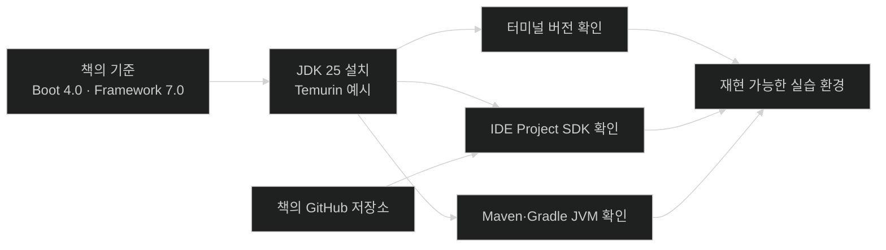

# Chapter 1의 출발점과 학습 환경

## 한눈에 보기

| 항목 | 책의 기준 | 학습할 때 확인할 것 |
|---|---|---|
| 플랫폼 | Spring Boot 4.0 + Spring Framework 7.0 | 책의 코드가 요구하는 최소 기반을 맞췄는가 |
| Java | JDK 25 권장, Java 17 호환성 유지 | 터미널·IDE·빌드 도구가 같은 JDK를 보는가 |
| JDK 배포판 | Eclipse Temurin 25 예시 | 무료 배포판인지, 상용 지원이 필요한지 |
| 설치·전환 | SDKMAN 권장 | 여러 프로젝트의 JDK를 안전하게 전환할 수 있는가 |
| 개발 환경 | IntelliJ IDEA 또는 Spring Tools 4 | Spring 탐색·실행·설정 지원을 사용할 수 있는가 |
| 원본 코드 | 책의 GitHub 저장소 | 설명에서 생략된 import와 최종 구조를 대조할 수 있는가 |

## 1. 왜 이게 필요한가

### 출발 장면: 코드는 같은데 한쪽에서만 실행되지 않는다

책의 예제를 내려받아 `java --version`을 실행했는데 Java 17이 표시되고, IDE의 Project SDK는 Java 25이며, Maven은 다시 다른 JDK를 사용한다고 해 보자. 소스 파일은 같아도 컴파일 가능한 문법과 API, 테스트 실행 결과가 달라질 수 있다. 그래서 첫 장의 도구 준비는 부록이 아니라 이후 모든 실습의 재현성을 결정하는 전제다.

이 책은 **[[스프링-부트]]**(=Spring Framework 애플리케이션의 시작·설정·운영을 간소화하는 프로젝트) 4.0을 기준으로 한다. Spring Boot 4.0은 Spring Framework 7.0 위에 놓이며, 책은 Java 25를 주 학습 환경으로 선택한다. Java 17에서도 호환성을 유지한다고 설명하지만, “실행할 수 있는 최소 버전”과 “책이 예제를 작성하고 확인한 기준 버전”은 같은 말이 아니다.

### Java 복잡성을 줄이려는 흐름

Chapter 1의 도입부는 Spring의 역사를 단순 연표로 소개하지 않는다. 2000년대 중반 Java 개발은 설정이 많고 테스트가 어려웠으며, Spring Framework는 객체 조립과 엔터프라이즈 기능 사용의 복잡성을 줄이려 했다. 2013년 SpringOne 2GX에서 공개된 Spring Boot는 그 목표를 애플리케이션의 시작 방식까지 확장했다.

Spring Boot 4에서 책이 강조하는 변화는 다음과 같다.

- 의존성이 더 작고 기술 중심적인 모듈로 나뉜다.
- 스타터가 무엇을 활성화하는지 더 명시적으로 드러낸다.
- 테스트 의존성이 실제 테스트 대상 기술 계층과 더 잘 맞춰진다.
- 그 결과 빌드 파일만 봐도 애플리케이션의 아키텍처 의도를 더 쉽게 읽을 수 있다.

즉, 이 장의 질문은 “Spring Boot가 코드를 얼마나 짧게 만드는가?”가 아니다. “반복되는 조립은 대신하면서도 개발자의 선택은 어떻게 보존하는가?”가 핵심이다.

### 준비 도구가 맡는 서로 다른 역할

**[[자바-개발-키트]]**(=Java 코드를 컴파일하고 실행·진단하는 도구 묶음)는 코드를 실제로 빌드하고 실행한다. **[[IDE]]**(=편집·빌드·실행·디버깅을 통합한 개발 환경)는 개발 과정을 편리하게 만든다. **[[GitHub]]**(=Git 저장소를 원격에서 제공하는 서비스)는 책의 기준 코드를 보관한다. 셋은 서로 대체 관계가 아니다.

비유하면 JDK는 요리할 수 있는 주방 설비, IDE는 재료와 도구를 찾기 쉽게 정리한 작업대, GitHub 저장소는 조리 과정과 완성 모습을 기록한 레시피다. 다만 이 비유는 “IDE가 없어도 빌드할 수 있다”는 점에서 깨진다. 작업대가 없으면 요리 자체가 곤란하지만, IDE 없이도 명령행과 텍스트 편집기로 Java 애플리케이션을 빌드하고 실행할 수 있다.

## 2. 어떻게 동작하는가

### 2.1 JDK 25를 준비한다

책은 **[[SDKMAN]]**(=여러 JVM 도구 버전을 설치·전환하는 셸 도구)을 이용하는 흐름을 제안한다.

```bash
# SDKMAN 설치 후 새 셸을 열거나 안내된 초기화 명령을 실행한다.
sdk install java 25.0.1-tem

# 설치 과정에서 기본 JDK로 선택했는지와 실제 결과를 확인한다.
java --version
```

1. SDKMAN 설치 스크립트를 실행한다. — JDK 파일을 직접 내려받아 경로와 환경 변수를 수동 관리하는 반복을 줄이기 위해서다.
2. `sdk install java 25.0.1-tem`으로 책이 사용한 계열을 설치한다. — 예제 환경과 언어·런타임 기능의 기준을 맞추기 위해서다.
3. 기본 JDK로 선택한다. — 새 터미널에서 별도 설정 없이 같은 버전을 사용하기 위해서다.
4. `java --version`으로 확인한다. — 설치 성공과 현재 셸이 실제로 참조하는 실행 파일은 별개의 문제이기 때문이다.

명령 끝의 `tem`은 **[[Eclipse-Temurin]]**(=Eclipse Adoptium이 제공하는 OpenJDK 배포판)을 뜻한다. 책은 Temurin이 무료·오픈 소스이고 표준 **[[TCK]]**(=Java 사양 호환성을 검증하는 시험 모음)를 통과한 배포판이라는 점을 선택 이유로 든다. 과거 이름인 AdoptOpenJDK와 연결되는 배포판이기도 하다.

여기서 **[[장기지원]]**(=일반 릴리스보다 오랫동안 업데이트를 제공하는 릴리스 계열)은 “영원히 무료 지원된다”는 뜻이 아니다. Oracle JDK, Azul Zulu처럼 상용 지원 계약이 필요한 조직은 비용, 패치 정책, 인증 요구를 따로 검토해야 한다. 책은 상용 지원이 필요하지 않은 학습·일반 개발 환경에 Temurin을 충분한 선택으로 본다.

Windows에서는 두 경로를 구분한다.

- WSL을 개발 환경으로 사용한다면 그 Linux 셸 안에서 SDKMAN을 사용할 수 있다.
- Windows에 직접 설치하고 싶다면 Adoptium의 Temurin 설치 파일을 사용할 수 있다.

### 2.2 세 군데의 Java 버전을 맞춘다

JDK 설치 뒤에는 다음 세 지점을 각각 확인해야 한다.

| 확인 위치 | 무엇을 확인하나 | 어긋났을 때 나타나는 문제 |
|---|---|---|
| 터미널 | `java --version`, 필요하면 `javac --version` | 셸에서 실행한 빌드만 다른 결과가 난다 |
| IDE | Project SDK, language level, Gradle/Maven JVM | 편집기는 허용하지만 빌드는 거부하거나 그 반대가 된다 |
| 빌드 도구 | Maven/Gradle이 실행되는 JVM | 테스트·플러그인이 예상과 다른 Java에서 실행된다 |

SDKMAN은 셸의 JDK 전환을 돕지만, 이미 열려 있는 IDE의 프로젝트 SDK까지 항상 바꾸지는 않는다. 이 단계가 필요한 이유는 “설치된 JDK”가 아니라 “각 도구가 실제로 선택한 JDK”가 결과를 결정하기 때문이다.

### 2.3 IDE를 고른다

책이 제시하는 선택지는 다음과 같다.

- IntelliJ IDEA: 단일 설치 프로그램에서 에디션에 따라 기능이 활성화된다. Community Edition은 무료이고 기본 학습에 충분하며, Ultimate Edition은 더 폭넓은 Spring 지원 기능을 제공한다.
- Spring Tools 4 for Eclipse: Eclipse를 기반으로 Spring 개발 지원을 제공한다.
- Spring Tools 4 for VS Code: VS Code 안에서 Spring 프로젝트 탐색과 실행을 돕는다.

선택 단계는 다음처럼 접근할 수 있다.

1. 후보 IDE에서 같은 프로젝트를 열고 실행한다. — 기능 목록보다 실제 작업 흐름이 자신에게 맞는지 확인하기 위해서다.
2. 코드 탐색, 자동완성, 디버깅, Spring 구성 지원을 비교한다. — 이 책의 반복 작업에 직접 영향을 주는 항목이기 때문이다.
3. 한 달 정도 사용해 본 뒤 주 도구를 정한다. — 단기 인상보다 지속적인 생산성이 중요하기 때문이다.

텍스트 편집기를 사용해도 책의 내용을 학습할 수 있다. 다만 현대 IDE가 제공하는 Spring 지원의 이점과 그 대신 발생하는 자원 사용량·라이선스 비용을 알고 선택하라는 것이 책의 취지다.

### 2.4 GitHub 원본을 기준점으로 둔다

책의 예제 저장소는 다음 위치다.

```text
https://github.com/PacktPublishing/Learning-Spring-Boot-4
```

1. GitHub 계정을 만든다. — 저장소 접근뿐 아니라 현대 개발 도구와 협업 서비스에 연결하기 쉽기 때문이다.
2. 책의 저장소를 내려받거나 웹에서 확인한다. — 지면에서 생략된 import, 파일 위치, 장별 최종 상태를 대조하기 위해서다.
3. 현재 읽는 절과 해당 장의 코드 상태를 맞춰 본다. — 완성본만 복사하면 중간 변경의 이유를 놓칠 수 있기 때문이다.

원본 저장소는 정답을 대신 외우는 곳이 아니라, 책의 서술과 실행 가능한 전체 문맥 사이의 간격을 메우는 자료다.

### 2.5 공식 문서와 책의 버전을 함께 읽는다

이 노트의 주 근거는 책의 Spring Boot 4.0 서술이다. Spring Boot 4.0.3 공식 문서도 Java 17 이상과 Spring Framework 7.x를 기반으로 설명하며, Servlet 6.1 계열을 사용한다. 다만 최신 공식 문서의 지원 상한과 패치 버전은 시간이 지나면서 달라질 수 있으므로, 실제 프로젝트를 만들 때는 선택한 Spring Boot 버전의 시스템 요구사항을 다시 확인해야 한다.

## 3. 그림으로 보기



위 그림의 핵심은 JDK를 한 번 설치하는 것으로 끝나지 않는다는 점이다. 터미널, IDE, 빌드 도구가 같은 실행 기준을 공유해야 책의 코드와 결과를 안정적으로 대조할 수 있다.

## 4. 이 노트에 나온 용어

| 용어 | 한 줄 풀이 | 자세히 |
|---|---|---|
| 스프링 부트 | Spring 애플리케이션의 조립·설정·운영을 간소화하는 프로젝트 | [[_glossary#스프링-부트]] |
| 자바 개발 키트 | Java 개발·실행 도구를 묶은 배포판 | [[_glossary#자바-개발-키트]] |
| 장기 지원 | 일반 릴리스보다 긴 지원 수명을 제공하는 릴리스 계열 | [[_glossary#장기지원]] |
| SDKMAN | 여러 JVM 도구 버전을 설치·전환하는 도구 | [[_glossary#SDKMAN]] |
| Eclipse Temurin | Eclipse Adoptium의 무료 OpenJDK 배포판 | [[_glossary#Eclipse-Temurin]] |
| TCK | Java 구현의 사양 호환성을 검증하는 시험 모음 | [[_glossary#TCK]] |
| IDE | 편집·실행·디버깅을 통합한 개발 환경 | [[_glossary#IDE]] |
| GitHub | 원격 Git 저장소와 협업 기능을 제공하는 서비스 | [[_glossary#GitHub]] |

## 5. 자주 헷갈리는 것

### JDK 버전 지원과 책의 권장 버전

- “Java 17과 호환된다”는 말은 Java 17이 책의 모든 실습에서 가장 적합하다는 뜻이 아니다.
- 이 책은 Java 25를 설치 기준으로 삼는다. 특히 뒤 장에서 Java 25의 기능을 직접 다루는 부분은 그 기준을 따라야 한다.

### OpenJDK와 Temurin

- OpenJDK는 Java SE의 오픈 소스 구현 프로젝트다.
- Temurin은 OpenJDK 소스를 빌드·시험해 배포하는 바이너리 공급 선택지다.
- Oracle JDK나 Azul Zulu도 “다른 Java 언어”가 아니라 배포·지원 정책이 다른 JDK 선택지다.

### Git과 GitHub

- Git은 로컬에서도 동작하는 버전 관리 도구다.
- GitHub는 Git 저장소를 호스팅하는 서비스다.
- 책이 요구하는 GitHub 계정은 책의 원본 코드와 다른 생태계 도구에 접근하기 위한 준비다.

## 6. 언제 안 쓰나 / 경계

- SDKMAN은 모든 운영체제의 네이티브 표준 설치 관리자가 아니다. Windows 네이티브 환경에서는 직접 설치나 다른 버전 관리 방식을 선택할 수 있다.
- IDE가 프로젝트의 빌드 정의를 대신하지 않는다. 다른 사람과 재현 가능한 설정은 `pom.xml`이나 `build.gradle` 같은 빌드 파일에 남아야 한다.
- 책의 GitHub 코드는 출판 시점의 기준이다. 보안 패치나 Spring Boot 최신 패치 버전까지 자동으로 반영한다고 가정하면 안 된다.

## 7. 연결

- [[01-autoconfiguring-spring-beans]] — 준비한 런타임에서 가장 먼저 이해할 Spring Boot의 핵심 조립 기능이다.
- [[02-adding-portfolio-components-using-spring-boot-starters]] — IDE와 빌드 도구에서 선택한 의존성이 애플리케이션 아키텍처를 드러낸다.
- [[04-managing-application-dependencies]] — JDK 기준과 라이브러리 버전 정렬이 함께 맞아야 빌드 재현성이 생긴다.

## 8. 스스로 확인

1. `java --version`이 25를 출력해도 IDE 빌드가 Java 17로 실행될 수 있는 이유는 무엇인가?
2. Spring Boot 4.0이 Java 17과 호환된다는 설명과 책이 JDK 25를 요구하는 설명은 어떻게 양립하는가?
3. Eclipse Temurin, OpenJDK, Oracle JDK의 관계를 “구현과 배포판” 관점에서 설명할 수 있는가?
4. IDE와 빌드 도구는 각각 무엇을 책임지며, 어떤 설정을 공유 저장소에 남겨야 하는가?
5. 책의 GitHub 완성 코드를 그대로 복사하지 않고도 적극 활용하려면 어떤 순서로 대조해야 하는가?


> 다섯 문항을 스스로 답한 **뒤에** [[_00-technical-requirements]]에서 모범답안과 대조한다. 먼저 열면 이 문항들은 다시 인출 문제로 쓸 수 없다.

<!-- ==== 아래는 내 영역 · 스킬 수정 금지 ==== -->

## 내 설명 시도


## 막혔던 지점


## 리뷰 이력
