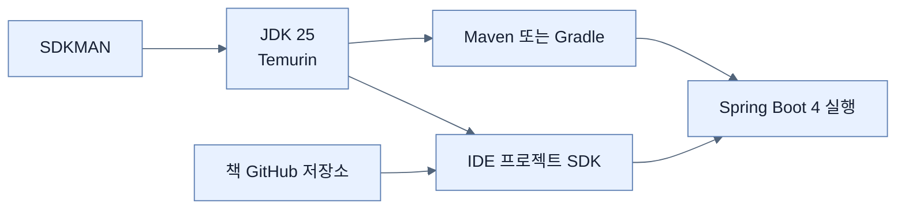

# Chapter 1 학습 환경

## 한눈에 보기

책의 실습 기준은 **JDK 25**, Spring을 지원하는 현대적 IDE, GitHub 계정이다. Spring Boot 4.0은 Spring Framework 7.0 위에 있으며 Java 25를 우선 지원하지만 Java 17 호환성도 유지한다. 책은 JDK 배포판으로 Eclipse Temurin을, 여러 JDK 전환 도구로 SDKMAN을 제안한다.

## 1. 왜 이게 필요한가

같은 소스라도 JDK·빌드 도구·의존성 버전이 다르면 컴파일 결과와 사용할 수 있는 API가 달라진다. 특히 후반의 Java 25 AOT 캐시와 가상 스레드 예제는 실행 환경이 학습 내용의 일부다. GitHub 저장소는 책의 완성 코드와 장별 변경점을 대조하는 기준점이다.

## 2. 어떻게 동작하는가

1. SDKMAN으로 JDK를 설치하고 기본 버전을 정한다. 여러 프로젝트가 다른 JDK를 요구할 때 전환 비용을 줄이기 위해서다.
2. `java --version`으로 실제 터미널의 런타임을 확인한다. IDE 설정과 셸 설정이 어긋날 수 있기 때문이다.
3. IntelliJ IDEA 또는 Spring Tools 계열 IDE를 연결한다. Spring 설정 메타데이터, 탐색, 실행 구성이 반복 작업을 줄인다.
4. 책의 GitHub 저장소를 기준 코드로 둔다. 설명 중 생략된 import와 최종 구조를 확인하되, 코드를 그대로 따라 쓰는 대신 각 변경의 이유를 추적한다.

비유하면 SDKMAN은 여러 크기의 공구를 갈아 끼우는 공구함이다. 다만 JDK만 바꾼다고 Maven/Gradle이나 IDE 프로젝트 SDK까지 항상 자동으로 맞는 것은 아니므로 각각 확인해야 한다.

## 3. 그림으로 보기

## 4. 이 노트에 나온 용어

- **JDK**: Java 컴파일러와 런타임, 개발 도구를 묶은 배포판.
- **LTS**: 장기간 지원되는 Java 릴리스 계열.
- **Eclipse Temurin**: 무료 OpenJDK 배포판.
- **SDKMAN**: Unix 계열 환경에서 여러 JVM 도구 버전을 설치·전환하는 도구.

## 7. 연결

- [[01-autoconfiguring-spring-beans]] — 준비한 런타임에서 처음 확인할 Spring Boot 핵심 기능이다.
- [[04-managing-application-dependencies]] — JDK 버전과 함께 재현 가능한 빌드를 만드는 또 다른 축이다.

## 8. 스스로 확인

- 전체 1차 정리 후: `java --version`, IDE SDK, 빌드 도구가 모두 같은 JDK를 가리키는지 설명한다.

<!-- ==== 아래는 내 영역 · 스킬 수정 금지 ==== -->

## 내 설명 시도

## 막혔던 지점

## 리뷰 이력

