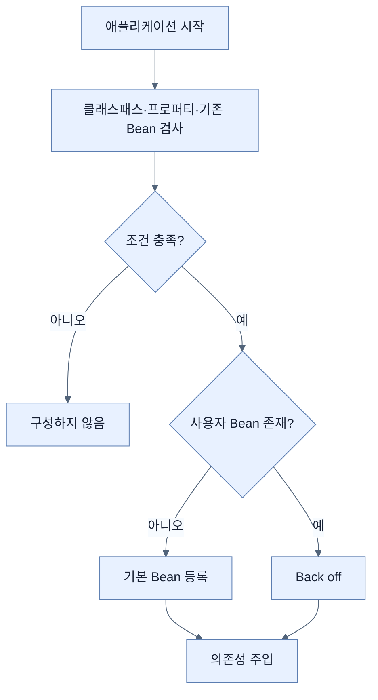

# Spring Bean 자동 구성

## 한눈에 보기

애플리케이션이 시작되면 Spring Boot는 **클래스패스, 기존 Bean, 설정값**을 보고 필요한 기반 Bean을 조건부로 등록한다. 사용자가 같은 역할의 Bean을 직접 제공하면 자동 구성은 물러난다(back off). 따라서 기본값은 빠르게 얻되 제어권은 잃지 않는다.

## 1. 왜 이게 필요한가

웹 핸들러, 데이터소스, 직렬화기 같은 기반 시설을 매 프로젝트마다 조립하면 비즈니스 코드보다 반복 설정이 커진다. 반대로 프레임워크가 무조건 생성하면 특수한 운영 환경을 수용할 수 없다. 자동 구성은 “흔한 선택을 기본으로, 명시한 선택을 우선으로”라는 타협을 제공한다.

## 2. 어떻게 동작하는가

Spring의 **application context**는 객체를 만들고 의존성을 주입하며 생명주기를 관리하는 컨테이너다. 그 안에서 관리되는 객체가 Spring Bean이다.

1. `@SpringBootApplication`으로 애플리케이션 컨텍스트가 시작된다.
2. 자동 구성 후보가 클래스패스와 환경을 검사한다. 예를 들어 JDBC `DataSource` 클래스가 있으면 데이터소스 구성을 검토할 이유가 생긴다.
3. `@ConditionalOnClass`, `@ConditionalOnMissingBean`, `@ConditionalOnProperty` 같은 조건이 맞는 구성만 활성화된다.
4. 필요한 Bean이 등록되고 다른 Bean의 생성자 인자로 주입된다.
5. 사용자가 `DataSource`를 직접 정의했다면 기본 데이터소스 생성은 건너뛴다.

자동 구성은 자동 조종 장치와 비슷하지만 목적지를 정하지는 않는다. 클래스패스에 들어온 의존성과 사용자의 명시적 Bean이 잘못되면 “합리적인 기본값”도 의도와 달라질 수 있다. 조건 평가 보고서가 중요한 이유다.

## 3. 그림으로 보기

## 4. 이 노트에 나온 용어

- **application context**: Bean 생성·설정·연결·생명주기를 책임지는 Spring 컨테이너.
- **dependency injection**: 객체가 필요한 협력자를 직접 만들지 않고 외부 컨테이너로부터 받는 방식.
- **autoconfiguration**: 관찰된 실행 조건에 따라 기반 Bean을 조건부로 제공하는 Spring Boot 기능.
- **back-off**: 사용자의 명시적 구성이 있으면 자동 구성이 기본 Bean 생성을 포기하는 정책.

## 7. 연결

- [[02-adding-portfolio-components-using-spring-boot-starters]] — 스타터가 자동 구성이 판단할 클래스패스를 만든다.
- [[03-customizing-the-setup-with-configuration-properties]] — 프로퍼티는 자동 구성의 값과 활성 조건을 바꾼다.
- [[chapter-4-securing-an-application-with-spring-boot/01-security-foundations|보안 자동 구성]] — 보안 필터 체인도 같은 조건부 구성 원리 위에 올라간다.

## 8. 스스로 확인

- 전체 1차 정리 후: 사용자 `DataSource` Bean을 정의했을 때 자동 구성이 어떻게 달라지는지 설명한다.

<!-- ==== 아래는 내 영역 · 스킬 수정 금지 ==== -->

## 내 설명 시도

## 막혔던 지점

## 리뷰 이력

