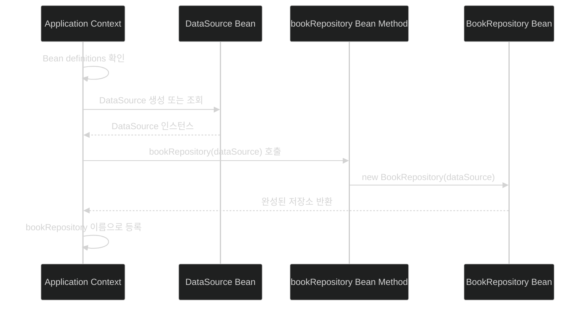
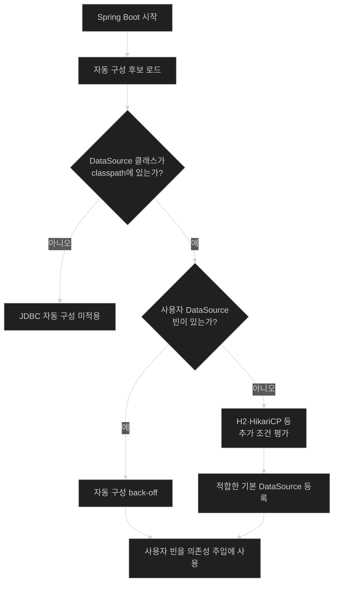

# Application Context, 의존성 주입, Spring Boot 자동 구성

## 한눈에 보기

| 질문 | 핵심 답 |
|---|---|
| Spring은 애플리케이션 객체를 어디에 보관하나? | Application context에 Spring bean으로 등록하고 생명주기와 연결을 관리한다. |
| 객체가 다른 객체를 필요로 하면? | 생성자나 `@Bean` 메서드 인자로 요구하고 컨텍스트가 알맞은 빈을 주입한다. |
| Spring Boot가 추가하는 것은? | 클래스패스·기존 빈·설정값을 검사해 흔한 인프라 빈을 조건부로 자동 등록한다. |
| 사용자가 직접 빈을 만들면? | 자동 구성이 back off하여 사용자의 명시적 선택을 우선한다. |
| Spring Boot 4의 특징은? | 자동 구성을 하나의 거대한 묶음보다 더 작고 기술 중심적인 모듈로 제공한다. |

## 1. 왜 이게 필요한가

### 출발 장면: 저장소가 데이터베이스 연결을 필요로 한다

도서 정보를 저장하는 `BookRepository`가 JDBC 연결을 얻기 위해 `DataSource`를 필요로 한다고 하자. 가장 직접적인 코드는 저장소 안에서 구현체를 바로 만드는 것이다.

```java
public class BookRepository {
    private final DataSource dataSource = createProductionDataSource();
}
```

이 코드는 운영에서는 우연히 동작할 수 있지만 테스트에서는 실제 데이터베이스를 떼어내기 어렵다. 클라우드에서 플랫폼이 제공한 연결 정보로 바꾸거나, 커넥션 풀 구현을 교체할 때도 `BookRepository` 자체를 수정해야 한다. 객체의 본업인 “도서 저장”과 인프라를 “어떻게 만들 것인가”가 한 클래스에 묶였기 때문이다.

**[[스프링-프레임워크]]**(=Java 객체의 생성·연결과 여러 애플리케이션 기반 기능을 제공하는 프레임워크)는 이 조립 책임을 **[[애플리케이션-컨텍스트]]**(=Spring이 객체를 생성·설정·연결·관리하는 컨테이너)로 옮긴다. 컨텍스트가 관리하는 객체를 **[[스프링-빈]]**(=Spring 컨테이너에 등록되어 생명주기를 관리받는 객체)이라고 한다.

### 애플리케이션 컨텍스트가 필요한 이유

컨텍스트가 없으면 각 클래스가 `new`를 호출해 자신의 협력자를 직접 선택한다. 작은 프로그램에서는 단순하지만 애플리케이션이 커지면 다음 문제가 반복된다.

- 생성 코드가 여러 비즈니스 클래스에 흩어진다.
- 운영 구현을 테스트 대역으로 교체할 접점이 없다.
- 같은 인프라 객체를 공유해야 하는지 매번 직접 판단해야 한다.
- 생성 순서와 종료 처리를 각 코드가 따로 책임진다.
- 환경에 따라 구현을 바꾸려면 비즈니스 코드를 수정해야 한다.

**[[의존성-주입]]**(=객체가 필요한 협력자를 직접 만들지 않고 외부에서 전달받는 방식)은 이 문제를 해결한다. `BookRepository`는 “어떤 `DataSource`를 만들 것인가”가 아니라 “`DataSource`가 필요하다”는 사실만 표현한다.

### 자동 구성이 한 단계 더 필요한 이유

Spring Framework가 조립을 담당해도, 개발자가 모든 기반 빈을 직접 정의한다면 프로젝트마다 데이터소스, 웹 핸들러, JSON 변환기, 보안 필터 등을 반복 설정해야 한다. Spring Boot의 **[[자동-구성]]**(=현재 애플리케이션에서 관찰한 조건에 따라 흔한 기반 빈을 자동 등록하는 기능)은 그 반복을 줄인다.

하지만 무조건 자동으로 넣는다면 프레임워크가 사용자의 선택을 가로막는다. 그래서 자동 구성은 “쓸 만한 기본값을 먼저 제안하되, 사용자가 명시하면 물러난다”는 규칙을 따른다. 이 물러남이 **[[백오프]]**(=사용자 정의가 있을 때 기본 구성을 만들지 않는 정책)다.

비유하면 애플리케이션 컨텍스트는 공연의 무대 감독이고, 자동 구성은 장르와 대관 시설을 보고 기본 무대 장비를 미리 배치하는 스태프다. 배우는 필요한 마이크를 직접 제작하지 않고 요청만 한다. 그러나 이 비유는 런타임 변경에서 깨진다. 공연 스태프는 공연 중에도 장비를 자유롭게 바꿀 수 있지만, 대부분의 Spring 빈 구성은 컨텍스트 시작 시점에 결정되며 이후 임의 교체를 전제로 하지 않는다.

## 2. 어떻게 동작하는가

### 2.1 Application context가 빈을 만들고 연결한다

책은 다음 Java 구성을 예로 든다.

```java
@Bean
public BookRepository bookRepository(DataSource dataSource) {
    return new BookRepository(dataSource);
}
```

여기서 `new`가 완전히 사라진 것은 아니다. 중요한 변화는 `BookRepository` 클래스가 자신의 의존성을 직접 만들지 않는다는 점이다. 컨텍스트가 구성 메서드를 호출하는 한곳에서 생성 책임을 통제한다.

1. 컨텍스트가 `bookRepository`라는 `@Bean` 팩터리 메서드를 발견한다. — 어떤 객체를 컨테이너가 관리해야 하는지 알아야 하기 때문이다.
2. 메서드 인자 `DataSource dataSource`를 보고 필요한 타입을 파악한다. — 저장소가 구현 생성 방식이 아니라 필요한 계약만 표현하게 하기 위해서다.
3. 컨텍스트에서 `DataSource` 빈을 찾고, 아직 없다면 다른 구성 정의를 따라 먼저 만든다. — 의존 대상이 준비된 뒤 저장소를 안전하게 생성하기 위해서다.
4. 찾은 `DataSource`를 인자로 넣어 `bookRepository(...)`를 호출한다. — 의존성을 외부에서 전달해 저장소와 특정 생성 방식의 결합을 끊기 위해서다.
5. 반환된 `BookRepository`를 기본적으로 메서드 이름인 `bookRepository`라는 빈 이름으로 등록한다. — 이후 다른 빈도 이름이나 타입을 기준으로 이 객체를 사용할 수 있게 하기 위해서다.
6. 컨텍스트가 시작·사용·종료 동안 관련 빈의 생명주기를 관리한다. — 초기화와 자원 정리를 각 비즈니스 객체가 제각각 구현하지 않게 하기 위해서다.

빈들이 서로 필요한 대상을 찾아 연결되는 이 과정을 **[[와이어링]]**(=빈 사이의 의존 관계를 배선하듯 완성하는 과정)이라고 부른다. 이름은 전기 부품을 선으로 연결하는 모습에서 왔다. 단, 실제 Java 객체 사이에 선이 생기는 것이 아니라 생성자·메서드·필드 참조가 설정되는 것이다.

### 2.2 Spring bean과 JavaBean은 같은 기준이 아니다

책은 두 이름이 쉽게 섞인다는 점을 별도로 짚는다.

| 구분 | Spring bean | JavaBean |
|---|---|---|
| 판별 기준 | Spring 컨텍스트가 관리하는가 | 특정 Java 객체 관례를 따르는가 |
| 대표 특징 | 생성, 의존성 연결, 생명주기 관리 | private 필드, getter/setter, 인자 없는 생성자 |
| 서로의 필수 조건인가 | JavaBean 모양이 아니어도 Spring bean일 수 있다 | Spring에 등록되지 않아도 JavaBean일 수 있다 |
| 예 | 생성자만 있는 불변 서비스 빈 | `Video()`와 `getName()/setName()`이 있는 일반 객체 |

**[[자바빈]]**(=getter/setter와 인자 없는 생성자 같은 관례를 따르는 객체)은 여러 도구가 프로퍼티를 다루기 쉽게 만든 오래된 Java 관례다. 반면 Spring bean은 객체의 모양보다 “누가 관리하는가”를 말한다. `Serializable` 구현은 JavaBean과 흔히 연결되지만 책도 그것이 항상 엄격히 강제되는 핵심 기준은 아니라고 설명한다.

### 2.3 의존성 주입이 주는 실제 유연성

컨텍스트가 조립을 맡으면 같은 `BookRepository` 코드를 두고도 조합을 바꿀 수 있다.

- 일반 실행: 운영용 데이터베이스를 바라보는 `DataSource`를 주입한다.
- 단위·통합 테스트: stub 또는 mock 성격의 빈이나 테스트 데이터베이스 빈으로 바꾼다.
- 클라우드 환경: 플랫폼에 바인딩된 데이터 서비스의 연결 정보를 사용하는 빈을 제공한다.

유연성은 “무엇이든 자동으로 교체된다”는 뜻이 아니다. 교체 가능한 경계를 만들고, 어느 구현을 등록할지는 구성에서 결정할 수 있다는 뜻이다.

### 2.4 Spring Boot가 자동 구성 후보를 평가한다

Spring Boot 애플리케이션이 시작되면 현재 **[[클래스패스]]**(=JVM이 실행 중 클래스와 리소스를 찾는 경로 집합)를 살펴본다. 공식 문서 기준으로 애플리케이션은 보통 주 구성 클래스의 `@SpringBootApplication` 또는 `@EnableAutoConfiguration`을 통해 자동 구성을 활성화한다. 배포된 모듈은 `META-INF/spring/org.springframework.boot.autoconfigure.AutoConfiguration.imports`에 자동 구성 후보를 등록할 수 있다.

후보가 있다는 사실만으로 모든 빈이 생기는 것은 아니다. 각 **[[자동-구성-정책]]**(=특정 기술의 기본 빈을 어떤 조건과 순서로 만들지 정의한 규칙)이 조건을 평가한다.

데이터베이스 예제의 핵심 흐름은 다음과 같다.

```java
@ConditionalOnClass(DataSource.class)
class DataSourceAutoConfiguration {
    // 실제 구성은 여러 조건과 내부 구성으로 더 세분화된다.
}
```

> **원문의 단순화에 대한 주의**: 책은 `DataSource` 클래스가 JDBC 드라이버와 함께 클래스패스에 들어오면 이 정책이 활성화되는 흐름으로 설명한다. 실제 `DataSource`는 Java의 표준 JDBC API 타입이며, 클래스 하나의 존재만으로 데이터베이스가 완성되지는 않는다. Spring Boot 4의 실제 구성은 Spring JDBC 타입, 사용자 빈, R2DBC 구성 여부, 임베디드 데이터베이스나 드라이버·풀 구현 등 여러 조건을 더 평가한다. 이 예제는 “클래스패스 조건이 자동 구성 후보를 연다”는 개념 모델로 읽어야 한다.

1. `DataSource` 클래스가 클래스패스에 있는지 확인한다. — JDBC 기술을 전혀 선택하지 않은 애플리케이션에 데이터베이스 구성을 억지로 적용하지 않기 위해서다.
2. 조건이 맞으면 `DataSourceAutoConfiguration` 후보를 검토한다. — 기술 선택을 실제 구성 규칙과 연결하기 위해서다.
3. 추가 조건으로 임베디드 데이터베이스 H2가 있는지, HikariCP 같은 풀 구현을 쓸 수 있는지 판단한다. — 같은 `DataSource` 계약도 사용 가능한 구현에 따라 만드는 방식이 달라지기 때문이다.
4. 사용자 정의 `DataSource` 같은 기존 빈을 확인한다. — 사용자가 명시한 선택과 기본 빈이 충돌하지 않게 하기 위해서다.
5. 조건을 모두 만족하는 기본 빈만 등록한다. — 필요한 인프라는 제공하되 불필요한 객체와 부작용은 만들지 않기 위해서다.
6. 자동 구성 사이의 순서를 적용한다. — 선행 인프라가 준비되기 전에 그것을 소비하는 후속 빈이 만들어지는 문제를 막기 위해서다.

클래스·빈·프로퍼티의 존재 여부에 따라 적용을 결정하는 방식이 **[[조건부-구성]]**(=정해진 조건이 참일 때만 구성 정의를 활성화하는 방식)이다. `@ConditionalOnClass`는 그중 “특정 클래스가 있는가”를 묻는 조건이다. 공식 문서에서 흔히 쓰는 `@ConditionalOnMissingBean`은 “사용자가 같은 타입을 이미 제공했는가”를 확인해 백오프를 구현한다.

#### 조건은 한 번에 평가되지 않는다

후보가 수백 개인데 하나하나 클래스를 로딩해 조건을 따지면 시작이 그만큼 느려진다. 그래서 조건 평가는 두 단계로 나뉜다.

1. **필터 단계** — 빌드 시 미리 계산해 둔 자동 구성 메타데이터만 보고, 필요한 클래스가 아예 없는 후보를 통째로 걷어낸다. 클래스 로딩 없이 이름 비교로 끝나므로 싸다.
2. **`REGISTER_BEAN` 단계** — 살아남은 후보에 대해 실제 컨텍스트를 조회한다. `@ConditionalOnMissingBean`은 이 단계에서만 평가된다. 어떤 빈 정의가 모였는지 알아야 “없다”를 판정할 수 있기 때문이다.

이 두 단계 구분은 위 흐름의 1번과 4번이 왜 같은 종류의 검사가 아닌지를 설명한다. 클래스패스 조건은 싸고 일찍, 빈 조건은 비싸고 늦게 평가된다.

그리고 여기서 자동 구성이 실제로 만들어 내는 것은 객체가 아니라 **[[빈-정의]]**(=어떤 타입의 객체를 어떤 인자로 어떻게 만들지 적어 둔 컨테이너의 설계도)다. `@AutoConfiguration`은 메타 애노테이션으로 `@Configuration`이며, 조건이 붙었을 뿐 평범한 구성 클래스다. 인스턴스화와 주입과 생명주기는 그다음에 애플리케이션 컨텍스트가 맡는다.

6번의 순서를 지정하는 것은 `@AutoConfiguration(before = ..., after = ...)` 속성이고, 별도 애노테이션 `@AutoConfigureBefore`·`@AutoConfigureAfter`도 같은 일을 한다. JPA 자동 구성이 `DataSource` 자동 구성보다 먼저 돌면 소비할 대상이 없으므로 이 순서가 필요하다.

### 2.5 사용자가 제공한 빈이 자동 구성보다 우선한다

예를 들어 H2가 클래스패스에 있어도 사용자가 직접 다음 빈을 제공하면 Spring Boot는 그 선택을 존중한다.

```java
@Bean
DataSource dataSource() {
    return createMyDataSource();
}
```

Spring Boot에 별도 콜백을 보내거나 “자동 구성을 끄라”고 통보할 필요가 없다. 자동 구성 쪽의 missing-bean 조건이 사용자 빈을 발견해 기본 생성을 건너뛴다.

이때 **[[데이터소스]]**(=애플리케이션이 데이터베이스 연결을 얻는 표준 JDBC 진입점)는 구체 커넥션 풀 구현과 같은 말이 아니다. H2는 임베디드 데이터베이스의 한 선택이고, HikariCP는 연결을 재사용하는 풀 구현의 한 선택이다. 자동 구성은 클래스패스와 설정을 바탕으로 이 조합을 정하되 사용자가 지정하면 물러난다.

#### 백오프는 우선순위 경쟁이 아니다

“사용자 빈이 이긴다”를 순위 다툼으로 상상하면 그림이 틀린다. 두 개의 `DataSource` 빈이 등록된 뒤 순위로 하나가 이기는 것이 아니라, 자동 구성 쪽 빈 정의가 **애초에 만들어지지 않는다.** 메커니즘을 세 칸으로 나누면 이렇다.

| 칸 | 내용 | 왜 그래야 하는가 |
|---|---|---|
| 무엇을 | 자동 구성의 `@Bean` 메서드에 붙은 `@ConditionalOnMissingBean`이 “이 타입의 빈이 이미 있는가”를 본다. 인자를 주지 않으면 대상 타입은 **그 메서드의 반환 타입**이다 | 사용자가 무엇을 어떻게 만들었는지가 아니라 같은 역할이 이미 채워졌는지만 알면 되기 때문이다 |
| 언제 | 자동 구성 클래스는 **사용자 정의 빈 정의가 모두 등록된 뒤에** 처리된다 | 아직 등록되지 않은 사용자 빈을 “없다”고 판정하면 백오프가 동전 던지기가 되기 때문이다 |
| 누가 | `OnBeanCondition`이 `REGISTER_BEAN` 단계에서 실제 컨텍스트를 조회해 판정한다 | 빈 정의가 다 모인 뒤라야 부재를 확정할 수 있기 때문이다 |

공식 문서가 `@ConditionalOnBean`·`@ConditionalOnMissingBean`을 **자동 구성 클래스에서만** 쓰라고 권하는 이유가 두 번째 칸이다. 평범한 `@Configuration`에 붙이면 그 클래스가 언제 처리되는지에 따라 결과가 달라져 예측할 수 없게 된다.

차이가 눈에 보이는 지점은 예외다. 우선순위 모델이었다면 `DataSource` 빈이 둘이 되어 `@Primary` 없이는 `NoUniqueBeanDefinitionException`이 났을 것이다. 실제로는 빈이 하나뿐이라 아무 예외도 나지 않는다. **아무 일도 일어나지 않는 것이 백오프의 정상 동작이다.** 이 조용함이 편리한 만큼 위험하기도 하다는 점은 §6에서 다룬다.

#### 판정 기준은 이름이 아니라 타입이다

빈 이름은 기본적으로 `@Bean` 메서드 이름이다. `dataSource()`가 만든 빈의 이름은 `dataSource`다. 그런데 백오프는 이름을 보지 않는다. 메서드 이름을 `myDataSource()`로 바꿔도 반환 타입이 `DataSource`면 자동 구성은 그대로 물러나고, 반대로 이름을 Boot 쪽과 똑같이 맞춰도 타입이 다르면 물러나지 않는다.

두 축을 섞지 않는 것이 좋다. **이름은 “주입할 때 여럿 중 무엇을 고르나”의 축이고(`@Qualifier`, `@Primary`), 타입은 “자동 구성이 물러나나”의 축이다.**

### 2.6 Spring Boot 4의 모듈화된 자동 구성

책은 이전 버전의 자동 구성이 한곳에 크게 묶여 전달되던 방식과 달리, Spring Boot 4에서는 특정 기술·프레임워크를 중심으로 더 작은 모듈로 정리되었다고 강조한다.

| 관점 | 큰 단일 묶음 | Boot 4의 기술 중심 모듈 |
|---|---|---|
| 클래스패스 의미 | 무관한 전이 의존성이 예상 밖 동작을 켤 여지가 크다 | 명시적으로 선택한 기술과 동작의 관계가 더 선명하다 |
| 빌드 가독성 | 어떤 기능이 왜 들어왔는지 추적하기 어렵다 | 의존성에서 아키텍처 의도를 읽기 쉽다 |
| 문제 발견 | 실행 시점의 놀라움으로 드러날 수 있다 | 구성 선택을 더 이르고 예측 가능하게 드러낸다 |
| 책의 크기 비교 | `spring-boot-autoconfigure-3.5.8.jar`: 약 2.1 MB | `spring-boot-autoconfigure-4.0.0.jar`: 약 369 KB |

파일 크기는 모듈화의 결과를 보여 주는 한 사례일 뿐, 작다는 사실만으로 애플리케이션이 자동으로 빠르다는 뜻은 아니다. 핵심은 선택한 기술과 활성화되는 구성 사이의 계약을 더 명시적으로 만드는 데 있다.

#### 줄어든 것이 아니라 나간 것이다

369 KB는 내용이 사라진 결과가 아니라 기술별 모듈로 **옮겨 간** 결과다. Boot 4 소스에서 확인되는 실제 위치는 다음과 같다.

| 자동 구성 | Boot 4의 모듈 / 패키지 |
|---|---|
| `DataSourceAutoConfiguration` | `spring-boot-jdbc` / `org.springframework.boot.jdbc.autoconfigure` |
| `MultipartAutoConfiguration` | `spring-boot-servlet` / `org.springframework.boot.servlet.autoconfigure` |
| `FlywayProperties` | `spring-boot-flyway` / `org.springframework.boot.flyway.autoconfigure` |

패키지 이름의 순서가 뒤집힌 것에 주목할 만하다. `boot.autoconfigure.jdbc`가 `boot.jdbc.autoconfigure`가 되었다. **기술이 상위, 자동 구성이 하위**다. “기술 중심 모듈”이라는 표현의 문자 그대로의 모습이 이것이다. §2.7의 넓은 목록을 외울 필요가 없는 이유도 여기 있다. 그 기술들은 이제 각자의 모듈에 살고, 내가 그 모듈을 클래스패스에 넣었을 때만 후보가 된다.

#### 왜 빌드 파일이 아키텍처 선언이 되는가

옛 방식에서는 `spring-boot-autoconfigure` 하나만 있으면 **모든 기술의 후보가 목록에 오른다.** 실제 적용은 `@ConditionalOnClass`가 막아 주지만 그 판단이 전이 의존성에 좌우된다. 내가 직접 넣은 적 없는 라이브러리가 어떤 클래스를 끌고 오면, 선언한 적 없는 기능이 켜진다.

Boot 4에서는 자동 구성 코드 자체가 기술 모듈 안에 있으므로 그 모듈이 없으면 **후보가 존재하지 않는다.** 조건 평가 이전 단계에서 잘린다.

그래서 “이 애플리케이션이 Kafka를 쓰는가”를 빌드 파일만 보고 답할 수 있는지가 달라진다. 옛 방식에서는 확답이 어려워 의존성 트리나 조건 평가 리포트까지 봐야 했고, Boot 4에서는 빌드 파일이 곧 “이 애플리케이션이 참여하기로 한 기술 목록”에 가깝다. 부수적으로 클래스패스가 작아지면 평가할 조건도 줄어 시작 시간과 AOT·네이티브 이미지에 유리하고, 취약점 점검 대상도 줄어든다.

#### 대가: 클래스 이름이 바뀌었다

분할은 공짜가 아니었다. 자동 구성 클래스의 패키지가 바뀌었기 때문에 Boot 4는 호환 레이어를 따로 둔다. `META-INF/spring/{애노테이션 이름}.replacements` 파일이 옛 클래스명을 새 이름에 매핑하고, `AutoConfigurationReplacements`가 이를 읽어 `@AutoConfigureBefore`·`@AutoConfigureAfter` 참조와 자동 구성 제외 설정에 적용한다. **호환 레이어가 필요할 만큼의 변화였다**는 사실 자체가, 이 분할이 내부 정리가 아니라 공개 표면을 건드린 변경임을 말해 준다.

### 2.7 자동 구성의 적용 범위

책은 자동 구성이 단지 데이터베이스 하나에만 적용되지 않는다는 점을 폭넓은 목록으로 보여 준다. 아래 표는 책의 항목을 기능군으로 다시 묶은 것이다.

| 기능군 | 책에서 든 기술·기능 |
|---|---|
| 비동기 메시징·통합 | Spring AMQP, Spring JMS, Apache Kafka, Spring Integration, Spring RSocket |
| 데이터 저장소 연결 | Cassandra, Elasticsearch, Hazelcast, InfluxDB, JPA, MongoDB, Neo4j, Solr |
| 데이터 접근 추상화 | Spring Data JDBC/JPA/LDAP/MongoDB/Neo4j/R2DBC/Redis/REST 등, Spring JDBC, Spring R2DBC, jOOQ |
| 스키마 관리 | Flyway, Liquibase |
| 웹·네트워크 | Spring MVC, Spring WebFlux, Spring Web Services, Spring WebSocket, Netty |
| 화면 렌더링 | Freemarker, Groovy Templates, Mustache, Thymeleaf |
| 직렬화 | Gson, Jackson |
| 애플리케이션 기반 기능 | Spring AOP, Batch, Cache, Validation, Session, Quartz scheduling |
| 하이퍼미디어·운영 연계 | Spring HATEOAS, Spring JMX |
| 메일 | Spring Mail, SendGrid |

책도 이 목록이 완전한 목록은 아니라고 명시한다. 목록을 외우는 것보다 “기술 의존성을 추가하면 그 기술 전용 자동 구성 후보가 조건을 평가한다”는 구조를 이해하는 것이 중요하다.

### 2.8 Spring Boot는 Spring Framework를 대체하지 않는다

Spring Framework가 애플리케이션 컨텍스트, 빈, 의존성 주입이라는 토대를 제공한다. Spring Boot는 그 토대 위에서 현재 애플리케이션의 조건을 읽고 흔한 빈 정의를 자동으로 보탠다.

```text
Spring Framework: 객체를 만들고 연결할 수 있는 컨테이너와 프로그래밍 모델
Spring Boot: 그 컨테이너에 어떤 기본 객체를 넣을지 조건부로 결정하는 조립 정책
```

따라서 자동 구성을 제대로 이해하려면 “Boot가 마법처럼 객체를 만든다”에서 멈추면 안 된다. 최종 결과는 여전히 Spring Framework의 애플리케이션 컨텍스트에 등록된 Spring 빈이다.

## 3. 그림으로 보기

### Application context의 의존성 주입



### 자동 구성과 back-off



두 그림을 합치면 “자동 구성은 컨텍스트 밖의 별도 체계가 아니라, 어떤 빈 정의를 컨텍스트에 추가할지 결정하는 앞단”이라는 점이 보인다.

## 4. 이 노트에 나온 용어

| 용어 | 한 줄 풀이 | 자세히 |
|---|---|---|
| 스프링 프레임워크 | 애플리케이션 컨텍스트와 객체 조립 기반을 제공하는 프레임워크 | [[_glossary#스프링-프레임워크]] |
| 애플리케이션 컨텍스트 | 빈의 생성·설정·연결·생명주기를 관리하는 컨테이너 | [[_glossary#애플리케이션-컨텍스트]] |
| 스프링 빈 | 컨텍스트에 등록되어 Spring이 관리하는 객체 | [[_glossary#스프링-빈]] |
| 자바빈 | getter/setter와 인자 없는 생성자 같은 객체 관례 | [[_glossary#자바빈]] |
| 의존성 주입 | 필요한 객체를 내부에서 만들지 않고 외부에서 받는 방식 | [[_glossary#의존성-주입]] |
| 와이어링 | 빈들의 의존 관계를 찾아 연결하는 과정 | [[_glossary#와이어링]] |
| 클래스패스 | 실행 중 클래스와 리소스를 찾는 경로 집합 | [[_glossary#클래스패스]] |
| 자동 구성 | 조건을 평가해 흔한 기반 빈을 자동 등록하는 기능 | [[_glossary#자동-구성]] |
| 자동 구성 정책 | 특정 기술의 기본 빈 생성 조건과 순서를 담은 규칙 | [[_glossary#자동-구성-정책]] |
| 조건부 구성 | 조건이 참일 때만 구성 정의를 적용하는 방식 | [[_glossary#조건부-구성]] |
| 백오프 | 사용자 정의가 있으면 기본 자동 구성이 물러나는 정책 | [[_glossary#백오프]] |
| 데이터소스 | 데이터베이스 연결을 얻는 표준 JDBC 진입점 | [[_glossary#데이터소스]] |

## 5. 자주 헷갈리는 것

### Spring bean vs JavaBean

판별 질문은 하나다. “이 객체의 모양이 어떤가?”를 묻는다면 JavaBean이고, “Spring 컨텍스트가 이 객체를 관리하는가?”를 묻는다면 Spring bean이다.

### 의존성 주입 vs `new` 금지

DI는 애플리케이션 전체에서 `new`를 금지하는 규칙이 아니다. 금지되는 것은 비즈니스 클래스가 자기가 쓸 구현을 스스로 골라 박아 넣는 일이다. `BookRepository`가 안에서 `new HikariDataSource()`를 호출하면 저장소는 그 구현에 묶이고, 테스트에서 다른 것으로 바꿔 끼우려면 저장소 코드를 고쳐야 한다. DI는 그 선택을 저장소 바깥, 즉 `@Bean` 메서드 같은 구성 코드 한곳으로 옮긴다. `@Bean` 안의 `new`가 모순이 아닌 이유도 여기 있다. 그 자리는 원래 “무엇을 쓸지 정하는 자리”이고, 호출 시점과 횟수를 컨텍스트가 통제한다.

판별 질문은 이렇다. 테스트에서 다른 구현으로 바꿔 끼우려면 이 클래스를 고쳐야 하는가? 고쳐야 한다면 DI가 아니다.

### 컴포넌트 스캔 vs 자동 구성

- 컴포넌트 스캔은 주로 애플리케이션 코드의 `@Component` 계열 클래스를 찾아 빈 후보로 등록한다.
- 자동 구성은 Boot가 제공하는 후보 구성을 가져와 클래스·빈·설정 조건을 평가한다.
- 둘 다 빈 등록으로 이어질 수 있지만, 발견하는 대상과 판단 규칙이 다르다.

### 자동 구성 vs 스타터

스타터는 빌드 단계에서 의존성 묶음을 클래스패스에 넣는다. 자동 구성은 실행 단계에서 그 클래스패스를 비롯한 조건을 보고 빈을 만든다. 둘은 함께 작동하지만 같은 기능이 아니다.

## 6. 언제 안 쓰나 / 경계

- 자동 구성은 애플리케이션의 비즈니스 규칙을 추론하지 않는다. 주문 정책이나 도메인 서비스를 대신 설계해 주지 않는다.
- 클래스패스에 의존성을 넣는 것은 단순한 다운로드가 아니라 동작 가능성을 여는 결정이다. 사용하지 않는 기술을 무심코 추가하면 조건 평가와 보안 표면이 달라질 수 있다.
- 백오프가 모든 사용자 설정을 무조건 알아서 합친다는 뜻은 아니다. 자동 구성마다 어떤 타입·이름·조건을 검사하는지 다르므로 예상과 다르면 조건 평가 결과를 확인해야 한다.
- 커스텀 빈을 제공하면 기본값의 일부 편의 기능까지 함께 잃는다. 백오프의 단위가 설정값 하나가 아니라 **빈 정의 하나**이기 때문이다. `DataSource`를 직접 만들면 Boot가 그 빈을 만들면서 같이 해 주던 일이 통째로 빠진다.
  - `spring.datasource.*` 프로퍼티가 내 빈에 바인딩되지 않는다. `application.yml`에 URL을 적어 두어도 **오류 없이 무시된다.** 가장 흔하고 가장 늦게 발견되는 함정이다.
  - 드라이버 클래스 추론, 임베디드 데이터베이스 결정, 커넥션 풀 기본값처럼 프로퍼티 지원 클래스가 해 주던 일을 직접 책임져야 한다.
  - Actuator의 데이터소스 헬스 인디케이터나 커넥션 풀 지표가 내 빈에 붙지 않을 수 있다.
  - 같은 타입에 조건을 건 **다른** 자동 구성들의 평가 결과도 함께 바뀐다. 빈 하나를 손으로 등록하는 일은 그 타입에 의존하는 후속 구성 전체로 파급된다.
- 그래서 오버라이드는 단계로 나눠 판단한다. ① 프로퍼티만 바꾼다 — 자동 구성 유지, 대부분 여기서 끝난다. ② customizer 성격의 빈을 더한다 — 자동 구성을 유지하면서 일부만 조정한다. ③ 빈을 직접 제공한다 — 자동 구성 포기, 마지막 수단이다. 무엇이 왜 물러났는지는 `--debug` 실행이 찍는 조건 평가 리포트나 Actuator의 conditions 엔드포인트에서 확인한다.

## 7. 연결

- [[02-adding-portfolio-components-using-spring-boot-starters]] — 스타터가 클래스패스를 바꾸면 해당 기술의 자동 구성 후보가 평가될 수 있다.
- [[03-customizing-the-setup-with-configuration-properties]] — 프로퍼티는 자동 구성 빈의 값과 활성 조건을 조정하는 또 다른 입력이다.
- [[04-managing-application-dependencies]] — 자동 구성 모듈과 기반 라이브러리의 호환 버전은 Boot의 의존성 관리가 정렬한다.

## 8. 스스로 확인

1. `BookRepository`가 `DataSource`를 직접 만들지 않을 때 테스트와 클라우드 배포가 각각 어떻게 쉬워지는가?
2. `@Bean` 메서드의 매개변수와 반환값은 애플리케이션 컨텍스트에서 각각 어떤 의미인가?
3. Spring bean과 JavaBean을 같은 말로 쓰면 어떤 오해가 생기는가?
4. H2가 클래스패스에 있을 때 `DataSourceAutoConfiguration`이 검토되는 과정을 조건별로 설명할 수 있는가?
5. 사용자 `DataSource` 빈이 있으면 자동 구성이 물러나는 이유와 메커니즘은 무엇인가?
6. 스타터, 자동 구성, 애플리케이션 컨텍스트를 “빌드 시점 → 시작 시점 → 실행 객체” 순서로 연결해 설명할 수 있는가?
7. Spring Boot가 Spring Framework를 대체하지 않는다는 말을 책임 분리로 설명할 수 있는가?
8. Boot 4의 기술 중심 자동 구성 모듈이 빌드 파일의 아키텍처 의도를 더 잘 드러내는 이유는 무엇인가?

> 여덟 문항을 스스로 답한 **뒤에** [[_01-autoconfiguring-spring-beans]]에서 모범답안과 대조한다. 먼저 열면 이 문항들은 다시 인출 문제로 쓸 수 없다.

<!-- ==== 아래는 내 영역 · 스킬 수정 금지 ==== -->

## 내 설명 시도

### 2026-08-28 — 「8. 스스로 확인」 1차 인출

1. BookRepository가 DataSource 타입에 대한 구현체의 생성, 연결, 라이프사이클 관리를 스프링 프레임워크 어플리케이션 컨텍스트에 위임함으로써 운영, 테스트, 클라우드 배포에 따라 다른 종류의 DataSource 타입의 빈 객체의 교체가 용이해졌다. 즉, 환경에 따라 BookRepository를 직접 수정할 필요없이 configuration 설정으로 구현체의 주입이 가능하다. → 교체 가능한 경계를 만들고, 어느 구현을 등록할지 구성에서 결정한다.
2. @Bean 메서드의 매개변수는 애플리케이션 컨텍스트이 관리하는 빈을 주입하는 대상인 것이고 반환값은 해당 매개변수로 인해 생성되는 반환 객체가 새로 애플리케이션 컨텍스트에 새로운 빈으로 등록되게 된다.
3. Bean이라는 단어 때문에 비슷하다고 느낄 수 있는데, Java Bean은 setter, getter, 매개변수 없는 생성자 같은 오래된 자바관례를 뜻하는 것이고 Spring Bean은 자바 스프링의 어플리케이션 컨텍스트가 관리하는 자바 객체를 뜻하는 것이다.
4. DataSource클래스가 클래스패스에 있는지 확인 → 조건이 맞으면, DataSourceAutoConfiguration 후보를 검토 → H2 클래스가 있는것을 확인 → 사용자 정의 DataSource 타입의 기존 빈이 있는지 확인 → 사용자 정의 빈이 있으면 해당 빈을, 없으면 H2 빈을 등록함.
5. 조건부-구성 방식으로 인해서 적용됨. 백 오프 매커니즘으로 인해서 우선순위에 따라 구성이 결정됨.
6. 빌드 시점에 스타터에 의한 의존성을 결정, 시작 시점에 자동 구성으로 인해서 필요한 빈들을 생성하여 어플리케이션 컨텍스트에 빈으로 등록함. (일단 다시 제대로 된 설명을 봐야할 듯)
7. 스프링 프레임워크는 객체를 만들고 연결할 수 있는 컨테이너와 프로그래밍 뼈대이고 스프링 부트는 스프링 프레임워크 위에서 기본적으로 등록할 클래스패스, 기존 빈, 설정값을 검사하여 인프라 빈을 조건부로 등록을 결정하는 정책이기 떄문.
8. -- 읽긴 했는데 제대로 설명을 못하겠음 --


## 막혔던 지점

- 2026-08-28: (Q5) 백오프가 "왜" 일어나는지를 `조건부 구성`·`백오프`라는 **이름으로만** 답했다. 자동 구성 쪽이 무엇을 검사해서 물러나는지(어떤 조건 애노테이션이 그 역할을 하는지)를 인출하지 못했다. 또 "우선순위에 따라 결정"이라고 표현해, 두 정의가 등록된 뒤 순위로 이기는 것과 애초에 정의가 활성화되지 않는 것을 구분하지 못했다.
- 2026-08-28: (Q4) 백오프 상황에서 "사용자 정의 빈이 있으면 **해당 빈을 등록함**"이라고 답했다. 사용자 빈을 등록하는 주체가 자동 구성이 아니라 사용자 구성이라는 점, 즉 자동 구성은 등록 주체를 바꾸는 게 아니라 **아무것도 만들지 않는다**는 점이 흐릿하다. 자동 구성 사이의 순서(ordering) 단계도 인출되지 않았다.
- 2026-08-28: (Q6) 빌드 시점 → 시작 시점의 뼈대는 맞게 말했으나 스스로 "다시 제대로 된 설명을 봐야할 듯"이라며 확신하지 못했다. 자동 구성이 빈을 직접 만드는지, 빈 **정의**를 컨텍스트에 보태고 생성·주입은 컨텍스트가 하는지의 경계가 확정되지 않았다.
- 2026-08-28: (Q8) 시도하지 못했다. Boot 4의 기술 중심 모듈화가 빌드 파일의 아키텍처 의도를 더 잘 드러내는 이유를 설명하지 못했다. 자동 구성 모듈 분할 → 클래스패스에 들어오는 것 → 켜지는 동작의 인과 사슬이 아직 연결되지 않았다.


## 리뷰 이력

- 2026-08-28: 「8. 스스로 확인」 1차 인출. 8문항 중 7문항 시도, 1문항(Q8) 미시도. Q1·Q3·Q7은 매끄러움. Q2·Q4·Q6은 뼈대는 맞으나 정밀도 부족. Q5는 이름만 답함(Level 2 미달), Q8은 stall. status: prepared → attempted.
- 2026-08-28: 사용자 요청으로 Q1~Q8 + 꼬리질문 A~D의 모범답안을 대화에서 제공했다. **답을 읽은 것이므로 위 4개 gap은 `open`으로 유지한다.** 다음 세션은 반드시 다른 표현(엣지 형태)으로 재출제해야 하며, 같은 문항을 그대로 다시 묻지 않는다.
