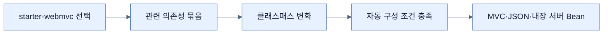

# Spring Boot 스타터로 기능 묶음 추가하기

## 한눈에 보기

**스타터(starter)**는 웹, JPA, 보안처럼 한 기능 영역에 함께 필요한 의존성을 의도 있는 묶음으로 제공한다. Spring Boot 4에서는 스타터와 자동 구성 모듈이 더 작고 명시적인 기술 단위로 나뉘어, 빌드 파일이 애플리케이션의 기능 경계를 드러낸다.

## 1. 왜 이게 필요한가

Spring MVC 하나를 쓰더라도 Spring Framework 모듈, JSON 처리, 검증, 내장 서버처럼 호환되는 라이브러리를 함께 골라야 한다. 개별 좌표를 외우고 버전을 맞추는 방식은 누락과 우연한 전이 의존성을 만든다. 스타터는 “이 기능을 사용한다”라는 결정을 한 줄의 의존성으로 표현한다.

## 2. 어떻게 동작하는가

예를 들어 `spring-boot-starter-webmvc`를 추가하면 MVC 애플리케이션에 필요한 기술이 클래스패스에 들어온다. 자동 구성은 그 존재를 감지해 내장 서블릿 컨테이너, MVC 인프라, 직렬화기 등을 조건부로 준비한다. `spring-boot-starter-data-jpa`는 JPA와 Spring Data의 저장소 추상화를 사용할 기반을 만든다.

1. 개발자가 원하는 capability에 대응하는 스타터를 고른다.
2. 빌드 도구가 스타터의 전이 의존성을 해석한다.
3. 클래스패스가 바뀐다.
4. 자동 구성 조건이 활성화되어 관련 Bean이 생긴다.

스타터는 완제품 키트에 가깝다. 다만 모든 조합을 대신 설계해 주는 것은 아니다. 불필요한 스타터를 넣으면 사용하지 않는 기술이 클래스패스와 보안 표면에 들어올 수 있으므로 의도적으로 선택해야 한다.

## 3. 그림으로 보기

## 4. 이 노트에 나온 용어

- **starter**: 특정 기능 영역의 권장 의존성을 묶은 설명용 의존성.
- **transitive dependency**: 직접 선언한 모듈이 다시 요구하여 함께 들어오는 간접 의존성.
- **classpath**: JVM과 프레임워크가 클래스·리소스를 찾는 경로 집합.

## 7. 연결

- [[01-autoconfiguring-spring-beans]] — 스타터는 자동 구성의 입력을 만든다.
- [[04-managing-application-dependencies]] — 스타터 구성 요소의 호환 버전은 Boot BOM이 맞춘다.
- [[chapter-2-creating-web-and-api-applications-with-spring-boot/01-using-start-spring-io-to-build-apps|Spring Initializr]] — Initializr는 스타터 선택을 프로젝트 골격으로 변환한다.

## 8. 스스로 확인

- 전체 1차 정리 후: 스타터를 추가한 것만으로 Bean이 생기는 과정을 클래스패스와 조건부 구성으로 설명한다.

<!-- ==== 아래는 내 영역 · 스킬 수정 금지 ==== -->

## 내 설명 시도

## 막혔던 지점

## 리뷰 이력

