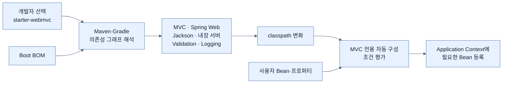
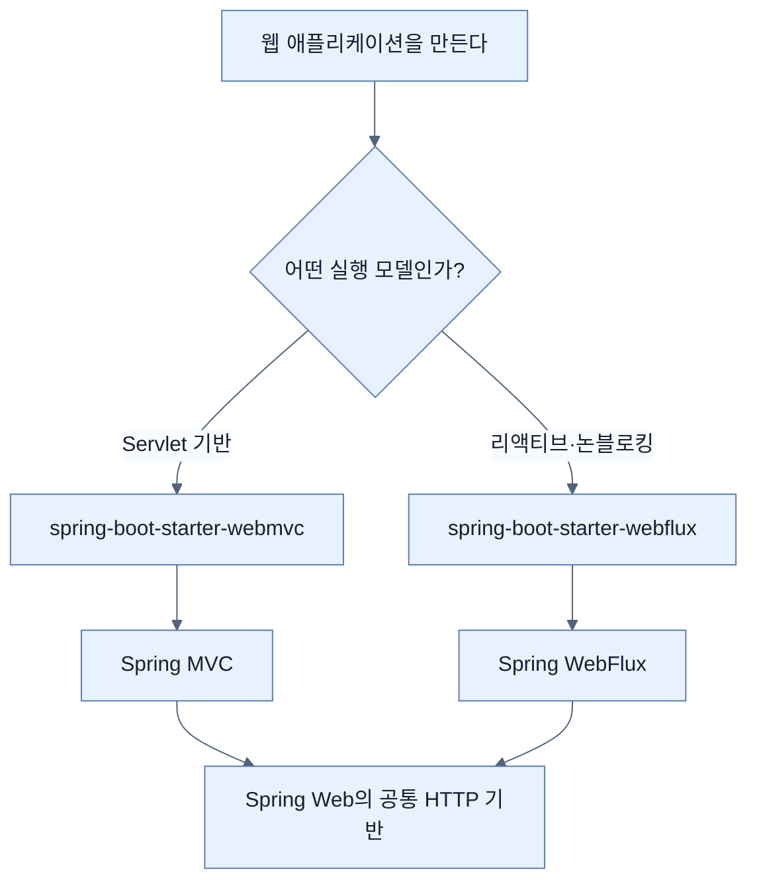

# Spring Boot 스타터로 기능 묶음 추가하기

## 한눈에 보기

| 선택 | 표현하는 의도 | 함께 따라오는 대표 기능 |
|---|---|---|
| `spring-boot-starter-webmvc` | Servlet 기반 Spring MVC 웹 애플리케이션 | MVC, 공통 Web 인프라, Jackson, 내장 서버, 검증·오류 처리, 로깅·설정, MVC 자동 구성 |
| `spring-boot-starter-webflux` | 리액티브·논블로킹 웹 애플리케이션 | WebFlux와 그 실행 모델에 맞는 웹 인프라 |
| `spring-boot-starter-data-jpa` | JPA 기반 영속성 계층 | Spring Data JPA와 관련 JPA 기반 기능 |
| `spring-boot-starter-webmvc-test` | MVC 계층 테스트 | MVC 기술과 정렬된 테스트 지원 |
| `spring-boot-starter-data-jpa-test` | JPA 영속성 테스트 | JPA 기술과 정렬된 테스트 지원 |

## 1. 왜 이게 필요한가

### 출발 장면: “웹 기능 하나”가 의존성 하나가 아니다

Servlet 기반 웹 애플리케이션을 만들기 위해 빌드 파일을 열었다고 하자. Spring MVC 모듈만 추가하면 끝날 것 같지만 실제로는 HTTP 기반 코드, JSON 직렬화, 입력 검증, 오류 처리, 로깅, 내장 서버와 이들을 연결하는 자동 구성까지 서로 호환되는 조합이 필요하다. 각각의 Maven 좌표를 기억해 한 줄씩 추가하면 빠뜨리거나 뜻하지 않은 버전을 섞기 쉽다.

Spring Boot는 이 문제를 **[[스타터]]**(=하나의 기능 영역을 시작하는 데 필요한 의존성을 목적별로 묶은 모듈)로 해결한다. 이름 그대로 starter는 그 기능을 시작하기 위한 출발점이다. “이 라이브러리 A, B, C를 쓴다”보다 “Servlet 기반 MVC를 쓴다”는 의도를 빌드 파일에 표현한다.

### 긴 좌표 목록보다 기능 의도를 선언한다

스타터가 없으면 개발팀이 다음을 직접 관리해야 한다.

- 어떤 Spring 모듈이 필요한가?
- JSON 처리·검증·로깅은 어떤 구현을 함께 넣는가?
- 내장 웹 컨테이너는 무엇을 선택하는가?
- 서로 호환되는 버전인가?
- 테스트에는 운영 의존성 중 어디까지 필요한가?

스타터를 추가하면 빌드 도구가 스타터가 가리키는 **[[전이-의존성]]**(=직접 선언한 모듈이 다시 요구해 간접적으로 함께 들어오는 의존성)을 해석한다. 그 결과 애플리케이션의 **[[클래스패스]]**(=실행 중 클래스와 리소스를 찾는 경로 집합)가 달라지고, **[[자동-구성]]**(=현재 조건을 보고 기반 빈을 등록하는 Boot 기능)이 그 기술에 맞는 구성을 검토한다.

### Spring Boot 4에서 명시성이 더 중요한 이유

책은 Spring Boot 4의 스타터가 더 명시적인 기술 단위로 나뉜 점을 강조한다. 웹이라는 큰 이름 하나로 MVC와 리액티브 중 무엇을 선택했는지 흐리게 두기보다, `webmvc` 또는 `webflux`라는 이름으로 실행 모델을 드러낸다. 테스트 스타터도 실제 테스트할 기술 영역에 맞춰진다.

이 명시성은 단순히 artifact 이름이 길어졌다는 뜻이 아니다. 빌드 파일을 읽는 사람이 “이 서비스는 Servlet MVC인가, 리액티브 WebFlux인가?”, “테스트는 어느 계층을 대상으로 하는가?”를 의존성 선언에서 바로 파악할 수 있게 한다.

비유하면 스타터는 용도별 공구 세트다. “배관 수리 세트”를 고르면 함께 쓰는 공구가 한 상자에 담겨 온다. 그러나 비유는 자동 구성에서 깨진다. 실제 공구 상자는 도구만 제공하지만, Spring Boot에서는 의존성이 클래스패스에 들어온 뒤 자동 구성 정책이 조건을 평가해 실행 객체까지 준비한다. 스타터 하나가 직접 모든 빈을 만드는 것은 아니며, 스타터와 자동 구성이 이어져 동작한다.

## 2. 어떻게 동작하는가

### 2.1 스타터를 빌드 파일에 선언한다

Servlet 기반 MVC를 선택하려면 책은 다음 Maven 의존성을 보여 준다.

```xml
<dependency>
    <groupId>org.springframework.boot</groupId>
    <artifactId>spring-boot-starter-webmvc</artifactId>
</dependency>
```

JPA 기반 데이터 접근을 선택하려면 다음 스타터를 추가한다.

```xml
<dependency>
    <groupId>org.springframework.boot</groupId>
    <artifactId>spring-boot-starter-data-jpa</artifactId>
</dependency>
```

각 좌표를 이름으로 읽으면 설계 의도가 보인다.

- `org.springframework.boot`: Spring Boot가 제공·관리하는 모듈이라는 그룹이다.
- `spring-boot-starter`: 특정 기능을 시작하기 위한 의존성 묶음이라는 공통 접두사다.
- `webmvc`: Servlet 기반 Spring MVC 스택을 명시한다.
- `data-jpa`: Spring Data를 통해 JPA 영속성 기술을 사용한다는 뜻이다.

개별 라이브러리 버전이 코드에 없는 이유는 [[04-managing-application-dependencies|의존성 관리 노트]]에서 다룬다. 짧게 말하면 스타터는 “무엇을 함께 가져올지”를 정하고, Boot BOM은 “어떤 버전으로 가져올지”를 정한다.

### 2.2 빌드 도구가 의존성 그래프를 해석한다

1. 개발자가 기능에 맞는 스타터 하나를 직접 의존성으로 선언한다. — 라이브러리 목록이 아니라 아키텍처 결정을 표현하기 위해서다.
2. Maven 또는 Gradle이 스타터의 전이 의존성을 따라간다. — 기능을 구성하는 관련 모듈을 빠짐없이 클래스패스에 넣기 위해서다.
3. Spring Boot의 의존성 관리가 각 모듈의 버전을 정렬한다. — 개별 최신 버전을 섞어 호환성이 깨지는 문제를 줄이기 위해서다.
4. 애플리케이션 시작 시 자동 구성이 새 클래스패스를 검사한다. — 기술을 실제로 사용할 조건이 갖춰졌는지 확인하기 위해서다.
5. 기존 사용자 빈과 프로퍼티를 포함한 추가 조건을 평가한다. — 스타터가 있다는 이유만으로 사용자의 명시적 구성을 덮지 않기 위해서다.
6. 조건을 만족하는 기반 빈과 런타임 관례를 적용한다. — 반복 인프라 조립을 줄이고 비즈니스 기능을 바로 개발할 수 있게 하기 위해서다.

따라서 다음 등식은 틀리다.

```text
starter = 자동으로 생성된 bean
```

정확한 흐름은 다음과 같다.

```text
starter 선언 → 관련 의존성 유입 → classpath 변화
→ auto-configuration 조건 평가 → 필요한 bean 등록
```

### 2.3 세 웹 영역을 구분한다

책은 Spring의 웹 기능을 세 층위로 설명한다.

#### Spring MVC

**[[Spring-MVC]]**(=Servlet API와 전통적인 요청-응답 실행 모델을 사용하는 Spring 웹 스택)는 성숙한 Servlet 기반 아키텍처를 나타낸다. `spring-boot-starter-webmvc`를 고르면 이 모델을 명시적으로 선택한다.

#### Spring WebFlux

**[[Spring-WebFlux]]**(=리액티브·논블로킹 실행 모델을 지원하는 Spring 웹 스택)는 대기 시간을 스레드를 점유하는 방식과 다르게 다루는 웹 애플리케이션에 사용한다. `spring-boot-starter-webflux`라는 이름이 이 선택을 드러낸다.

#### Spring Web

**[[Spring-Web]]**(=MVC와 WebFlux가 공유하는 HTTP 추상화와 애노테이션 기반 인프라)는 두 프로그래밍 모델에 공통으로 쓰이는 바탕을 제공한다. 공통 애노테이션을 쓴다고 해서 MVC와 WebFlux의 실행 모델이 같아지는 것은 아니다.

| 구분 질문 | Spring MVC | Spring WebFlux | Spring Web |
|---|---|---|---|
| 무엇인가 | Servlet 기반 완성 웹 스택 | 리액티브·논블로킹 완성 웹 스택 | 두 스택이 공유하는 기반 영역 |
| 빌드 의도 | `starter-webmvc` | `starter-webflux` | 보통 완성 스택을 통해 함께 사용 |
| 핵심 차이 | 전통적 Servlet 요청 처리 | 리액티브 실행 모델 | 실행 모델 선택 자체가 아님 |

### 2.4 `spring-boot-starter-webmvc`가 준비하는 범위

책이 열거한 MVC 스타터의 범위는 다음과 같다.

1. Spring MVC와 공통 Spring Web 인프라를 가져온다. — 컨트롤러·요청·응답을 처리하는 프로그래밍 모델이 필요하기 때문이다.
2. Jackson을 통한 JSON 직렬화·역직렬화를 준비한다. — Java 객체와 HTTP JSON 본문을 변환해야 하기 때문이다.
3. **[[내장-서블릿-컨테이너]]**(=애플리케이션 프로세스 안에서 함께 시작되는 Servlet 실행 환경)를 가져온다. — 외부 애플리케이션 서버에 WAR를 배포하지 않고 독립 실행하기 위해서다.
4. 검증과 오류 처리 인프라를 제공한다. — 잘못된 요청을 일관되게 판별하고 응답하기 위해서다.
5. 로깅과 구성 지원을 포함한다. — 실행 상태를 관찰하고 환경별 값을 바꿀 수 있어야 하기 때문이다.
6. MVC 스택에 범위를 맞춘 자동 구성을 가져온다. — 리액티브 스택과 섞지 않고 선택한 아키텍처에 필요한 빈만 구성하기 위해서다.

**[[서블릿]]**(=웹 컨테이너가 HTTP 요청을 Java 코드에 전달하는 서버 규약) 기반 애플리케이션에 필요한 상당 부분이 이 스타터로 준비된다. 하지만 템플릿 엔진은 포함 범위로 가정하면 안 된다. Thymeleaf 같은 서버 측 화면 렌더링을 원하면 목적에 맞는 별도 스타터를 선택해야 한다.

### 2.5 Jakarta EE와 Spring Boot의 관계

책은 현대 Spring Boot가 Servlet, Persistence, Validation 같은 **[[Jakarta-EE]]**(=엔터프라이즈 Java 표준 사양의 모음) API 위에 구축된다고 설명한다. Jakarta EE는 Java EE 사양이 Eclipse Foundation으로 이관된 뒤의 이름이며, 최신 Spring 애플리케이션은 `javax.*`가 아니라 `jakarta.*` 네임스페이스를 사용한다.

여기서 흔한 오해는 “Spring과 Jakarta EE 중 하나만 선택한다”는 것이다. Spring Framework와 Spring Boot는 자체 프로그래밍 모델을 제공하면서도 Servlet·Validation·Persistence 같은 표준 계약은 Jakarta EE API를 활용한다.

### 2.6 테스트 스타터도 대상 기술과 맞춘다

Spring Boot 4의 명시적인 접근은 테스트에도 이어진다.

- `spring-boot-starter-webmvc-test`는 `spring-boot-starter-webmvc`로 만든 MVC 계층을 시험하는 데 필요한 지원을 맞춘다.
- `spring-boot-starter-data-jpa-test`는 JPA 영속성 계층을 시험하는 데 필요한 지원을 맞춘다.

1. 운영 코드의 기술 스택을 먼저 식별한다. — MVC 테스트와 JPA 테스트는 띄워야 할 인프라가 다르기 때문이다.
2. 그 기술과 짝을 이루는 테스트 스타터를 고른다. — 관련 없는 전체 애플리케이션 의존성을 무조건 가져오지 않기 위해서다.
3. 테스트 범위에 맞는 컨텍스트와 도구를 사용한다. — 테스트 속도와 실패 원인의 명확성을 높이기 위해서다.

책은 구체적인 테스트 슬라이스를 Chapter 5에서 더 다룬다. Chapter 1에서 기억할 것은 “운영 스타터와 마찬가지로 테스트 의존성도 기술 의도를 표현한다”는 점이다.

### 2.7 스타터, 자동 구성, BOM의 책임을 분리한다

세 기능은 함께 등장해 섞이기 쉽다.

| 기능 | 답하는 질문 | 작동 중심 시점 | 결과 |
|---|---|---|---|
| 스타터 | 이 기능을 위해 무엇을 함께 가져올까? | 빌드 의존성 해석 | 관련 모듈이 클래스패스에 들어온다 |
| 자동 구성 | 현재 조건에서 어떤 빈을 만들까? | 애플리케이션 시작 | 조건을 만족하는 기반 빈이 컨텍스트에 등록된다 |
| **[[BOM]]**(=호환 버전 제약을 모은 명세) | 각 모듈을 어느 버전으로 쓸까? | 의존성 버전 해석 | Spring과 주요 서드파티 버전이 정렬된다 |

스타터만으로 버전 호환 문제가 완전히 해결되는 것도 아니고, BOM만으로 필요한 라이브러리가 자동 선택되는 것도 아니다. 각자 다른 질문에 답한다.

## 3. 그림으로 보기





첫 번째 그림은 스타터가 직접 빈을 만드는 것이 아니라 클래스패스를 바꾸고 자동 구성의 입력을 만든다는 점을 보여 준다. 두 번째 그림은 `webmvc`와 `webflux`가 단순한 이름 차이가 아니라 실행 아키텍처 선택임을 보여 준다.

## 4. 이 노트에 나온 용어

| 용어 | 한 줄 풀이 | 자세히 |
|---|---|---|
| 스타터 | 기능 영역별 권장 의존성을 묶은 시작점 | [[_glossary#스타터]] |
| 전이 의존성 | 직접 의존성이 다시 요구해 간접적으로 들어오는 의존성 | [[_glossary#전이-의존성]] |
| 클래스패스 | JVM이 실행 중 클래스와 리소스를 찾는 경로 집합 | [[_glossary#클래스패스]] |
| 자동 구성 | 클래스패스 등의 조건으로 기반 빈을 등록하는 Boot 기능 | [[_glossary#자동-구성]] |
| Spring MVC | Servlet 기반 Spring 웹 스택 | [[_glossary#Spring-MVC]] |
| Spring WebFlux | 리액티브·논블로킹 Spring 웹 스택 | [[_glossary#Spring-WebFlux]] |
| Spring Web | 두 웹 스택이 공유하는 HTTP 기반 영역 | [[_glossary#Spring-Web]] |
| 서블릿 | HTTP 요청을 Java 서버 코드에 전달하는 Jakarta 규약 | [[_glossary#서블릿]] |
| 내장 서블릿 컨테이너 | 애플리케이션과 함께 시작되는 Servlet 실행 환경 | [[_glossary#내장-서블릿-컨테이너]] |
| Jakarta EE | Servlet·Persistence·Validation 등의 엔터프라이즈 Java 사양 모음 | [[_glossary#Jakarta-EE]] |
| BOM | 라이브러리의 호환 버전 제약을 모은 명세 | [[_glossary#BOM]] |

## 5. 자주 헷갈리는 것

### 스타터 vs 자동 구성

- 스타터는 빌드 파일의 의존성 묶음이다.
- 자동 구성은 애플리케이션 시작 때 조건을 평가하는 코드다.
- 스타터가 자동 구성 모듈과 기반 라이브러리를 가져오므로 이어져 보이지만, 두 단계의 책임은 다르다.

### 스타터 vs BOM

- 스타터: 함께 필요한 “목록”을 제공한다.
- BOM: 그 목록과 직접 의존성에 적용할 “버전 제약”을 제공한다.
- 스타터의 이름에 버전을 쓰지 않아도 되는 것은 별도의 Boot 의존성 관리가 있기 때문이다.

### Spring MVC vs Spring WebFlux

둘 다 Spring의 애노테이션과 HTTP 추상화를 일부 공유할 수 있지만 실행 모델과 적합한 라이브러리가 다르다. 단지 더 최신이라는 이유로 WebFlux를 고르거나, 이름이 익숙하다는 이유로 MVC를 고르는 것이 아니라 애플리케이션의 I/O 특성과 팀의 프로그래밍 모델을 기준으로 선택해야 한다.

### 스타터가 포함하는 것 vs 애플리케이션에 필요한 모든 것

`starter-webmvc`는 실행 가능한 웹 애플리케이션의 기반을 제공하지만 서버 측 HTML 템플릿 엔진까지 자동으로 선택하지 않는다. 데이터베이스 드라이버, 비즈니스 기능, 운영 환경의 비밀값도 별도로 선택해야 한다.

## 6. 언제 안 쓰나 / 경계

- 스타터가 제공하는 묶음보다 훨씬 제한된 라이브러리만 필요한 모듈에서는 개별 의존성을 선택할 수 있다. 다만 자동 구성과 버전 관리 관계를 직접 확인해야 한다.
- 상충하는 웹 스타터를 아무 생각 없이 함께 넣으면 “둘 다 쓸 수 있겠지”가 아니라 어떤 애플리케이션 타입이 선택되는지 이해하기 어려워질 수 있다.
- 전이 의존성은 편리하지만 보이지 않는 의존이다. 실제 배포물과 보안 표면을 파악하려면 Maven/Gradle의 dependency tree를 확인해야 한다.
- 스타터 선택은 비즈니스 아키텍처를 대신 결정하지 않는다. MVC를 넣었다고 계층 구조나 도메인 경계가 자동으로 좋은 설계가 되지는 않는다.

## 7. 연결

- [[01-autoconfiguring-spring-beans]] — 스타터가 만든 클래스패스가 기술별 자동 구성 정책을 활성화하는 입력이 된다.
- [[03-customizing-the-setup-with-configuration-properties]] — 스타터가 제공한 기본 빈의 값과 실행 조건은 구성 프로퍼티로 조정한다.
- [[04-managing-application-dependencies]] — 스타터의 구성 요소가 사용할 호환 버전은 Spring Boot BOM이 정렬한다.

## 8. 스스로 확인

1. `spring-boot-starter-webmvc` 한 줄에서 실제 MVC 빈이 생기기까지의 단계를 빌드 시점과 시작 시점으로 나눠 설명할 수 있는가?
2. 스타터와 자동 구성이 같은 기능이 아닌 이유는 무엇인가?
3. 스타터와 BOM은 각각 “무엇”과 “버전” 중 어느 질문에 답하는가?
4. Spring MVC, Spring WebFlux, Spring Web의 관계를 공통 기반과 실행 모델로 구분할 수 있는가?
5. MVC 스타터가 제공하는 여섯 범위와 별도로 선택해야 하는 템플릿 엔진을 설명할 수 있는가?
6. Spring Boot가 Spring을 쓰면서도 Jakarta EE의 Servlet·Validation API에 의존하는 것이 모순이 아닌 이유는 무엇인가?
7. 테스트 스타터가 기술별로 나뉘면 테스트의 범위와 빌드 가독성에 어떤 이점이 생기는가?

<!-- ==== 아래는 내 영역 · 스킬 수정 금지 ==== -->

## 내 설명 시도


## 막혔던 지점


## 리뷰 이력

