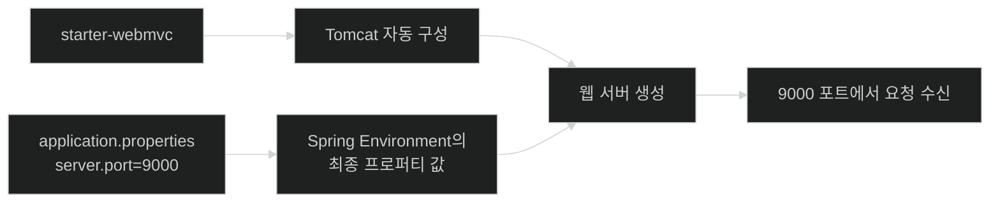
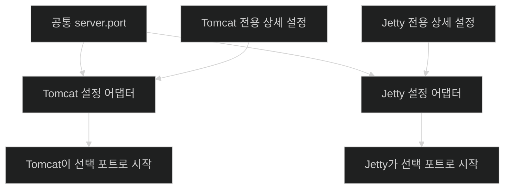

# Configuration Properties로 자동 구성의 기본값 바꾸기

## 한눈에 보기

| 질문 | 핵심 |
|---|---|
| Boot가 웹 서버 기본값을 고르면 그대로 써야 하나? | 아니다. 구성 프로퍼티로 기본값을 덮어쓸 수 있다. |
| 가장 단순한 예는? | `src/main/resources/application.properties`의 `server.port=9000` |
| 어떤 파일 형식을 지원하나? | `application.properties`와 `application.yml`/`application.yaml` |
| Tomcat에서 Jetty로 바꾸면 키도 바뀌나? | 일반 서버 포트는 공통 `server.port`를 그대로 쓴다. |
| 공통 키로 부족하면? | 컨테이너별 상세 프로퍼티를 사용한다. |

## 1. 왜 이게 필요한가

### 출발 장면: 웹 서버는 떴지만 8080 포트를 쓸 수 없다

`spring-boot-starter-webmvc`를 추가해 애플리케이션을 실행하면 Spring Boot는 내장 Apache Tomcat과 여러 MVC 기반 빈을 준비한다. 개발자가 서버 생성 코드를 쓰지 않아도 실행되지만, 그 순간 Boot는 포트, context path, SSL, 스레드 같은 수많은 값을 먼저 선택해야 한다.

예를 들어 같은 컴퓨터에서 두 개의 Spring Boot 웹 애플리케이션이 모두 기본 포트 8080을 사용하려 하면 두 번째 프로세스는 포트 충돌로 시작할 수 없다. 자동 구성이 기본값을 제공한다는 사실과, 그 값을 프로젝트에 맞게 바꿀 수 있어야 한다는 요구는 함께 존재한다.

Spring Boot는 **[[구성-프로퍼티]]**(=이름-값 형태의 외부 입력으로 Boot 또는 사용자 빈의 설정을 조정하는 모델)를 제공한다. “convention over configuration”은 구성을 없앤다는 뜻이 아니라, 흔한 기본값을 제공해 반드시 써야 하는 구성만 남긴다는 뜻이다.

### 자동 구성과 사용자 선택 사이의 균형

**[[Spring-MVC]]**(=Servlet 기반 Spring 웹 스택) 스타터를 선택하면 Spring Boot는 기본적으로 실행 가능한 웹 환경을 만든다. 이때 **[[내장-서블릿-컨테이너]]**(=애플리케이션 프로세스 안에서 함께 시작되는 Servlet 실행 환경)가 네트워크 요청을 받을 설정을 필요로 한다.

선택지가 두 극단뿐이라면 둘 다 문제가 된다.

- 모든 값을 코드로 직접 구성: 반복 설정이 많아지고 서버 구현을 바꾸기 어렵다.
- 모든 값을 Boot 기본값으로 고정: 포트·SSL·스레드 등 운영 요구를 반영할 수 없다.

구성 프로퍼티는 “기본 객체 구조는 자동 구성에 맡기고, 환경이나 프로젝트에 따라 달라지는 값은 외부 입력으로 바꾼다”는 중간 지점을 만든다.

비유하면 자동 구성은 새 집에 기본 조명과 스위치를 설치해 주는 것이고, 구성 프로퍼티는 전구 밝기와 켜지는 시간을 조절하는 설정판이다. 하지만 이 비유는 구조 변경에서 깨진다. 설정판으로 모든 배선을 바꿀 수 없듯 프로퍼티만으로 임의의 객체 구조를 만들 수는 없다. 기본 구성이 제공하지 않는 구조는 사용자 빈이나 별도 구성 코드가 필요하다.

## 2. 어떻게 동작하는가

### 2.1 `application.properties`에 포트를 적는다

책의 첫 예제는 다음 한 줄이다.

```properties
server.port=9000
```

파일 위치는 다음과 같다.

```text
project-root/
└── src/
    └── main/
        └── resources/
            └── application.properties
```

Java의 `.properties` 형식은 기본적으로 `key=value` 쌍을 사용한다.

- 왼쪽 `server.port`는 어떤 설정인지를 나타내는 키다.
- 오른쪽 `9000`은 그 설정에 적용할 값이다.
- 점으로 구분한 이름은 `server` 영역의 `port` 설정이라는 계층적 의미를 드러낸다.

애플리케이션 시작 흐름은 다음과 같다.

1. Spring Boot가 구성 데이터를 읽을 시점에 `application.properties`를 찾는다. — 코드 수정 없이 표준 위치의 설정을 자동 발견하기 위해서다.
2. 파일의 키와 문자열 값을 프로퍼티 환경에 적재한다. — 여러 구성 소비자가 같은 입력 모델을 사용하게 하기 위해서다.
3. 웹 서버 자동 구성이 `server.port`의 최종 값을 조회한다. — 기본 포트를 무조건 쓰지 않고 사용자의 선택을 반영하기 위해서다.
4. 값이 없으면 기본 8080을 사용하고, `9000`이 있으면 그 값으로 덮는다. — 설정을 생략해도 실행되면서 필요할 때만 바꿀 수 있게 하기 위해서다.
5. 내장 서버가 선택된 포트에 바인딩한다. — 실제 네트워크 요청을 해당 포트에서 받기 위해서다.

한 컴퓨터에서 여러 애플리케이션을 띄울 때 각각 다른 포트를 지정하면 충돌을 피할 수 있다. 다만 포트가 다르면 클라이언트와 배포 인프라의 라우팅 설정도 함께 맞아야 한다.

### 2.2 YAML도 사용할 수 있다

Spring Boot는 `application.properties`뿐 아니라 `application.yml` 또는 `application.yaml` 형식도 지원한다. 같은 의미를 YAML로 적으면 다음과 같다.

```yaml
server:
  port: 9000
```

| 관점 | Properties | YAML |
|---|---|---|
| 표현 | `server.port=9000` | 들여쓰기 기반 계층 |
| 장점 | 단순하고 한 줄 비교가 쉽다 | 중첩 구조를 묶어 읽기 쉽다 |
| 주의 | 긴 접두사가 반복될 수 있다 | 들여쓰기와 자료형 해석에 주의해야 한다 |

Chapter 1은 `application.properties`를 사용한다. 형식 선택보다 더 중요한 것은 같은 키가 어떤 빈의 어떤 값을 조정하는지 이해하는 것이다.

표가 보여 주는 것은 **차이**뿐이다. 질문을 뒤집어 “무엇이 같은가”를 보면 형식 선택이 왜 취향 문제에 가까운지가 드러난다. 두 형식은 다음을 **동일하게** 해결한다.

| 같은 것 | 뜻하는 바 |
|---|---|
| 키 이름 공간 | `server.port`와 `server: port:`는 같은 키다. 형식을 바꿔도 키를 다시 짓지 않는다 |
| 우선순위 층 | 둘 다 config data라는 **한 층**에 속한다. YAML이라서 더 세거나 약하지 않다 |
| 도달 지점 | 둘 다 같은 Spring `Environment`로 들어가고, 소비자는 어느 형식에서 왔는지 알지 못한다 |
| 바인딩 규칙 | 같은 느슨한 바인딩 규칙이 적용된다. 단순 프로퍼티에서 camelCase·kebab-case·밑줄 표기를 똑같이 허용한다 |

실제로 갈리는 지점은 표현 문법과 **리스트 표기**다. properties는 대괄호 인덱스나 쉼표 구분을 쓰고 YAML은 YAML 리스트 문법이나 쉼표 구분을 쓴다.

정말로 규칙이 다른 것은 두 파일 형식 사이가 아니라 **파일과 환경 변수 사이**다. 환경 변수는 대문자와 밑줄만 쓸 수 있어 표기 자체가 달라진다. 그 규칙은 [[03a-creating-custom-properties]]에서 다룬다.

### 2.3 컨테이너가 달라도 공통 프로퍼티를 사용한다

Spring Boot는 기본 Tomcat 외에도 Jetty 계열의 내장 서버 선택을 지원한다. 서버 구현마다 원래 설정 API와 세부 옵션은 다르지만, 일반적인 HTTP 포트는 공통 `server.port`로 표현한다.

1. 개발자가 웹 서버 스타터 조합을 선택한다. — 어떤 **[[서블릿]]**(=HTTP 요청을 Java 서버 코드로 전달하는 Jakarta 규약) 컨테이너를 사용할지 결정하기 위해서다.
2. Boot의 해당 컨테이너 자동 구성이 활성화된다. — Tomcat 또는 Jetty에 맞는 실제 서버 객체를 만들기 위해서다.
3. 두 자동 구성 모두 공통 서버 프로퍼티 모델에서 `server.port`를 읽는다. — 컨테이너 교체가 애플리케이션 공통 설정의 전면 재작성을 요구하지 않게 하기 위해서다.
4. 특정 컨테이너만의 기능이 필요하면 전용 프로퍼티를 추가한다. — 공통 추상화로 표현할 수 없는 세부 조절 능력을 보존하기 위해서다.

공통 키는 기술 교체 비용을 낮추지만, 모든 서버가 완전히 같은 기능을 제공한다는 뜻은 아니다.

### 2.4 Spring Boot 4의 Servlet 6.1 경계

책은 Spring Boot 4가 Servlet 6.1 호환 런타임을 요구한다고 짚는다. Tomcat 11과 Jetty 12.1 계열이 이 기준을 충족한다. 출판 시점에 Undertow는 Servlet 6.1과 호환되지 않아 Spring Boot 4에서 Undertow 스타터와 내장 서버 지원이 제거되었다.

이 사실은 두 가지를 보여 준다.

- 구성 프로퍼티가 서버 교체를 쉽게 해도, 기반 표준 버전 호환성까지 무시할 수는 없다.
- 과거 Spring Boot 버전에서 가능했던 조합이 새 메이저 버전에서도 자동으로 유지된다고 가정하면 안 된다.

현재 프로젝트에서는 선택한 Spring Boot 패치 버전의 시스템 요구사항과 마이그레이션 가이드를 다시 확인해야 한다.

### 2.5 프로퍼티는 런타임 유연성을 만든다

포트 예제의 진짜 목적은 9000이라는 숫자를 외우는 것이 아니다. 코드와 빌드 산출물은 같게 두고 실행 환경이 값을 공급할 수 있다는 모델을 익히는 것이다. 이것이 **[[외부화된-구성]]**(=환경별 값을 코드와 애플리케이션 바이너리 밖에서 공급하는 방식)으로 확장된다.

이후 흐름은 세 단계로 이어진다.

- [[03a-creating-custom-properties]]: Boot가 제공한 키뿐 아니라 애플리케이션 고유 키를 타입 있는 객체에 묶는다.
- [[03b-externalizing-application-configuration]]: 파일 위치, 프로파일, 환경 변수 등 여러 외부 소스와 우선순위를 다룬다.
- [[03c-configuring-property-based-beans]]: 값만 바꾸는 것을 넘어 어떤 구현 빈을 만들지 결정한다.

## 3. 그림으로 보기





첫 그림은 프로퍼티가 자동 구성의 입력이라는 점을, 둘째 그림은 공통 설정과 구현별 상세 설정이 함께 존재하는 이유를 보여 준다.

## 4. 이 노트에 나온 용어

| 용어 | 한 줄 풀이 | 자세히 |
|---|---|---|
| 구성 프로퍼티 | 이름-값 입력으로 Boot 또는 사용자 빈의 설정을 조정하는 모델 | [[_glossary#구성-프로퍼티]] |
| Spring MVC | Servlet 기반 Spring 웹 스택 | [[_glossary#Spring-MVC]] |
| 내장 서블릿 컨테이너 | 애플리케이션과 함께 시작되는 Servlet 실행 환경 | [[_glossary#내장-서블릿-컨테이너]] |
| 서블릿 | HTTP 요청을 Java 서버 코드에 전달하는 Jakarta 규약 | [[_glossary#서블릿]] |
| 외부화된 구성 | 실행 환경의 값을 코드와 바이너리 밖에서 공급하는 방식 | [[_glossary#외부화된-구성]] |

## 5. 자주 헷갈리는 것

### 기본값 vs 강제값

Spring Boot의 8080은 사용자가 바꿀 수 없는 규칙이 아니라 설정이 없을 때 적용하는 기본값이다. `server.port=9000`을 제공하면 자동 구성은 그 값을 소비한다.

### 공통 프로퍼티 vs 컨테이너별 프로퍼티

`server.port`는 여러 서블릿 컨테이너에 공통으로 적용되는 추상화다. 세부 스레드·연결 옵션은 구현별 키가 필요할 수 있다. 공통 키가 있다는 사실을 “모든 서버 설정이 동일하다”로 확대하면 안 된다.

### `.properties` vs Java system property

파일 형식인 `application.properties`와 JVM의 `-Dserver.port=9000` 시스템 프로퍼티는 서로 다른 프로퍼티 소스다. 같은 키를 제공할 수 있지만 우선순위와 공급 위치가 다르다.

## 6. 언제 안 쓰나 / 경계

- 구성 프로퍼티는 복잡한 비즈니스 의사결정을 코드 밖의 문자열로 옮기는 도구가 아니다. 어떤 값이 운영 설정인지 도메인 규칙인지 구분해야 한다.
- 포트를 바꿨다고 방화벽, 컨테이너 포트 노출, 로드 밸런서 라우팅까지 자동으로 바뀌지 않는다.
- 비밀값을 외부 파일로 옮겼다고 자동으로 암호화되거나 접근 제어되는 것은 아니다. 외부화와 비밀 관리는 별도 문제다.
- Undertow 제거처럼 메이저 버전의 플랫폼 기준이 바뀌면 프로퍼티 호환성만으로 서버 구현을 유지할 수 없다.

## 7. 연결

- [[01-autoconfiguring-spring-beans]] — 구성 프로퍼티는 자동 구성 정책이 기본 빈을 만들 때 소비하는 입력이다.
- [[02-adding-portfolio-components-using-spring-boot-starters]] — 웹 스타터가 서버 자동 구성을 활성화하고 프로퍼티를 적용할 대상을 만든다.
- [[03a-creating-custom-properties]] — 같은 프로퍼티 모델을 애플리케이션 고유 설정 객체로 확장한다.
- [[03b-externalizing-application-configuration]] — 설정 파일 밖의 여러 소스와 프로파일별 덮어쓰기를 다룬다.

## 8. 스스로 확인

1. `server.port`가 없을 때와 9000일 때 웹 서버 시작 과정을 비교해 설명할 수 있는가?
2. 자동 구성의 기본값이 있으면서도 개발자 제어권이 유지되는 이유는 무엇인가?
3. Tomcat에서 Jetty로 바꿔도 `server.port`를 유지할 수 있는 구조적 이유는 무엇인가?
4. 공통 서버 프로퍼티와 컨테이너 전용 프로퍼티는 각각 어떤 문제를 해결하는가?
5. Spring Boot 4에서 Undertow 지원이 제거된 사실이 “구성과 플랫폼 호환성”에 관해 무엇을 보여 주는가?
6. `application.properties`와 `application.yml`은 표현 방식 외에 어떤 점을 동일하게 해결하는가?

> 여섯 문항을 스스로 답한 **뒤에** [[_03-customizing-the-setup-with-configuration-properties]]에서 모범답안과 대조한다. 먼저 열면 이 문항들은 다시 인출 문제로 쓸 수 없다.

<!-- ==== 아래는 내 영역 · 스킬 수정 금지 ==== -->

## 내 설명 시도


## 막혔던 지점


## 리뷰 이력

