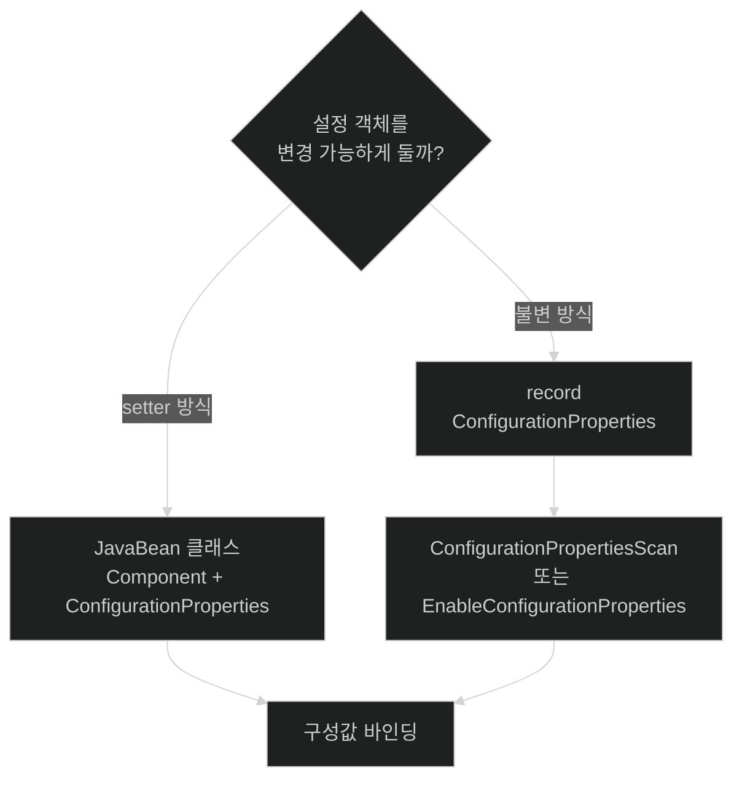

# 애플리케이션 전용 Configuration Properties 만들기

## 한눈에 보기

| 방식 | 등록 방법 | 값 전달 방식 | 적합한 경우 |
|---|---|---|---|
| 가변 JavaBean 클래스 | `@Component` + `@ConfigurationProperties` | setter 중심 바인딩 | 책의 첫 예제처럼 단순하게 시작할 때 |
| record 또는 생성자 중심 타입 | `@ConfigurationProperties` + scan/enable | 생성자 매개변수 바인딩 | 불변 설정 객체를 원할 때 |
| 기본값 | 필드 초기값 또는 생성자 기본값 | 외부 값이 없을 때 사용 | 선택 설정에 합리적인 기본이 있을 때 |

## 1. 왜 이게 필요한가

### 출발 장면: `server.port` 말고 우리 애플리케이션의 제목도 바꾸고 싶다

화면 상단에는 `Learning Spring Boot 4`, 하단에는 소스 코드 주소를 표시한다고 하자. 문자열을 컨트롤러와 템플릿 코드에 직접 적으면 문구를 바꿀 때 소스를 수정하고 다시 빌드해야 하며, 같은 값이 여러 곳에 복제될 수 있다.

Spring Boot가 제공하는 `server.port`만 구성 가능한 것이 아니다. **[[구성-프로퍼티]]**(=이름-값 입력으로 빈의 설정을 조정하는 모델)는 애플리케이션이 만든 **[[스프링-빈]]**(=Spring 컨테이너가 생성·연결·관리하는 객체)에도 적용할 수 있다. 관련 키를 하나의 타입으로 묶으면 문자열 키를 코드 곳곳에서 직접 조회하지 않고 의미 있는 설정 객체를 주입받을 수 있다.

### 관련 설정을 하나의 이름 공간으로 묶는다

책의 예제는 `my.app`을 접두사로 사용한다.

```text
my.app.header
my.app.footer
```

접두사(prefix)는 설정 키의 공통 앞부분이다. `my.app`이라는 이름은 Spring Boot 내장 키와 애플리케이션 고유 키가 충돌하지 않게 하고, 서로 관련된 설정임을 보여 준다. `header`와 `footer`는 Java 객체의 프로퍼티 이름에 대응한다.

비유하면 접두사는 아파트 동 주소이고 각 필드는 호수다. `my.app` 동의 `header` 호와 `footer` 호로 값이 배달된다. 하지만 이 비유는 타입 변환에서 깨진다. 우편은 주소만 맞으면 같은 방식으로 전달되지만, 프로퍼티 바인더는 문자열을 숫자·기간·목록·중첩 객체 같은 Java 타입으로 변환해야 하며 변환할 수 없는 값은 시작 오류가 될 수 있다.

### 문자열 키 조회보다 타입 있는 객체가 낫다

설정 객체를 쓰면 다음 이점이 생긴다.

- 관련 키가 하나의 클래스에 모인다.
- 코드가 `"my.app.header"` 같은 문자열을 반복하지 않는다.
- 필드 타입으로 허용되는 값의 형태를 표현할 수 있다.
- 기본값을 설정 객체 가까이에 둘 수 있다.
- IDE가 구성 메타데이터를 통해 키 탐색과 자동완성을 제공하기 쉬워진다.

## 2. 어떻게 동작하는가

### 2.1 가변 JavaBean 방식으로 설정 타입을 만든다

책의 첫 예제 구조는 다음과 같다.

```java
@Component
@ConfigurationProperties(prefix = "my.app")
public class MyCustomProperties {

    // 기본값이 필요하면 필드나 생성자에서 지정할 수 있다.
    private String header;
    private String footer;

    public String getHeader() {
        return header;
    }

    public void setHeader(String header) {
        this.header = header;
    }

    public String getFooter() {
        return footer;
    }

    public void setFooter(String footer) {
        this.footer = footer;
    }
}
```

각 애노테이션은 서로 다른 책임을 가진다.

- `@Component`: 컴포넌트 스캔이 이 클래스를 발견해 Spring bean으로 등록하게 한다.
- `@ConfigurationProperties(prefix = "my.app")`: `my.app` 아래의 외부 설정을 이 타입에 묶도록 Spring Boot에 알린다.

가변 클래스는 **[[자바빈]]**(=private 필드와 getter/setter, 인자 없는 생성자 같은 관례를 따르는 객체) 프로퍼티 규칙을 따른다. 책 예제에서 `header`에는 `getHeader()`와 `setHeader(...)`가, `footer`에는 `getFooter()`와 `setFooter(...)`가 대응한다. getter는 다른 코드가 읽을 길을 제공하고 setter는 바인더가 값을 넣을 길을 제공한다.

### 2.2 프로퍼티 파일에 값을 제공한다

```properties
my.app.header=Learning Spring Boot 4
my.app.footer=Find all the source code at https://github.com/PacktPublishing/Learning-Spring-Boot-4
```

**[[프로퍼티-바인딩]]**(=외부 구성의 문자열 값을 Java 타입의 프로퍼티에 변환·연결하는 과정)은 다음 순서로 이해할 수 있다.

1. 컴포넌트 스캔이 `MyCustomProperties`를 빈 후보로 찾는다. — 바인딩 결과를 애플리케이션에서 주입받을 관리 객체가 필요하기 때문이다.
2. Spring Boot가 `@ConfigurationProperties`와 `my.app` 접두사를 읽는다. — 전체 구성 중 이 객체가 소비할 키 범위를 정하기 위해서다.
3. 최종 프로퍼티 환경에서 `my.app.header`와 `my.app.footer`를 찾는다. — 내부 파일·외부 파일·환경 변수 등 여러 소스가 합쳐진 뒤의 승자 값을 사용하기 위해서다.
4. 키의 나머지 이름을 객체의 `header`, `footer` 프로퍼티에 대응시킨다. — 문자열 키를 의미 있는 Java 멤버와 연결하기 위해서다.
5. 값을 필요한 타입으로 변환해 객체에 설정한다. — 애플리케이션 코드가 원시 문자열을 직접 파싱하지 않게 하기 위해서다.
6. 완성된 설정 빈을 **[[애플리케이션-컨텍스트]]**(=Spring 빈의 생성·연결·생명주기를 관리하는 컨테이너)에서 다른 컴포넌트에 주입한다. — 여러 소비자가 동일한 설정 모델을 재사용하게 하기 위해서다.

책의 “값이 주입된 뒤 컨텍스트에 들어간다”는 표현은 학습 흐름을 단순화한 것이다. 실제로는 해당 타입이 빈으로 등록되고 생성 과정에서 구성 프로퍼티 후처리와 바인딩을 거친 다음, 다른 빈이 사용할 준비가 된다고 이해하는 편이 정확하다.

### 2.3 설정 빈을 다른 컴포넌트에서 사용한다

```java
@Component
public class PageTextService {

    private final MyCustomProperties properties;

    public PageTextService(MyCustomProperties properties) {
        this.properties = properties;
    }

    public String header() {
        return properties.getHeader();
    }
}
```

여기서는 두 종류의 “주입”이 이어진다.

1. 프로퍼티 바인딩이 `my.app.header` 값을 `MyCustomProperties.header`에 넣는다. — 외부 문자열을 설정 객체로 만들기 위해서다.
2. Spring의 의존성 주입이 완성된 `MyCustomProperties` 빈을 `PageTextService` 생성자에 넣는다. — 서비스가 구성 소스를 직접 조회하지 않게 하기 위해서다.

바인딩은 “값 → 설정 객체”, 의존성 주입은 “설정 객체 → 소비하는 빈”의 연결이다.

### 2.4 기본값을 둔다

외부 값이 선택 사항이라면 필드나 생성자에서 기본값을 정할 수 있다.

```java
private String header = "My Application";
```

1. 코드가 안전한 기본값을 제공한다. — 설정이 빠져도 애플리케이션이 의미 있게 동작하게 하기 위해서다.
2. 외부 값이 있으면 바인더가 기본값을 덮는다. — 배포 환경이 코드 재빌드 없이 값을 바꿀 수 있게 하기 위해서다.

인증 토큰처럼 반드시 외부에서 제공해야 하는 값에 무심코 작동하는 기본값을 두면 누락을 숨길 수 있다. 기본값은 설정 부재가 정말 허용되는 항목에만 사용한다.

### 2.5 record로 불변 설정 타입을 만든다

책은 Java record도 사용할 수 있다고 덧붙인다.

```java
@ConfigurationProperties(prefix = "my.app")
public record MyCustomProperties(String header, String footer) {
}
```

record 방식에서는 `@Component`를 붙이지 않고, Spring Boot 애플리케이션 구성에서 다음 중 하나로 등록한다.

```java
@ConfigurationPropertiesScan
@SpringBootApplication
public class Application {
}
```

또는 필요한 타입을 명시한다.

```java
@EnableConfigurationProperties(MyCustomProperties.class)
@SpringBootApplication
public class Application {
}
```

1. record의 컴포넌트가 생성자 매개변수가 된다. — setter 없이 한 번에 완성된 불변 객체를 만들기 위해서다.
2. scan 또는 enable이 해당 타입을 구성 프로퍼티 빈으로 등록한다. — `@Component` 없이도 바인딩 대상을 컨텍스트에 알려 주기 위해서다.
3. 바인더가 생성자 인자에 값을 연결한다. — 생성 후 변경하지 않아도 되는 설정 스냅샷을 만들기 위해서다.

### 2.6 코드에 넣으면 안 되는 값을 설정으로 분리한다

책은 GitHub API에 접근할 개인 코드를 예로 들어 `app.security` 접두사의 별도 설정 타입을 만든다.

```java
@Component
@ConfigurationProperties(prefix = "app.security")
public class ApplicationSecuritySettings {

    private String githubPersonalCode;

    public String getGithubPersonalCode() {
        return githubPersonalCode;
    }

    public void setGithubPersonalCode(String githubPersonalCode) {
        this.githubPersonalCode = githubPersonalCode;
    }
}
```

이 코드가 해결하는 핵심은 토큰 값 자체를 클래스에 하드코딩하지 않는 것이다.

1. 비밀값의 구조와 이름만 코드에 둔다. — 어떤 설정이 필요한지는 컴파일 시점에 표현하기 위해서다.
2. 실제 값은 실행 환경에서 공급한다. — 토큰 변경이 애플리케이션 재빌드·재배포를 요구하지 않게 하기 위해서다.
3. 설정 객체를 필요한 API 클라이언트에 주입한다. — 비밀값 접근 지점을 제한하고 구성 조회 코드를 분산시키지 않기 위해서다.

이 단계가 **[[외부화된-구성]]**(=환경별 값을 코드와 산출물 밖에서 공급하는 방식)으로 이어진다. 단, “설정으로 뺐다”는 것과 “안전한 비밀 저장소에 보관했다”는 것은 다르다. 평문 파일, 로그, Git 커밋에 비밀이 남지 않도록 별도 보호가 필요하다.

### 2.7 환경 변수로는 `my.app.header`라고 쓸 수 없다

앞의 §2.2는 “여러 소스가 합쳐진 뒤의 승자 값”을 쓴다고 했다. 그런데 그 소스 중 하나인 환경 변수에는 **점을 쓸 수 없다.** 리눅스 셸 변수 이름에 허용되는 문자는 영문자, 숫자, 밑줄뿐이고 관례상 대문자다. 그러면 컨테이너 플랫폼이 `my.app.header`를 어떻게 주는가.

```bash
# 이건 대부분의 셸에서 아예 설정되지 않는다
my.app.header=...

# 실제로 쓰는 형태
MY_APP_HEADER="Learning Spring Boot 4"
```

Spring Boot는 이 문제를 **[[느슨한-바인딩]]**(=소스마다 자연스러운 표기로 적어도 같은 키로 인식하는 규칙)으로 푼다. 표준형(canonical form) 하나를 두고 소스별 표기를 그 표준형으로 되돌린다.

**표준형을 환경 변수 이름으로 바꾸는 규칙 세 가지**

1. 점(`.`)을 밑줄(`_`)로 바꾼다.
2. 하이픈(`-`)은 **지운다.**
3. 대문자로 만든다.

그래서 `spring.main.log-startup-info`는 `SPRING_MAIN_LOGSTARTUPINFO`가 된다. 하이픈이 밑줄이 되는 것이 **아니라 사라진다**는 점이 함정이다. 리스트는 인덱스를 밑줄로 감싼다 — `my.service[0].other`는 `MY_SERVICE_0_OTHER`다.

**소스마다 허용 표기가 다르다**

| 소스 | 단순 프로퍼티 표기 | 리스트 |
|---|---|---|
| properties 파일 | camelCase · kebab-case · 밑줄 | 대괄호 인덱스 또는 쉼표 구분 |
| YAML 파일 | 위와 같음 | YAML 리스트 문법 또는 쉼표 구분 |
| 시스템 프로퍼티 | camelCase · kebab-case · 밑줄 | 대괄호 인덱스 또는 쉼표 구분 |
| **환경 변수** | **대문자 + 밑줄만** | 인덱스를 밑줄로 감싼다 |

1. 바인더가 소스별 표기를 표준형으로 되돌린다. — 같은 설정을 여러 소스에서 줄 수 있어야 우선순위가 의미를 갖기 때문이다.
2. 표준형끼리 비교해 우선순위 승자를 정한다. — `MY_APP_HEADER`가 파일의 `my.app.header`를 덮으려면 둘이 **같은 키**로 인식돼야 하기 때문이다.
3. 승자 값을 설정 객체의 프로퍼티에 변환해 넣는다. — 애플리케이션이 표기 차이를 몰라도 되게 하기 위해서다.

**적을 때는 kebab-case를 권장한다.** 공식 문서가 `my.person.first-name=Rod`처럼 소문자 kebab으로 저장하기를 권한다. 표준형에 가장 가까워 다른 표기로 옮길 때 규칙을 한 번만 적용하면 되기 때문이다.

**경계**: 이 느슨함은 `@ConfigurationProperties` 바인딩의 규칙이다. 문자열 키를 직접 지정하는 방식에는 같은 관대함을 기대하면 안 된다. 그리고 대소문자를 무시한다고 해서 오타까지 봐주지는 않는다 — `my.app.headr`는 그냥 존재하지 않는 키이고, 조용히 무시된다.

## 3. 그림으로 보기




첫 그림은 프로퍼티 바인딩과 의존성 주입이 연속되지만 서로 다른 연결임을 보여 준다. 둘째 그림은 mutable JavaBean과 record의 등록 방식 차이를 보여 준다.

## 4. 이 노트에 나온 용어

| 용어 | 한 줄 풀이 | 자세히 |
|---|---|---|
| 구성 프로퍼티 | 이름-값 입력으로 빈의 설정을 조정하는 모델 | [[_glossary#구성-프로퍼티]] |
| 프로퍼티 바인딩 | 외부 값을 Java 설정 객체에 타입에 맞게 연결하는 과정 | [[_glossary#프로퍼티-바인딩]] |
| 느슨한 바인딩 | 소스마다 다른 표기를 같은 키로 인식하는 규칙 | [[_glossary#느슨한-바인딩]] |
| 스프링 빈 | 컨텍스트가 생성·연결·관리하는 객체 | [[_glossary#스프링-빈]] |
| 자바빈 | getter/setter와 인자 없는 생성자 같은 객체 관례 | [[_glossary#자바빈]] |
| 애플리케이션 컨텍스트 | Spring 빈과 의존 관계를 관리하는 컨테이너 | [[_glossary#애플리케이션-컨텍스트]] |
| 외부화된 구성 | 환경별 값을 코드와 바이너리 밖에서 공급하는 방식 | [[_glossary#외부화된-구성]] |

## 5. 자주 헷갈리는 것

### 프로퍼티 바인딩 vs 의존성 주입

- 바인딩: `my.app.header`라는 값을 설정 객체의 `header`에 연결한다.
- 의존성 주입: 완성된 설정 객체를 그것이 필요한 서비스에 연결한다.
- 둘 다 “넣어 준다”라고 표현하지만 출발점과 목적지가 다르다.

### `@Component` vs `@ConfigurationProperties`

- `@Component`는 객체를 Spring bean으로 발견·등록하게 한다.
- `@ConfigurationProperties`는 어떤 접두사의 값을 그 객체에 바인딩할지 선언한다.
- 가변 클래스 예제에서는 둘이 함께 필요하지만 record 등록 방식은 다르다.

### 설정 외부화 vs 비밀 관리

토큰을 코드 밖으로 옮겨도 평문 파일을 Git에 커밋하면 안전하지 않다. 외부화는 배포 유연성을 주고, 비밀 저장소·권한·회전 정책은 기밀성을 제공한다.

## 6. 언제 안 쓰나 / 경계

- 관련 없는 설정을 하나의 거대한 `AppProperties`에 모두 넣으면 접두사의 경계와 책임이 흐려진다. 기능별로 응집된 타입을 만든다.
- 기본값이 설정 누락을 숨겨서는 안 된다. 인증 정보나 필수 외부 주소는 시작 시 검증하는 편이 안전하다.
- 구성 프로퍼티 객체에 복잡한 서비스 의존성과 비즈니스 로직을 넣지 않는다. 공식 문서도 이런 타입을 환경 표현에 집중하도록 권한다.
- record는 불변성을 주지만 런타임에 값을 실시간 갱신하는 모델은 아니다. 일반적인 Boot 구성은 시작 시점의 값으로 객체를 만든다.

## 7. 연결

- [[03-customizing-the-setup-with-configuration-properties]] — Boot 기본 키를 바꾸던 모델을 애플리케이션 고유 키로 확장한다.
- [[03b-externalizing-application-configuration]] — 설정 객체에 들어갈 최종 값은 여러 외부 소스와 프로파일 우선순위로 결정된다.
- [[03c-configuring-property-based-beans]] — 프로퍼티는 객체의 필드 값뿐 아니라 어떤 빈을 만들지도 결정할 수 있다.
- [[01-autoconfiguring-spring-beans]] — 바인딩된 설정 객체 역시 애플리케이션 컨텍스트가 관리하고 다른 빈에 주입한다.

## 8. 스스로 확인

1. `my.app.header`가 `MyCustomProperties.header`에 들어가 서비스까지 전달되는 두 연결 단계를 설명할 수 있는가?
2. `@Component`와 `@ConfigurationProperties`는 각각 무엇을 책임지는가?
3. 가변 JavaBean 방식과 record 방식의 등록·바인딩 차이는 무엇인가?
4. `my.app` 같은 접두사가 설정의 충돌과 탐색 비용을 어떻게 줄이는가?
5. 기본값을 넣으면 좋은 설정과 넣으면 위험한 설정을 각각 예로 들 수 있는가?
6. API 토큰을 구성 프로퍼티로 옮기는 것만으로 보안 문제가 끝나지 않는 이유는 무엇인가?

> 여섯 문항을 스스로 답한 **뒤에** [[_03a-creating-custom-properties]]에서 모범답안과 대조한다. 먼저 열면 이 문항들은 다시 인출 문제로 쓸 수 없다.

<!-- ==== 아래는 내 영역 · 스킬 수정 금지 ==== -->

## 내 설명 시도

## 막혔던 지점

## 리뷰 이력
