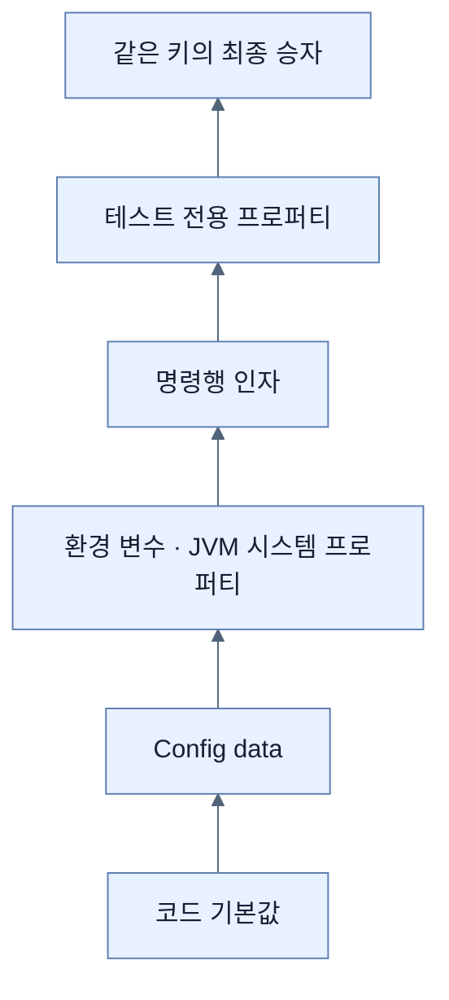
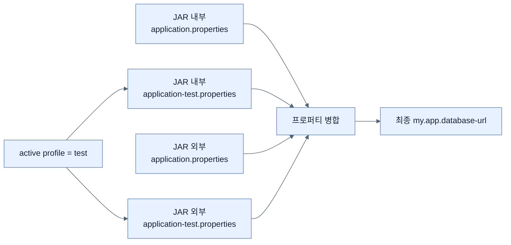

# 설정 외부화, Profile, Property Source 우선순위

## 한눈에 보기

| 요구 | Spring Boot의 수단 | 핵심 규칙 |
|---|---|---|
| JAR 기본 설정 제공 | JAR 내부 `application.properties` | 모든 환경이 공유할 기준값 |
| 배포마다 값 변경 | JAR 밖의 설정 파일 | 외부 파일이 내부 파일을 덮을 수 있다 |
| 환경별 묶음 | `application-{profile}.properties` | 활성 프로파일 파일이 일반 파일을 덮는다 |
| 한두 값 즉시 변경 | 환경 변수, JVM 시스템 프로퍼티, 명령행 인자 | 더 높은 우선순위 소스가 같은 키의 값을 이긴다 |
| 테스트 전용 값 | 테스트 애노테이션·속성 | 일반 실행 설정보다 높은 우선순위로 격리한다 |

## 1. 왜 이게 필요한가

### 출발 장면: GitHub 토큰 하나를 바꾸려고 JAR를 다시 빌드한다

애플리케이션이 GitHub API를 호출하려면 접근 코드가 필요하다고 하자. 그 값을 소스나 JAR 안의 `application.properties`에 넣으면 토큰이 만료될 때마다 소스를 수정하고 새 산출물을 만들어 배포해야 한다. 개발·테스트·운영이 같은 JAR를 사용하기도 어렵고, 비밀값이 저장소나 배포물에 남을 위험도 커진다.

**[[외부화된-구성]]**(=환경마다 달라질 값을 코드와 애플리케이션 바이너리 밖에서 공급하는 방식)은 “프로그램의 기능”과 “이번 실행에 사용할 값”을 분리한다. 같은 JAR를 두고도 외부 파일, **[[환경-변수]]**(=운영체제나 플랫폼이 프로세스에 전달하는 이름-값), **[[시스템-프로퍼티]]**(=`-Dname=value`로 JVM에 주는 이름-값) 등으로 실행 환경별 설정을 제공할 수 있다.

### 여러 소스가 필요한 이유

한 종류의 설정 소스만으로는 모든 환경을 다루기 어렵다.

- 공통 기본값은 애플리케이션과 함께 버전 관리하고 싶다.
- 운영 데이터베이스 주소나 비밀은 JAR 밖에 두고 싶다.
- 컨테이너 플랫폼에서는 파일보다 환경 변수가 편하다.
- 임시 실행에서는 명령행 인자 하나로 값을 바꾸고 싶다.
- 테스트에서는 운영 설정과 무관한 값을 가장 확실하게 덮고 싶다.

Spring Boot는 이 출처들을 **[[프로퍼티-소스]]**(=설정 값을 공급하는 하나의 출처)로 모은다. 같은 키가 여러 곳에 있으면 **[[우선순위]]**(=충돌 시 최종 값을 고르는 순서)에 따라 한 값이 승자가 된다.

비유하면 여러 프로퍼티 소스는 투명 필름을 겹쳐 놓은 지도다. 아래 필름의 기본 도로 위에 위쪽 필름이 수정 사항을 덮어 그린다. 하지만 비유는 병합 단위에서 깨진다. 모든 복합 값이 필드별로 영리하게 합쳐지는 것은 아니며, 리스트나 한 덩어리 값은 높은 소스의 값이 통째로 대체될 수 있다. 어떤 단위로 바인딩되는지 타입별로 확인해야 한다.

## 2. 어떻게 동작하는가

### 2.1 JAR 내부 설정과 외부 설정을 함께 읽는다

기본적인 배포 모양을 다음처럼 생각할 수 있다.

```text
deployment/
├── learning-spring-boot-4.jar
└── application.properties
```

JAR 내부에도 다음 파일이 있을 수 있다.

```text
BOOT-INF/classes/application.properties
```

1. 애플리케이션이 시작되며 표준 구성 파일 위치를 검색한다. — 개발자가 매번 로더 코드를 작성하지 않아도 내부·외부 설정을 찾기 위해서다.
2. JAR 내부 일반 설정을 읽는다. — 애플리케이션과 함께 배포할 안전한 기본값을 제공하기 위해서다.
3. 실행 디렉터리 등 JAR 밖의 일반 설정을 읽는다. — 같은 바이너리를 다시 만들지 않고 배포 환경이 값을 덮게 하기 위해서다.
4. 활성 프로파일의 전용 파일을 추가로 읽는다. — 개발·테스트·운영의 관련 설정을 이름 있는 묶음으로 적용하기 위해서다.
5. 다른 프로퍼티 소스와 우선순위를 비교해 각 키의 최종 값을 정한다. — 충돌 결과를 일관되고 예측 가능하게 만들기 위해서다.
6. 자동 구성과 사용자 설정 빈이 최종 값을 소비한다. — 모든 소비자가 같은 환경 모델을 바라보게 하기 위해서다.

책은 JAR 옆의 `application.properties`를 가장 즉각적인 외부 덮어쓰기 예로 든다. 실제 기본 검색 위치는 실행 디렉터리와 그 하위 `config` 위치 등을 포함할 수 있으므로, 운영 배포에서는 선택한 Boot 버전의 config data 검색 규칙을 함께 확인한다.

### 2.2 구성 파일 위치를 명시적으로 지정한다

환경 변수로 위치를 지정하는 예는 다음과 같다.

```bash
SPRING_CONFIG_LOCATION=file:/opt/my-app/config/ java -jar learning-spring-boot-4.jar
```

JVM 시스템 프로퍼티로는 표준 점 표기 키를 사용한다.

```bash
java -Dspring.config.location=file:/opt/my-app/config/ \
     -jar learning-spring-boot-4.jar
```

1. 배포 환경이 설정 파일의 알려진 위치를 결정한다. — 애플리케이션 이미지와 환경 설정을 독립적으로 관리하기 위해서다.
2. `spring.config.location`을 애플리케이션이 아주 이른 시점에 읽는다. — 일반 config data를 찾기 전에 검색 위치부터 알아야 하기 때문이다.
3. 지정된 위치에서 구성 파일을 로드한다. — 컨테이너 볼륨, 서버 공용 디렉터리 같은 운영 배치를 지원하기 위해서다.

`spring.config.location`은 기본 검색 위치를 대체하는 성격이 있으므로, 기존 기본 위치를 유지하면서 위치를 더하려면 `spring.config.additional-location`의 의미를 구분해야 한다. Chapter 1의 핵심은 “설정 파일 위치 자체도 배포 환경이 제어할 수 있다”는 점이다.

### 2.3 Profile로 환경별 덮어쓰기를 묶는다

**[[프로파일]]**(=`dev`, `test`, `prod`처럼 환경별 설정과 구성에 붙이는 이름)은 여러 관련 값을 하나의 이름 아래 활성화한다.

기본 파일:

```properties
# application.properties
my.app.database-url=https://prod-db.example.com:1234/prod
```

테스트 전용 파일:

```properties
# application-test.properties
my.app.database-url=http://test-db.example.com:1234/test
```

테스트 프로파일을 JVM 시스템 프로퍼티로 활성화한다.

```bash
java -Dspring.profiles.active=test -jar learning-spring-boot-4.jar
```

동작은 다음 순서다.

1. `application.properties`를 읽는다. — 모든 환경이 공유하는 기준 설정을 마련하기 위해서다.
2. `spring.profiles.active=test`에서 활성 프로파일 이름을 얻는다. — 어떤 환경별 변형을 추가로 적용할지 결정하기 위해서다.
3. `application-test.properties`를 읽는다. — 테스트 환경에서 달라지는 값만 별도로 표현하기 위해서다.
4. 프로파일 전용 파일의 같은 키가 일반 파일의 값을 덮는다. — 공통값을 복제하지 않고 차이만 관리하기 위해서다.
5. 최종 URL을 구성 객체나 자동 구성에 바인딩한다. — 코드가 현재 환경 이름을 직접 분기하지 않게 하기 위해서다.

`application-dev.properties`, `application-test.properties`처럼 `{profile}` 자리에 이름이 들어간다. 여러 프로파일을 함께 활성화하면 공식 문서 기준으로 뒤에 지정된 프로파일이 앞의 프로파일보다 우선하는 last-wins 규칙이 적용된다.

책은 `application.properties`를 운영값으로 두고 다른 환경을 프로파일로 덮는 방법을 한 실천 예로 제안한다. 이것은 Spring Boot가 강제하는 규칙은 아니다. 민감한 운영값까지 JAR 내부 기본 파일에 넣으라는 뜻으로 읽어서는 안 된다. 조직에 따라 기본 파일에는 안전한 공통값만 두고 `prod`도 명시적으로 활성화하거나 외부 운영 설정으로 공급할 수 있다.

### 2.4 전체 프로퍼티 소스 우선순위를 읽는다

책의 목록은 낮은 우선순위에서 높은 우선순위 순으로 제시된다. 뒤의 소스가 같은 키를 제공하면 앞의 값을 덮는다. Spring Boot 4.0 공식 문서와 대조해 `@DynamicPropertySource`도 표시했다.

| 낮음 → 높음 | 프로퍼티 소스 | 왜 필요한가 |
|---:|---|---|
| 1 | `SpringApplication.setDefaultProperties()` 기본값 | 어떤 외부 설정도 없을 때의 프로그램 기본을 제공한다 |
| 2 | `@Configuration` 클래스의 `@PropertySource` | Java 구성과 함께 별도 프로퍼티 파일을 등록한다 |
| 3 | Config data: `application.properties`/YAML | 애플리케이션의 표준 파일 구성을 제공한다 |
| 4 | `random.*`를 제공하는 `RandomValuePropertySource` | 임시 포트·비밀 같은 무작위 값을 생성할 수 있게 한다 |
| 5 | OS 환경 변수 | 컨테이너·클라우드가 파일 없이 설정을 주입하게 한다 |
| 6 | Java 시스템 프로퍼티 | JVM 실행 옵션으로 값을 덮게 한다 |
| 7 | `java:comp/env`의 JNDI 속성 | 관리형 Java 실행 환경의 설정을 연결한다 |
| 8 | `ServletContext` 초기화 파라미터 | 웹 애플리케이션 컨텍스트 수준의 값을 제공한다 |
| 9 | `ServletConfig` 초기화 파라미터 | 개별 Servlet 구성 수준의 값을 제공한다 |
| 10 | `SPRING_APPLICATION_JSON` | 환경 변수·시스템 프로퍼티 안의 JSON으로 여러 값을 전달한다 |
| 11 | 명령행 인자 | 이번 실행에서만 값을 가장 직접적으로 바꾼다 |
| 12 | 테스트의 `properties` 속성 | `@SpringBootTest`와 테스트 슬라이스에 전용 값을 준다 |
| 13 | `@DynamicPropertySource` | 테스트가 실행 중 계산한 동적 값을 등록한다 — 공식 문서 보강 |
| 14 | `@TestPropertySource` | 테스트 클래스에 명시한 별도 값을 적용한다 |
| 15 | DevTools 전역 설정 | DevTools 활성 개발 환경의 사용자 전역 설정을 적용한다 |

목록을 통째로 암기하기보다 다음 세 층을 먼저 기억하면 복원하기 쉽다.

```text
코드·기본값 < 애플리케이션 config data < 실행 환경·명령행 < 테스트 전용 override
```

다만 “환경에 가까울수록 항상 높다”는 문장은 기억 보조일 뿐 정확한 규칙을 대신하지 않는다. 테스트 소스 사이처럼 세부 순서가 필요할 때는 공식 목록을 확인해야 한다.

### 2.5 Config data 파일끼리의 순서를 구분한다

구성 파일만 떼어 보면 낮은 순위에서 높은 순위는 다음과 같다.

1. JAR 내부의 일반 `application.properties`/YAML — 애플리케이션과 함께 배포할 기본을 제공하기 위해서다.
2. JAR 내부의 프로파일별 파일 — 패키지된 기본 환경 변형이 일반 내부 값을 덮게 하기 위해서다.
3. JAR 외부의 일반 파일 — 배포 환경의 공통 설정이 패키지 내부 값을 바꾸게 하기 위해서다.
4. JAR 외부의 프로파일별 파일 — 현재 배포 환경의 가장 구체적인 파일 설정이 승리하게 하기 위해서다.

예를 들어 네 위치에 모두 `server.port`가 있다면 외부의 활성 프로파일 파일 값이 파일 그룹 안에서는 가장 강하다. 그러나 명령행 인자가 같은 키를 주면 전체 우선순위에서 명령행이 다시 이긴다.

### 2.6 최종값을 역추적하는 방법

값이 예상과 다르면 “파일을 읽었는가?”만 묻지 말고 다음 순서로 추적한다.

1. 키 이름이 정확한지 확인한다. — 오타는 우선순위 문제가 아니라 존재하지 않는 설정을 만든다.
2. 어떤 프로파일이 활성화되었는지 확인한다. — 다른 프로파일 파일이 덮을 수 있기 때문이다.
3. 내부·외부 파일의 위치를 확인한다. — 같은 파일명이라도 위치가 우선순위를 바꾸기 때문이다.
4. 환경 변수·시스템 프로퍼티·명령행에 같은 키가 있는지 확인한다. — 파일보다 높은 소스가 조용히 승리할 수 있기 때문이다.
5. 테스트라면 테스트 전용 프로퍼티 소스를 확인한다. — 일반 실행과 다른 최상위 값이 적용되기 때문이다.
6. 최종값이 어느 설정 객체나 자동 구성에 바인딩되는지 확인한다. — 값이 존재해도 소비자가 다른 키를 읽을 수 있기 때문이다.

## 3. 그림으로 보기





첫 그림은 전체 소스의 큰 우선순위 방향을 단순화한 것이고, 둘째 그림은 config data 파일 안에서 내부/외부와 일반/프로파일 전용의 두 축이 겹치는 모습을 보여 준다.

## 4. 이 노트에 나온 용어

| 용어 | 한 줄 풀이 | 자세히 |
|---|---|---|
| 외부화된 구성 | 환경별 값을 코드와 바이너리 밖에서 공급하는 방식 | [[_glossary#외부화된-구성]] |
| 구성 프로퍼티 | 이름-값 입력으로 Boot 또는 사용자 빈을 조정하는 모델 | [[_glossary#구성-프로퍼티]] |
| 프로퍼티 소스 | 설정 값을 공급하는 하나의 출처 | [[_glossary#프로퍼티-소스]] |
| 프로파일 | 환경별 설정 묶음에 붙인 이름 | [[_glossary#프로파일]] |
| 우선순위 | 같은 키가 여러 소스에 있을 때 승자를 정하는 순서 | [[_glossary#우선순위]] |
| 환경 변수 | 운영체제나 실행 플랫폼이 프로세스에 전달하는 설정 | [[_glossary#환경-변수]] |
| 시스템 프로퍼티 | `-D` 옵션 등으로 JVM에 제공하는 설정 | [[_glossary#시스템-프로퍼티]] |

## 5. 자주 헷갈리는 것

### 프로파일 vs 배포 환경

프로파일은 이름 붙은 구성 묶음이고, 개발·테스트·운영은 실제 배포 환경이다. 둘을 일대일로 매핑할 수 있지만 반드시 그래야 하는 것은 아니다. `cloud`, `feature-x` 같은 다른 축의 프로파일도 가능하다.

### 파일 검색 순서 vs 전체 프로퍼티 우선순위

외부 프로파일 파일이 내부 일반 파일보다 높다는 것은 config data 내부 순서다. 명령행이나 테스트 프로퍼티는 config data 전체보다 더 높은 별도 소스다. 두 목록을 한꺼번에 섞어 기억하지 않는다.

### `spring.config.location` vs 일반 애플리케이션 프로퍼티

설정 파일을 찾기 위해 먼저 알아야 하는 키이므로 일반 파일 안에 뒤늦게 적어도 검색 시작점을 결정하는 용도로 사용할 수 없다. 환경 변수, 시스템 프로퍼티, 명령행처럼 이른 입력으로 제공한다.

### 외부 파일 vs 안전한 비밀 저장소

JAR 밖에 있다는 사실만으로 안전하지 않다. 파일 권한, 저장 매체 암호화, 비밀 회전, 로그 마스킹과 별도 비밀 관리 시스템을 함께 고려해야 한다.

## 6. 언제 안 쓰나 / 경계

- 프로파일 수가 기능 플래그와 배포 위치의 모든 조합만큼 늘어나면 어떤 값이 활성화되는지 추론하기 어려워진다. 환경 축과 기능 축을 무분별하게 섞지 않는다.
- 운영 자격 증명을 `application.properties`에 기본값으로 패키징하지 않는다. 책의 “기본 파일을 production으로 본다”는 예시를 비밀 하드코딩 허가로 해석하면 안 된다.
- 높은 우선순위가 항상 더 “옳은” 값이라는 뜻은 아니다. 잘못 남은 명령행 옵션이나 환경 변수가 안전한 파일 값을 덮을 수도 있다.
- 구성 소스 순서는 버전별 공식 문서를 기준으로 확인한다. 이 노트는 책의 Spring Boot 4.0 흐름과 4.0.3 공식 문서를 대조한 것이다.

## 7. 연결

- [[03-customizing-the-setup-with-configuration-properties]] — `server.port` 한 키를 바꾸는 예제에서 여러 구성 소스의 병합 모델로 확장한다.
- [[03a-creating-custom-properties]] — 외부 소스에서 결정된 최종 값이 타입 있는 사용자 설정 객체에 바인딩된다.
- [[03c-configuring-property-based-beans]] — 최종 프로퍼티 값은 필드뿐 아니라 어떤 구현 빈이 활성화되는지도 결정한다.
- [[04-managing-application-dependencies]] — 같은 JAR를 여러 환경에서 재사용하려면 코드뿐 아니라 의존성 버전도 재현 가능하게 정렬되어야 한다.

## 8. 스스로 확인

1. JAR 내부와 외부에 같은 `server.port`가 있을 때 어느 쪽이 이기며, 왜 그런 순서가 유용한가?
2. 일반 파일과 프로파일 전용 파일은 어떻게 합쳐지고 어떤 값이 덮이는가?
3. `spring.profiles.active=test`를 시스템 프로퍼티로 주었을 때 파일 탐색부터 최종 바인딩까지 설명할 수 있는가?
4. 프로퍼티 소스 전체 순위를 “기본 → config data → 실행 환경 → 테스트”의 큰 층으로 복원할 수 있는가?
5. `spring.config.location`과 `spring.config.additional-location`의 의도 차이는 무엇인가?
6. 외부화된 구성이 재빌드를 줄여도 비밀 관리 문제를 자동으로 해결하지 못하는 이유는 무엇인가?
7. 값이 예상과 다를 때 어떤 순서로 출처를 역추적할 것인가?

<!-- ==== 아래는 내 영역 · 스킬 수정 금지 ==== -->

## 내 설명 시도

## 막혔던 지점

## 리뷰 이력
