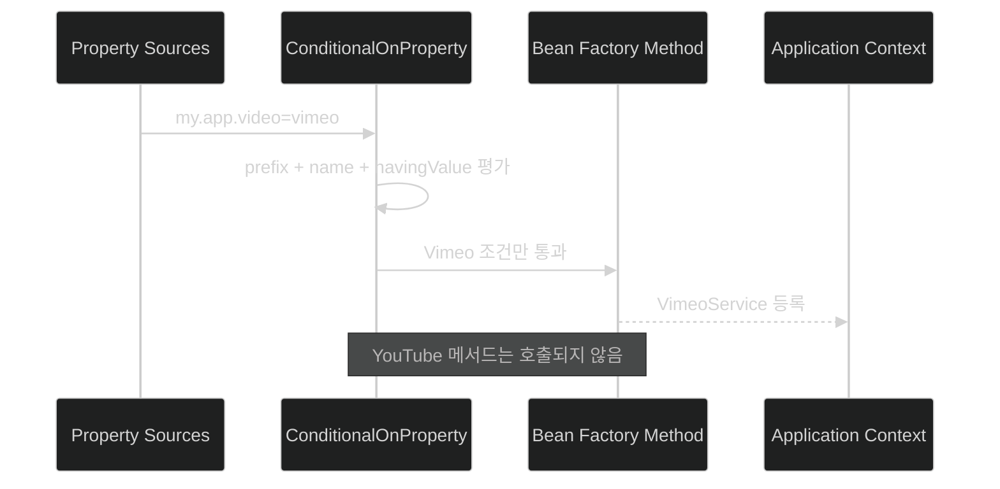

# Property 값으로 생성할 Bean 선택하기

## 한눈에 보기

| 선언 | 조건 | 결과 |
|---|---|---|
| `@ConditionalOnProperty(prefix="my.app", name="video")` | `my.app.video`가 존재하고 값이 `false`가 아님 | Bean 생성 |
| 위 조건에서 프로퍼티 누락 | 기본 `matchIfMissing=false` | Bean 미생성 |
| `havingValue="youtube"` | 최종 값이 `youtube`와 일치 | YouTube Bean만 생성 |
| `havingValue="vimeo"` | 최종 값이 `vimeo`와 일치 | Vimeo Bean만 생성 |
| `matchIfMissing=true` | 키가 없어도 기본 구현을 허용 | Bean 생성 가능 |

## 1. 왜 이게 필요한가

### 출발 장면: 배포 환경에 따라 영상 공급자를 바꾼다

같은 애플리케이션이 어떤 고객에게는 YouTube에서 영상을 가져오고, 다른 고객에게는 Vimeo를 사용해야 한다고 하자. 서비스 코드 곳곳에 다음 분기를 반복하면 공급자 선택이 비즈니스 로직에 퍼진다.

```java
if ("youtube".equals(videoProvider)) {
    // YouTube 호출
} else if ("vimeo".equals(videoProvider)) {
    // Vimeo 호출
}
```

공급자 선택은 애플리케이션을 시작할 때 한 번 결정해도 되는 구성 문제다. Spring Boot는 **[[구성-프로퍼티]]**(=이름-값 입력으로 애플리케이션 구성을 조정하는 모델)를 단순한 필드 값뿐 아니라 빈 생성 조건으로도 사용할 수 있다.

**[[조건부-빈]]**(=정해진 조건이 맞을 때만 컨텍스트에 등록되는 빈)을 사용하면 환경별 구현 선택을 `@Bean` 메서드가 모인 구성 클래스 한곳으로 모을 수 있다. 나머지 서비스는 어떤 공급자가 선택되었는지 묻는 대신 주입된 공통 역할을 사용한다.

### 프로파일을 만들지 않고 작은 선택을 표현한다

개발·테스트·운영처럼 여러 설정을 한 묶음으로 바꿀 때는 프로파일이 유용하다. 반면 영상 공급자 하나만 바꾸려고 `youtube`, `vimeo` 프로파일을 만들면 프로파일 이름이 환경과 기능 선택을 동시에 표현하게 된다. `@ConditionalOnProperty`는 특정 키 하나의 최종값으로 빈 생성 여부를 결정한다.

비유하면 프로퍼티 조건은 철도 분기기의 레버다. `youtube` 쪽으로 놓으면 YouTube 선로가 연결되고 `vimeo` 쪽이면 Vimeo 선로가 연결된다. 하지만 이 비유는 동적 전환에서 깨진다. 실제 분기기는 열차 사이에 바꿀 수 있지만, 조건부 빈은 보통 애플리케이션 컨텍스트 시작 시 평가된다. 실행 중 값을 바꾼다고 기존 빈이 자동 교체되는 것은 아니다.

## 2. 어떻게 동작하는가

### 2.1 프로퍼티의 존재 여부로 Bean을 만든다

책의 첫 패턴은 다음과 같다.

```java
@Bean
@ConditionalOnProperty(prefix = "my.app", name = "video")
YouTubeService youTubeService() {
    return new YouTubeService();
}
```

두 애노테이션의 책임을 분리해 읽는다.

- `@Bean`: 메서드가 반환한 객체를 Spring bean으로 등록한다. 기본 빈 이름은 메서드 이름인 `youTubeService`다.
- `@ConditionalOnProperty`: 조합된 프로퍼티 키와 최종값을 검사해 이 빈 정의를 적용할지 결정한다.

`prefix="my.app"`와 `name="video"`를 합치면 검사 키는 다음과 같다.

```text
my.app.video
```

평가 순서는 다음과 같다.

1. Spring Boot가 모든 프로퍼티 소스를 합쳐 `my.app.video`의 최종값을 구한다. — 파일·환경 변수·명령행 중 실제 승자 값을 조건에 사용하기 위해서다.
2. `@ConditionalOnProperty`가 키의 존재와 값을 검사한다. — 빈 생성 여부를 실행 환경의 선택과 연결하기 위해서다.
3. 조건이 참이면 `youTubeService()`를 호출한다. — 선택된 구현만 실제 객체로 만들기 위해서다.
4. 반환된 `YouTubeService`를 **[[애플리케이션-컨텍스트]]**(=Spring 빈을 생성·연결·관리하는 컨테이너)에 등록한다. — 다른 서비스가 조건 분기 없이 주입받게 하기 위해서다.
5. 조건이 거짓이면 메서드를 호출하지 않고 빈도 등록하지 않는다. — 사용하지 않는 구현의 초기화와 의존성을 피하기 위해서다.

### 2.2 “값이 있으면 생성”의 정확한 경계를 안다

책은 첫 예제를 “`my.app.video`에 어떤 값이든 있으면 생성된다”는 흐름으로 설명한다. Spring Boot 공식 동작에는 중요한 예외가 있다. `havingValue`를 생략한 기본 조건은 프로퍼티가 존재하면서 문자열 값이 `false`가 아닐 때 일치한다.

| `my.app.video` 상태 | 기본 조건 결과 | 이유 |
|---|---|---|
| 키 없음 | 불일치 | `matchIfMissing` 기본값이 `false`다 |
| `false` | 불일치 | 기본 조건이 명시적 false를 비활성으로 해석한다 |
| `true` | 일치 | 존재하며 false가 아니다 |
| `youtube` | 일치 | 존재하며 false가 아니다 |
| `vimeo` | 일치 | 존재하며 false가 아니다 |
| 빈 문자열 | 일반적으로 일치 | 존재하며 false 문자열이 아니다 |

따라서 “아무 값”은 학습용 단순화로 읽고, 실제로는 `false` 예외와 누락 규칙을 기억해야 한다. 키가 없을 때도 기본 구현을 만들고 싶다면 `matchIfMissing=true`를 명시할 수 있다.

```java
@ConditionalOnProperty(
    prefix = "my.app",
    name = "video",
    havingValue = "youtube",
    matchIfMissing = true
)
```

이 설정은 키가 없으면 YouTube를 기본으로 택하고, 키가 있으면 값이 `youtube`일 때만 택한다. 기본값이 안전하고 의도가 분명할 때만 사용한다.

### 2.3 `havingValue`로 구현을 정확히 선택한다

책의 세분화된 패턴은 다음과 같다.

```java
@Bean
@ConditionalOnProperty(
    prefix = "my.app",
    name = "video",
    havingValue = "youtube"
)
YouTubeService youTubeService() {
    return new YouTubeService();
}

@Bean
@ConditionalOnProperty(
    prefix = "my.app",
    name = "video",
    havingValue = "vimeo"
)
VimeoService vimeoService() {
    return new VimeoService();
}
```

프로퍼티에 다음 중 하나를 제공한다.

```properties
my.app.video=youtube
```

또는:

```properties
my.app.video=vimeo
```

1. 최종 프로퍼티 값이 `youtube`면 첫 조건만 참이 된다. — YouTube 구현만 컨텍스트에 등록하기 위해서다.
2. 값이 `vimeo`면 둘째 조건만 참이 된다. — 코드 재빌드 없이 Vimeo 구현으로 조합을 바꾸기 위해서다.
3. 값이 `other`이거나 키가 없으면 기본 설정상 둘 다 거짓이다. — 알 수 없는 값을 임의 구현에 연결하지 않기 위해서다.
4. 소비자는 선택된 구현을 주입받는다. — 사용 지점에 공급자 이름 비교가 퍼지지 않게 하기 위해서다.

이 패턴은 **[[조건부-구성]]**(=클래스·빈·프로퍼티 등의 조건이 맞을 때만 구성 정의를 적용하는 방식)의 프로퍼티 기반 사례다. 자동 구성도 같은 조건 모델을 폭넓게 사용한다.

### 2.4 Profile과 property condition을 구분한다

**[[프로파일]]**(=여러 환경별 설정을 이름으로 함께 활성화하는 묶음)도 빈을 선택할 수 있지만 질문이 다르다.

| 질문 | Profile | `@ConditionalOnProperty` |
|---|---|---|
| 무엇을 기준으로 하나 | 활성 프로파일 이름 | 특정 프로퍼티의 존재·값 |
| 보통의 범위 | 환경별 여러 설정과 Bean 묶음 | 한 기능·구현·플래그의 세밀한 선택 |
| 예 | `test`에서 테스트 DB·메일·캐시 설정 | `my.app.video=youtube`로 영상 구현 선택 |
| 결합 가능성 | 프로파일 파일이 프로퍼티 값을 제공할 수 있다 | 그 최종값을 읽어 조건을 평가한다 |

둘은 경쟁 관계가 아니다. `application-test.properties`가 `my.app.video=vimeo`를 제공하고, 조건부 빈이 그 값을 읽는 식으로 연결할 수 있다.

### 2.5 환경별 조합을 구성한다

책은 같은 원리를 개발자 환경, 테스트베드, 운영, 백업 시설, 서로 다른 클라우드 공급자까지 확장한다.

```text
환경별 property source
        ↓
my.app.video의 최종값
        ↓
조건 평가
        ↓
해당 환경에서 필요한 구현 bean만 등록
```

환경별 동작은 코드에 `if (environment == ...)`를 추가하는 방식이 아니라, 외부 구성과 컨텍스트 조립의 조합으로 만든다. 같은 바이너리를 재사용한다는 외부화된 구성의 목표와도 맞는다.

### 2.6 IDE 자동완성과 configuration metadata

책은 IntelliJ IDEA, Spring Tools, Eclipse, VS Code 같은 현대 IDE가 `application.properties` 자동완성을 제공한다고 덧붙인다. 이 기능은 **[[구성-메타데이터]]**(=프로퍼티 키·타입·설명을 IDE가 이해할 수 있게 기술한 정보)를 활용한다.

자동완성이 주는 이점은 단순 타이핑 절약보다 크다.

- 존재하는 키를 탐색한다.
- 예상 타입과 설명을 확인한다.
- 오타로 인해 조건이 영원히 참이 되지 않는 문제를 줄인다.
- 사용자 정의 구성 프로퍼티도 메타데이터 생성 설정을 통해 더 잘 지원할 수 있다.

그러나 IDE가 보여 주는 후보가 현재 애플리케이션에서 반드시 활성화된다는 뜻은 아니다. 클래스패스와 자동 구성 조건까지 맞아야 실제 소비자가 존재한다.

## 3. 그림으로 보기

```mermaid
%%{init: {'theme': 'dark'}}%%
flowchart TD
    A["프로퍼티 소스 병합"] --> B["my.app.video 최종값"]
    B --> C{"값은 무엇인가?"}
    C -- "youtube" --> Y["YouTubeService Bean 생성"]
    C -- "vimeo" --> V["VimeoService Bean 생성"]
    C -- "누락 또는 다른 값" --> N["두 Bean 모두 생성하지 않음"]
    Y --> CTX["Application Context"]
    V --> CTX
```





첫 그림은 값별 결과를, 둘째 그림은 조건이 거짓인 `@Bean` 메서드는 호출 자체가 생략된다는 점을 보여 준다.

## 4. 이 노트에 나온 용어

| 용어 | 한 줄 풀이 | 자세히 |
|---|---|---|
| 구성 프로퍼티 | 이름-값 입력으로 애플리케이션 설정을 조정하는 모델 | [[_glossary#구성-프로퍼티]] |
| 조건부 빈 | 정해진 조건이 맞을 때만 등록되는 Spring bean | [[_glossary#조건부-빈]] |
| 조건부 구성 | 조건이 참일 때만 구성 정의를 적용하는 방식 | [[_glossary#조건부-구성]] |
| 애플리케이션 컨텍스트 | 조건을 통과한 빈을 생성·연결·관리하는 컨테이너 | [[_glossary#애플리케이션-컨텍스트]] |
| 프로파일 | 환경별 설정·Bean 묶음에 붙인 이름 | [[_glossary#프로파일]] |
| 구성 메타데이터 | IDE에 프로퍼티 키·타입·설명을 알려 주는 정보 | [[_glossary#구성-메타데이터]] |

## 5. 자주 헷갈리는 것

### 프로퍼티 존재 조건의 `false` 예외

`havingValue`를 생략했다고 해서 문자 그대로 모든 값이 참인 것은 아니다. 기본 조건은 키가 존재하고 값이 `false`가 아닐 때 일치한다. Boolean 기능 플래그로 쓸 때 특히 중요하다.

### `havingValue` vs `matchIfMissing`

- `havingValue`: 키가 있을 때 어떤 값과 일치해야 하는지 정한다.
- `matchIfMissing`: 키가 아예 없을 때 조건을 참으로 볼지 정한다.
- 기본은 누락 시 불일치다.

### Profile vs property-based bean

프로파일은 설정 묶음을 활성화하는 상위 문맥이고, 프로퍼티 조건은 최종 키 하나를 평가하는 세밀한 스위치다. 프로파일 파일이 그 스위치 값을 공급할 수 있다.

### 조건부 생성 vs 런타임 분기

조건부 빈은 시작할 때 객체 그래프를 정한다. 요청마다 YouTube와 Vimeo를 바꿔야 한다면 두 구현을 모두 빈으로 두고 런타임 라우팅 정책을 별도로 설계해야 한다.

## 6. 언제 안 쓰나 / 경계

- 사용자 요청마다 구현을 바꿔야 하는 동적 라우팅에는 시작 시점 조건부 빈만으로 충분하지 않다.
- 알 수 없는 값일 때 아무 빈도 생기지 않아 애플리케이션이 뒤늦게 실패할 수 있다. 허용값 검증이나 명확한 기본 정책을 둔다.
- 여러 조건이 겹쳐 같은 역할의 빈이 둘 이상 생기면 주입이 모호해질 수 있다. 조건을 상호 배타적으로 설계한다.
- 기능 플래그를 영구 아키텍처 분기로 남발하면 사용하지 않는 경로와 테스트 조합이 폭증한다.
- 외부 값 변경만으로 이미 시작된 컨텍스트의 빈이 자동 재구성된다고 가정하지 않는다.

## 7. 연결

- [[01-autoconfiguring-spring-beans]] — 자동 구성의 back-off와 클래스 조건도 같은 조건부 구성 원리 위에서 동작한다.
- [[03-customizing-the-setup-with-configuration-properties]] — 단순히 빈의 포트 값을 바꾸던 프로퍼티가 이제 빈의 존재 자체를 결정한다.
- [[03a-creating-custom-properties]] — 설정 객체는 값을 타입 있게 소비하고, 조건부 빈은 그 값으로 객체 그래프를 선택한다.
- [[03b-externalizing-application-configuration]] — 여러 소스와 프로파일이 결정한 최종값이 `@ConditionalOnProperty`의 입력이 된다.

## 8. 스스로 확인

1. `@Bean`과 `@ConditionalOnProperty`는 각각 어떤 책임을 가지는가?
2. `prefix="my.app"`, `name="video"`가 실제 어떤 키로 결합되는가?
3. `havingValue`가 없을 때 누락, `false`, `youtube` 각각의 결과를 설명할 수 있는가?
4. `havingValue`와 `matchIfMissing`을 함께 쓰면 어떤 두 질문에 답하는가?
5. `youtube`와 `vimeo` 조건이 서로 배타적이어야 하는 이유는 무엇인가?
6. 프로파일 파일과 `@ConditionalOnProperty`가 함께 동작하는 예를 만들 수 있는가?
7. 실행 중 요청마다 구현을 바꾸는 요구에는 왜 이 패턴만으로 부족한가?

> 일곱 문항을 스스로 답한 **뒤에** [[_03c-configuring-property-based-beans]]에서 모범답안과 대조한다. 먼저 열면 이 문항들은 다시 인출 문제로 쓸 수 없다.

<!-- ==== 아래는 내 영역 · 스킬 수정 금지 ==== -->

## 내 설명 시도

## 막혔던 지점

## 리뷰 이력
