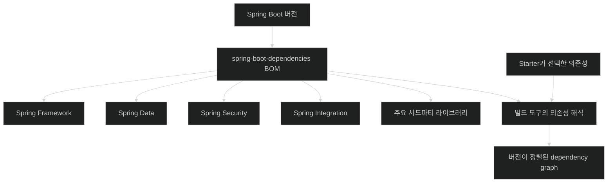
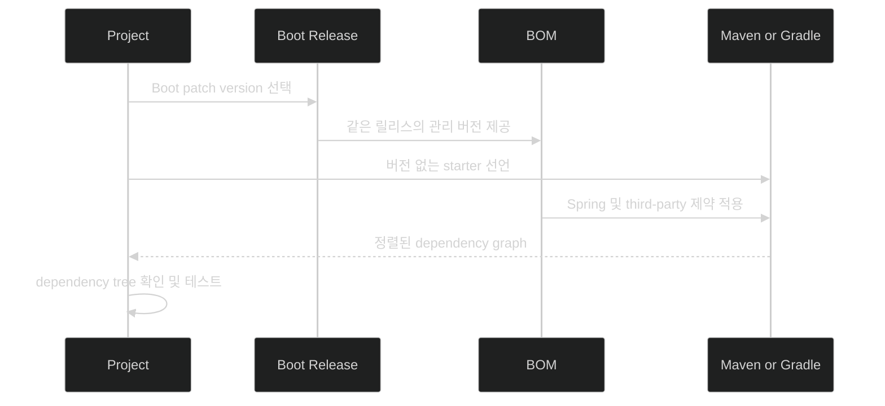

# Spring Boot BOM으로 애플리케이션 의존성 관리하기

## 한눈에 보기

| 질문 | Spring Boot의 답 |
|---|---|
| Spring Framework, Data, Security 버전을 각각 고를까? | Boot 버전 하나를 기준으로 검증된 조합을 적용한다. |
| 버전 목록은 어디에 있나? | `spring-boot-dependencies` BOM에 Spring 모듈과 주요 서드파티 버전 제약이 모인다. |
| Maven만 쓸 수 있나? | 아니다. Maven과 Gradle 모두 관리 버전을 적용할 수 있다. |
| 스타터와 같은가? | 아니다. 스타터는 함께 넣을 의존성 묶음, BOM은 적용할 버전 제약이다. |
| 개별 버전을 덮을 수 있나? | 가능하지만 Boot 팀이 검증한 조합 밖의 호환성 책임을 프로젝트가 진다. |
| 보안 패치는 어떻게 따라오나? | Boot 패치 릴리스가 영향받은 포트폴리오·서드파티 관리 버전을 갱신할 수 있다. |

## 1. 왜 이게 필요한가

### 출발 장면: Spring Data JPA 하나만 올리려다 일주일을 쓴다

새 Spring Data JPA 릴리스에 꼭 필요한 Query by Example 개선이 들어왔다고 하자. 당장 그 모듈만 올리고 싶지만 애플리케이션은 Spring Framework, Spring MVC, Spring Integration, Spring Security도 함께 사용한다. 새 Data 버전이 현재 Framework 버전과 호환되는지, 바뀐 전이 의존성이 다른 모듈을 깨뜨리지 않는지 직접 조사해야 한다.

책은 이전 업그레이드에서 릴리스 노트를 뒤지고 충돌을 해결하느라 일주일을 쓴 상황을 떠올리게 한다. 라이브러리 하나의 기능 개선을 얻는 일이 전체 생태계의 호환 조합 검증으로 번지면, 자동 구성과 스타터가 줄여 준 시작 비용을 유지보수 단계에서 다시 지불하게 된다.

Spring Boot의 **[[의존성-관리]]**(=직접·전이 의존성에 적용할 버전 제약을 중앙에서 통제하는 빌드 기능)는 Boot 버전을 생태계의 기준점으로 삼는다. 팀이 모든 조합을 개별 선택하기보다 Spring Boot 팀이 큐레이션하고 정렬한 목록을 적용한다.

### 최신 버전보다 함께 동작하는 버전이 중요하다

각 라이브러리의 가장 최신 버전을 모은다고 가장 안정적인 조합이 되지는 않는다. 릴리스 시점, API 변경, 지원하는 기반 Framework 버전이 서로 다르기 때문이다. **[[버전-정렬]]**(=서로 연동되는 라이브러리 버전을 호환 가능한 조합으로 맞추는 일)은 개별 최대 숫자가 아니라 조합 전체의 일관성을 목표로 한다.

이 조합은 **[[BOM]]**(=함께 사용할 라이브러리의 버전 제약을 모아 배포하는 Bill of Materials)인 `spring-boot-dependencies`에 표현된다. BOM은 “자재 명세서”라는 이름처럼 제품을 만들 때 어떤 부품 버전을 쓸지 적은 표다.

비유하면 Spring Framework가 재료 모음이고 Spring Boot가 미리 구운 케이크라는 책의 표현은, 호환 조합과 기본 조립이 준비되어 있다는 장점을 잘 보여 준다. 그러나 이 비유는 사용자 코드에서 깨진다. 실제 케이크는 완성되면 재료를 교체하기 어렵지만 Spring Boot 애플리케이션은 사용자 빈, 설정, 의존성 override로 조합을 바꿀 수 있다. 바꿀 수 있다는 것과 그 조합을 Boot 팀이 검증했다는 것은 별개다.

## 2. 어떻게 동작하는가

### 2.1 Boot 버전이 생태계의 기준점이 된다

동작을 개념적으로 나누면 다음과 같다.

1. 프로젝트가 사용할 Spring Boot 버전을 선택한다. — 전체 Spring 생태계 버전을 정렬할 단일 기준점을 만들기 위해서다.
2. 빌드가 `spring-boot-dependencies` BOM의 제약을 가져온다. — 지원되는 모듈의 버전 표를 중앙에서 적용하기 위해서다.
3. 프로젝트는 관리 대상 의존성의 개별 버전을 대체로 생략한다. — 여러 파일에 버전 숫자를 복제해 서로 어긋나는 문제를 줄이기 위해서다.
4. Maven 또는 Gradle이 직접·전이 의존성 그래프에 관리 버전을 적용한다. — 스타터를 통해 들어온 간접 의존성까지 일관된 버전으로 해석하기 위해서다.
5. 컴파일·테스트·패키징이 정렬된 그래프를 사용한다. — 개발자 컴퓨터와 CI에서 재현 가능한 빌드를 만들기 위해서다.
6. Spring Boot 버전을 업그레이드하면 BOM도 함께 바뀐다. — 관련 Spring 모듈과 주요 서드파티 개선·수정 버전을 조화롭게 이동시키기 위해서다.

이 흐름에서 BOM은 라이브러리 바이너리 묶음이 아니다. BOM 자체가 애플리케이션 기능을 실행하지 않고, 다른 의존성을 해석할 때 사용할 버전 제약을 제공한다.

### 2.2 스타터와 BOM이 다른 문제를 푼다

**[[스타터]]**(=하나의 기능 영역에 필요한 의존성을 목적별로 묶은 모듈)와 BOM은 자주 함께 보이지만 역할이 다르다.

예를 들어 `spring-boot-starter-webmvc`를 선언하면 MVC, JSON, 내장 서버 등의 관련 모듈이 **[[전이-의존성]]**(=직접 선언한 모듈이 다시 요구해 간접적으로 들어오는 의존성)으로 따라온다. 이때 각 모듈의 정확한 버전은 BOM의 관리 제약을 따른다.

```text
starter-webmvc: 무엇을 함께 가져올까?
spring-boot-dependencies BOM: 그것들을 어느 버전으로 가져올까?
auto-configuration: 가져온 기술을 보고 어떤 bean을 만들까?
```

세 질문을 분리하면 빌드 문제와 런타임 구성 문제를 혼동하지 않게 된다.

### 2.3 Maven에서 관리 버전을 적용한다

**[[Maven]]**(=POM을 중심으로 빌드와 의존성을 관리하는 도구)에서는 Spring Boot parent를 사용하는 일반적인 방식이 BOM과 플러그인 기본 설정을 함께 가져온다. 조직의 parent POM 때문에 Boot parent를 사용할 수 없다면 공식 문서가 보여 주는 것처럼 BOM을 직접 import할 수 있다.

```xml
<dependencyManagement>
    <dependencies>
        <dependency>
            <groupId>org.springframework.boot</groupId>
            <artifactId>spring-boot-dependencies</artifactId>
            <version>${spring-boot.version}</version>
            <type>pom</type>
            <scope>import</scope>
        </dependency>
    </dependencies>
</dependencyManagement>
```

그다음 관리 대상 의존성에는 보통 버전을 쓰지 않는다.

```xml
<dependencies>
    <dependency>
        <groupId>org.springframework.boot</groupId>
        <artifactId>spring-boot-starter-data-jpa</artifactId>
    </dependency>
</dependencies>
```

1. `dependencyManagement`에서 BOM을 import한다. — 의존성을 실제로 추가하기 전에 적용할 버전 표를 빌드에 알려 주기 위해서다.
2. 실제 필요한 스타터나 라이브러리를 `dependencies`에 선언한다. — 관리 대상 전체를 무조건 애플리케이션에 넣지 않고 필요한 것만 선택하기 위해서다.
3. 버전을 생략하면 Maven이 BOM 제약을 사용한다. — 프로젝트별 수동 숫자 관리와 충돌을 줄이기 위해서다.

`dependencyManagement`에 항목이 있다고 그 라이브러리가 자동으로 런타임에 들어오는 것은 아니다. 실제 `dependencies` 선언이나 전이 경로가 있어야 포함된다.

### 2.4 Gradle에서도 같은 버전 집합을 사용할 수 있다

**[[Gradle]]**(=Groovy 또는 Kotlin DSL을 사용하는 빌드 도구)도 Spring Boot의 관리 의존성을 적용할 수 있다. 책은 Chapter 1에서 상세 문법보다 Maven과 Gradle 모두 같은 관리 버전 집합을 소비할 수 있다는 원리를 강조하고, 실제 빌드 설정은 Chapter 2로 넘긴다.

공식 문서의 대표 흐름은 Spring Boot 플러그인과 `io.spring.dependency-management` 플러그인을 함께 사용해 선택한 Boot 버전의 BOM을 자동 import하는 것이다. Gradle의 native platform 지원으로 BOM을 사용할 수도 있다.

핵심 단계는 빌드 도구와 무관하다.

1. Boot 버전을 선택한다. — 관리 목록의 정확한 릴리스를 결정하기 위해서다.
2. 그 버전의 BOM을 Gradle 의존성 해석에 연결한다. — Maven과 같은 큐레이션을 적용하기 위해서다.
3. 관리 대상 의존성의 버전을 생략한다. — DSL은 달라도 버전 정렬의 단일 출처를 유지하기 위해서다.

### 2.5 Boot 업그레이드가 정렬된 생태계를 이동시킨다

Spring Boot 버전을 한 단계 올리면 다음이 함께 달라질 수 있다.

- Spring Framework 기본 버전
- Spring Data, Spring Security, Spring Integration 등 Spring 포트폴리오 버전
- Jackson, 데이터베이스 드라이버, 로깅 라이브러리 등 관리되는 주요 서드파티 버전
- 자동 구성과 스타터 모듈 자체

1. Boot 릴리스 노트와 마이그레이션 가이드를 읽는다. — 관리 목록이 일관되더라도 애플리케이션이 의존하는 동작 변경은 남아 있기 때문이다.
2. Boot 버전 속성을 올린다. — 생태계 이동의 기준점을 한곳에서 바꾸기 위해서다.
3. 실제 dependency tree를 확인한다. — 프로젝트의 직접 override와 관리 밖 라이브러리가 예상대로 해석됐는지 확인하기 위해서다.
4. 전체 테스트를 실행한다. — BOM은 버전 조합을 지원하지만 애플리케이션의 모든 사용 방식까지 대신 검증하지 않기 위해서다.

“Boot 버전만 바꾸면 모든 것이 무조건 호환된다”가 아니라, “검증할 조합의 출발점을 Boot가 제공해 수동 조합 비용을 크게 줄인다”가 정확한 의미다.

### 2.6 보안 패치와 CVE 대응

**[[CVE]]**(=공개 보안 취약점을 공통 식별자로 추적하는 항목)가 Spring 포트폴리오의 어느 구성 요소에 보고되든, Spring Boot 팀은 영향받는 버전을 정리해 보안 패치 릴리스에 반영할 수 있다. BOM은 Boot 코드와 함께 릴리스되므로 프로젝트가 Boot 패치 버전을 올리면 수정된 관리 버전이 따라올 수 있다.

1. 취약점이 Spring 또는 관리 서드파티 모듈에 보고된다. — 어떤 애플리케이션이 영향을 받는지 공통 식별자로 추적하기 위해서다.
2. Spring Boot 팀이 지원 조합 안에서 수정 버전을 선택한다. — 한 취약점만 고치다 다른 호환성이 깨지는 위험을 줄이기 위해서다.
3. Boot 패치 릴리스와 BOM을 함께 배포한다. — 사용자가 같은 기준 버전 변경으로 코드와 의존성 제약을 맞추기 위해서다.
4. 프로젝트가 Boot 패치 버전을 올리고 테스트한다. — 실제 애플리케이션에 수정 버전을 적용하고 자체 동작을 검증하기 위해서다.

단, BOM 사용만으로 취약점이 자동 치료되지는 않는다. 프로젝트가 지원되는 보안 패치 릴리스로 실제 업그레이드해야 하며, BOM 관리 밖의 라이브러리와 자체 override도 별도로 점검해야 한다.

### 2.7 개별 버전 override의 책임

Spring Boot 공식 문서는 필요하면 관리 버전을 재정의할 수 있다고 설명한다. 그러나 특히 Spring Framework의 기반 버전을 임의로 지정하는 것은 권장하지 않는다. 한 모듈의 새 기능이 급하더라도 다음을 먼저 확인한다.

| 확인 질문 | 이유 |
|---|---|
| Boot가 그 버전을 관리하는가? | 관리 밖이면 호환성 검증 범위가 달라진다 |
| 새 버전이 현재 Spring Framework 기준을 지원하는가? | 컴파일은 되어도 런타임 API가 어긋날 수 있다 |
| 전이 의존성이 무엇을 바꾸는가? | 직접 지정한 한 줄이 여러 하위 라이브러리를 움직일 수 있다 |
| 전체 테스트가 관련 경로를 덮는가? | 조합 변경의 회귀를 검출해야 한다 |
| 다음 Boot 릴리스로 기다릴 수 있는가? | 장기적인 override 유지 비용을 피할 수 있다 |

override는 “Spring Boot를 쓰면서 자유를 잃지 않는다”는 확장 지점이지만, 큐레이션 경계 밖으로 나간 부분의 책임도 함께 가져오는 선택이다.

## 3. 그림으로 보기





첫 그림은 스타터의 의존성 목록과 BOM의 버전 제약이 빌드 도구에서 만나는 구조를 보여 준다. 둘째 그림은 Boot 패치 업그레이드가 실제 프로젝트에 적용되려면 의존성 해석과 테스트까지 이어져야 함을 보여 준다.

## 4. 이 노트에 나온 용어

| 용어 | 한 줄 풀이 | 자세히 |
|---|---|---|
| 의존성 관리 | 프로젝트 전체의 의존성 버전을 중앙에서 통제하는 빌드 기능 | [[_glossary#의존성-관리]] |
| BOM | 호환 라이브러리 버전 제약을 모은 명세 | [[_glossary#BOM]] |
| 버전 정렬 | 함께 사용하는 라이브러리를 호환 조합으로 맞추는 일 | [[_glossary#버전-정렬]] |
| 스타터 | 기능 영역에 필요한 의존성을 목적별로 묶은 모듈 | [[_glossary#스타터]] |
| 전이 의존성 | 직접 의존성이 요구해 간접적으로 들어오는 의존성 | [[_glossary#전이-의존성]] |
| Maven | POM 중심 Java 빌드·의존성 관리 도구 | [[_glossary#Maven]] |
| Gradle | Groovy/Kotlin DSL 기반 빌드 도구 | [[_glossary#Gradle]] |
| CVE | 공개 보안 취약점의 공통 식별 항목 | [[_glossary#CVE]] |

## 5. 자주 헷갈리는 것

### BOM vs starter

- BOM은 버전 제약 표이며 라이브러리를 자동 추가하지 않는다.
- 스타터는 기능별 의존성 묶음이며 정확한 버전은 별도 관리 정책을 따른다.
- 둘을 함께 써야 “필요한 목록”과 “호환 버전”이 모두 해결된다.

### `dependencyManagement` vs `dependencies`

- `dependencyManagement`: 나중에 그 라이브러리가 필요해졌을 때 적용할 버전 규칙을 선언한다.
- `dependencies`: 실제로 빌드와 런타임에 필요한 라이브러리를 선언한다.
- BOM import만으로 모든 관리 라이브러리가 애플리케이션에 포함되지는 않는다.

### Boot 업그레이드 vs 개별 라이브러리 업그레이드

Boot 업그레이드는 정렬된 생태계를 함께 이동시킨다. 개별 override는 한 부분만 먼저 움직이므로 추가 호환성 검증이 필요하다.

### 관리 버전 vs 보안 보장

관리 목록에 있다는 사실은 현재 프로젝트가 최신 보안 패치를 사용한다는 뜻이 아니다. 사용 중인 Boot 라인이 지원 중인지, 실제 패치 버전과 최종 dependency graph가 무엇인지 확인해야 한다.

## 6. 언제 안 쓰나 / 경계

- Spring Boot를 전혀 사용하지 않는 독립 라이브러리가 Boot BOM에 결합하면 소비자에게 불필요한 플랫폼 제약을 줄 수 있다. 애플리케이션과 재사용 라이브러리의 빌드 정책을 구분한다.
- BOM 관리 밖의 라이브러리는 프로젝트가 직접 호환성과 보안을 관리해야 한다.
- 강제 override를 여러 개 쌓으면 사실상 자체 BOM을 만드는 셈이 되어 Boot 업그레이드 장점이 줄어든다.
- BOM은 런타임 행위 호환성을 수학적으로 보증하지 않는다. 마이그레이션 가이드와 회귀 테스트는 여전히 필요하다.
- Boot 패치 릴리스를 올리지 않으면 새 BOM의 CVE 수정 버전도 따라오지 않는다.

## 7. 연결

- [[00-technical-requirements]] — JDK 기준과 라이브러리 버전 기준이 함께 맞아야 다른 환경에서 빌드를 재현할 수 있다.
- [[01-autoconfiguring-spring-beans]] — 자동 구성 코드가 기대하는 기반 라이브러리 버전을 BOM이 정렬한다.
- [[02-adding-portfolio-components-using-spring-boot-starters]] — 스타터가 가져올 모듈 목록에 BOM이 정확한 버전을 배정한다.
- [[03b-externalizing-application-configuration]] — 정렬된 동일 JAR와 외부 설정을 결합하면 한 빌드를 여러 환경에서 일관되게 배포할 수 있다.

## 8. 스스로 확인

1. Spring Data JPA만 개별 업그레이드할 때 왜 Spring Framework, MVC, Integration까지 확인해야 할 수 있는가?
2. 스타터, BOM, 자동 구성은 각각 어떤 질문에 답하는가?
3. Maven의 `dependencyManagement`에 BOM을 import해도 라이브러리가 자동으로 포함되지 않는 이유는 무엇인가?
4. Boot 버전 하나를 올리면 어떤 범주의 라이브러리가 함께 이동할 수 있는가?
5. Maven과 Gradle의 문법이 달라도 같은 BOM 원리를 적용할 수 있는 이유는 무엇인가?
6. CVE가 해결된 Boot 패치가 나왔을 때 실제 프로젝트가 해야 할 단계는 무엇인가?
7. 개별 버전 override가 가능한데도 Spring Framework 버전 재정의를 권장하지 않는 이유는 무엇인가?
8. “Boot는 미리 구운 케이크”라는 비유가 설명하는 장점과 설명하지 못하는 경계는 무엇인가?

> 여덟 문항을 스스로 답한 **뒤에** [[_04-managing-application-dependencies]]에서 모범답안과 대조한다. 먼저 열면 이 문항들은 다시 인출 문제로 쓸 수 없다.

<!-- ==== 아래는 내 영역 · 스킬 수정 금지 ==== -->

## 내 설명 시도


## 막혔던 지점


## 리뷰 이력

