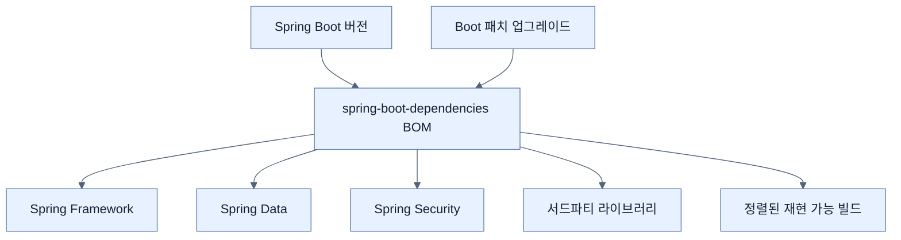

# 애플리케이션 의존성 관리

## 한눈에 보기

Spring Boot는 Spring Framework, Spring Data, Spring Security와 주요 서드파티 라이브러리의 **검증된 버전 조합**을 제공한다. Maven BOM인 `spring-boot-dependencies`가 버전 정렬의 중심이며 Maven과 Gradle 모두 이를 소비할 수 있다.

## 1. 왜 이게 필요한가

라이브러리를 개별 업그레이드하면 API 호환성, 전이 의존성, 보안 패치 조합을 개발팀이 직접 검증해야 한다. 기능 하나를 얻으려다 다른 Spring 모듈이 깨지는 문제는 반복 비용이 크다. Boot 버전을 플랫폼 기준점으로 삼으면 전체 생태계를 하나의 호환 단위로 움직일 수 있다.

## 2. 어떻게 동작하는가

1. 프로젝트가 Spring Boot 버전을 선택한다.
2. 부모 POM이나 의존성 관리 플러그인이 `spring-boot-dependencies` BOM의 버전 제약을 가져온다.
3. 스타터와 직접 의존성은 보통 개별 버전을 생략한다.
4. 빌드 도구가 BOM에 맞는 버전을 해석한다.
5. Boot 패치 릴리스로 올리면 관련 버그·CVE 대응 버전도 함께 따라온다.

BOM은 검증된 여행 패키지와 비슷하다. 교통편끼리 시간이 맞는다는 장점이 있지만, 모든 목적지에 최적인 것은 아니다. 특정 라이브러리 버전을 강제로 재정의할 수는 있어도 Boot 팀이 검증한 조합 밖으로 나간 책임은 프로젝트가 진다.

## 3. 그림으로 보기

## 4. 이 노트에 나온 용어

- **BOM**: 의존성 자체보다 호환 버전 제약을 모아 배포하는 Bill of Materials.
- **version alignment**: 함께 사용하는 라이브러리 버전을 검증된 조합으로 맞추는 것.
- **CVE**: 공개적으로 식별·추적되는 보안 취약점 항목.
- **dependency management**: 직접·전이 의존성의 선택 버전을 중앙에서 통제하는 빌드 기능.

## 7. 연결

- [[02-adding-portfolio-components-using-spring-boot-starters]] — 스타터가 가져오는 구성 요소도 BOM 버전을 따른다.
- [[chapter-15-whats-new-in-spring-boot-4/08-additional-migration-considerations|추가 마이그레이션 고려사항]] — 대규모 업그레이드에서는 관리 버전 밖의 재정의를 점검해야 한다.

## 8. 스스로 확인

- 전체 1차 정리 후: “스타터”와 “BOM”이 각각 무엇을 묶는지 구분해 설명한다.

<!-- ==== 아래는 내 영역 · 스킬 수정 금지 ==== -->

## 내 설명 시도

## 막혔던 지점

## 리뷰 이력

