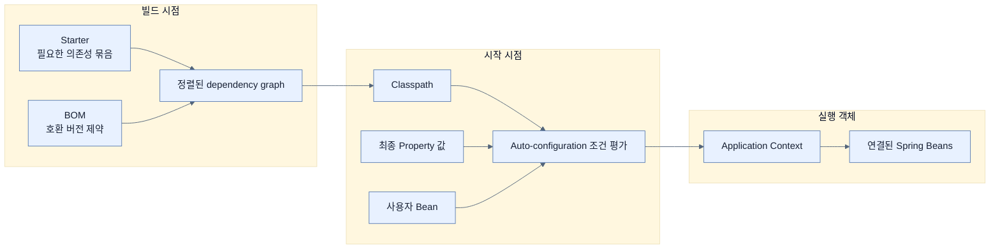

# Chapter 1 개념 지도 — Core Features of Spring Boot

> Chapter 1은 Spring Boot의 기능 목록을 외우는 장이 아니다. `빌드에서 기술 선택 → 시작 시 조건 평가 → 컨텍스트에 Bean 조립 → 외부 값으로 조정`이라는 하나의 흐름을 이해하는 장이다. 원문 누락 여부는 [[_coverage]]에서 추적한다.

## 읽는 순서


| 순서 | 노트 | 원문에서 답하는 질문 |
|---:|---|---|
| 00 | [[00-technical-requirements]] | 어떤 Java·IDE·원본 코드 환경에서 책을 따라갈까? |
| 01 | [[01-autoconfiguring-spring-beans]] | Spring은 객체를 어떻게 만들고, Boot는 어떤 기본 Bean을 보탤까? |
| 02 | [[02-adding-portfolio-components-using-spring-boot-starters]] | 필요한 기술 묶음을 빌드에 어떻게 명시할까? |
| 03 | [[03-customizing-the-setup-with-configuration-properties]] | 자동 구성의 기본값을 어떻게 바꿀까? |
| 03a | [[03a-creating-custom-properties]] | 애플리케이션 고유 설정을 어떻게 타입 있는 객체로 만들까? |
| 03b | [[03b-externalizing-application-configuration]] | 여러 환경의 값과 충돌 우선순위를 어떻게 관리할까? |
| 03c | [[03c-configuring-property-based-beans]] | 설정값에 따라 어떤 구현 Bean을 만들지 어떻게 고를까? |
| 04 | [[04-managing-application-dependencies]] | 함께 쓰는 라이브러리 버전을 어떻게 호환 조합으로 유지할까? |

## 축 1: 빌드 시점 → 애플리케이션 시작 시점 → 실행 객체

이 축의 질문은 “Spring Boot의 각 기능은 어느 시점에 무엇을 바꾸는가?”다. starter와 BOM을 런타임 기능으로, configuration property를 빌드 의존성으로 혼동하지 않게 해 준다.



- [[02-adding-portfolio-components-using-spring-boot-starters]]: 기능을 구성하는 라이브러리 목록을 선택한다.
- [[04-managing-application-dependencies]]: 그 목록의 버전을 정렬한다.
- [[01-autoconfiguring-spring-beans]]: 클래스패스·사용자 빈·설정 조건을 평가한다.
- [[03b-externalizing-application-configuration]]: 조건과 빈 설정에 들어갈 최종값을 결정한다.

## 축 2: 편리한 기본값 ↔ 명시적인 제어

이 축의 질문은 “Boot가 대신 정하는 범위와 사용자가 다시 가져오는 제어권의 경계는 어디인가?”다.

| Boot가 제공하는 기본 | 사용자가 제어권을 가져오는 수단 | 관련 노트 |
|---|---|---|
| 흔한 인프라 Bean | 같은 역할의 사용자 Bean을 정의하면 back-off | [[01-autoconfiguring-spring-beans]] |
| 기능별 권장 의존성 묶음 | 필요한 starter를 명시적으로 선택·제외 | [[02-adding-portfolio-components-using-spring-boot-starters]] |
| 내장 서버의 8080 포트 | `server.port`로 override | [[03-customizing-the-setup-with-configuration-properties]] |
| 설정 객체의 코드 기본값 | 외부 프로퍼티를 바인딩 | [[03a-creating-custom-properties]] |
| 일반 config data | 외부 파일·profile·환경 변수·명령행의 우선순위 | [[03b-externalizing-application-configuration]] |
| 조건에 맞는 기본 구현 | `havingValue`, `matchIfMissing`, 사용자 구성 | [[03c-configuring-property-based-beans]] |
| 검증된 라이브러리 버전 | 필요 시 개별 override, 대신 호환성 책임 인수 | [[04-managing-application-dependencies]] |

Spring Boot의 opinionated라는 성격은 “선택 불가”가 아니라 “흔한 선택에는 기본 의견이 있고, 명시적 선택을 하면 물러난다”에 가깝다.

## 축 3: 무엇을 고정하고 무엇을 외부에서 바꿀까

이 축의 질문은 “변경 빈도와 책임 주체에 따라 결정이 어디에 놓여야 하는가?”다.

```text
소스 코드
  └─ 도메인 규칙, 구성 타입, Bean 경계

빌드 파일
  └─ MVC/JPA 같은 기술 선택, Boot 버전, 스타터

패키지 내부 config data
  └─ 안전한 공통 기본값

배포 환경
  └─ 서버 주소, 포트, 환경별 값, 자격 증명 참조

일시적 실행·테스트
  └─ 명령행 override, 테스트 전용 프로퍼티
```

- 빌드 파일의 starter 변경은 클래스패스와 가능한 자동 구성을 바꾼다.
- 외부 프로퍼티 변경은 같은 바이너리의 값 또는 시작 시 빈 조합을 바꾼다.
- 런타임 요청마다 달라지는 결정은 시작 시점의 조건부 Bean만으로 해결하지 않는다.

## 축 4: 네 핵심 기능의 책임 분리

이 축의 질문은 “문제가 생겼을 때 어느 계층을 조사해야 하는가?”다.

| 관찰된 문제 | 먼저 볼 곳 | 이유 |
|---|---|---|
| 필요한 클래스가 없다 | starter와 dependency tree | 클래스패스에 기술이 들어왔는지 확인해야 한다 |
| 클래스는 있는데 Bean이 없다 | auto-configuration 조건 | 클래스·기존 Bean·프로퍼티 조건이 거짓일 수 있다 |
| Bean은 있는데 값이 이상하다 | property source와 precedence | 더 높은 소스가 값을 덮었을 수 있다 |
| 같은 역할의 Bean이 중복된다 | conditional과 back-off 경계 | 조건이 상호 배타적인지 확인해야 한다 |
| 업그레이드 뒤 런타임 충돌 | Boot BOM, 직접 override, dependency tree | 정렬된 조합 밖의 버전이 섞였을 수 있다 |

## 이름으로 원리를 기억하기

| 이름 | 이름이 붙은 이유 | 기억할 경계 |
|---|---|---|
| Application context | 애플리케이션 객체가 존재하고 연결되는 전체 문맥을 보관한다 | 단순 객체 저장소가 아니라 생성·생명주기까지 관리한다 |
| Dependency injection | 필요한 대상을 객체 안에서 찾거나 만들지 않고 밖에서 넣는다 | `new` 자체 금지가 아니다 |
| Auto-configuration | 현재 조건을 보고 구성 결정을 자동 적용한다 | 비즈니스 설계까지 자동화하지 않는다 |
| Starter | 기능 사용을 시작할 의존성 출발점을 제공한다 | Bean을 직접 만드는 런타임 기능은 아니다 |
| Externalized configuration | 값을 바이너리 바깥으로 옮겨 환경이 공급한다 | 비밀 보안을 자동 보장하지 않는다 |
| Profile | 여러 설정에 이름을 붙여 함께 활성화한다 | 실제 배포 환경과 반드시 일대일은 아니다 |
| BOM | 제품을 구성할 부품 버전의 자재 명세서다 | 의존성을 실제로 추가하는 목록과 다르다 |

## 책과 공식 문서 사이에서 주의할 두 지점

1. 책은 기본 `@ConditionalOnProperty`를 “키에 어떤 값이든 있으면”으로 설명하지만 실제로 문자열 `false`는 기본 조건에 일치하지 않는다. 자세한 진리표는 [[03c-configuring-property-based-beans]]에 있다.
2. 책의 property source 목록에는 `@DynamicPropertySource`가 빠져 있다. Spring Boot 4.0.3 공식 목록을 반영한 전체 순서는 [[03b-externalizing-application-configuration]]에 있다.

## 나의 취약 엣지

- 아직 Chapter 1 인출 연습을 시작하지 않았으므로 실제 stall 기반 취약 엣지는 기록하지 않았다.
- 이후 막힘은 [[../../_global/gaps|전역 gaps]]에 `chapter-1-core-features-of-spring-boot` 카테고리로 추가한다.
- 우선 확인 후보: starter vs auto-configuration, Spring bean vs JavaBean, profile vs property condition, BOM vs starter. 이것들은 현재 “약점으로 판정된 항목”이 아니라 읽을 때 구분해야 할 경계다.

## 관련 Chapter

- [[../../part-2-creating-an-application-with-spring-boot/chapter-2-creating-web-and-api-applications-with-spring-boot/01-using-start-spring-io-to-build-apps|Chapter 2 · Spring Initializr]] — Chapter 1의 starter와 BOM을 실제 프로젝트 골격으로 만든다.
- [[../../part-2-creating-an-application-with-spring-boot/chapter-2-creating-web-and-api-applications-with-spring-boot/02-creating-a-spring-mvc-web-controller|Chapter 2 · MVC Controller]] — `starter-webmvc`가 준비한 실행 환경 위에서 첫 웹 기능을 만든다.
- [[../../part-3-releasing-an-application-with-spring-boot/chapter-6-configuring-an-application-with-spring-boot/01-creating-custom-properties|Chapter 6 · Custom properties]] — Chapter 1의 타입 바인딩을 검증·메타데이터와 함께 깊게 다룬다.
- [[../../part-3-releasing-an-application-with-spring-boot/chapter-6-configuring-an-application-with-spring-boot/05-ordering-property-overrides|Chapter 6 · Property override order]] — 외부 구성의 우선순위를 실전 수준으로 확장한다.
