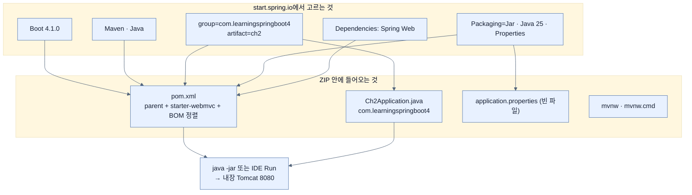

# start.spring.io로 웹 애플리케이션 골격 만들기

## 한눈에 보기

| 질문 | 핵심 답 |
|---|---|
| Initializr가 실제로 만들어 주는 것은? | 코드가 아니라 **빌드 파일과 최소 골격**이다. 버전이 서로 맞는 의존성 조합이 핵심 산출물이다. |
| 무엇을 고르게 하나? | Boot 버전, 빌드 도구, 언어, 프로젝트 좌표, Java 버전, 스타터, 패키징, 설정 파일 형식 — 8가지다. |
| JAR과 WAR 중 무엇? | 쓰던 외부 서블릿 컨테이너가 있는 게 아니면 JAR이다. "누가 서버를 띄우는가"가 갈린다. |
| 웹 컨트롤러를 쓰려면 최소 무엇이 필요? | 의존성 하나 — Spring Web. |
| GENERATE 버튼이 하는 일 | 선택 조합대로 만들어진 프로젝트 ZIP을 내려받는다. |

## 1. 왜 이게 필요한가

### 출발 장면: 빈 `pom.xml` 앞에서

Spring MVC로 웹 애플리케이션을 새로 만들려고 한다. 필요한 것은 Spring Framework, Spring MVC, 내장 Tomcat, JSON 변환기, 로깅 구현체, 테스트 라이브러리다. 여기서 진짜 문제는 "무엇이 필요한가"가 아니라 **"이 여섯 개를 어느 버전 조합으로 써야 서로 안 깨지는가"**다. 책은 Spring Boot가 나오기 전 개발자들이 이 질문에 답하던 방식을 네 가지로 정리한다.

- Option 1: stackoverflow.com을 뒤져 예제 Maven 빌드 파일을 찾는다.
- Option 2: 레퍼런스 문서를 파고들어 빌드 XML 조각들을 이어 붙이고, 동작하기를 바란다.
- Option 3: 유명한 전문가들의 블로그를 검색해 빌드 설정이 담긴 글을 찾는다.
- Option 4: 이전 프로젝트를 복사해 필요 없는 파일을 지우고 라이브러리를 더하거나 뺀다.

### 여기서 뭐가 무너지나

네 방법 모두 같은 지점에서 무너진다. **정답의 유효기간이 짧다는 것**이다.

블로그 글과 Stack Overflow 답변은 쓰인 시점의 버전 조합이다. 그 사이 모듈이 이름을 바꾸거나 사라졌다면, 복사한 XML은 "빌드는 되는데 실행하면 클래스를 못 찾는" 상태가 된다. 책은 이 상황을 "더 이상 존재하지 않거나 필요한 일을 하지 않는 설정 옵션을 적용하려 시도했을 수 있다"고 적는다. 설정을 잘못 쓴 것이 아니라, **그 설정이 있던 시절의 세계가 사라진 것**이다.

Option 4가 특히 함정이다. 복사는 시작이 가장 빠르지만, 이전 프로젝트에만 필요했던 의존성·설정·디렉터리를 하나씩 걷어내야 한다. 책의 저자는 이 정리에 새 프로젝트를 처음부터 만드는 것보다 더 오래 걸린 적도 있다고 말한다.

### 그래서 나온 생각

그러면 **버전 조합을 아는 사람이 직접 만들어 주면 된다.** Spring 팀이 운영하는 웹 서비스에서 필요한 기능을 고르면, 그 순간 유효한 조합으로 된 빌드 파일을 만들어 내려준다. 이것이 **[[스프링-이니셜라이저]]**(= 고른 조합대로 프로젝트 골격과 빌드 파일을 만들어 주는 Spring 팀의 서비스)다. 주소는 `start.spring.io`다.

이름이 "Initializer"가 아니라 `Initializr`인 것은 2000년대 후반 웹 서비스들의 표기 유행(Flickr, Tumblr)을 따른 것이지만, **"initialize"까지만 해 준다**는 범위도 정확히 담고 있다. 초기화 이후의 설계와 코드는 여전히 개발자 몫이다.

비유하자면 Initializr는 **가구 조립 키트의 부품 목록과 나사 규격을 대신 뽑아 주는 창구**다. 무엇을 만들지는 내가 정하지만, "이 선반에는 M4 나사 12개가 맞는다"는 부분은 창구가 책임진다. 다만 이 비유는 한 지점에서 깨진다 — 가구 키트는 조립 설명서까지 따라오지만, Initializr는 **애플리케이션을 어떻게 설계할지에 대해서는 아무 말도 하지 않는다.** 패키지 구조도, 계층도, 도메인 모델도 빈 상태로 준다.

> **Note (책 p.26)**: 이 장의 예제 코드는 책의 저장소 `ch2` 폴더에 있다.

## 2. 어떻게 동작하는가

### 2.1 Initializr가 고르게 하는 것

책은 start.spring.io의 핵심 기능을 다음처럼 나열한다. 이 목록 자체가 "프로젝트 시작에 필요한 결정이 무엇인지"의 체크리스트다.

| 선택 항목 | 무엇을 결정하는가 | 나중에 바꾸기 |
|---|---|---|
| Spring Boot 버전 | 전체 의존성 버전 정렬의 기준점 | 가능하나 전이 의존성이 함께 움직인다 |
| 빌드 도구 (Maven / Gradle) | 빌드 파일 문법과 실행 명령 | 사실상 프로젝트 재구성 |
| 언어 (Java / Kotlin / Groovy) | 소스 디렉터리와 컴파일러 플러그인 | 사실상 프로젝트 재구성 |
| 프로젝트 좌표 | 산출물의 이름과 기본 패키지 | group·artifact 변경은 소비자에게 영향 |
| Java 버전 | 컴파일 타깃과 쓸 수 있는 언어 기능 | 비교적 쉬움 |
| 모듈(스타터) | 클래스패스에 무엇이 올라오는가 | 쉬움 — [[03-augmenting-an-existing-project-with-initializr]] |
| Packaging (Jar / War) | 서버를 누가 띄우는가 | 배포 방식 전체가 바뀐다 |
| 설정 형식 (Properties / YAML) | `application.properties` vs `application.yaml` | 쉬움 |

### 2.2 빌드 도구·언어·Boot 버전

첫 화면에서 세 가지를 고른다.

1. **빌드 도구**: Maven, Gradle-Groovy, Gradle-Kotlin. — 빌드 파일의 문법과 명령이 완전히 달라서 프로젝트 생성 시점에 정해야 하기 때문이다. 책은 Maven을 쓴다.
2. **언어**: Java, Kotlin, Groovy. — 언어를 고르면 그 언어용 컴파일러 플러그인과 소스 레이아웃이 빌드 파일에 함께 들어간다. 책은 Java를 쓴다.
3. **Spring Boot 버전**: 책은 **4.1.0**을 고르고, 그 버전이 없으면 최신 4.1.x를 쓰라고 안내한다. — 이 선택 하나가 뒤따르는 모든 라이브러리의 버전을 정렬하는 기준이 되기 때문이다.

> **Note (책 p.27)**: start.spring.io는 새 Spring Boot 릴리스가 나오면 **스스로 갱신된다.** 그래서 오늘 화면에 보이는 버전 목록과 책의 스크린샷은 다를 수 있다. 이는 버그가 아니라 "정답의 유효기간이 짧다"는 §1의 문제를 서비스 쪽에서 흡수하는 방식이다.

### 2.3 프로젝트 좌표, 패키징, Java 버전, 설정 형식

페이지를 내리면 **[[프로젝트-좌표]]**(= 빌드 시스템이 산출물을 유일하게 식별하는 이름표)를 입력한다. Group은 `com.learningspringboot4`, Artifact와 Name은 `ch2`, Package name은 Group과 Artifact에서 자동으로 유도된다.

그다음이 이 절에서 가장 중요한 결정인 **[[패키징]]**(= 빌드 결과물을 어떤 배포 형식으로 묶을지의 선택)이다.

| | JAR | WAR |
|---|---|---|
| 서버를 띄우는 주체 | 애플리케이션 자신 (내장 Tomcat) | 미리 설치된 **[[외부-서블릿-컨테이너]]**(= 애플리케이션과 별도로 운영되고 그 안에 배포물을 얹는 서버) |
| 실행 방법 | `java -jar ch2.jar` | 컨테이너의 배포 디렉터리에 얹고 컨테이너를 재시작 |
| Spring Boot 팀의 지원 | first-class | 여전히 유효하지만 부차적 |
| 언제 고르나 | 기본값 | 조직이 이미 운영 중인 서블릿 컨테이너에 배포해야 할 때 |

> "Make JAR not WAR" — Josh Long (@starbuxman), 책 p.28 인용

JAR을 고르면 나오는 산출물이 **[[실행-가능-JAR]]**(= 코드·의존성·내장 서버를 한 파일에 담아 `java -jar`만으로 뜨는 JAR)이다. 이 형태가 왜 기본이 되었는지는 배포 환경을 보면 분명하다. 컨테이너 이미지나 클라우드 플랫폼에 올릴 때, "이 이미지 안에 Tomcat을 미리 깔아 두고 그 안에 WAR을 넣는" 2단계는 그대로 낭비다. **[[서블릿]]**(= HTTP 요청 하나를 처리하는 객체를 정의한 Java 표준 모델) 컨테이너가 애플리케이션 안으로 들어오면 배포 단위가 하나가 된다.

Java 버전은 25를 고른다. 다만 책은 경계를 분명히 한다 — **Spring Framework 7과 Spring Boot 4가 요구하는 최소 버전은 Java 17**이고, Boot 4 애플리케이션은 Java 17에서도 돈다. 25는 "현재 LTS의 언어·JVM 개선을 쓰기 위한 책의 선택"이지 요구사항이 아니다.

마지막으로 Configuration을 **Properties**로 고른다. 이 선택은 생성되는 **[[구성-프로퍼티]]**(= 외부 파일의 키-값으로 동작을 조정하는 설정) 파일이 `application.properties`인지 `application.yaml`인지를 정할 뿐이다. 책 집필 시점에 Initializr에 새로 추가된 옵션이다.

### 2.4 의존성 고르기 — Spring Web 하나면 된다

`ADD DEPENDENCIES…`를 누르면 필터 상자가 뜬다. `Web`을 입력하면 **Spring Web**이 목록 맨 위로 올라온다. Return을 누르면 목록에 추가된다.

책은 여기서 놀라운 사실을 짚는다. **웹 컨트롤러를 만들기 시작하는 데 필요한 것은 이 항목 하나가 전부다.** Spring Web은 **[[스타터]]**(= 어떤 기능을 쓰기 시작하는 데 필요한 의존성 묶음을 한 이름으로 제공하는 아티팩트) 하나로 번역되고, 그 스타터가 Spring MVC·내장 Tomcat·JSON 변환기·HTTP 메시지 변환기를 전부 끌고 들어온다. 실제로 어떤 아티팩트인지는 [[02-creating-a-spring-mvc-web-controller]]에서 `pom.xml`을 열어 확인한다.

### 2.5 GENERATE — ZIP을 받아 IDE로 연다

화면 하단의 `GENERATE` 버튼을 누르면 선택 조합대로 만들어진 프로젝트가 ZIP으로 내려온다. 압축을 풀고 IDE로 열면 바로 컨트롤러를 쓸 수 있다.

> **Tip (책 p.29)**: IDE는 무엇을 써도 상관없다. IntelliJ IDEA, Microsoft VS Code, Spring Tool Suite 모두 기본 내장이든 플러그인 설치든 Spring Boot 프로젝트를 지원한다.

이 마지막 단계를 굳이 강조하는 이유는, **GENERATE가 "새 프로젝트"에만 쓰는 버튼**이기 때문이다. 이미 진행 중인 프로젝트에 기능을 더할 때는 다른 버튼을 쓴다 — [[03-augmenting-an-existing-project-with-initializr]].

## 3. 그림으로 보기

### 선택 → 산출물

핵심은 화살표가 전부 `pom.xml`로 모인다는 점이다. Initializr의 진짜 산출물은 **소스 파일이 아니라 정렬된 빌드 파일**이다.

### 첫 화면 — 빌드 도구·언어·Boot 버전

![[_assets/lsb4-p52-fig2-1-initializr-build-and-version.png]]
> 출처: *Learning Spring Boot 4*, p.27 (Figure 2.1)

### 프로젝트 좌표·패키징·설정 형식·Java 버전

![[_assets/lsb4-p53-fig2-2-initializr-project-metadata.png]]
> 출처: *Learning Spring Boot 4*, p.28 (Figure 2.2)

Packaging에 `Jar`, Configuration에 `Properties`, Java에 `25`가 선택된 상태다. `21`과 `17`도 목록에 있다는 점이 "Java 17이 baseline"이라는 서술과 맞물린다.

### 의존성 필터에서 Spring Web 고르기

![[_assets/lsb4-p54-fig2-3-initializr-add-spring-web.png]]
> 출처: *Learning Spring Boot 4*, p.29 (Figure 2.3)

강조 표시된 설명 문구 — "Build web, including RESTful, applications using Spring MVC. Uses Apache Tomcat as the default embedded container" — 가 이 항목 하나로 무엇이 함께 들어오는지를 그대로 말해 준다.

### 새 프로젝트를 받는 버튼

![[_assets/lsb4-p54-fig2-4-initializr-generate-button.png]]
> 출처: *Learning Spring Boot 4*, p.29 (Figure 2.4)

## 4. 이 노트에 나온 용어

| 용어 | 한 줄 풀이 | 자세히 |
|---|---|---|
| 스프링 이니셜라이저 | 고른 조합대로 프로젝트 골격과 빌드 파일을 만들어 주는 서비스 | [[_glossary#스프링-이니셜라이저]] |
| 프로젝트 좌표 | 빌드 시스템이 산출물을 유일하게 식별하는 이름표 | [[_glossary#프로젝트-좌표]] |
| 패키징 | 결과물을 JAR로 묶을지 WAR로 묶을지의 선택 | [[_glossary#패키징]] |
| 실행 가능 JAR | 코드·의존성·내장 서버를 한 파일에 담아 단독 실행되는 JAR | [[_glossary#실행-가능-JAR]] |
| 외부 서블릿 컨테이너 | 미리 설치·운영되고 그 안에 배포물을 얹는 서버 | [[_glossary#외부-서블릿-컨테이너]] |
| 서블릿 | HTTP 요청 하나를 처리하는 객체를 정의한 Java 표준 모델 | [[_glossary#서블릿]] |
| 스타터 | 기능 하나를 시작하는 데 필요한 의존성 묶음 아티팩트 | [[_glossary#스타터]] |
| 구성 프로퍼티 | 외부 파일의 키-값으로 동작을 조정하는 설정 | [[_glossary#구성-프로퍼티]] |

## 5. 자주 헷갈리는 것

### Initializr vs 코드 생성기(scaffolding)

Rails의 `scaffold`나 JHipster처럼 엔티티를 주면 CRUD 코드까지 만들어 주는 도구가 있다. Initializr는 그런 도구가 **아니다.** 만들어 주는 것은 빌드 파일, 메인 클래스 하나, 빈 설정 파일, Maven/Gradle wrapper까지다. 판별 질문은 하나다 — "이 도구가 내 도메인을 아는가?" Initializr는 모른다.

### Spring Boot 버전 vs Java 버전

둘 다 목록에서 고르지만 성격이 다르다. Boot 버전은 **다른 라이브러리들의 버전을 정렬하는 기준점**이고, Java 버전은 **컴파일 타깃**이다. Boot 4는 Java 17 이상이면 어느 것과도 조합되므로, Java 25를 골랐다고 Boot 버전이 달라지지 않는다.

### JAR/WAR 선택 vs 내장 서버 사용 여부

WAR을 고르면 내장 서버가 사라지는 것이 아니라, **개발 중에는 내장 서버로 돌고 배포 시에는 외부 컨테이너에 얹히는** 이중 구성이 된다. 즉 WAR 선택의 진짜 의미는 "내장 서버를 포기한다"가 아니라 "외부 컨테이너에 배포할 수 있는 형태도 만든다"다.

## 6. 언제 안 쓰나 / 경계

- Initializr는 **아키텍처를 정해 주지 않는다.** 패키지 구조, 계층 분리, 도메인 모델은 전부 빈 상태다. 이 장 뒷부분의 [[04b-building-our-app-with-a-better-design]]가 그 빈자리를 직접 채우는 절이다.
- 지원이 끝난 Spring Boot 버전은 목록에서 사라진다. 오래된 버전을 유지해야 하는 프로젝트는 Initializr로 되살릴 수 없다.
- 조직 내부 저장소나 사내 표준 스타터가 필요한 환경에서는 공개 Initializr 결과를 그대로 쓸 수 없다. Initializr는 오픈소스라 사내 인스턴스를 띄울 수 있지만, 그것은 별도 운영 대상이다.
- 생성된 `pom.xml`은 시작점이지 최종본이 아니다. Node 빌드 연동처럼 이 장 뒤에서 손으로 더하는 플러그인도 있다 — [[06-integrating-nodejs-with-a-spring-boot-web-app]].

## 7. 연결

- [[02-creating-a-spring-mvc-web-controller]] — 여기서 고른 Spring Web이 `pom.xml`의 어떤 스타터가 되고, 그 스타터가 무엇을 열어 주는지 확인한다.
- [[03-augmenting-an-existing-project-with-initializr]] — 같은 화면을 새 프로젝트가 아니라 **기존 프로젝트를 확장**하는 데 쓰는 방법이다. GENERATE 대신 EXPLORE를 누른다.
- [[04-leveraging-templates-to-create-content]] — Spring Web만으로는 HTML을 못 만든다는 사실이 드러나는 지점이며, 여기서 고른 Properties 설정 형식이 실제로 쓰인다.

## 8. 스스로 확인

1. Spring Boot 이전의 네 가지 프로젝트 시작 방법이 전부 같은 지점에서 무너진다고 했다. 그 지점은 무엇인가?
2. 이전 프로젝트 복사가 "가장 빠른 시작"인데도 결국 더 느려지는 이유를 구체적으로 설명할 수 있는가?
3. Initializr가 만들어 주는 산출물 중 **핵심 하나**만 고른다면 무엇이고, 왜인가?
4. JAR과 WAR 중 하나를 고르는 결정은 실제로 무엇을 가르는가? "누가 서버를 띄우는가"로 답해 보라.
5. Java 25를 골랐는데 팀의 운영 환경이 Java 17이라면 무엇이 문제이고 무엇은 문제가 아닌가?
6. Spring Web 하나로 웹 컨트롤러를 쓸 수 있는 이유를 스타터 개념으로 설명할 수 있는가?
7. start.spring.io가 스스로 갱신된다는 성질은 §1에서 지적한 어떤 문제를 흡수하는가?
8. Initializr가 **하지 않는** 일을 세 가지 이상 말할 수 있는가?

<!-- ==== 아래는 내 영역 · 스킬 수정 금지 ==== -->

## 내 설명 시도

## 막혔던 지점

## 리뷰 이력
