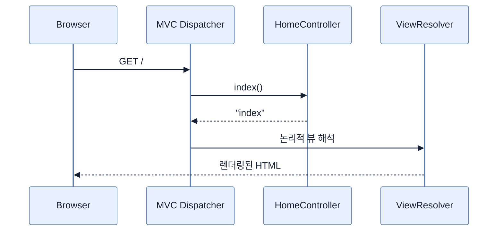

# Spring MVC 웹 컨트롤러 만들기

## 한눈에 보기

`@Controller`는 클래스를 MVC 요청 처리 Bean으로 만들고, `@GetMapping("/")`은 GET 루트 요청을 메서드에 연결한다. `@Controller` 메서드가 반환한 문자열 `index`는 응답 본문이 아니라 렌더링할 **논리적 뷰 이름**이다.

## 1. 왜 이게 필요한가

HTTP 요청을 애플리케이션 로직과 화면 렌더링에 연결하는 명시적 진입점이 필요하다. 컨트롤러가 URL·HTTP 동사와 메서드의 관계를 선언하면 서블릿 저수준 코드를 직접 다루지 않고도 웹 계층을 만들 수 있다.

## 2. 어떻게 동작하는가

`spring-boot-starter-webmvc`가 MVC와 요청 매핑 인프라를 클래스패스에 놓는다. Boot는 자동 구성으로 DispatcherServlet 등을 준비하고, 기본 패키지 아래를 컴포넌트 스캔해 `@Controller`를 Bean으로 등록한다. 요청이 오면 매핑 테이블에서 경로와 동사가 맞는 메서드를 찾고, 반환된 뷰 이름을 ViewResolver가 실제 템플릿으로 바꾼다.

컨트롤러는 안내 데스크에 비유할 수 있다. 요청을 적절한 업무와 화면으로 안내하지만, 데이터 저장과 핵심 규칙까지 안내 데스크 안에 쌓아두면 계층이 무너진다.

## 3. 그림으로 보기

## 4. 이 노트에 나온 용어

- **request mapping**: HTTP 경로·동사·조건을 컨트롤러 메서드에 연결하는 규칙.
- **logical view name**: 템플릿 경로·확장자를 추상화한 화면 이름.
- **component scanning**: 지정 패키지에서 stereotype 애노테이션 클래스를 찾아 Bean으로 등록하는 과정.

## 7. 연결

- [[04-leveraging-templates-to-create-content]] — 논리적 뷰 이름이 실제 Mustache 템플릿으로 이어진다.
- [[05-creating-json-based-apis]] — `@RestController`는 같은 매핑 모델에서 반환값을 응답 본문으로 바꾼다.

## 8. 스스로 확인

- 전체 1차 정리 후: `@Controller` 메서드의 문자열 반환값이 JSON API와 다르게 해석되는 이유를 설명한다.

<!-- ==== 아래는 내 영역 · 스킬 수정 금지 ==== -->

## 내 설명 시도

## 막혔던 지점

## 리뷰 이력

