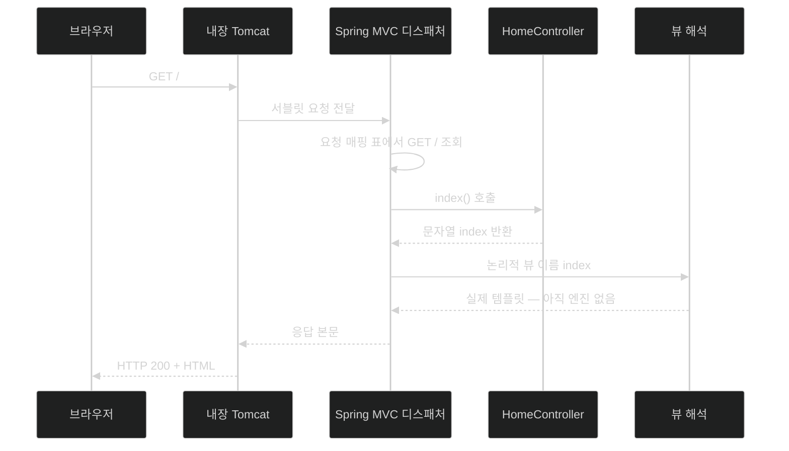

# Spring MVC 웹 컨트롤러 만들기

## 한눈에 보기

| 질문 | 핵심 답 |
|---|---|
| 웹 컨트롤러란? | HTTP 요청을 받아 처리하고 무엇을 응답할지 정하는 컴포넌트다. |
| 그 능력은 어디서 오나? | Spring MVC. Boot 4에서는 `spring-boot-starter-webmvc`가 클래스패스에 올린다. |
| 클래스 이름이 중요한가? | 아니다. **애노테이션**이 전부다. |
| `@Controller` + `@GetMapping("/")`의 의미 | "이 클래스는 웹 컨트롤러다" + "GET / 요청을 이 메서드로 보내라". |
| `return "index";`는 무슨 뜻? | 파일 경로가 아니라 **논리적 뷰 이름**이다. 실제 파일 찾기는 컨트롤러 바깥에서 한다. |
| 이 노트가 끝나도 남는 문제 | 템플릿 엔진을 아직 고르지 않았다. |

## 1. 왜 이게 필요한가

### 출발 장면: 실행은 되는데 페이지가 없다

[[01-using-start-spring-io-to-build-apps]]에서 받은 ZIP을 풀고 IDE에서 실행하면 애플리케이션은 뜬다. 콘솔에 Tomcat이 8080 포트에서 시작됐다는 로그도 찍힌다. 그런데 브라우저로 `localhost:8080`에 가면 아무것도 없다.

서버는 살아 있는데 **그 서버에게 `GET /`를 어떻게 처리하라고 말한 코드가 하나도 없기 때문**이다. Initializr가 만들어 준 것은 실행 환경이지 동작이 아니다.

### 여기서 뭐가 무너지나

"그러면 요청을 직접 처리하면 되지 않나?" 순진한 방법은 Java 표준 **[[서블릿]]**(= HTTP 요청 하나를 처리하는 객체를 정의한 Java 표준 모델)을 직접 구현하는 것이다.

```java
public class HomeServlet extends HttpServlet {
    protected void doGet(HttpServletRequest req, HttpServletResponse resp) {
        // 경로를 직접 꺼내 보고
        // 어떤 화면인지 if-else로 갈라내고
        // 응답 스트림에 HTML을 직접 쓴다
    }
}
```

이 방식은 화면이 하나일 때만 견딘다. 경로가 스무 개가 되면 `doGet` 하나가 거대한 분기문이 되고, HTTP 메서드마다 `doGet`/`doPost`가 따로 있으니 "같은 `/videos` 경로의 GET과 POST"가 서로 다른 파일로 흩어진다. 무엇보다 요청 파라미터를 꺼내고, 타입을 바꾸고, 응답 형식을 정하는 **똑같은 배관 코드가 모든 서블릿에 반복된다.**

### 그래서 나온 생각

경로와 HTTP 메서드에 따라 **어느 Java 메서드를 부를지 정하는 일**을 프레임워크에 맡기고, 개발자는 그 메서드 안의 결정만 쓴다. 이 역할을 하는 컴포넌트가 **[[웹-컨트롤러]]**(= HTTP 요청을 받아 처리하고 무엇을 응답할지 정하는 컴포넌트)다.

책은 웹 컨트롤러가 하는 일을 세 가지로 든다.

- `GET /` 같은 요청에 응답한다 — 보통 HTML을 돌려준다.
- `GET /api/videos` 같은 API 요청에 JSON을 돌려준다 — [[05-creating-json-based-apis]].
- 사용자가 `POST`로 변경을 일으킬 때 들어오는 JSON 본문을 처리한다.

이 능력을 주는 Spring 포트폴리오의 조각이 **[[Spring-MVC]]**(= 서블릿 컨테이너 위에서 Model-View-Controller 방식으로 웹 앱을 만들게 해 주는 Spring Framework 모듈)다. 이름의 세 글자가 곧 책임 분할이다 — 데이터(Model), 그 데이터를 보여 줄 표현(View), 둘을 이어 무엇을 할지 통제(Control)하는 자리. 컨트롤러는 **직접 그리지 않는다.** 무엇을 그릴지만 정한다.

비유하자면 컨트롤러는 **식당의 주문 접수 창구**다. 창구는 요리를 하지 않는다. 주문을 받아 주방에 넘기고 어느 접시로 나갈지만 정한다. `@GetMapping("/")`은 창구 앞에 붙은 "이 창구는 어떤 주문을 받는가" 팻말이다.

→ 비유가 깨지는 지점: 식당 창구는 손님이 몰리면 사람을 더 세운다. 하지만 Spring의 컨트롤러 빈은 기본적으로 **애플리케이션 전체에 딱 하나만** 만들어지고, 여러 요청 스레드가 그 하나를 동시에 쓴다. 그래서 컨트롤러 필드에 "이번 요청의 값"을 저장하면 다른 요청과 섞인다. 창구 직원은 여러 명일 수 있지만 컨트롤러는 한 명이 동시에 모든 손님을 받는다.

## 2. 어떻게 동작하는가

### 2.1 Spring Web을 골랐다는 것은 `pom.xml`에 무엇이 들어왔다는 뜻인가

`pom.xml`을 열면 결정적인 의존성 하나가 보인다.

```xml
<dependency>
    <groupId>org.springframework.boot</groupId>
    <artifactId>spring-boot-starter-webmvc</artifactId>
</dependency>
```

Chapter 1에서 본 **[[스타터]]**(= 기능 하나를 시작하는 데 필요한 의존성 묶음을 한 이름으로 제공하는 아티팩트) 중 하나다. 이름을 눈여겨볼 값이 있다 — **Spring Boot 3까지 이 자리는 `spring-boot-starter-web`이었다.** Boot 4는 이를 `spring-boot-starter-webmvc`로 바꿔, 이름만 보고도 "서블릿 기반 MVC를 쓴다"는 아키텍처 선택이 드러나게 했다. 리액티브 쪽은 `spring-boot-starter-webflux`로 분명히 갈린다.

Spring Boot 4.1.0 공식 빌드 정의 기준으로 이 스타터가 묶는 것은 다음과 같다.

| 묶인 모듈 | 무엇을 여는가 |
|---|---|
| `spring-boot-starter` | 코어 · 로깅 · 자동 구성 기반 |
| `spring-boot-starter-tomcat` | 내장 서블릿 컨테이너 |
| `spring-boot-starter-jackson` | Java ↔ JSON 변환 — [[05-creating-json-based-apis]]의 전제 |
| `spring-boot-http-converter` | HTTP 본문 ↔ 객체 변환기 |
| `spring-boot-webmvc` | Spring MVC 모듈과 그 자동 구성 |

책이 "Spring Web을 넣으면 Jackson이 딸려 온다"고 나중에 말하는 근거가 이 표의 세 번째 줄이다. 마법이 아니라 **전이 의존성 한 줄**이다.

### 2.2 클래스패스에 올라온 것이 왜 곧바로 동작하는가

의존성이 들어오면 두 가지가 연달아 일어난다.

1. **[[자동-구성]]**(= 클래스패스·기존 빈·프로퍼티 조건을 보고 기반 빈을 조건부 등록하는 Boot 기능)이 Spring MVC 클래스들이 있는 것을 보고, 요청을 받아 컨트롤러로 분배하는 인프라 빈들을 등록한다. — 개발자가 매 프로젝트마다 디스패처와 핸들러 매핑을 손으로 정의하지 않게 하기 위해서다.
2. **[[컴포넌트-스캔]]**(= 애노테이션이 붙은 클래스를 찾아 빈으로 등록하는 동작)이 우리가 쓴 컨트롤러 클래스를 찾아 인스턴스로 만든다. — 우리가 만든 클래스를 그 인프라에 등록하기 위해서다.

책은 이를 "그 존재만으로 우리가 만드는 어떤 웹 컨트롤러든 활성화되도록 Spring Boot의 자동 구성 설정을 촉발한다"고 표현한다. 두 단계가 **모두** 일어나야 동작한다는 점이 중요하다 — 인프라만 있고 컨트롤러가 스캔되지 않으면 여전히 404다.

컴포넌트 스캔이 어디부터 뒤지는지는 **[[베이스-패키지]]**(= 컴포넌트 스캔이 시작되는 기준 패키지)가 정한다. Initializr는 우리가 입력한 좌표대로 `com.learningspringboot4` 패키지와 그 안의 메인 클래스를 만들어 뒀다. 그러니 컨트롤러는 **이 패키지나 그 하위**에 두어야 한다.

### 2.3 컨트롤러 한 장

`com.learningspringboot4` 안에 `HomeController` 클래스를 만든다.

```java
@Controller
public class HomeController {
    @GetMapping("/")
    public String index() {
        return "index";
    }
}
```

세 줄이 각각 무엇을 말하는지 순서대로 보자.

1. `@Controller` — "이 클래스는 웹 컨트롤러다"를 Spring MVC에 알린다. 시작할 때 컴포넌트 스캔이 이 애노테이션을 보고 인스턴스를 만들어 컨텍스트에 등록한다. — 프레임워크가 이 클래스를 **찾을 수 있게** 하기 위해서다. 이 표시가 없으면 클래스는 그냥 아무도 부르지 않는 평범한 Java 클래스다.
2. `@GetMapping("/")` — HTTP `GET /` 호출을 이 메서드로 보내라는 **[[요청-매핑]]**(= 어떤 HTTP 메서드와 경로를 어느 컨트롤러 메서드가 처리할지 연결하는 선언)이다. — 경로 판단을 메서드 본문의 `if` 문이 아니라 선언으로 옮기기 위해서다. 그래야 같은 경로의 GET과 POST가 각각 자기 메서드를 갖는다.
3. `return "index";` — 여기서 돌려주는 문자열은 HTML도 파일 경로도 아니다. `@Controller`를 썼기 때문에 이 반환값은 **[[논리적-뷰-이름]]**(= 무엇을 그릴지만 이름으로 말하고 파일 위치는 말하지 않는 문자열)으로 해석된다. — 컨트롤러가 템플릿 파일의 위치와 확장자를 몰라도 되게 하기 위해서다.

그다음 Spring MVC의 **[[뷰-해석]]**(= 논리적 뷰 이름을 실제 템플릿 파일과 엔진으로 바꾸는 단계) 메커니즘이 `index`를 실제 템플릿으로 연결한다. 그 규칙은 [[04-leveraging-templates-to-create-content]]에서 본다.

### 2.4 이름은 자유, 애노테이션은 필수

책은 여기서 초보자가 흔히 헷갈리는 지점을 못 박는다. **클래스 이름과 메서드 이름은 전혀 중요하지 않다.** `HomeController`를 `Foo`로, `index()`를 `bar()`로 바꿔도 똑같이 동작한다. 중요한 부분은 애노테이션이다 — `@Controller`가 "이건 웹 컨트롤러다"를, `@GetMapping`이 "`GET /`를 이 메서드로 라우팅하라"를 말한다.

> **Tip (책 p.31)**: 그렇다고 아무 이름이나 쓰라는 뜻은 아니다. 유지보수를 위해서는 의미가 드러나는 이름이 좋다. 이 예에서 `HomeController`는 "우리가 만드는 사이트의 home 경로를 담당하는 컨트롤러"라는 뜻을 이름만으로 전달한다.

두 문장이 모순처럼 보이지만 겨냥하는 대상이 다르다. **기계는 이름을 안 본다. 사람은 이름만 본다.**

### 2.5 아직 해결되지 않은 것

`index`가 렌더링할 템플릿의 이름이라고 했다. 그런데 [[01-using-start-spring-io-to-build-apps]]에서 템플릿 엔진을 고른 적이 있는가? 없다. Spring Web만 골랐다.

이 미완의 상태가 바로 다음 절이 존재하는 이유다 — 이미 시작한 프로젝트에 의존성을 안전하게 더하는 방법, [[03-augmenting-an-existing-project-with-initializr]].

## 3. 그림으로 보기

### 요청 하나가 지나가는 길



`index()`가 만든 것은 **문자열 하나**뿐이고, 그것이 HTML이 되기까지 두 단계(뷰 해석 → 렌더링)가 더 남아 있다는 점이 이 그림의 요지다.

### 두 층의 등록이 모두 있어야 한다

```text
[의존성이 클래스패스에 올라온 뒤]

  spring-boot-starter-webmvc
        │
        ├─▶ (A) 자동 구성이 만드는 것
        │      디스패처 · 핸들러 매핑 · 메시지 변환기 · 뷰 해석기
        │      → "요청을 받아 누군가에게 넘길 준비"
        │
        └─▶ (B) 컴포넌트 스캔이 만드는 것
               @Controller가 붙은 내 클래스의 인스턴스
               → "넘겨받을 그 누군가"

  (A)만 있으면  → 요청은 들어오는데 처리할 사람이 없다 → 404
  (B)만 있으면  → 클래스는 있는데 아무도 부르지 않는다 → 애초에 서버가 안 뜬다
  (A)+(B)      → GET / 이 index()에 도달한다
```

## 4. 이 노트에 나온 용어

| 용어 | 한 줄 풀이 | 자세히 |
|---|---|---|
| 웹 컨트롤러 | HTTP 요청을 받아 무엇을 응답할지 정하는 컴포넌트 | [[_glossary#웹-컨트롤러]] |
| Spring MVC | 서블릿 위에서 MVC 방식으로 웹 앱을 만드는 Spring 모듈 | [[_glossary#Spring-MVC]] |
| 서블릿 | HTTP 요청 하나를 처리하는 객체를 정의한 Java 표준 | [[_glossary#서블릿]] |
| 스타터 | 기능 하나를 시작하는 데 필요한 의존성 묶음 | [[_glossary#스타터]] |
| 자동 구성 | 조건을 보고 기반 빈을 자동 등록하는 Boot 기능 | [[_glossary#자동-구성]] |
| 컴포넌트 스캔 | 애노테이션 붙은 클래스를 찾아 빈으로 등록하는 동작 | [[_glossary#컴포넌트-스캔]] |
| 베이스 패키지 | 컴포넌트 스캔이 시작되는 기준 패키지 | [[_glossary#베이스-패키지]] |
| 요청 매핑 | HTTP 메서드·경로를 컨트롤러 메서드에 연결하는 선언 | [[_glossary#요청-매핑]] |
| 논리적 뷰 이름 | 파일 위치 대신 "무엇을 그릴지"만 담은 문자열 | [[_glossary#논리적-뷰-이름]] |
| 뷰 해석 | 뷰 이름을 실제 템플릿 파일·엔진으로 바꾸는 단계 | [[_glossary#뷰-해석]] |

## 5. 자주 헷갈리는 것

### `@Controller` vs `@RestController`

지금은 차이가 안 보이지만 [[05-creating-json-based-apis]]에서 갈린다. 판별 질문은 하나다 — **"메서드가 돌려준 문자열이 뷰 이름인가, 응답 본문인가?"** `@Controller`면 뷰 이름이고, `@RestController`면 그 문자열이 그대로 본문이 된다.

### 논리적 뷰 이름 vs 파일 경로

`return "index"`는 `"/templates/index.mustache"`의 줄임말이 아니다. 컨트롤러는 그 파일이 존재하는지도, 확장자가 무엇인지도 모른다. 이 무지 덕분에 **템플릿 엔진을 Mustache에서 Thymeleaf로 바꿔도 컨트롤러 코드는 한 글자도 바뀌지 않는다.**

### Spring Boot vs Spring MVC

우리가 만드는 것은 Spring Boot 애플리케이션이지만, 웹 컨트롤러를 쓸 수 있게 해 주는 것은 **Spring MVC**다. Boot는 그 MVC를 클래스패스에 올리고 필요한 빈을 자동으로 붙여 줄 뿐, 컨트롤러 라우팅 자체는 Spring Framework의 기능이다.

### 컴포넌트 스캔 vs 자동 구성

둘 다 빈을 만들지만 대상이 다르다. 컴포넌트 스캔은 **내가 쓴 코드**를, 자동 구성은 **Boot가 제공하는 구성 후보**를 다룬다. `HomeController`가 안 걸리면 컴포넌트 스캔 범위(패키지 위치)를 의심하고, 디스패처가 없으면 자동 구성 조건을 의심한다.

## 6. 언제 안 쓰나 / 경계

- 컨트롤러에 **요청별 상태를 필드로 두면 안 된다.** 빈은 하나이고 요청 스레드는 여럿이다. 요청마다 다른 값은 메서드 지역 변수나 파라미터로 다뤄야 한다.
- `@Controller`가 붙어도 **베이스 패키지 밖에 있으면 스캔되지 않는다.** "애노테이션은 맞는데 404"의 대표 원인이다.
- 논리적 뷰 이름 방식은 서버가 화면을 만들어 내는 구조를 전제한다. 화면 전환과 상태를 브라우저 쪽에서 관리하는 SPA라면 컨트롤러의 역할이 달라진다 — [[07a-creating-a-reactjs-app]].
- 서블릿 기반 Spring MVC는 요청 하나가 스레드 하나를 점유하는 모델이다. 요청당 대기 시간이 길고 동시 접속이 매우 많은 상황에서는 다른 모델(WebFlux)이 검토 대상이 되지만, 이 책의 Chapter 2 범위 밖이다.

## 7. 연결

- [[01-using-start-spring-io-to-build-apps]] — 여기서 고른 Spring Web이 `spring-boot-starter-webmvc`가 되어 이 노트의 모든 애노테이션을 사용 가능하게 만든다.
- [[03-augmenting-an-existing-project-with-initializr]] — `return "index"`가 가리킬 템플릿 엔진이 아직 없다는 이 노트의 미완 상태를 해결한다.
- [[04-leveraging-templates-to-create-content]] — 논리적 뷰 이름 `index`가 실제 파일로 해석되는 규칙을 다룬다.

## 8. 스스로 확인

1. Initializr로 만든 앱이 실행은 되는데 `localhost:8080`이 비어 있는 이유를 두 층(자동 구성 / 컴포넌트 스캔)으로 설명할 수 있는가?
2. 서블릿을 직접 구현하는 방식이 화면 수가 늘면 무너지는 이유를 세 가지 이상 말할 수 있는가?
3. Boot 4가 `spring-boot-starter-web`을 `spring-boot-starter-webmvc`로 이름을 바꾼 것은 무엇을 더 분명히 하려는 선택인가?
4. "Spring Web을 넣으면 Jackson이 딸려 온다"를 마법이 아니라 의존성 그래프로 설명할 수 있는가?
5. `@Controller`를 지우면 정확히 어느 단계가 깨지는가? `@GetMapping`을 지우면?
6. `return "index"`가 파일 경로가 아니라는 사실이 실제로 어떤 자유를 주는가?
7. 클래스·메서드 이름이 "중요하지 않다"와 "의미 있게 지으라"가 모순이 아닌 이유는?
8. 컨트롤러 필드에 이번 요청의 사용자 이름을 저장하면 무엇이 잘못되는가?

> 여덟 문항을 스스로 답한 **뒤에** [[_02-creating-a-spring-mvc-web-controller]]에서 모범답안과 대조한다. 먼저 열면 이 문항들은 다시 인출 문제로 쓸 수 없다.

<!-- ==== 아래는 내 영역 · 스킬 수정 금지 ==== -->

## 내 설명 시도


## 막혔던 지점


## 리뷰 이력
