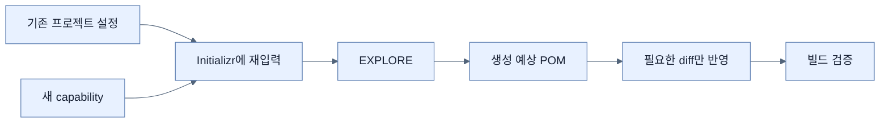

# Initializr로 기존 프로젝트 확장하기

## 한눈에 보기

기존 프로젝트를 버리고 새 ZIP을 만들 필요는 없다. Initializr에 기존 설정을 재현하고 새 capability를 선택한 뒤 **EXPLORE**로 생성될 빌드 파일을 확인해 필요한 의존성 조각만 반영한다. 책은 Mustache 스타터를 이 방식으로 추가한다.

## 1. 왜 이게 필요한가

오래된 프로젝트에는 코드, 설정, 커밋 역사가 이미 있다. 새 기능 때문에 전체 골격을 교체하면 기존 변경을 잃거나 불필요한 충돌이 생긴다. 반대로 아티팩트 이름을 추측하면 잘못된 스타터나 버전을 넣기 쉽다.

## 2. 어떻게 동작하는가

1. 현재 프로젝트의 Boot 버전·언어·좌표·패키징을 Initializr에 다시 입력한다.
2. 추가하려는 Mustache 같은 의존성을 선택한다.
3. GENERATE가 아니라 EXPLORE를 눌러 예상 프로젝트를 브라우저에서 연다.
4. `spring-boot-starter-mustache` 같은 변경분을 현재 `pom.xml`에 옮긴다.
5. 빌드와 자동 구성 보고서로 실제 활성화를 검증한다.

이 방식은 변경 예시를 얻는 비교 도구이지 자동 병합기는 아니다. 기존 플러그인과 사용자 정의 의존성을 덮어쓰지 않도록 diff 관점으로 봐야 한다.

## 3. 그림으로 보기

## 4. 이 노트에 나온 용어

- **EXPLORE**: 프로젝트를 다운로드하지 않고 생성 결과와 파일 내용을 살펴보는 Initializr 기능.
- **dependency coordinates**: 라이브러리를 식별하는 groupId·artifactId 등의 좌표.
- **Mustache**: 로직을 최소화한 서버 템플릿 언어.

## 7. 연결

- [[01-using-start-spring-io-to-build-apps]] — 새 프로젝트 생성과 기존 프로젝트 확장의 차이를 보여준다.
- [[04-leveraging-templates-to-create-content]] — 추가한 Mustache 스타터가 다음 렌더링 단계를 활성화한다.

## 8. 스스로 확인

- 전체 1차 정리 후: 기존 프로젝트에 기능을 넣을 때 EXPLORE 결과를 그대로 덮어쓰면 안 되는 이유를 설명한다.

<!-- ==== 아래는 내 영역 · 스킬 수정 금지 ==== -->

## 내 설명 시도

## 막혔던 지점

## 리뷰 이력

