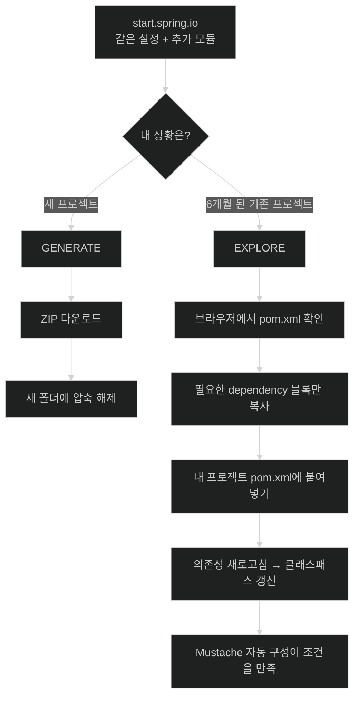

# 기존 프로젝트에 의존성 더하기 — EXPLORE 활용법

## 한눈에 보기

| 질문 | 핵심 답 |
|---|---|
| 문제 상황 | 6개월 굴린 프로젝트에 기능을 더하고 싶다. 새로 만들 수는 없다. |
| 해법 | start.spring.io에 **같은 설정을 다시 입력**하고 필요한 모듈만 추가로 고른다. |
| 결정적 버튼 | GENERATE가 아니라 **EXPLORE**. ZIP을 받지 않고 브라우저에서 결과를 본다. |
| 무엇을 얻는가 | 정확한 artifact 좌표와 **호환되는 버전**. 이름을 검색해 옮겨 적을 필요가 없다. |
| 이 장에서 더한 것 | `spring-boot-starter-mustache` — HTML을 만들 템플릿 엔진 |
| 명령행 대안 | `spring init` (Spring Boot CLI) |

## 1. 왜 이게 필요한가

### 출발 장면: 6개월 된 프로젝트

[[02-creating-a-spring-mvc-web-controller]]에서 컨트롤러는 `return "index";`까지 썼다. 그런데 그 `index`를 실제 HTML로 바꿔 줄 **[[템플릿-엔진]]**(= 데이터와 골격 문서를 합쳐 최종 문서를 만드는 라이브러리)이 프로젝트에 없다. 지금이야 파일이 몇 개뿐이라 새로 만들어도 되지만, 책은 더 현실적인 상황을 든다.

> 이미 6개월 동안 작업해 온 프로젝트가 있고, 코드와 설정과 버전 관리 이력이 쌓여 있다. 그런데 이제 새 기능을 넣고 싶다.

이 상황에서 "기능 하나 더하려고 프로젝트를 버리고 새로 만든다"는 선택지는 없다. 커밋 이력, 리뷰 기록, 배포 파이프라인, 사내 설정이 전부 그 프로젝트에 묶여 있기 때문이다.

### 여기서 뭐가 무너지나

그러면 `pom.xml`에 의존성 한 줄을 손으로 쓰면 된다. 문제는 **그 한 줄을 정확히 쓰는 일이 생각보다 어렵다**는 것이다. 세 가지를 동시에 맞혀야 한다.

1. **groupId** — `org.springframework.boot`인가 `com.samskivert`인가? Mustache 자체의 구현체와 Boot 스타터는 좌표가 다르다.
2. **artifactId** — `spring-boot-starter-mustache`인가 `spring-boot-mustache`인가? Boot 4는 여러 모듈 이름을 바꿨다.
3. **version** — 여기에 버전을 써야 하나, 쓰지 말아야 하나? Boot BOM이 관리하는 아티팩트에 버전을 직접 박으면 정렬이 깨진다.

셋 중 하나만 틀려도 결과는 "빌드가 안 되거나" 또는 더 나쁘게 "빌드는 되는데 런타임에 버전이 어긋나는" 상태다. 이건 [[01-using-start-spring-io-to-build-apps]]에서 정리했던 옛 방식(Stack Overflow 검색, 블로그 복사)의 문제가 **기존 프로젝트 안으로 되돌아온 것**이다.

### 그래서 나온 생각

**[[스프링-이니셜라이저]]**(= 고른 조합대로 프로젝트 골격과 빌드 파일을 만들어 주는 Spring 팀의 서비스)가 새 프로젝트를 만들 때 이미 이 세 가지를 정확히 계산해 준다. 그렇다면 **결과 파일만 보고 필요한 조각을 가져오면** 된다. 그게 EXPLORE 버튼이다.

비유하자면 EXPLORE는 **옷 가게의 피팅룸**이다. 계산대로 가서 사 오는(GENERATE) 대신, 일단 입어 보고 마음에 드는 부분만 확인한다.

→ 비유가 깨지는 지점: 피팅룸 거울은 옷이 **내 몸에** 맞는지 보여 준다. 하지만 EXPLORE는 그 조합이 **내 기존 프로젝트에** 맞는지는 보여 주지 않는다. Initializr는 "빈 프로젝트에 이 조합을 넣으면 이렇게 된다"만 계산할 뿐, 내가 이미 손으로 바꿔 둔 플러그인 설정이나 override한 버전과 충돌하는지는 여전히 내가 확인해야 한다.

## 2. 어떻게 동작하는가

### 2.1 왜 하필 Mustache인가

책은 HTML을 만들 방법을 고르는 과정을 짧게 보여 준다.

- 손으로 HTML을 다 쓸 수도 있다. — 하지만 서버 데이터를 화면에 끼워 넣을 방법이 없다.
- 템플릿 엔진을 쓴다. — Thymeleaf, Freemarker, Groovy Templates, Mustache 등이 Boot 자동 구성 대상이다.
- 그중 **가벼운 것**을 고른다 → **[[Mustache]]**(= `{{name}}` 같은 자리표시자로 데이터를 끼워 넣는 템플릿 언어).

Mustache가 가벼운 이유는 문법이 적어서다. **[[로직-없는-템플릿]]**(= 템플릿 안에 조건식·반복 카운터 같은 프로그래밍 구문을 두지 않는 설계)을 표방하기 때문에, 배워야 할 것이 사실상 "값 넣기"와 "섹션 열고 닫기" 두 가지뿐이다. 이름은 자리표시자 기호 `{{`가 옆으로 누우면 콧수염처럼 보이는 데서 왔다.

### 2.2 같은 설정을 다시 입력한다

start.spring.io로 돌아가 **이 장 앞에서 썼던 것과 같은 설정**을 다시 넣는다. Boot 4.1.0, Maven, Java, 그리고 같은 **[[프로젝트-좌표]]**(= 빌드 시스템이 산출물을 식별하는 이름표)다. — 좌표와 버전이 같아야 Initializr가 계산해 주는 결과가 지금 내 프로젝트와 같은 전제 위에 서기 때문이다.

그다음 `ADD DEPENDENCIES` 버튼을 눌러 `Mustache`를 입력하고 Return을 친다. 목록에 추가된다.

### 2.3 GENERATE가 아니라 EXPLORE

여기가 이 절 전체의 핵심이다. 하단 버튼을 **GENERATE가 아니라 EXPLORE로** 누른다.

| | GENERATE | EXPLORE |
|---|---|---|
| 결과 | ZIP 파일 다운로드 | 브라우저 안에서 프로젝트 내용 보기 |
| 쓰는 상황 | 새 프로젝트를 시작할 때 | 이미 있는 프로젝트를 확장할 때 |
| 내 프로젝트에 미치는 영향 | 없음 (별개의 새 폴더) | 없음 (내가 복사해 붙여 넣기 전까지) |
| 무엇을 가져오는가 | 전부 | 필요한 조각만 |

EXPLORE를 누르면 ZIP을 내려받는 대신 **그 조합으로 생성됐을 프로젝트를 브라우저에서 그대로 열어 준다.** `pom.xml`도 포함이다. 거기서 필요한 조각(또는 전체)을 복사해 내 프로젝트에 붙여 넣는다.

이번에 찾는 조각은 이것이다.

```xml
<dependency>
    <groupId>org.springframework.boot</groupId>
    <artifactId>spring-boot-starter-mustache</artifactId>
</dependency>
```

또 하나의 **[[스타터]]**(= 기능 하나를 시작하는 데 필요한 의존성 묶음 아티팩트)다. `<version>`이 없다는 점을 눈여겨보자 — Boot의 부모 POM/BOM이 버전을 정렬하므로 여기에 버전을 쓰면 오히려 그 정렬을 깬다.

### 2.4 이 방법이 실제로 아껴 주는 것

책의 표현을 그대로 옮기면 "Spring Initializr가 정확한 스타터 좌표와 호환되는 버전을 처리해 주므로, 우리는 artifact 이름을 찾아보거나 의존성 호환성을 걱정할 필요가 없다"이다.

이 문장의 무게는 §1에서 본 세 가지 실패 가능성을 다시 보면 분명해진다.

| 손으로 쓸 때의 위험 | EXPLORE가 해소하는 방식 |
|---|---|
| groupId를 잘못 안다 | 생성된 `pom.xml`을 그대로 복사 |
| artifactId 이름이 버전마다 바뀐다 | **내가 고른 Boot 버전 기준**으로 계산된 이름이 나온다 |
| 버전을 써야 할지 말지 모른다 | Boot가 관리하는 아티팩트면 버전이 없는 형태로 나온다 |

그리고 이 절차는 **반복 가능하다.** 책은 "start.spring.io로 계속 돌아가 필요한 모듈을 추가하되, 뭔가를 망가뜨리지 않는다는 완전한 확신을 가질 수 있다"고 정리한다. 실제로 이 장 뒤에서 HTTP 클라이언트를 더할 때 같은 절차를 다시 쓴다 — [[09-calling-versioned-apis-with-http-service-clients]].

### 2.5 명령행으로 같은 일 하기

> **Tip (책 p.33)**: 웹 인터페이스 말고도 Spring Boot는 `spring init` 명령행 도구를 제공한다.

**[[Spring-Boot-CLI]]**(= `spring init` 등으로 Initializr의 기능을 명령행에서 쓰게 해 주는 도구)를 쓰면 같은 프로젝트 생성을 **스크립트에 넣어 반복 가능하게** 만들 수 있다. 사내에 표준 프로젝트 템플릿을 배포하거나, 여러 마이크로서비스를 같은 규격으로 찍어낼 때 웹 UI를 사람이 클릭하는 것보다 낫다. 문서는 `https://docs.spring.io/spring-boot/cli/index.html`에 있다.

## 3. 그림으로 보기

### 두 버튼의 갈림길



### 왜 버전을 안 쓰는가

```text
[내가 붙여넣는 것]
  <dependency>
    <groupId>org.springframework.boot</groupId>
    <artifactId>spring-boot-starter-mustache</artifactId>
  </dependency>          ← <version> 없음

[버전이 정해지는 곳]
  spring-boot-starter-parent (또는 spring-boot-dependencies BOM)
    └─ Boot 4.1.0이 검증한 조합표
         mustache-compiler : x.y.z
         jackson           : a.b.c
         tomcat            : p.q.r
                 │
                 ▼
       내 dependency에 버전이 없으므로 이 표의 값이 적용된다

[여기에 <version>을 직접 쓰면]
  → 그 하나만 표 밖으로 나간다
  → 다른 라이브러리는 여전히 표의 값
  → 두 세계가 섞여 런타임에 NoSuchMethodError 같은 형태로 터진다
```

### EXPLORE 버튼

![[_assets/lsb4-p57-fig2-6-initializr-explore-button.png]]
> 출처: *Learning Spring Boot 4*, p.32 (Figure 2.6)

GENERATE 버튼(Figure 2.4)과 나란히 놓고 보면 UI상 비슷한 위치에 있지만, 하는 일은 "가져간다"와 "들여다본다"로 완전히 갈린다.

## 4. 이 노트에 나온 용어

| 용어 | 한 줄 풀이 | 자세히 |
|---|---|---|
| 스프링 이니셜라이저 | 고른 조합대로 빌드 파일과 골격을 만들어 주는 서비스 | [[_glossary#스프링-이니셜라이저]] |
| 스타터 | 기능 하나를 시작하는 데 필요한 의존성 묶음 | [[_glossary#스타터]] |
| 프로젝트 좌표 | 빌드 시스템이 산출물을 식별하는 이름표 | [[_glossary#프로젝트-좌표]] |
| 템플릿 엔진 | 데이터와 골격 문서를 합쳐 최종 문서를 만드는 라이브러리 | [[_glossary#템플릿-엔진]] |
| Mustache | `{{name}}` 자리표시자로 값을 끼워 넣는 템플릿 언어 | [[_glossary#Mustache]] |
| 로직 없는 템플릿 | 템플릿 안에 프로그래밍 구문을 두지 않는 설계 | [[_glossary#로직-없는-템플릿]] |
| Spring Boot CLI | Initializr의 기능을 명령행에서 쓰는 도구 | [[_glossary#Spring-Boot-CLI]] |
| 자동 구성 | 조건을 보고 기반 빈을 자동 등록하는 Boot 기능 | [[_glossary#자동-구성]] |

## 5. 자주 헷갈리는 것

### EXPLORE vs GENERATE

같은 계산 결과를 보여 주지만 목적이 다르다. 판별 질문 — **"내 작업 폴더가 이미 존재하는가?"** 존재하면 EXPLORE다. GENERATE로 받은 ZIP을 기존 폴더에 덮어쓰면 `.git`·소스·설정이 뒤섞인다.

### Mustache 라이브러리 vs Mustache 스타터

`spring-boot-starter-mustache`는 Mustache 구현체 자체가 아니라 **"Mustache를 Spring MVC 뷰로 쓰기 위한 묶음"**이다. 구현체(compiler)와 Spring 연동 코드, 자동 구성이 함께 들어온다. Mustache 구현체만 직접 넣으면 뷰 해석이 연결되지 않는다.

### 의존성 추가 vs 기능 활성화

`pom.xml`에 줄을 넣는 것은 **클래스패스를 바꾸는 일**이지 기능을 켜는 명령이 아니다. 실제로 Mustache가 동작하는 것은 그 클래스패스를 본 **[[자동-구성]]**(= 클래스패스·기존 빈·프로퍼티 조건을 보고 기반 빈을 조건부 등록하는 Boot 기능)의 조건이 참이 되기 때문이다. Chapter 1에서 본 "빌드 시점 → 시작 시점" 구분이 여기서 그대로 반복된다.

## 6. 언제 안 쓰나 / 경계

- EXPLORE가 계산해 주는 것은 **빈 프로젝트 기준의 정답**이다. 내가 이미 버전을 override했거나 사내 부모 POM을 쓰고 있다면, 복사한 조각이 그 설정과 충돌하는지는 직접 확인해야 한다.
- 스타터 좌표만 정확할 뿐, **그 기능을 어떻게 쓸지**는 알려 주지 않는다. Mustache를 넣어도 템플릿 파일을 어디에 두는지는 별도 지식이다 — [[04-leveraging-templates-to-create-content]].
- 사내 저장소만 쓰는 폐쇄망에서는 공개 start.spring.io에 접근하지 못할 수 있다. 이 경우 Initializr를 사내에 띄우거나 CLI를 사내 미러로 설정해야 한다.
- 의존성을 더하는 일은 되돌리기가 더 어렵다. 클래스패스에 올라온 기술은 조건부 자동 구성을 켜서 예상 밖 동작을 만들 수 있으므로, "일단 넣고 본다"는 습관은 위험하다.

## 7. 연결

- [[01-using-start-spring-io-to-build-apps]] — 같은 화면, 다른 버튼. 새 프로젝트용 GENERATE와 대비된다.
- [[02-creating-a-spring-mvc-web-controller]] — `return "index"`가 가리킬 대상이 없던 미완 상태를 이 절이 해소한다.
- [[09-calling-versioned-apis-with-http-service-clients]] — 같은 EXPLORE 절차를 HTTP 클라이언트 스타터를 더할 때 그대로 다시 쓴다.

## 8. 스스로 확인

1. 6개월 된 프로젝트에 의존성 한 줄을 손으로 쓸 때 동시에 맞혀야 하는 세 가지는 무엇인가?
2. 그중 "버전을 쓸지 말지"가 왜 특히 위험한가? 틀렸을 때 언제 드러나는가?
3. EXPLORE와 GENERATE를 가르는 판별 질문 한 문장은?
4. Mustache를 "가볍다"고 말할 때, 정확히 무엇이 적어서 가벼운 것인가?
5. `pom.xml`에 스타터를 넣는 것과 Mustache 기능이 켜지는 것은 각각 어느 시점의 일인가?
6. `spring init` CLI가 웹 UI보다 나은 상황을 하나 구체적으로 들 수 있는가?
7. EXPLORE가 **보장해 주지 않는** 것은 무엇인가?

> 일곱 문항을 스스로 답한 **뒤에** [[_03-augmenting-an-existing-project-with-initializr]]에서 모범답안과 대조한다. 먼저 열면 이 문항들은 다시 인출 문제로 쓸 수 없다.

<!-- ==== 아래는 내 영역 · 스킬 수정 금지 ==== -->

## 내 설명 시도


## 막혔던 지점


## 리뷰 이력
