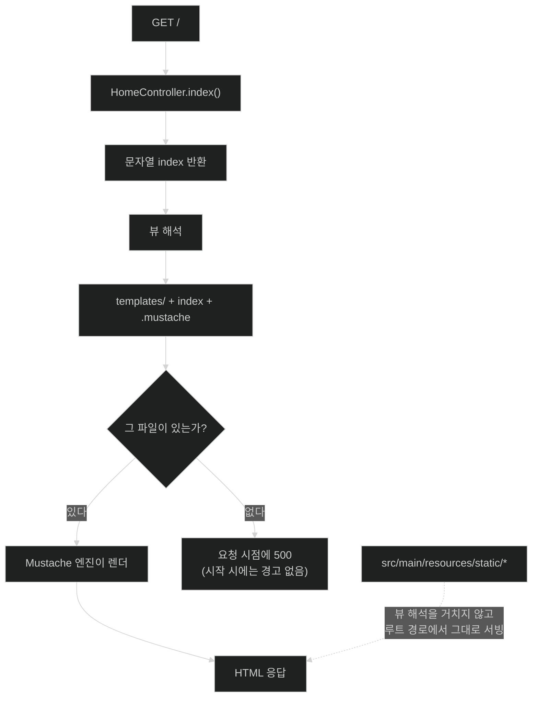

# 템플릿으로 HTML 만들기 — 뷰 이름이 파일이 되는 규칙

## 한눈에 보기

| 질문 | 핵심 답 |
|---|---|
| 컨트롤러 말고 더 쓸 코드가 있나? | 없다. 템플릿 **파일 하나**만 만들면 된다. |
| 그 파일은 어디에 두나? | `src/main/resources/templates/` |
| 파일 이름은? | 뷰 이름 + 엔진별 확장자. `index` → `index.mustache` |
| 누가 그 규칙을 정했나? | Spring Boot의 기본 구성 프로퍼티. 바꿀 수 있지만 관례를 따르는 편이 낫다. |
| 이 단계의 산출물 | 서버가 만들어 준 정적 HTML 한 장 |
| 남은 아쉬움 | 아직 **동적 데이터가 하나도 없다** |

## 1. 왜 이게 필요한가

### 출발 장면: 조각은 다 모였는데 화면이 없다

지금 프로젝트에는 두 가지가 있다.

- [[02-creating-a-spring-mvc-web-controller]]에서 만든 `HomeController`. `GET /`를 받아 `"index"`를 돌려준다.
- [[03-augmenting-an-existing-project-with-initializr]]에서 더한 `spring-boot-starter-mustache`.

그런데 실행하고 `localhost:8080`에 가면 여전히 화면이 없다. 컨트롤러가 `"index"`라고 말은 하는데, **그 이름에 해당하는 파일이 프로젝트 어디에도 없기 때문**이다.

### 여기서 뭐가 무너지나

순진한 해법은 컨트롤러가 HTML을 직접 만들어 돌려주는 것이다.

```java
@GetMapping("/")
@ResponseBody
public String index() {
    return "<h1>Greetings Learning Spring Boot 4.0 fans!</h1>"
         + "<p>In this chapter, we are learning how to make a web app</p>";
}
```

돌아가긴 한다. 그리고 정확히 세 가지가 무너진다.

1. **HTML이 Java 문자열이 된다.** 따옴표 이스케이프, 줄바꿈 연결, 들여쓰기가 전부 사라진다. 에디터의 HTML 문법 검사도, 자동 완성도 작동하지 않는다.
2. **화면을 고치려면 Java를 다시 컴파일해야 한다.** 문구 하나 바꾸는 데 빌드 사이클이 돈다.
3. **디자이너와 협업할 수 없다.** HTML 파일이 존재하지 않으니 브라우저로 열어 볼 수도, 디자인 도구에 넣을 수도 없다.

### 그래서 나온 생각

HTML을 **파일로 두고**, 컨트롤러는 "그중 어느 파일인지"만 이름으로 말한다. 그 이름을 파일로 바꾸는 일은 **[[템플릿-엔진]]**(= 데이터와 골격 문서를 합쳐 최종 문서를 만드는 라이브러리)과 Spring MVC가 맡는다.

그러려면 "이름 → 파일"의 변환 규칙이 있어야 한다. Spring Boot는 이 규칙을 **[[관례-우선-설정]]**(= 자주 쓰는 배치와 이름을 기본값으로 미리 정해 두고 그 관례를 따르면 설정을 쓰지 않아도 되게 하는 설계 방침)으로 제공한다. 폴더와 확장자를 미리 정해 두고, 그 자리에 파일을 놓기만 하면 된다.

비유하자면 이 규칙은 **도서관의 청구기호**다. 나는 "『자바의 정석』"이라는 이름만 대면 되고, 그 책이 3층 A열 몇 번째 칸에 있는지는 규칙이 안다.

→ 비유가 깨지는 지점: 도서관 사서는 그 책이 없으면 **찾는 순간 "없습니다"라고 말해 준다.** 하지만 뷰 해석은 그렇지 않다 — 템플릿 파일이 없어도 애플리케이션은 아무 경고 없이 정상 시작하고, **누군가 실제로 그 URL을 요청하는 순간**에야 500 오류로 터진다. 없는 파일에 대한 컴파일 시점 검사가 없다는 것이 이 관례의 대가다.

## 2. 어떻게 동작하는가

### 2.1 우리가 안 쓴 코드는 누가 쓰고 있는가

책은 "컨트롤러 클래스를 만든 뒤로는 더 할 일이 별로 없다"고 말한다. 실제로 두 가지가 우리 몰래 이미 끝나 있다.

1. **[[컴포넌트-스캔]]**(= 애노테이션 붙은 클래스를 찾아 빈으로 등록하는 동작)이 `@Controller`가 붙은 `HomeController`를 찾아 인스턴스로 만든다. — 우리가 만든 클래스를 요청 라우팅 인프라에 등록하기 위해서다.
2. **[[자동-구성]]**(= 클래스패스·기존 빈·프로퍼티 조건을 보고 기반 빈을 조건부 등록하는 Boot 기능)이 Mustache 클래스들이 클래스패스에 올라온 것을 보고, Mustache 엔진을 Spring의 뷰 인프라에 꽂아 주는 빈들을 추가한다. — 논리적 뷰 이름을 Mustache 파일로 해석할 주체가 필요하기 때문이다.

두 번째가 없으면 `"index"`는 해석할 사람이 없는 문자열로 남는다. 그래서 [[03-augmenting-an-existing-project-with-initializr]]에서 스타터를 더한 것이 이 절의 전제다.

### 2.2 뷰 이름이 파일이 되는 규칙

**[[논리적-뷰-이름]]**(= 파일 위치 대신 무엇을 그릴지만 담은 문자열) `"index"`가 실제 파일이 되는 **[[뷰-해석]]**(= 뷰 이름을 실제 템플릿 파일·엔진으로 바꾸는 단계) 과정은 접두사와 접미사를 붙이는 단순한 조립이다.

```text
컨트롤러가 돌려준 값:                     "index"
                                             │
   앞에 기본 위치를 붙인다  ──────────────▶  src/main/resources/templates/index
                                             │
   뒤에 엔진별 확장자를 붙인다  ───────────▶  src/main/resources/templates/index.mustache
                                             │
   그 파일을 읽어 Mustache 엔진에 넘긴다 ──▶  렌더링된 HTML
```

> **Tip (책 p.34)**: Spring Boot는 템플릿 엔진용 구성 프로퍼티를 갖고 있고, 그 기본값이 모든 템플릿을 `src/main/resources/templates` 안에 두게 한다. 그리고 엔진마다 확장자가 있다 — Mustache는 `.mustache`다. 컨트롤러에서 `index`를 반환하면 Spring Boot가 이를 `src/main/resources/templates/index.mustache`로 바꿔 파일을 가져오고 Mustache 엔진에 흘려 넣는다. 이 동작은 **[[구성-프로퍼티]]**(= 외부 파일의 키-값으로 동작을 조정하는 설정)로 바꿀 수 있지만, 일반적으로는 정해진 관례를 따르는 편이 단순하다.

"바꿀 수 있지만 따르는 편이 낫다"는 조언에는 이유가 있다. 위치와 확장자를 바꾸면 **그 프로젝트를 처음 여는 사람이 templates 폴더를 찾다가 못 찾는다.** 관례의 값은 규칙 자체가 아니라 "모두가 같은 규칙을 안다"는 데 있다.

### 2.3 템플릿 파일 한 장

`src/main/resources/templates` 안에 `index.mustache`를 만들고 다음을 넣는다.

```html
<h1>Greetings Learning Spring Boot 4.0 fans!</h1>
<p>
    In this chapter, we are learning how to make
    a web app using Spring Boot 4.0
</p>
```

책의 표현대로 이건 "100% 순정 HTML5"다. **[[Mustache]]**(= `{{name}}` 같은 자리표시자로 값을 끼워 넣는 템플릿 언어) 문법이 한 글자도 없다.

이 사실이 중요한 이유는 **[[로직-없는-템플릿]]**(= 템플릿 안에 프로그래밍 구문을 두지 않는 설계)의 성격을 보여 주기 때문이다. Mustache 템플릿은 "특수 문법으로 쓴 문서"가 아니라 "**HTML인데 필요할 때만 몇 글자가 더 있는 문서**"다. 그래서 데이터 없이도 브라우저로 그냥 열어 볼 수 있고, 디자이너가 손대도 깨지지 않는다.

### 2.4 실행하고 확인하기

IDE에서 Initializr가 만들어 준 메인 애플리케이션 클래스를 우클릭해 Run 한다. 책은 그 클래스를 `Chapter2Application`이라고 적는데, Figure 2.2에서 Name 필드에 `ch2`를 넣었으므로 실제로 생성되는 클래스 이름은 `Ch2Application`이다. **메인 클래스 이름은 Initializr의 Name 값에서 유도되므로 각자의 입력에 따라 달라진다** — 이름 자체가 아니라 "`@SpringBootApplication`이 붙은 클래스 하나"라는 점이 중요하다.

뜨고 나면 브라우저로 `localhost:8080`에 간다.

### 2.5 그래서 지금 상태는

책은 결과를 보고 "Ta-dah!" 한 뒤 곧바로 스스로 김을 뺀다.

> 감흥이 없다고? 맞다. 여기엔 동적 콘텐츠가 하나도 없다. 솔직히 지루하다. 헤더 하나와 문단 하나. 누가 이런 걸 원하겠나?

이 자기 비판이 정확한 진단이다. 지금까지 만든 것은 **"서버를 거쳐 나온 정적 파일"**이다. 이 구조의 값은 화면 자체가 아니라, 이제 이 파일에 서버 데이터를 끼워 넣을 자리가 생겼다는 데 있다 — [[04a-adding-demo-data-to-a-template]].

## 3. 그림으로 보기

### 정적 파일과 템플릿의 갈림길



점선 화살표는 이 장 뒤에서 다시 나오는 다른 경로다 — 템플릿을 거치지 않는 정적 자산은 [[06-integrating-nodejs-with-a-spring-boot-web-app]]에서 다룬다.

### 두 폴더의 책임 구분

| | `src/main/resources/templates/` | `src/main/resources/static/` |
|---|---|---|
| 무엇이 들어가나 | 렌더링이 필요한 문서 (`.mustache`) | 그대로 나가는 파일 (`.js`, `.css`, 이미지) |
| 접근 경로 | 컨트롤러의 뷰 이름을 통해서만 | URL 경로로 직접 |
| 서버 데이터 삽입 | 가능 | 불가능 |
| 파일이 없을 때 | 요청 시 500 | 404 |
| 이 장의 예 | `index.mustache` | Parcel이 만든 `index.js` 번들 |

### 렌더링 결과

![[_assets/lsb4-p59-fig2-7-mustache-static-page.png]]
> 출처: *Learning Spring Boot 4*, p.34 (Figure 2.7)

주소창의 `localhost:8080`과 `<h1>`·`<p>` 두 요소가 그대로 나온 것이 보인다. 화면에는 Mustache의 흔적이 없다 — 렌더링이 끝나면 템플릿 문법은 결과물에 남지 않기 때문이다.

## 4. 이 노트에 나온 용어

| 용어 | 한 줄 풀이 | 자세히 |
|---|---|---|
| 컴포넌트 스캔 | 애노테이션 붙은 클래스를 찾아 빈으로 등록하는 동작 | [[_glossary#컴포넌트-스캔]] |
| 자동 구성 | 조건을 보고 기반 빈을 자동 등록하는 Boot 기능 | [[_glossary#자동-구성]] |
| 템플릿 엔진 | 데이터와 골격 문서를 합쳐 최종 문서를 만드는 라이브러리 | [[_glossary#템플릿-엔진]] |
| Mustache | `{{name}}` 자리표시자로 값을 끼워 넣는 템플릿 언어 | [[_glossary#Mustache]] |
| 로직 없는 템플릿 | 템플릿 안에 프로그래밍 구문을 두지 않는 설계 | [[_glossary#로직-없는-템플릿]] |
| 논리적 뷰 이름 | 파일 위치 대신 "무엇을 그릴지"만 담은 문자열 | [[_glossary#논리적-뷰-이름]] |
| 뷰 해석 | 뷰 이름을 실제 템플릿 파일·엔진으로 바꾸는 단계 | [[_glossary#뷰-해석]] |
| 관례 우선 설정 | 기본값을 미리 정해 두고 따르면 설정이 필요 없게 하는 방침 | [[_glossary#관례-우선-설정]] |
| 구성 프로퍼티 | 외부 파일의 키-값으로 동작을 조정하는 설정 | [[_glossary#구성-프로퍼티]] |

## 5. 자주 헷갈리는 것

### `templates/`와 `static/`

이름이 둘 다 리소스 폴더라 섞기 쉽지만 **접근 경로 자체가 다르다.** `templates/index.mustache`는 URL로 직접 열 수 없고, `static/app.js`는 컨트롤러를 거치지 않는다. 판별 질문 — "이 파일에 서버 데이터를 끼워 넣어야 하는가?" 그렇다면 `templates/`다.

### 뷰 이름 `"index"` vs 문자열 응답 `"index"`

같은 코드가 `@Controller`에서는 뷰 이름이 되고 `@RestController`에서는 본문 문자열 `index`가 된다. 클래스에 붙은 애노테이션이 이 해석을 바꾼다 — [[05-creating-json-based-apis]].

### "Mustache 문법이 없다"와 "Mustache가 필요 없다"

지금 `index.mustache`에는 Mustache 문법이 하나도 없지만, **파일이 Mustache 엔진을 거치지 않는 것은 아니다.** 엔진은 여전히 파일을 읽고 처리하며, 단지 바꿀 자리표시자가 없을 뿐이다. 스타터를 빼면 이 파일도 렌더되지 않는다.

## 6. 언제 안 쓰나 / 경계

- 템플릿 파일이 없어도 **애플리케이션은 정상 시작한다.** 뷰 이름의 오타는 시작 시점이 아니라 그 URL을 처음 요청할 때 드러난다. 컨트롤러 테스트가 필요한 이유 중 하나다.
- 관례를 벗어나 위치나 확장자를 바꾸는 것은 기술적으로 가능하지만, 그 순간부터 팀의 모든 사람이 그 설정을 알아야 한다. 얻는 것보다 잃는 것이 큰 경우가 많다.
- 서버가 완성된 HTML을 만들어 보내는 이 방식은 화면 상태가 단순할 때 잘 맞는다. 화면 안에서 상태가 계속 바뀌는 UI라면 브라우저 쪽에서 렌더링하는 접근이 검토 대상이다 — [[07a-creating-a-reactjs-app]].
- `templates/`는 클래스패스 리소스다. 실행 중인 JAR 안의 템플릿을 바꾸려면 다시 빌드해야 한다. 개발 중 즉시 반영은 IDE나 devtools의 별도 기능에 기댄다.

## 7. 연결

- [[02-creating-a-spring-mvc-web-controller]] — 이 노트는 그 컨트롤러가 돌려준 `"index"`가 파일이 되는 나머지 절반이다.
- [[03-augmenting-an-existing-project-with-initializr]] — Mustache 스타터가 없으면 이 노트의 뷰 해석 자체가 성립하지 않는다.
- [[04a-adding-demo-data-to-a-template]] — 지금은 정적인 이 HTML에 서버 데이터를 끼워 넣는 다음 단계다.

## 8. 스스로 확인

1. 컨트롤러가 HTML 문자열을 직접 만들어 돌려주는 방식이 무너지는 세 지점을 말할 수 있는가?
2. `"index"`가 `src/main/resources/templates/index.mustache`가 되기까지의 조립 과정을 단계별로 설명할 수 있는가?
3. 템플릿 파일 이름에 오타를 내면 언제 알게 되는가? 왜 그때인가?
4. "관례를 바꿀 수 있지만 따르는 편이 낫다"의 실질적 이유는 무엇인가?
5. `templates/`와 `static/`을 가르는 판별 질문 한 문장은?
6. `index.mustache`에 Mustache 문법이 하나도 없는데도 Mustache 스타터가 필요한 이유는?
7. 컴포넌트 스캔과 자동 구성이 이 화면을 만드는 데 각각 무엇을 기여했는가?

> 일곱 문항을 스스로 답한 **뒤에** [[_04-leveraging-templates-to-create-content]]에서 모범답안과 대조한다. 먼저 열면 이 문항들은 다시 인출 문제로 쓸 수 없다.

<!-- ==== 아래는 내 영역 · 스킬 수정 금지 ==== -->

## 내 설명 시도


## 막혔던 지점


## 리뷰 이력
