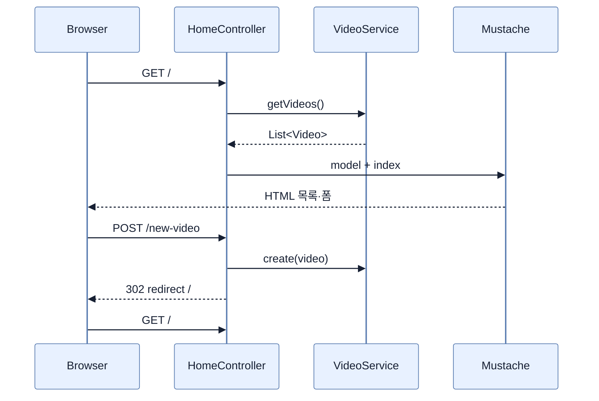
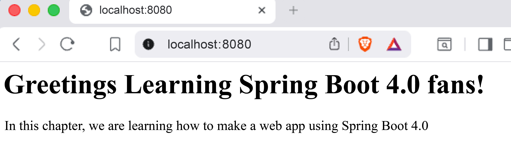

# 템플릿으로 동적 콘텐츠 만들기

## 한눈에 보기

Boot는 기본적으로 `src/main/resources/templates`에서 Mustache 템플릿을 찾는다. 컨트롤러는 `Model`에 데이터를 담고 논리적 뷰 이름을 반환한다. 책은 인메모리 `VideoService`, 생성자 주입, HTML 폼의 POST 바인딩과 PRG 형태의 리다이렉트를 한 흐름으로 확장한다.

## 1. 왜 이게 필요한가

정적 HTML만으로는 서버 데이터가 변할 때 화면을 갱신할 수 없다. 그러나 컨트롤러가 데이터까지 소유하면 요청 처리와 상태 관리가 결합된다. 템플릿·컨트롤러·서비스를 분리하면 같은 데이터를 HTML과 API 양쪽에서 재사용할 수 있다.

## 2. 어떻게 동작하는가

1. `index`라는 반환값을 ViewResolver가 `templates/index.mustache`로 해석한다.
2. 컨트롤러가 `model.addAttribute("videos", ...)`로 이름 있는 데이터를 넘긴다.
3. Mustache의 `{{#videos}}...{{/videos}}`가 목록을 순회하고 `{{name}}`을 HTML에 삽입한다.
4. `Video`를 별도 record로, 목록 관리를 `@Service`로 옮긴다. 컨트롤러는 단일 생성자를 통해 서비스 Bean을 받는다.
5. HTML 폼은 `POST /new-video`를 보내고 `@ModelAttribute`가 필드를 `Video`로 묶는다.
6. 저장 후 `redirect:/`을 반환하여 브라우저가 새 GET 요청으로 갱신된 목록을 읽게 한다.

책의 목록 갱신은 기존 immutable list를 mutable 복사본으로 옮겨 추가한 뒤 `List.copyOf`로 새 불변 목록을 만든다. 참조를 통한 우발적 변경은 줄지만 동시에 여러 POST가 들어올 때 원자성을 보장하지 않으므로 영구 저장소나 동시성 제어의 대안은 아니다.

## 3. 그림으로 보기

책의 첫 Mustache 렌더링 결과는 다음과 같다.

## 4. 이 노트에 나온 용어

- **Model**: 컨트롤러가 뷰에 넘길 이름 있는 데이터를 담는 MVC 객체.
- **constructor injection**: 필요한 Bean을 생성자 매개변수로 받는 의존성 주입 방식.
- **form binding**: 요청 폼 필드를 Java 객체의 속성으로 변환하는 과정.
- **PRG**: POST 처리 뒤 Redirect를 보내고 GET으로 결과를 조회하게 하는 흐름.

## 7. 연결

- [[02-creating-a-spring-mvc-web-controller]] — 뷰 이름과 요청 매핑의 출발점이다.
- [[05-creating-json-based-apis]] — 같은 `VideoService`를 기계용 JSON 표현에도 재사용한다.
- [[chapter-3-querying-for-data-with-spring-boot/01-adding-spring-data-to-an-existing-application|Spring Data 추가]] — 인메모리 목록을 실제 저장소로 교체한다.

## 8. 스스로 확인

- 전체 1차 정리 후: POST 처리 후 바로 HTML을 반환하지 않고 리다이렉트하는 흐름을 설명한다.

<!-- ==== 아래는 내 영역 · 스킬 수정 금지 ==== -->

## 내 설명 시도

## 막혔던 지점

## 리뷰 이력

