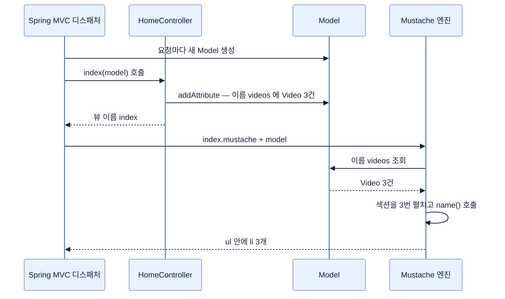

# 템플릿에 데모 데이터 넣기 — Model과 Mustache 섹션

## 한눈에 보기

| 질문 | 핵심 답 |
|---|---|
| 컨트롤러에서 템플릿으로 데이터를 어떻게 넘기나? | 메서드에 `Model` 파라미터를 추가하고 `addAttribute(이름, 값)`로 담는다. |
| 왜 문자열이 아니라 `record`인가? | Mustache는 **이름 있는 속성**으로 값을 찾는다. record가 그 이름을 타입으로 보장한다. |
| 목록을 반복 출력하는 문법 | `{{#videos}}` … `{{/videos}}` — Mustache 섹션 |
| `{{name}}`은 무엇을 찾나? | 현재 항목의 `name` 속성. record의 `name()` 접근자로 해결된다. |
| 속성 이름을 틀리면? | 오류가 아니라 **아무것도 출력되지 않는다.** |
| 이 단계에서 남는 문제 | 데이터 정의가 컨트롤러 안에 있다 |

## 1. 왜 이게 필요한가

### 출발 장면: 세 줄을 화면에 뿌리고 싶다

[[04-leveraging-templates-to-create-content]]에서 만든 화면에는 헤더 하나와 문단 하나뿐이었다. 이제 서버가 가진 비디오 목록 세 건을 화면에 뿌리려 한다.

```text
• Need HELP with your SPRING BOOT 4 App?
• Don't do THIS to your own CODE!
• SECRETS to fix BROKEN CODE!
```

### 여기서 뭐가 무너지나

가장 단순한 방법은 컨트롤러에서 HTML 조각을 조립해 넘기는 것이다.

```java
String html = "";
for (String name : videoNames) {
    html += "<li>" + name + "</li>";
}
model.addAttribute("listHtml", html);
```

세 가지가 동시에 무너진다.

1. **HTML이 다시 Java 문자열로 돌아온다.** [[04-leveraging-templates-to-create-content]]에서 템플릿 파일로 옮긴 이유가 무효가 된다.
2. **이스케이프가 사라진다.** 비디오 제목에 `<`가 들어오면 그대로 태그로 해석된다. 사용자가 제목을 입력하는 순간 이건 보안 구멍이다.
3. **화면 구조를 바꾸려면 Java를 고쳐야 한다.** `<ul>`을 `<table>`로 바꾸는 일이 컨트롤러 수정이 된다.

### 그래서 나온 생각

컨트롤러는 **값만** 넘기고, 그 값을 **어떤 HTML로 그릴지는 템플릿이** 정한다. 이 분업에는 두 가지가 필요하다.

- 컨트롤러 쪽: 값을 담아 넘길 그릇 → **[[모델]]**(= 컨트롤러가 뷰에 넘길 데이터를 이름을 붙여 담아 두는 Spring MVC의 그릇)
- 템플릿 쪽: 목록을 항목 수만큼 반복할 문법 → **[[Mustache-섹션]]**(= `{{#이름}}`으로 열고 `{{/이름}}`으로 닫는 반복·조건 블록)

비유하자면 `Model`은 **택배 상자에 붙이는 라벨**이다. 템플릿은 상자를 열어 보지 않고 라벨에 적힌 이름으로만 내용물을 찾는다. `model.addAttribute("videos", ...)`가 라벨에 "videos"라고 쓰는 행위다.

→ 비유가 깨지는 지점: 택배는 라벨을 잘못 쓰면 반송되거나 배송 사고가 난다. 하지만 Mustache에서 이름을 틀리면 **아무 일도 일어나지 않는다.** `{{#video}}`(단수)로 잘못 쓰면 오류도 경고도 없이 그 블록 전체가 화면에서 사라진다. 로직 없는 템플릿이 "값이 없으면 안 그린다"를 정상 동작으로 정의하기 때문이다 — 이 조용함이 이 방식에서 가장 흔한 디버깅 함정이다.

## 2. 어떻게 동작하는가

### 2.1 데이터를 만드는 두 줄

`HomeController`를 다음처럼 고친다.

```java
@Controller
public class HomeController {
    record Video(String name) {}

    List<Video> videos = List.of(
            new Video("Need HELP with your SPRING BOOT 4 App?"),
            new Video("Don't do THIS to your own CODE!"),
            new Video("SECRETS to fix BROKEN CODE!"));

    @GetMapping("/")
    public String index(Model model) {
        model.addAttribute("videos", videos);
        return "index";
    }
}
```

책은 여기서 쓴 Java 기능 두 가지를 짚는다.

1. **[[레코드]]**(= 필드 목록만 선언하면 생성자·접근자·`equals`·`hashCode`·`toString`을 컴파일러가 만들어 주는 불변 데이터 전용 클래스)를 한 줄로 정의했다. `record Video(String name) {}`이 전부다.
2. `List.of()`로 **[[불변-컬렉션]]**(= 만들어진 뒤 원소를 더하거나 뺄 수 없는 컬렉션)을 조립했다. 테스트용 데이터 한 묶음을 만드는 데 가장 짧은 방법이다.

> **Tip (책 p.35)**: 값 하나짜리 데이터에 굳이 record를 만드는 이유는 무엇인가? Mustache가 **이름 있는 속성(named attributes)** 위에서 동작하기 때문이다. 이름과 값을 가진 raw JSON을 손으로 쓸 수도 있지만 record가 더 간단하고, 게다가 **더 강한 타입 안전성**을 준다. `Video` 타입이 Mustache 템플릿에 넘길 데이터를 깔끔하게 감싸 준다.

이 Tip이 말하는 바를 뒤집어 보면 이해가 쉽다. 만약 `List<String>`을 넘겼다면 템플릿에서 각 항목의 **이름을 부를 방법이 없다.** `{{name}}`이라고 쓸 대상이 없기 때문이다. record가 `name`이라는 이름을 만들어 준다.

### 2.2 `Model` 파라미터가 하는 일

책의 설명은 이렇다 — 데이터를 템플릿에 넘기려면 Spring MVC가 이해하는 객체, 즉 데이터를 놓아 둘 **홀더**가 필요하고, 그러려면 `index` 메서드에 `Model` 파라미터를 추가해야 한다.

여기서 놓치기 쉬운 점이 있다. **`Model`은 우리가 만들지 않는다.** Spring MVC는 웹 메서드에 선택적으로 붙일 수 있는 여러 파라미터 타입을 지원하고, `Model`은 그중 "템플릿 엔진에 데이터를 넘겨야 할 때 쓰는 타입"이다. 파라미터로 요구하기만 하면 프레임워크가 채워서 넘겨준다.

동작 순서는 다음과 같다.

1. Spring MVC가 `index` 메서드의 시그니처를 보고 `Model` 타입 파라미터를 발견한다. — 메서드가 무엇을 필요로 하는지 호출 전에 알아야 하기 때문이다.
2. 요청마다 새 `Model` 인스턴스를 만들어 인자로 넘긴다. — 요청 간에 데이터가 섞이지 않게 하기 위해서다.
3. 우리 코드가 `addAttribute("videos", videos)`로 **[[모델-속성]]**(= 모델 안의 "이름 → 값" 한 쌍) 하나를 담는다. — 템플릿이 이름으로 값을 찾을 수 있게 하기 위해서다.
4. 메서드가 뷰 이름을 반환하면, Spring MVC가 그 모델을 템플릿 엔진에 함께 넘긴다. — 렌더링 시점에 값이 있어야 하기 때문이다.

책이 짚듯이 위 코드는 `videos`라는 이름의 속성에 `List<Video>`를 공급한 것이다. **이 이름 `"videos"`가 컨트롤러와 템플릿 사이의 유일한 계약**이다.

### 2.3 템플릿에서 목록 그리기

`index.mustache`의 `<p>` 태그 아래에 다음을 더한다.

```html
<ul>
    {{#videos}}
        <li>{{name}}</li>
    {{/videos}}
</ul>
```

세 줄이 각각 무엇인지 책의 설명대로 보자.

- `{{#videos}}` — 모델에 담아 준 `videos` 속성을 가져오라는 Mustache 지시다. 이 값이 **목록이므로** Mustache는 항목마다 이 블록을 펼친다. `List<Video>`를 순회하며 항목마다 별도의 `<li>` 항목을 만든다.
- `{{name}}` — 데이터 구조의 `name` 필드를 원한다는 뜻이다. 우리 `Video` 타입의 `name` 필드와 맞물린다. 다시 말해 `List<Video>`의 각 항목마다 `name` 필드를 `<li>`와 `</li>` 사이에 출력한다.
- `{{/videos}}` — 반복 구역의 끝이다.

결과는 세 개의 `<li>`를 담은 `<ul>` 하나다.

`#`을 "반복"이 아니라 "**섹션**"이라 부르는 이유가 여기 있다. 같은 문법이 값의 종류에 따라 다르게 동작하기 때문이다.

| `videos`의 값 | `{{#videos}}...{{/videos}}`의 결과 |
|---|---|
| 항목 3개짜리 목록 | 블록이 3번 펼쳐진다 |
| 빈 목록 | 블록이 **사라진다** |
| `null` 또는 속성 자체가 없음 | 블록이 **사라진다** (오류 아님) |
| 단일 객체 | 블록이 1번, 그 객체를 문맥으로 펼쳐진다 |
| `false` | 블록이 사라진다 |

**[[로직-없는-템플릿]]**(= 템플릿 안에 조건식·반복 카운터를 두지 않는 설계)이 `if`와 `for`를 따로 두지 않고 이 하나로 처리하는 방식이다. 문법은 줄었지만, 그 대가로 "이름을 틀렸을 때"와 "값이 비었을 때"가 **화면에서 구별되지 않는다.**

### 2.4 record에는 getter가 없는데 어떻게 동작하나

> **Tip (책 pp. 36–37)**: Mustache는 Java의 getter와 함께 동작한다. 그래서 `getName()`을 가진 값 타입이라면 `{{name}}`으로 제공된다. 그런데 **Java record는 getter를 만들지 않는다.** 컴파일러가 만드는 것은 `name()`이다. 걱정하지 않아도 된다 — Mustache가 이 경우도 잘 처리한다. 어느 쪽이든 템플릿에서는 `{{name}}`을 쓰면 된다.

이 Tip은 사소해 보이지만 중요한 경계를 담고 있다. `{{name}}`은 "필드를 직접 읽는다"는 뜻이 **아니다.** 접근자 메서드를 호출해 값을 얻는다는 뜻이고, 그 메서드 이름이 `getName()`이든 `name()`이든 Mustache가 둘 다 시도한다. record와 기존 JavaBean이 한 템플릿 문법 아래에 공존할 수 있는 이유다.

### 2.5 지금 상태와 남은 문제

애플리케이션을 다시 실행하고 `localhost:8080`에 가면 목록이 보인다. 화면은 완성됐다.

그런데 코드를 다시 보면 **`HomeController` 하나가 세 가지 일을 하고 있다.**

- HTTP 요청을 받는다 (컨트롤러의 일)
- `Video`라는 데이터 형태를 정의한다 (도메인의 일)
- 비디오 목록을 보관한다 (저장소의 일)

이 상태가 왜 문제인지는 다음 노트에서 다룬다 — [[04b-building-our-app-with-a-better-design]].

## 3. 그림으로 보기

### 이름 하나로 이어지는 계약



### 같은 문법이 값에 따라 갈리는 지점

```text
템플릿:   {{#videos}} <li>{{name}}</li> {{/videos}}

  모델의 videos 값                      출력
  ─────────────────────────────────    ──────────────────────────────
  [Video(a), Video(b), Video(c)]  →    <li>a</li><li>b</li><li>c</li>
  []                              →    (아무것도 없음)
  null                            →    (아무것도 없음)
  속성 자체를 안 담음              →    (아무것도 없음)   ← 오타가 여기 숨는다
  Video(a)  (단일 객체)            →    <li>a</li>

  ▶ 아래 세 줄이 화면에서 구별되지 않는다는 것이 이 설계의 대가다.
    "목록이 비었나, 이름을 틀렸나"는 템플릿이 아니라 컨트롤러에서 확인해야 한다.
```

### 목록이 붙은 화면

![[_assets/lsb4-p62-fig2-8-mustache-video-list.png]]
> 출처: *Learning Spring Boot 4*, p.37 (Figure 2.8)

`<h1>`·`<p>` 아래에 글머리 기호 세 개가 붙었다. 이것이 `{{#videos}}` 블록이 세 번 펼쳐진 결과다.

## 4. 이 노트에 나온 용어

| 용어 | 한 줄 풀이 | 자세히 |
|---|---|---|
| 레코드 | 필드 목록만 선언하면 나머지를 컴파일러가 만드는 불변 데이터 클래스 | [[_glossary#레코드]] |
| 불변 컬렉션 | 만들어진 뒤 원소를 바꿀 수 없는 컬렉션 | [[_glossary#불변-컬렉션]] |
| 모델 | 컨트롤러가 뷰에 넘길 데이터를 이름 붙여 담는 그릇 | [[_glossary#모델]] |
| 모델 속성 | 모델 안의 "이름 → 값" 한 쌍 | [[_glossary#모델-속성]] |
| Mustache | `{{name}}` 자리표시자로 값을 끼워 넣는 템플릿 언어 | [[_glossary#Mustache]] |
| Mustache 섹션 | `{{#이름}}`~`{{/이름}}`으로 감싼 반복·조건 블록 | [[_glossary#Mustache-섹션]] |
| 로직 없는 템플릿 | 템플릿 안에 프로그래밍 구문을 두지 않는 설계 | [[_glossary#로직-없는-템플릿]] |

## 5. 자주 헷갈리는 것

### `{{name}}`과 `{{#name}}`

`{{name}}`은 **값을 출력**하고, `{{#name}}`은 **블록을 연다.** 앞에 `#`이 있는지 없는지가 전부다. 목록을 `{{videos}}`로 잘못 쓰면 `List`의 `toString()` 결과가 그대로 화면에 찍히거나 아무것도 안 나온다.

### 모델 속성 이름 vs Java 변수 이름

`model.addAttribute("videos", videos)`에서 왼쪽 문자열과 오른쪽 변수 이름이 우연히 같을 뿐이다. 템플릿이 보는 것은 **왼쪽 문자열뿐**이다. `model.addAttribute("clips", videos)`로 바꾸면 템플릿도 `{{#clips}}`가 되어야 한다.

### record의 `name()` vs JavaBean의 `getName()`

Java 문법상으로는 완전히 다른 메서드다. 다만 Mustache가 둘 다 찾아보기 때문에 **템플릿 문법에서는 구별할 필요가 없다.** 이 "둘 다 시도한다"는 성질이 record를 쓸 수 있게 만든 조건이다.

### `List.of()`가 만든 목록 vs `new ArrayList<>()`

둘 다 `List` 인터페이스를 만족하지만 `List.of()`의 결과는 불변이다. 지금은 읽기만 하니 차이가 안 보이지만, 여기에 항목을 더하려는 순간 문제가 된다 — [[04d-changing-the-data-through-html-forms]].

## 6. 언제 안 쓰나 / 경계

- 모델 속성 이름의 오타는 **오류로 드러나지 않는다.** 화면이 비면 먼저 이름 철자를 의심해야 한다.
- Mustache는 조건 분기와 반복만 제공한다. 정렬, 필터링, 포매팅 같은 화면 로직은 템플릿에서 할 수 없으므로 **컨트롤러나 서비스에서 미리 끝낸 값**을 넘겨야 한다. 이는 제약이면서 동시에 "화면에 로직이 스며들지 않게 하는" 장치이기도 하다.
- 지금처럼 컨트롤러 필드에 데이터를 두면 애플리케이션 전체가 공유하는 상태가 된다. 컨트롤러 빈이 하나이므로 이 필드도 하나다 — 데모에서는 편리하지만 실제 애플리케이션에서는 잘못된 자리다.
- record는 불변 데이터 전달에 맞다. JPA 엔티티처럼 프레임워크가 기본 생성자와 setter를 요구하는 자리에는 그대로 쓸 수 없다.

## 7. 연결

- [[04-leveraging-templates-to-create-content]] — 정적이던 그 템플릿에 값이 들어가는 지점이다. 뷰 해석 규칙은 그대로다.
- [[04b-building-our-app-with-a-better-design]] — 컨트롤러가 데이터 정의와 보관까지 떠안은 이 상태를 정리한다.
- [[05-creating-json-based-apis]] — 같은 `Video` record가 이번에는 Mustache가 아니라 Jackson을 통해 JSON으로 나간다. 표현만 바뀌고 데이터 정의는 재사용된다.

## 8. 스스로 확인

1. 컨트롤러에서 HTML 조각을 만들어 넘기면 무엇이 무너지는가? 특히 보안 측면에서.
2. 값이 하나뿐인데도 `record Video(String name)`을 만드는 이유를 Mustache의 동작으로 설명할 수 있는가?
3. `Model` 인스턴스는 누가 만들고, 왜 요청마다 새로 만드는가?
4. `{{#videos}}`가 반복이 아니라 "섹션"이라 불리는 이유를 값의 종류별 동작으로 설명할 수 있는가?
5. 템플릿에서 이름을 `{{#video}}`로 잘못 썼을 때 화면에 무엇이 나타나는가? 왜 그런가?
6. record에 `getName()`이 없는데 `{{name}}`이 동작하는 이유는?
7. `model.addAttribute("clips", videos)`로 바꾸면 템플릿의 무엇을 함께 고쳐야 하는가?
8. 지금 `HomeController`가 동시에 맡고 있는 세 가지 책임을 구분해 말할 수 있는가?

<!-- ==== 아래는 내 영역 · 스킬 수정 금지 ==== -->

## 내 설명 시도


## 막혔던 지점


## 리뷰 이력
