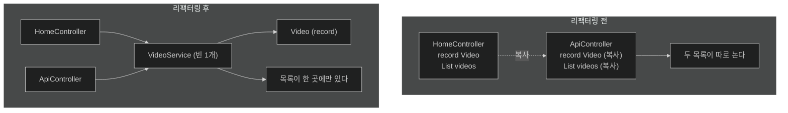

# 컨트롤러에서 데이터를 떼어내기 — 계층 분리와 @Service

## 한눈에 보기

| 질문 | 핵심 답 |
|---|---|
| 지금 코드의 문제 | `HomeController` 하나가 요청 처리 + 데이터 정의 + 데이터 보관을 전부 한다. |
| 언제 터지나 | **두 번째 컨트롤러가 생기는 순간.** |
| 첫 번째 리팩터링 | `Video` record를 `Video.java`로 독립시킨다. |
| `Video`가 `public`이 아닌 이유 | Java의 기본 가시성 — package-private. 필요할 때만 밖으로 연다. |
| 두 번째 리팩터링 | 목록 보관과 조회를 `@Service` 클래스 `VideoService`로 옮긴다. |
| `@Service`가 하는 일 | 컴포넌트 스캔에 걸려 빈이 되게 한다 + **의도를 이름으로 남긴다.** |

## 1. 왜 이게 필요한가

### 출발 장면: 두 번째 컨트롤러를 만들려는 순간

[[04a-adding-demo-data-to-a-template]]의 코드는 잘 돈다. 책의 표현으로 "꽤 그럴듯하다." 문제는 다음 요구가 들어올 때 드러난다.

같은 비디오 목록을 JSON으로도 내보내는 API를 만들려 한다 — 이 장 뒤의 [[05-creating-json-based-apis]]가 실제로 하는 일이다. 그러려면 `ApiController`라는 새 클래스가 필요하다. 그런데 비디오 목록은 지금 어디에 있는가?

```java
@Controller
public class HomeController {
    record Video(String name) {}                 // ← 데이터의 "형태"가 여기 있다
    List<Video> videos = List.of(...);           // ← 데이터 "자체"도 여기 있다
    ...
}
```

`HomeController` 안이다. 새 컨트롤러가 이 목록을 쓰려면 세 가지 나쁜 선택지밖에 없다.

1. `HomeController`의 필드를 복사해 붙여 넣는다 → **목록이 두 벌**이 되어 한쪽에 추가한 비디오가 다른 쪽에 안 보인다.
2. `ApiController`가 `HomeController`를 주입받는다 → 컨트롤러가 컨트롤러를 부르는 기이한 구조가 된다.
3. `Video` record를 `HomeController` 안에 둔 채 밖에서 `HomeController.Video`로 참조한다 → 데이터 타입의 이름이 웹 계층에 영원히 묶인다.

### 여기서 뭐가 무너지나

책은 이 상황을 두 가지 이유로 정리한다.

> - **컨트롤러가 데이터 정의를 관리해서는 안 된다.** 컨트롤러는 웹 호출에 응답하고 다른 서비스·시스템과 상호작용하는 것이 일이므로, 이런 정의는 더 낮은 수준에 있어야 한다.
> - **데이터까지 다루는 무거운 웹 컨트롤러는 웹 요구가 바뀔 때 조정을 어렵게 만든다.** 그래서 데이터 관리를 더 낮은 수준으로 밀어 두는 편이 낫다.

두 번째 이유가 특히 실질적이다. 웹 요구는 **자주** 바뀐다 — URL이 바뀌고, HTML이 JSON이 되고, 폼이 REST로 바뀐다. 반면 "비디오에는 이름이 있다"는 사실은 그만큼 자주 바뀌지 않는다. **변경 주기가 다른 두 가지를 한 파일에 두면 자주 바뀌는 쪽이 안 바뀌는 쪽을 계속 건드린다.**

### 그래서 나온 생각

성격이 다른 책임을 서로 다른 클래스 묶음으로 나눈다. 이것이 **[[계층-분리]]**(= 요청 처리·업무 규칙·데이터 접근처럼 성격이 다른 책임을 서로 다른 클래스 묶음으로 나누는 설계)다.

비유하자면 식당의 **홀과 주방**이다. 홀 직원은 주문을 받고 접시를 나르지만, 재료 재고를 자기 앞치마에 들고 다니지는 않는다. 재고는 주방이 관리하고 홀은 "있나요?"만 묻는다. 그래야 홀 직원이 한 명 더 와도 재고가 둘로 갈라지지 않는다.

→ 비유가 깨지는 지점: 실제 식당에서 홀 직원은 주방 냉장고에 마음대로 손을 넣을 수 없다 — **벽이 물리적으로 막는다.** 하지만 Spring의 계층은 같은 JVM 안의 객체 참조일 뿐이라 그런 벽이 없다. 컨트롤러가 서비스를 건너뛰고 저장소를 직접 부르는 코드도 **컴파일은 잘 된다.** 계층은 컴파일러가 아니라 사람이 지키는 약속이며, 이 장의 `Video`가 `public`이 아닌 것도 그 약속을 조금이나마 언어 수준으로 밀어 올리려는 시도다.

## 2. 어떻게 동작하는가

### 2.1 첫 번째 리팩터링 — `Video`를 독립시킨다

**[[레코드]]**(= 필드 목록만 선언하면 나머지를 컴파일러가 만드는 불변 데이터 클래스)를 자기 파일로 옮긴다.

```java
record Video(String name) {
}
```

책이 강조하듯 "앞에서 쓴 것과 완전히 같은 코드이고, 자기 파일로 옮겨졌을 뿐"이다. 그런데 옮기는 것만으로 무엇이 달라지는가? **`Video`가 더 이상 `HomeController`의 소유물이 아니게 된다.** 이제 같은 패키지의 누구든 이 타입을 쓸 수 있고, 어느 컨트롤러에도 종속되지 않는다.

> **Note (책 p.38)**: `Video` record는 왜 `public`이 아닌가? 사실 이것의 가시성은 무엇인가? 이것이 Java의 **기본 가시성**이며, 클래스·record·인터페이스의 경우 기본값은 **package-private**다. 같은 패키지의 다른 코드에만 보인다는 뜻이다. Java의 기본 가시성을 가능한 한 활용하고, 꼭 필요하다고 판단될 때만 패키지 밖으로 노출하는 것은 나쁘지 않은 생각이다.

**[[패키지-전용-가시성]]**(= 접근 제어자를 아무것도 쓰지 않았을 때 Java가 적용하는 기본 범위)이 여기서 하는 일은 명확하다. `Video`는 `com.learningspringboot4` 패키지 안에서만 보인다. 이 패키지는 [[04-leveraging-templates-to-create-content]]에서 본 **[[베이스-패키지]]**(= 컴포넌트 스캔이 시작되는 기준 패키지)와 같다.

`public`을 습관적으로 붙이지 않는 이유는 **한 번 공개한 타입은 되돌리기 어렵기 때문**이다. 밖에서 쓰기 시작하면 그 순간부터 그 타입은 계약이 된다. 기본값을 좁게 두면, 넓힐 때마다 "정말 밖에서 필요한가"를 한 번 묻게 된다.

### 2.2 두 번째 리팩터링 — 목록을 서비스로 옮긴다

```java
@Service
public class VideoService {
    private List<Video> videos = List.of(
         new Video("Need HELP with your SPRING BOOT 4 App?"),
         new Video("Don't do THIS to your own CODE!"),
         new Video("SECRETS to fix BROKEN CODE!"));

    public List<Video> getVideos() {
         return videos;
    }
}
```

책의 설명을 항목별로 보자.

- `@Service` — 컴포넌트 스캔 때 발견되어 애플리케이션 컨텍스트에 등록되어야 할 클래스임을 나타내는 Spring Framework의 애노테이션이다.
- `List.of()` — 이 장 앞에서 `Video` 컬렉션을 빠르게 조립할 때 쓴 것과 같은 연산이다. 결과는 **[[불변-컬렉션]]**(= 만들어진 뒤 원소를 바꿀 수 없는 컬렉션)이다.
- `getVideos()` — 현재 `Video` 컬렉션을 돌려주는 유틸리티 메서드다.

이 클래스가 놓이는 자리가 **[[서비스-계층]]**(= 웹이나 저장소 같은 바깥 기술에 매이지 않고 업무 동작 자체를 담당하는 계층)이다.

여기서 자연스러운 의문 하나 — **왜 `@Component`가 아니라 `@Service`인가?** 스캔되어 빈이 된다는 기계적 동작만 보면 둘은 같다. `@Service`는 `@Component`를 메타 애노테이션으로 갖는 특수화된 형태다. 차이는 **읽는 사람에게 남기는 정보**다. 클래스 목록만 훑어도 "이건 업무 동작을 담당한다"가 드러난다. 그래서 이런 애노테이션들을 stereotype(정형화된 역할 표시)이라 부른다. `@Controller`도 같은 계열이며, 다만 그쪽은 Spring MVC가 추가 의미까지 부여한다는 점이 다르다.

> **Tip (책 pp. 38–39)**: [[04-leveraging-templates-to-create-content]]에서 가볍게 짚은 **[[컴포넌트-스캔]]**(= 애노테이션 붙은 클래스를 찾아 빈으로 등록하는 동작)이 빛나는 지점이 여기다. 클래스를 만들고 Spring Framework의 `@Component` 계열 애노테이션 — 예를 들어 `@Service`나 `@Controller` — 중 하나를 붙인다. Spring Boot가 시작하면 가장 먼저 하는 일 중 하나가 컴포넌트 스캐너를 돌려 이런 클래스들을 찾아 인스턴스를 만드는 것이다. 그렇게 만들어진 빈들은 애플리케이션 컨텍스트에 등록되어, 그것을 요구하는 다른 Spring 빈에 autowire될 준비를 마친다.

Tip의 마지막 문장이 다음 리팩터링의 전제다.

### 2.3 세 번째 리팩터링 — 컨트롤러가 서비스를 받는다

`HomeController`에서 `List<Video>` 필드를 들어내고 `VideoService`를 받도록 바꾼다.

```java
@Controller
public class HomeController {
    private final VideoService videoService;

    public HomeController(VideoService videoService) {
        this.videoService = videoService;
    }
}
```

책은 이 변경을 두 줄로 요약한다.

- `List<Video>` 필드를 들어내고 `private final VideoService` 인스턴스로 바꾼다.
- 새 필드를 **생성자 주입**으로 채운다.

위 코드 조각에는 `index()` 메서드가 빠져 있는데, 책이 바뀐 부분만 보여 준 것이다. `index()`가 어떻게 바뀌는지와 "생성자 주입"이 정확히 무엇인지는 [[04c-injecting-dependencies-through-constructor-calls]]에서 이어진다.

### 2.4 리팩터링 전후에 무엇이 달라졌나

| 관심사 | 리팩터링 전 | 리팩터링 후 |
|---|---|---|
| `Video`의 형태 정의 | `HomeController` 안 중첩 record | `Video.java` (package-private) |
| 비디오 목록 보관 | `HomeController` 필드 | `VideoService` 필드 |
| 목록 조회 | 필드 직접 참조 | `videoService.getVideos()` |
| 두 번째 컨트롤러가 쓰려면 | 복사하거나 컨트롤러를 주입 | **같은 `VideoService` 빈을 주입** |
| 저장 방식을 DB로 바꾸려면 | 컨트롤러를 고친다 | `VideoService` 내부만 고친다 |

마지막 줄이 이 리팩터링의 진짜 값이다. Chapter 3에서 인메모리 목록을 실제 저장소로 바꿀 때, 컨트롤러는 손대지 않아도 된다.

책은 이 작업이 "약간 지루하게 느껴졌을지 모르지만, 계속 살을 붙여 나가면서 값을 할 것"이라고 말한다. 실제로 이 장 안에서만 그 값이 두 번 회수된다 — [[05-creating-json-based-apis]]에서 `ApiController`가 같은 서비스를 재사용하고, [[04d-changing-the-data-through-html-forms]]에서 추가 로직이 서비스 한 곳에만 들어간다.

## 3. 그림으로 보기

### 두 번째 컨트롤러가 생길 때 갈리는 구조



### 변경 주기로 계층을 가르기

```text
자주 바뀐다  ┌──────────────────────────────────────────┐
     ▲       │  웹 계층  @Controller / @RestController   │
     │       │  URL · HTTP 메서드 · 응답 형식 · 폼        │
     │       └──────────────────────────────────────────┘
     │                        │ 호출
     │       ┌──────────────────────────────────────────┐
     │       │  서비스 계층  @Service                     │
     │       │  "비디오를 조회한다 / 추가한다"는 동작      │
     │       └──────────────────────────────────────────┘
     │                        │ 사용
     ▼       ┌──────────────────────────────────────────┐
드물게 바뀐다 │  데이터 정의  record Video                 │
             │  "비디오에는 이름이 있다"                   │
             └──────────────────────────────────────────┘

   ▶ 화살표는 위에서 아래로만 간다. 서비스가 컨트롤러를 알면 안 되고,
     record가 서비스를 알아서도 안 된다. 이 방향성이 계층의 실체다.
```

## 4. 이 노트에 나온 용어

| 용어 | 한 줄 풀이 | 자세히 |
|---|---|---|
| 계층 분리 | 성격이 다른 책임을 서로 다른 클래스 묶음으로 나누는 설계 | [[_glossary#계층-분리]] |
| 서비스 계층 | 바깥 기술에 매이지 않고 업무 동작을 담당하는 계층 | [[_glossary#서비스-계층]] |
| 레코드 | 필드 목록만 선언하면 나머지를 컴파일러가 만드는 불변 데이터 클래스 | [[_glossary#레코드]] |
| 패키지 전용 가시성 | 접근 제어자를 안 쓸 때 적용되는 Java 기본 범위 | [[_glossary#패키지-전용-가시성]] |
| 베이스 패키지 | 컴포넌트 스캔이 시작되는 기준 패키지 | [[_glossary#베이스-패키지]] |
| 컴포넌트 스캔 | 애노테이션 붙은 클래스를 찾아 빈으로 등록하는 동작 | [[_glossary#컴포넌트-스캔]] |
| 불변 컬렉션 | 만들어진 뒤 원소를 바꿀 수 없는 컬렉션 | [[_glossary#불변-컬렉션]] |

## 5. 자주 헷갈리는 것

### `@Service` vs `@Component`

빈으로 등록되는 기계적 동작은 같다. 다르게 만드는 것은 **사람이 읽는 의도**다. 판별 질문 — "이 클래스가 하는 일에 더 구체적인 이름이 있는가?" 있으면 그 stereotype(`@Service`, `@Controller`, `@Repository`)을 쓰고, 없으면 `@Component`다.

### 계층 분리 vs 패키지 분리

이 절에서는 파일만 나눴고 패키지는 여전히 하나다. 계층 분리의 본질은 **책임의 분리**이지 디렉터리 구조가 아니다. 다만 프로젝트가 커지면 패키지도 함께 나누는 것이 보통이며, 그때 `Video`의 package-private 가시성은 다시 검토 대상이 된다.

### package-private vs `private`

`private`는 **같은 클래스** 안에서만 보이고, package-private는 **같은 패키지** 안에서 보인다. `Video`가 `private`였다면 `VideoService`조차 쓸 수 없다.

### "서비스"라는 말의 두 가지 쓰임

Spring의 `@Service`는 애플리케이션 안의 한 계층을 뜻한다. 반면 [[09-calling-versioned-apis-with-http-service-clients]]에 나오는 "HTTP 서비스"는 네트워크 건너의 원격 API를 뜻한다. 같은 단어지만 가리키는 대상이 다르다.

## 6. 언제 안 쓰나 / 경계

- 계층 방향은 **컴파일러가 강제하지 않는다.** 서비스가 컨트롤러를 주입받는 코드도 잘 컴파일된다. 방향을 지키는 것은 사람의 몫이며, 패키지 분리와 가시성 제한이 그 약속을 거드는 정도다.
- 클래스가 서너 개뿐인 데모에서는 계층을 나누는 비용이 이득보다 클 수도 있다. 이 절의 근거가 "지금 불편하다"가 아니라 "**두 번째 컨트롤러가 생기면** 불편하다"인 점을 기억할 필요가 있다.
- `@Service`를 붙여도 **베이스 패키지 밖에 있으면 스캔되지 않는다.** 빈이 없다는 오류를 만나면 애노테이션보다 패키지 위치를 먼저 본다.
- `getVideos()`가 내부 목록 참조를 그대로 돌려준다. 지금은 그 목록이 불변이라 안전하지만, 가변 목록을 이렇게 돌려주면 호출자가 서비스 내부 상태를 직접 바꿀 수 있다 — [[04d-changing-the-data-through-html-forms]]에서 이 점이 다시 문제가 된다.

## 7. 연결

- [[04a-adding-demo-data-to-a-template]] — 이 노트가 정리하는 대상이 그 노트에서 만든 컨트롤러다.
- [[04c-injecting-dependencies-through-constructor-calls]] — 여기서 쓴 생성자가 실제로 어떻게 채워지는지를 다룬다.
- [[05-creating-json-based-apis]] — 이 리팩터링의 값이 처음 회수되는 지점. 새 컨트롤러가 같은 `VideoService`를 그대로 쓴다.

## 8. 스스로 확인

1. 지금 코드가 "두 번째 컨트롤러가 생기는 순간" 무너진다고 했다. 구체적으로 어떤 세 가지 나쁜 선택지가 생기는가?
2. 컨트롤러와 데이터 정의를 나누는 근거를 "변경 주기"로 설명할 수 있는가?
3. `Video`를 자기 파일로 옮기는 것만으로 무엇이 달라지는가?
4. `Video`에 `public`을 붙이지 않는 것이 왜 좋은 습관인가? 되돌리기 어려운 것은 무엇인가?
5. `@Service`와 `@Component`가 기계적으로 같다면, `@Service`를 쓰는 이유는 무엇인가?
6. 계층의 화살표가 한 방향으로만 가야 한다는 규칙을 누가 강제하는가?
7. 저장 방식을 인메모리에서 DB로 바꿀 때, 리팩터링 전과 후에 각각 어느 파일을 고쳐야 하는가?
8. `getVideos()`가 내부 목록을 그대로 돌려주는 것이 지금은 왜 안전하고, 언제부터 위험해지는가?

> 여덟 문항을 스스로 답한 **뒤에** [[_04b-building-our-app-with-a-better-design]]에서 모범답안과 대조한다. 먼저 열면 이 문항들은 다시 인출 문제로 쓸 수 없다.

<!-- ==== 아래는 내 영역 · 스킬 수정 금지 ==== -->

## 내 설명 시도


## 막혔던 지점


## 리뷰 이력
