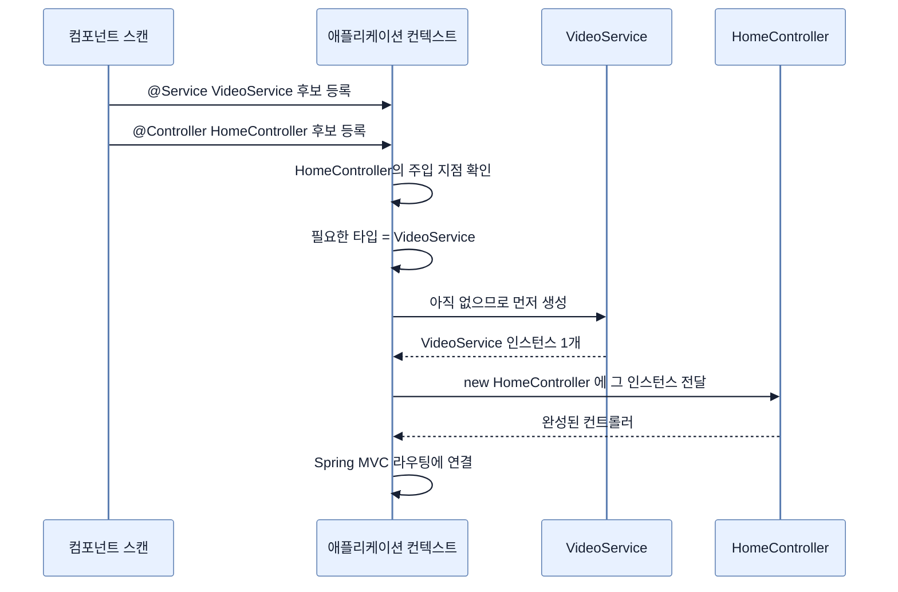

# 생성자로 의존성 주입받기 — autowiring이 하는 일

## 한눈에 보기

| 질문 | 핵심 답 |
|---|---|
| `new HomeController(...)`는 누가 부르나? | 우리가 아니라 **컨테이너**가 부른다. |
| 생성자 주입이란? | 빈이 필요로 하는 것을 **생성자 매개변수**로 받는 방식. |
| autowiring이란? | 그 매개변수 타입에 맞는 빈을 컨텍스트에서 찾아 자동으로 끼워 넣는 동작. |
| `@Autowired`를 꼭 써야 하나? | 생성자가 **하나뿐이면** 안 써도 된다. |
| 왜 예전엔 인기가 없었나? | 명시적 배선을 선호하는 진영이 있었고, `@Configuration`+`@Bean`으로 손수 배선했다. |
| 무엇이 바꿔 놓았나? | 자동 구성이 만든 빈들이 autowiring을 대규모로 활용하면서 사실상 표준이 됐다. |

## 1. 왜 이게 필요한가

### 출발 장면: 아무도 부르지 않는 생성자

[[04b-building-our-app-with-a-better-design]]에서 `HomeController`를 이렇게 바꿨다.

```java
@Controller
public class HomeController {
    private final VideoService videoService;

    public HomeController(VideoService videoService) {
        this.videoService = videoService;
    }
}
```

여기서 이상한 점이 있다. 이 생성자는 `VideoService`를 요구하는데, **프로젝트 어디에도 `new HomeController(...)`를 호출하는 코드가 없다.** `new VideoService()`도 없다. 그런데 애플리케이션은 정상으로 뜨고 화면도 나온다.

### 여기서 뭐가 무너지나

없는 코드를 우리가 직접 쓴다고 해 보자. 어딘가에서 이렇게 조립해야 한다.

```java
VideoService videoService = new VideoService();
HomeController homeController = new HomeController(videoService);
ApiController apiController = new ApiController(videoService);   // 같은 인스턴스를 넘겨야 한다
// ... 그리고 이 컨트롤러들을 Spring MVC의 요청 라우팅에 등록해야 한다
```

세 가지가 무너진다.

1. **조립 코드가 어딘가에 존재해야 한다.** 클래스가 늘어날수록 이 파일이 애플리케이션에서 가장 자주 바뀌는 파일이 된다.
2. **"같은 인스턴스를 공유해야 한다"를 사람이 기억해야 한다.** `ApiController`에 실수로 `new VideoService()`를 하나 더 넘기면 [[04b-building-our-app-with-a-better-design]]에서 없앤 "목록이 두 벌" 문제가 그대로 돌아온다.
3. **자동 구성이 만든 빈은 아예 손에 잡히지 않는다.** Mustache 엔진 빈이나 Jackson 변환기처럼 Boot가 만든 객체를 우리 코드에 넘기려면 그것들을 꺼낼 방법부터 필요하다.

### 그래서 나온 생각

객체 조립을 컨테이너에 맡기고, 클래스는 **"내가 일하려면 무엇이 필요한지"만 선언**한다. 그 선언을 생성자 매개변수로 하는 것이 **[[생성자-주입]]**(= 빈이 필요로 하는 협력 객체를 생성자 매개변수로 받는 의존성 주입 방식)이고, 그 선언을 보고 컨테이너가 알아서 채워 주는 동작이 **[[오토와이어링]]**(= 타입이 맞는 빈을 컨텍스트에서 찾아 자동으로 끼워 넣는 동작)이다.

책은 생성자 주입을 "Spring 빈이 필요로 하는 의존성을 생성자를 통해 얻는 것을 멋있게 말한 것"이라고 딱 잘라 설명한다. 개념 자체는 그만큼 단순하다.

"autowiring"이라는 이름은 Chapter 1의 wiring(배선) 개념에서 왔다. 부품 사이를 선으로 잇는 일을 사람이 하지 않고 **자동으로(auto)** 한다는 뜻이다.

비유하자면 벽의 **콘센트와 플러그**다. 전자기기는 "220V 2구 플러그가 필요하다"만 선언하고, 그 전기가 어느 발전소에서 어떤 경로로 왔는지는 모른 채 동작한다.

→ 비유가 깨지는 지점: 콘센트는 규격만 맞으면 무엇이든 꽂힌다. 하지만 Spring은 **타입이 같은 빈이 두 개 있으면 아무거나 꽂아 주지 않고 그 자리에서 시작을 실패시킨다.** "규격이 맞으니 알아서 하나 골라 주겠지"가 통하지 않는다는 점이 전기 비유와 결정적으로 다르다. 모호하면 사람이 이름이나 `@Primary`로 골라 줘야 한다.

## 2. 어떻게 동작하는가

### 2.1 컨테이너가 주입 지점을 찾아 채우는 순서

책의 설명은 이렇다 — Spring Boot의 컴포넌트 스캔에 걸리는 Java 클래스를 만들면, Spring Boot는 주입 지점이 있는지 확인하고, 있으면 애플리케이션 컨텍스트에서 **타입이 맞는 빈**을 찾아 주입한다.

단계별로 풀면 다음과 같다.

1. **[[컴포넌트-스캔]]**(= 애노테이션 붙은 클래스를 찾아 빈으로 등록하는 동작)이 `@Controller`가 붙은 `HomeController`와 `@Service`가 붙은 `VideoService`를 후보로 모은다. — 컨테이너가 관리할 대상 목록이 먼저 있어야 하기 때문이다.
2. 각 후보에서 **[[주입-지점]]**(= 컨테이너가 값을 채워 넣을 수 있는 자리 — 생성자 매개변수·setter·필드)을 찾는다. `HomeController`의 생성자 매개변수 `VideoService videoService`가 그것이다. — 무엇을 채워야 하는지 알아야 하기 때문이다.
3. 그 타입의 빈이 컨텍스트에 있는지 본다. 아직 없으면 **그 빈을 먼저 만든다.** — 의존 대상이 준비된 뒤에야 의존하는 쪽을 안전하게 만들 수 있기 때문이다. 그래서 `VideoService`가 `HomeController`보다 먼저 만들어진다.
4. 찾은 `VideoService` 인스턴스를 인자로 넣어 생성자를 호출한다. — 객체가 만들어지는 순간 필요한 것이 이미 채워져 있게 하기 위해서다.
5. 완성된 `HomeController`를 컨텍스트에 등록하고, Spring MVC의 요청 라우팅에도 연결한다. — 요청이 실제로 이 인스턴스에 도달해야 하기 때문이다.

여기서 3번이 중요하다. `VideoService` 빈은 **하나만** 만들어지고, `HomeController`와 (뒤에 나올) `ApiController`가 **같은 인스턴스**를 받는다. §1에서 걱정한 "목록이 두 벌" 문제가 구조적으로 사라진다.

### 2.2 왜 예전에는 이걸 싫어했나

책은 autowiring의 역사를 짧게 짚는데, 이 대목이 개념의 경계를 잡아 준다.

> Spring Boot 이전에는 autowiring이 지금만큼 인기 있지 않았다. 좋아하는 곳도 있었고 질색하며 피하는 곳도 있었다. 반대하던 쪽은 무엇을 했나? `@Configuration` 애노테이션을 붙인 클래스를 만들고 `@Bean` 메서드들을 작성했다. 그 메서드들이 객체 인스턴스를 반환하면, 그것을 생성자나 setter를 통해 다른 서비스에 **수동으로** 배선했다.

반대 진영의 논리는 이해할 만하다. **"어느 구현이 어디에 들어가는지가 코드에 안 보인다"**는 것이다. 타입만 보고 컨테이너가 고르므로, 배선 결과를 확인하려면 애플리케이션을 띄워 봐야 한다.

그런데 상황을 바꾼 것이 Spring Boot 자신이었다. 책의 표현대로 "Spring Boot가 부상하고 자동 구성이 만들어 내는 빈들이 autowiring을 대규모로 활용하면서, autowiring은 거의 모두에게 받아들여지게 됐다." **자동 구성이 만든 수십 개의 빈을 전부 손으로 배선하는 것은 애초에 가능한 선택지가 아니었기 때문**이다.

### 2.3 책이 든 "주입하는 세 가지 방법" 읽는 법

책은 클래스에 의존성을 주입하는 방법을 세 가지로 제시한다.

1. **Option 1** — 클래스 자체에 Spring Framework의 `@Component` 계열 애노테이션(또는 `@Component` 자체)을 붙인다. `@Service`, `@Controller`, `@RestController`, `@Configuration` 같은 것들이다.
2. **Option 2** — `@Autowired` 애노테이션으로 주입 지점을 표시한다. 생성자, setter 메서드, 필드(심지어 `private` 필드까지)에 붙일 수 있다.
3. **Option 3** — 클래스에 생성자가 **하나뿐이면** `@Autowired`를 붙일 필요가 없다. Spring이 그것을 autowire 대상으로 간주한다.

이 목록을 그대로 "셋 중 하나를 고르는 선택지"로 읽으면 헷갈린다. 실제로는 **두 개의 다른 질문**이 섞여 있다.

| 질문 | 답하는 항목 | 성격 |
|---|---|---|
| 이 클래스가 애초에 빈이 되는가? | Option 1 | **전제**. 이게 없으면 나머지는 의미가 없다. |
| 그 빈의 어느 자리를 채울 것인가? | Option 2, Option 3 | **선택**. 생성자 / setter / 필드 중 어디를 쓸지. |

즉 Option 1은 다른 둘과 나란한 선택지가 아니라 **필수 전제**다. `@Autowired`만 붙이고 `@Service`를 안 붙이면, 그 클래스는 애초에 컨테이너가 만들지 않으므로 아무 일도 일어나지 않는다.

그리고 Option 3이 우리 코드가 `@Autowired` 없이도 동작하는 이유다. `HomeController`에는 생성자가 하나뿐이므로 Spring이 그것을 주입 지점으로 간주한다.

> **공식 문서 기준 보강**: 책은 세 방식을 나열만 하고 우열을 매기지 않는다. 실제로 Spring 팀이 권장하는 것은 **생성자 주입**이며, 이유는 이 노트의 코드에 이미 드러나 있다 — `private final`을 쓸 수 있어 주입 후 교체가 불가능하고, 필수 의존성이 생성자 시그니처에 명시되며, 테스트에서 컨테이너 없이 `new HomeController(fakeService)`로 만들 수 있다. 필드 주입은 이 셋을 모두 잃는다.

### 2.4 `index()`가 바뀐 딱 한 줄

`VideoService`가 주입되었으니 `index()` 메서드를 고친다.

```java
@GetMapping("/")
public String index(Model model) {
     model.addAttribute("videos", videoService.getVideos());
     return "index";
}
```

책이 짚듯 "이 장 앞에서 쓴 것과 달라진 유일한 점은 `Video` 객체 목록을 얻기 위해 `videoService`를 호출한다는 것"이다.

**[[모델]]**(= 컨트롤러가 뷰에 넘길 데이터를 이름 붙여 담는 그릇)에 담는 방식도, 뷰 이름을 반환하는 방식도, 템플릿 파일도 하나도 바뀌지 않았다. 바뀐 것은 **값의 출처**뿐이다 — 컨트롤러 필드에서 **[[서비스-계층]]**(= 업무 동작을 담당하는 계층) 호출로.

이 "한 줄만 바뀌었다"가 [[04b-building-our-app-with-a-better-design]] 리팩터링이 옳았다는 증거다. 계층을 나눴는데 위쪽 계층이 크게 바뀌었다면 경계를 잘못 그은 것이다.

## 3. 그림으로 보기

### 컨테이너가 조립하는 순서



### 세 가지 주입 지점의 실제 차이

| | 생성자 주입 | setter 주입 | 필드 주입 |
|---|---|---|---|
| 코드 형태 | 생성자 매개변수 | `setXxx()` 메서드 | 필드에 `@Autowired` |
| `final` 가능 | 가능 | 불가 | 불가 |
| 필수 의존성이 드러나는 곳 | 생성자 시그니처 | 안 드러남 | 안 드러남 |
| 컨테이너 없이 테스트 | `new`로 바로 가능 | 만든 뒤 setter 호출 필요 | 리플렉션 필요 |
| 순환 의존을 만들면 | **시작 시 실패로 드러남** | 조용히 통과할 수 있음 | 조용히 통과할 수 있음 |
| `@Autowired` 생략 | 생성자가 하나면 가능 | 불가 | 불가 |

마지막 두 줄이 생성자 주입이 권장되는 이유를 압축한다 — 문제를 **늦게가 아니라 시작 시점에** 드러낸다.

### 수동 배선과 autowiring

```text
[수동 배선 — Spring Boot 이전에 흔했던 방식]

  @Configuration
  class AppConfig {
      @Bean VideoService videoService() { return new VideoService(); }
      @Bean HomeController homeController() {
          return new HomeController(videoService());     // ← 내가 직접 넘긴다
      }
  }
  → 어느 구현이 어디로 가는지 코드에 다 보인다
  → 그 대신 빈이 늘수록 이 파일이 계속 커진다
  → 자동 구성이 만든 빈은 여기서 다룰 수 없다

[autowiring]

  @Service    class VideoService  { ... }
  @Controller class HomeController {
      HomeController(VideoService videoService) { ... }   // ← 필요하다고 선언만
  }
  → 배선 파일이 사라진다
  → 대신 "무엇이 꽂혔는지"는 실행해 봐야 확실히 안다
  → 타입이 모호하면(같은 타입 빈 2개) 시작 시점에 실패한다
```

## 4. 이 노트에 나온 용어

| 용어 | 한 줄 풀이 | 자세히 |
|---|---|---|
| 생성자 주입 | 필요한 협력 객체를 생성자 매개변수로 받는 방식 | [[_glossary#생성자-주입]] |
| 오토와이어링 | 타입이 맞는 빈을 찾아 자동으로 끼워 넣는 동작 | [[_glossary#오토와이어링]] |
| 주입 지점 | 컨테이너가 값을 채울 수 있는 자리 | [[_glossary#주입-지점]] |
| 컴포넌트 스캔 | 애노테이션 붙은 클래스를 찾아 빈으로 등록하는 동작 | [[_glossary#컴포넌트-스캔]] |
| 서비스 계층 | 바깥 기술에 매이지 않고 업무 동작을 담당하는 계층 | [[_glossary#서비스-계층]] |
| 모델 | 컨트롤러가 뷰에 넘길 데이터를 이름 붙여 담는 그릇 | [[_glossary#모델]] |

## 5. 자주 헷갈리는 것

### "빈이 되는 것" vs "주입받는 것"

책의 세 옵션이 섞어 놓은 지점이다. `@Service`는 **이 클래스를 컨테이너가 만들게** 하고, `@Autowired`(또는 단일 생성자 규칙)는 **그 안의 어느 자리를 채울지** 정한다. 둘 다 필요하다.

### 생성자 주입 vs `new`

생성자 주입도 결국 `new`를 부른다. 다른 점은 **누가 부르는가**다. 컨테이너가 부르면 인자를 컨테이너가 고르고, 내가 부르면 내가 고른다. 테스트에서 `new HomeController(가짜서비스)`를 쓰는 것이 모순이 아닌 이유다.

### `@Autowired`를 안 쓴다 vs autowiring을 안 쓴다

`HomeController`에는 `@Autowired`가 없지만 autowiring은 **작동하고 있다.** 생성자가 하나뿐이라 애노테이션이 생략 가능할 뿐이다. 애노테이션의 유무와 동작의 유무는 다르다.

### 타입으로 찾는다 vs 이름으로 찾는다

기본은 타입이다. 그래서 같은 타입 빈이 둘이면 모호해져 실패한다. 이때 매개변수 이름을 빈 이름과 맞추거나 `@Qualifier`로 지정해 해결한다. 지금처럼 `VideoService` 빈이 하나뿐이면 이 고민이 없다.

## 6. 언제 안 쓰나 / 경계

- 같은 타입의 빈이 둘 이상이면 **시작 시점에 실패한다.** 이는 결함이 아니라 설계 의도다 — 컨테이너가 임의로 고르는 것보다 사람이 명시하는 편이 안전하기 때문이다.
- 생성자 매개변수가 대여섯 개를 넘기 시작하면, 주입 방식의 문제가 아니라 **그 클래스가 너무 많은 일을 한다는 신호**다. 필드 주입으로 바꿔 생성자를 짧게 보이게 만드는 것은 증상만 가린다.
- 순환 의존(`A`가 `B`를, `B`가 `A`를 요구)은 생성자 주입으로는 풀 수 없다. 컨테이너도 무엇을 먼저 만들지 정할 수 없기 때문이다. 이때는 주입 방식을 바꿀 것이 아니라 설계를 다시 봐야 한다.
- autowiring은 **빈들 사이**의 연결만 다룬다. 요청마다 달라지는 값(요청 파라미터, 폼 데이터, 인증 정보)은 주입이 아니라 메서드 파라미터로 들어온다 — [[04d-changing-the-data-through-html-forms]].

## 7. 연결

- [[04b-building-our-app-with-a-better-design]] — 이 노트가 설명하는 생성자가 그 리팩터링에서 만들어졌다.
- [[04d-changing-the-data-through-html-forms]] — 주입받은 서비스에 쓰기 동작을 더한다. 컨트롤러는 여전히 호출만 한다.
- [[05-creating-json-based-apis]] — 두 번째 컨트롤러가 **같은** `VideoService` 인스턴스를 주입받아, 목록이 하나로 유지되는 것을 확인한다.

## 8. 스스로 확인

1. `new HomeController(...)`를 아무도 부르지 않는데 화면이 나오는 이유를 단계로 설명할 수 있는가?
2. 조립 코드를 손으로 쓸 때 무너지는 세 지점은 무엇인가?
3. `VideoService`가 `HomeController`보다 먼저 만들어져야 하는 이유는?
4. autowiring을 싫어하던 진영의 논리는 무엇이었고, 무엇이 그 판단을 바꿨는가?
5. 책의 "세 가지 방법" 목록에서 Option 1이 나머지 둘과 성격이 다른 이유는?
6. `@Autowired`가 없는데 autowiring이 동작하는 이유는?
7. 생성자 주입이 필드 주입보다 나은 점을 `final`·테스트·순환 의존 세 가지로 말할 수 있는가?
8. 같은 타입의 빈이 둘일 때 Spring이 임의로 고르지 않고 실패하는 것이 왜 좋은 설계인가?

<!-- ==== 아래는 내 영역 · 스킬 수정 금지 ==== -->

## 내 설명 시도


## 막혔던 지점


## 리뷰 이력
